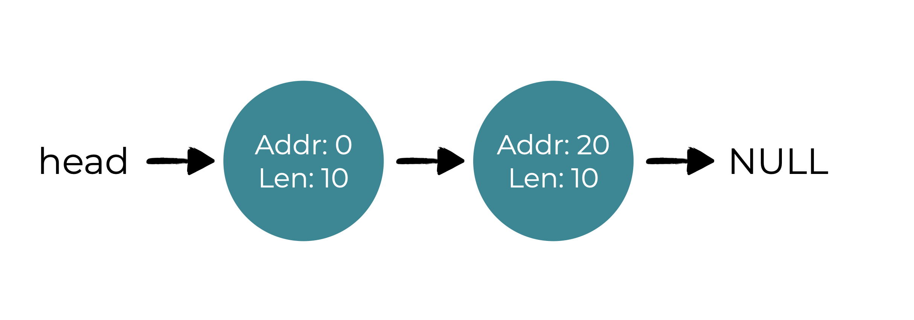
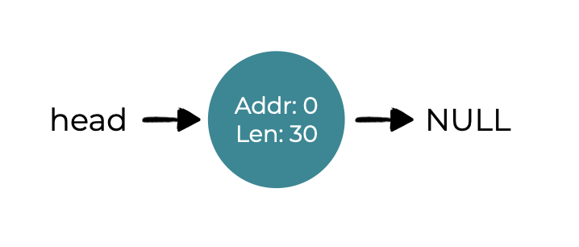
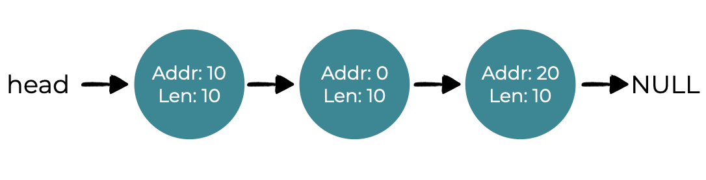
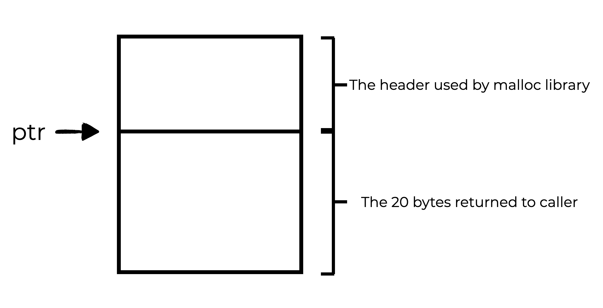
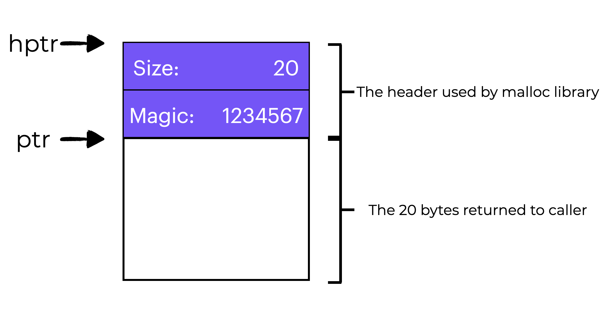
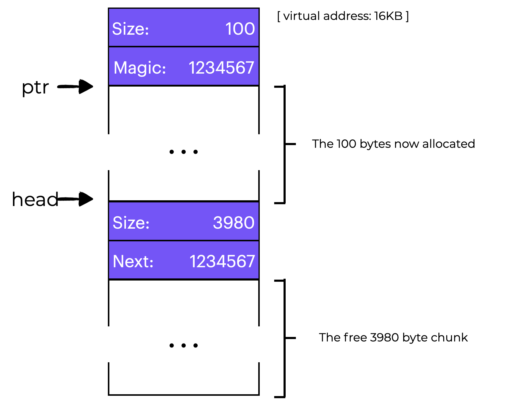
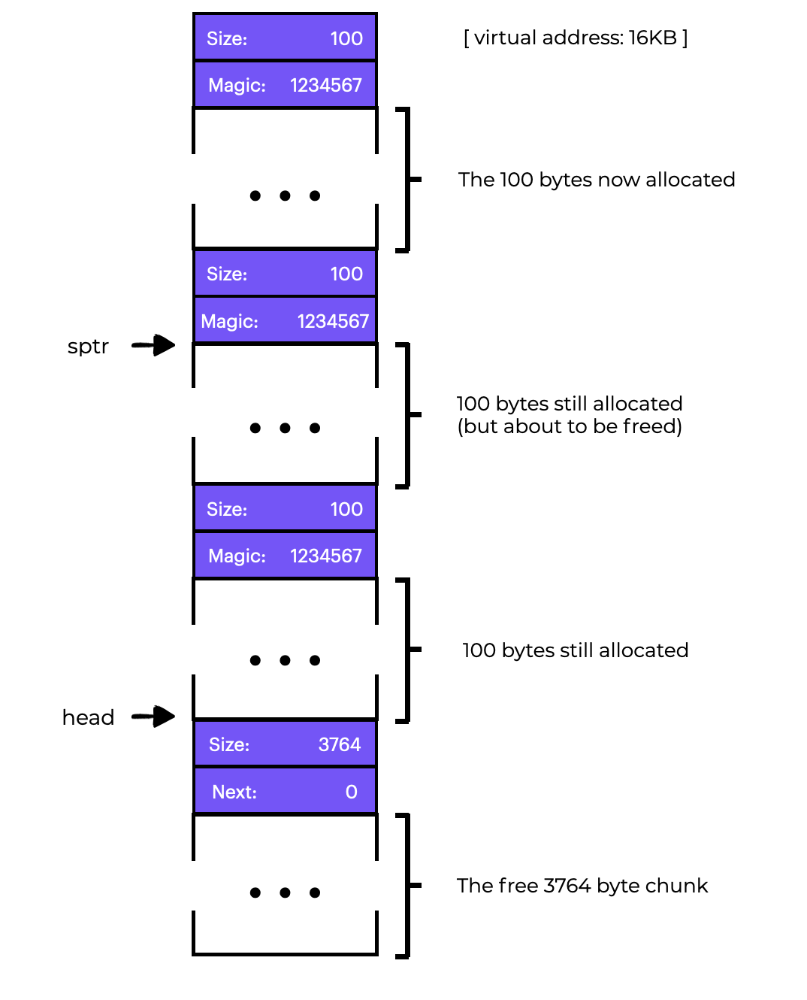
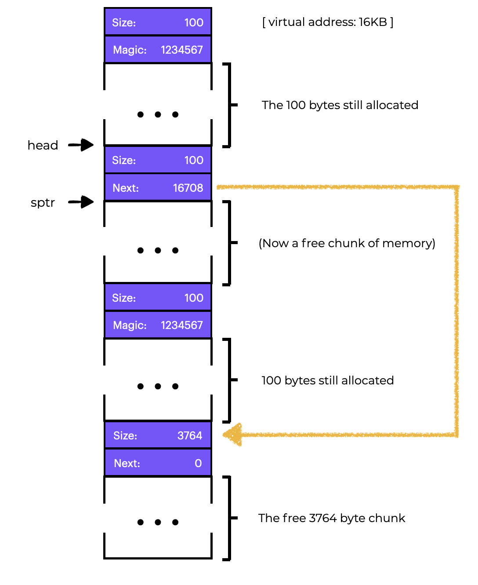
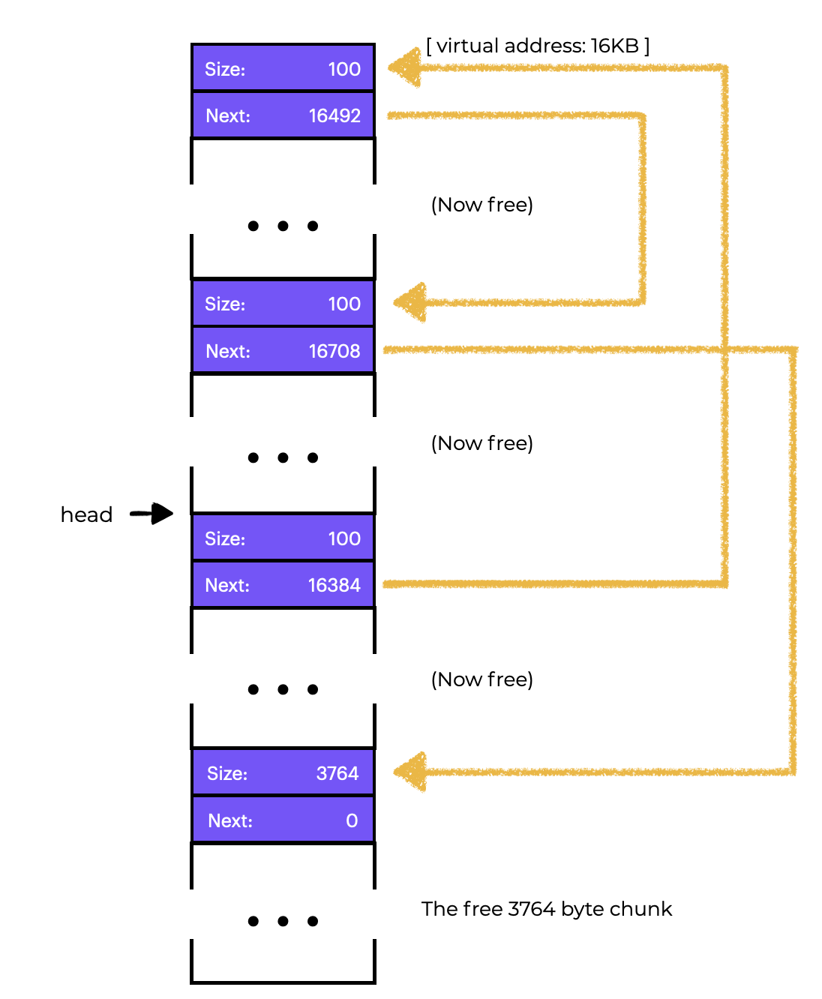
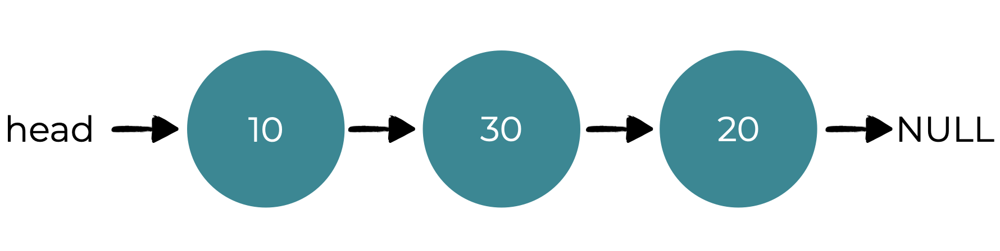

# Overview
# 概览
Let’s explore how to manage free space.   
让我们来探索如何管理空闲空间。  
This section should help us answer the following questions:  
本节应该能帮助我们回答以下问题：  
- How should variable-size requests be managed?  
- 变量大小的请求应该如何管理？  
- How can we reduce fragmentation?  
- 我们如何减少碎片？  
- What are the time and space overheads of different approaches?  
- 不同方法的时间和空间开销是什么？  

# Introduction
# 介绍  
Our study of virtualizing memory in this chapter is interrupted by a key element of every memory management system, be it a malloc library (managing pages of a process’s heap) or the OS itself (managing portions of the address space of a process). We will focus on the difficulties that come with **free-space management**.  
我们在本章中研究虚拟内存的工作被每个内存管理系统的关键元素中断，无论是malloc库（管理进程堆的页面）还是操作系统本身（管理进程地址空间的部分）。我们将专注于free-space management带来的困难。  
Managing free space can be simple, as we will see when we consider **paging**. When the area you manage is divided into fixed-sized units, keeping track of them is straightforward. When a client requests one, return the first entry.  
管理空闲空间可能很简单，当我们考虑分页时，我们将看到。当您管理的区域被划分为固定大小的单元时，跟踪它们是简单的。当客户端请求一个时，返回第一个条目。  
When a user-level memory-allocation library (like `malloc()` and `free()`) or an OS managing physical memory uses segmentation to implement virtual memory, managing free space becomes more challenging (and interesting). In either case, we have to deal with **extern\al fragmentation**: the free space gets chopped into little pieces of different sizes and is fragmented. Later requests may fail because there is no single contiguous space that can satisfy the request, even though the total amount of free space surpasses the size of the request.  
当用户级内存分配库（如malloc（）和free（））或管理物理内存的操作系统使用分段来实现虚拟内存时，管理空闲空间变得更具挑战性（也更有趣）。在这两种情况下，我们必须处理外部碎片：空闲空间被切成不同大小的小块，并且被碎片化。后来的请求可能会失败，因为没有单个连续的空间可以满足请求，即使总的空闲空间超过了请求的大小。  

The graphic above shows us an example of this issue. The total free space available in this example is `20` bytes. Sadly, it’s fragmented into two portions of size `10` each. As a result, even though there are `20` bytes available, a request for `15` bytes will fail. This is the problem we want to address in this section.  
上图显示了这个问题的一个例子。在这个例子中，可用的总空闲空间为20个字节。不幸的是，它被分成两个大小为10个字节的部分。因此，即使有20个字节可用，对15个字节的请求也会失败。这是我们想在本节中解决的问题。  

# Assumptions  
**We’ll begin our exploration with a few assumptions:**  
**我们将从一些假设开始我们的探索：**  
- We will assume a basic interface like `malloc()` or `free()`. void `*malloc(size t size)` takes 1 parameter, `size`. This is the number of bytes the program requests. It returns a **void pointer** to a region of that size (or larger).  
- 我们将假设一个基本的接口，如`malloc()` 或`free()`。void `*malloc(size t size)`接受1个参数，size。这是程序请求的字节数。它返回指向该大小（或更大）区域的void指针。  
  - The `void free(void *ptr)` method takes a pointer and frees the chunk pointed to by the pointer. The user doesn’t tell the library how big the space is when they free it, so the library has to be able to figure it out when only given a pointer.  
  - `void free(void *ptr)`方法接受一个指针，并释放指针所指向的块。当用户释放空间时，用户不会告诉库空间有多大，所以库只能在给定指针时才能找出它。
  - This library manages the `heap`. A **free list** is a generic data structure used to manage free space in the heap. This structure holds all free space in the controlled memory region. It doesn’t have to be a list, just a way to track empty space.  
  - 这个库管理堆。**空闲列表**是用于管理堆中空闲空间的通用数据结构。这个结构保存了控制内存区域中的所有空闲空间。它不必是一个列表，只是跟踪空闲空间的一种方法。  
- Let’s assume that we are mainly concerned with the **external fragmentation** we talked about earlier.  
- 让我们假设我们主要关心我们之前讨论的外部碎片。  
    - We could be concerned with **internal fragmentation**, which happens when an allocator gives out memory chunks larger than what was requested. Unrequested and unused memory is called **internal fragmentation** (since the waste occurs within the allocated unit). In this section, we’ll focus more on **external fragmentation**.  
    - 我们可能会关心**内部碎片**，当分配器分配的内存块大于请求的内存块时，就会发生内部碎片。未请求和未使用的内存称为**内部碎片**（因为浪费发生在分配的单元内）。在本节中，我们将更多地关注**外部碎片**。  
- We’ll also assume that once memory is given out to a client, it can’t be moved to another location.  
- 我们还假设一旦将内存分配给客户端，就不能将其移动到另一个位置。  
    - For example, if a program calls malloc() and is given a pointer to some space inside the heap, the memory region is effectively “owned” by the program (and cannot be changed by the library) until the program returns it via a corresponding call to free(). No free space **compaction** is possible, which would help fight fragmentation. While compaction can be utilized in the OS to cope with fragmentation when implementing **segmentation**.  
    - 例如，如果程序调用malloc()并获得指向堆内部某个空间的指针，则内存区域在程序通过对free()的相应调用返回之前有效地“属于”该程序（并且不能由库更改）。不可能进行空闲空间**压缩**，这有助于抵御碎片。虽然压缩可以在OS中使用，以便在实现**分段**时处理碎片。  

## Compaction
## 压缩
- Compaction refers to the fact that once memory is handed out to a client, it cannot be relocated to another location in memory  
- 压缩是指一旦将内存分配给客户端，就不能将其重新定位到内存中的另一个位置。  

Finally, we’ll assume the allocator manages a byte range.  
最后，我们假设分配器管理一个字节范围。  
- When an allocator runs out of space, it may ask the kernel to expand the heap (through a system call like sbrk). For simplicity, we’ll assume the region has a constant size throughout its life.  
- 当分配器空间不足时，它可能会要求内核扩展堆（通过类似sbrk的系统调用）。为了简单起见，我们假设整个生命周期中的区域具有恒定的大小。  

## Questions
A free list is a generic data structure that holds references to all of the available space in a managed region of memory.  
空闲列表是一个通用的数据结构，它保存了对内存管理区域中所有可用空间的引用。
Which of the following happens when an allocator gives out a portion of memory larger than what was requested, resulting in wasted space?  
当分配器分配的内存块大于请求的内存块时，会发生什么？  
Internal Fragmentation happens when an allocator gives out memory chunks larger than what was requested.  
当分配器分配的内存块大于请求的内存块时，发生内部碎片。

# Low-Level Mechanisms: Splitting and Coalescing

To begin, let’s review some common mechanisms used by most allocators.  
首先，让我们回顾一下大多数分配器使用的常见机制。  
- First, we’ll cover **splitting and coalescing**, two typical allocator approaches.  
- 首先，我们将介绍**分割和合并**，两种典型的分配器方法。  
- Second, we’ll teach you how to easily **track the size of allocated regions**.
- 其次，我们将教你如何轻松地**跟踪分配区域的大小**。
- Finally, we’ll look at how to **create a basic list within the free space** to track what is and isn’t free.  
- 最后，我们将看看如何**在空闲空间中创建一个基本列表**来跟踪哪些是空闲的。

**Splitting and Coalescing**

A **free list** contains pieces that describe the heap’s remaining free space. Assume our 30-byte heap:  
**空闲列表**包含描述堆剩余空闲空间的片段。假设我们有30字节的堆：  

This heap’s **free list** would have two components.
- The first entry describes the first **10** -byte free segment (bytes **0−9**)
- 第一个条目描述了第一个**10**字节的空闲段（字节**0-9**）
- The second entry (bytes **20−29**):
- 第二个条目（字节**20-29**）：  


A request for more than **10** bytes will fail (return NULL). There isn’t a single contiguous piece of memory available. Either of the free portions could readily handle a request of that size (**10** bytes).  
请求超过**10**字节将失败（返回NULL）。没有一个连续的内存块可用。任何一个空闲的部分都可以轻松处理这样大小的请求（**10**字节）。

**But what if the request is for less than 10 bytes?**  
**但是，如果请求的内存小于10字节怎么办？**

Assume we just need one byte of memory. In this situation, the allocator will perform a **splitting** operation, finding a free portion of memory that can handle the request and **separating it in two**.  
假设我们只需要一个字节的内存。在这种情况下，分配器将执行**分割**操作，找到可以处理请求的空闲内存部分并将其**分成两部分**。
- The first chunk goes back to the caller
- 第一块返回给调用者
- The second stays on the list.
- 第二块留在列表上。  
In our previous example, if a request for **1** byte was made, and the allocator chose to fulfill the request by using the second of the two elements on the list, the call to `malloc()` would return**20**(the address of the **1**-byte allocated region), and the list would look like this:  
在我们之前的例子中，如果请求**1**个字节，并且分配器选择通过使用列表上的两个元素中的第二个来满足请求，则对`malloc()`的调用将返回**20**(分配区域的**1**字节的地址)，列表将如下所示：  

The list is largely the same, but the free region now starts at **21** instead of **20**, and it’s length is only **9**. So, allocators typically use the split when requests are less than available free chunks.  
列表大体上是相同的，但空闲区域现在从**20**开始，而不是**20**，它的长度只有**9**。因此，当请求小于可用的空闲块时，分配器通常使用分割。  
**Coalescing** of free space is a common allocator corollary. Let’s reuse our last example (free **10** bytes, used **10** bytes, and another free **10** bytes).  
**合并**空闲空间是常见的分配器相关。让我们重用我们最后一个例子(空闲**10**字节，使用**10**字节，另一个空闲**10**字节)。  
**What happens when an application calls `free(10)` on this (small) heap, freeing the center space?**
If we add this blank space back into our list, we can end up with something like this:  
如果我们将这个空白空间添加到我们的列表中，我们可以得到类似的东西：  

While the heap is now free, it appears to be partitioned into three portions of **10** bytes each. So, if a user wants **20** bytes, a basic list traverse will fail.  
虽然现在堆是空闲的，但它似乎被分成了三个**10**字节的部分。因此，如果用户想要**20**字节，基本列表遍历将失败。  
To avoid this issue, allocators combine, or **coalesce** free space when memory is freed. In this case, if the newly-freed space is exactly next to one (or two, as in this example) existing free chunks, merge them into a single larger free chunk. So, after merging, our final list should be:  
为了避免这个问题，当内存被释放时，分配器将合并或**合并**空闲空间。在这种情况下，如果新释放的空间正好在一个(或两个，如本例所示)现有的空闲块旁边，则将它们合并为一个单独的更大的空闲块。因此，在合并后，我们的最终列表应该是：  

This is what the heap list looked like before any allocations were done. **Coalescing** allows an allocator to better ensure big free extents are available for the application.  
这是在任何分配之前堆列表的样子。**合并**允许分配器更好地确保大型空闲扩展可用于应用程序。

## Questions 
## 问题  
-  Coalescing looks at the addresses of a chunk of memory you are freeing, as well as nearby free chunks, to find neighbors to merge into one larger section.  
- 合并查看您正在释放的内存块的地址，以及附近的空闲块，以找到要合并到一个较大部分的邻居。
- Splitting is used when the user asks for a section of memory smaller than an available segment. The allocator finds an adequate piece of memory and separates it into two pieces.  
- 分割在用户要求内存小于可用段的部分时使用。分配器找到一块足够的内存，并将其分成两部分。

# Tracking the Size of Allocated Regions
# 跟踪分配区域的大小

You may have realized that the `free(void *ptr)` interface **doesn’t take a size parameter**. As a result, it is expected that, given a pointer, the malloc library can quickly compute the size of the portion of memory being freed and return the space to the free list.  
您可能已经意识到了`free(void *ptr)`接口**不需要大小参数**。因此，给定一个指针，malloc库可以快速计算被释放的内存部分的大小，并将空间返回到空闲列表。  
Most allocators do this by storing extra information in a **header** block that is held in memory just before the memory is handed out. Let’s revisit our example using the figure below.  
大多数分配器通过在内存分配之前存储在内存中的头部块中存储额外的信息来实现这一点。让我们重新审视下面的图表。  

Let’s look at an allocated block of size **20** bytes that is pointed to by `ptr`. Say the user called `malloc()` and placed the results in ptr, e.g., `ptr = malloc(20)`.   
让我们看看一个大小为**20**字节的分配块，它由`ptr`指向。假设用户调用了`malloc()`并将结果放在ptr中，例如，`ptr = malloc(20)`。  
In addition to the size of the allocated region (in this case, **20**), the header also contains additional pointers to speed up deallocation, a magic number to provide additional integrity checking, and other information. Consider a simple header that contains the size of the region and a magic number, like this:  
除了分配区域的大小(在本例中为20)，头部还包含其他指针以加快释放，一个魔术数字以提供额外的完整性检查，以及其他信息。考虑一个包含区域大小和魔术数字的简单头部，如下所示：  
```c
typedef struct {
    int size;
    int magic;
} header_t;
```
This example would look like the graphic below.  
这个例子看起来像下面的图形。  

When then user calls `free(ptr)`, the library uses pointer arithmetic to figure out where the header begins:  
当用户调用`free(ptr)`时，库使用指针算术来确定头部开始的位置：    
```c
void free(void *ptr) {
    header_t *hptr = (header_t *) ptr - 1;
    ...
}
```
After getting this pointer to the header, the library can check if the magic number matches the expected value (`assert(hptr->magic == 1234567`)) and calculate the overall size of the newly-freed region using a little math (adding the size of the header to size of the region).  
在获得指向头部的指针后，库可以检查魔术数字是否与预期值匹配(`assert(hptr->magic == 1234567`))，并使用一些数学计算新释放区域的总大小(将头部的大小添加到区域的大小)。  

The size of the free zone is equal to the header plus the user’s space. So, when a user requests **N** bytes of memory, the library looks for a free chunk of size **N** plus the header size.  
空闲区域的大小等于头部加用户的空间。因此，当用户请求**N**字节的内存时，库会查找大小为**N**加上头部大小的空闲块。  
Which of the following allows allocators to store extra information like the size of an allocated region, a magic number, and additional pointers?  
下面哪个允许分配器存储额外的信息，如分配区域的大小，魔术数字和其他指针？  
The header block can store information such as the size of an allocated region, magic number, and additional pointers.  
头部块可以存储分配区域的大小，魔术数字和其他指针等信息。

# Embedding A Free List  
# 嵌入空闲列表

So far, we’ve treated our free list as a concept. It’s just a list of free memory in the heap. But how do we create this list within the free space?  
到目前为止，我们将空闲列表视为一个概念。它只是堆中空闲内存的列表。但是我们如何在空闲空间中创建这个列表？  
In a normal list, you would run `malloc()` to allocate a new node. Sadly, the memory-allocation library does not allow this! Instead, create the list within the empty space.  
在一个正常的列表中，你会运行`malloc()`来分配一个新的节点。不幸的是，内存分配库不允许这样做！相反，在空白空间中创建列表。  
Say we need to handle **4096** byte memory (the heap is **4KB**). To manage this as a free list, we first have to start it with one entry of size 4096. (minus the header size). Here is an example of a list node:  
假设我们需要处理**4096**字节的内存(堆是**4KB**)。为了将其作为空闲列表进行管理，我们首先必须以4096字节的大小(减去头部大小)开始它。这是一个列表节点的例子：  
```c
typedef struct __node_t {
    int size;
    struct __node_t *next;
} node_t;
```
Next, let’s look at some code that initializes the heap and inserts the first free list item. We assume the heap is built inside some free space acquired by a call to the system call `mmap()`. This isn’t the only way to generate such a heap, but it works well here. The code is:  
接下来，让我们看看初始化堆并插入第一个空闲列表项的代码。我们假设堆是在调用系统调用`mmap()`获取的一些空闲空间中构建的。这不是生成这样的堆的唯一方法，但它在这里工作得很好。代码是：  
```c
// mmap() returns a pointer to a chunk of free space
node_t *head = mmap(NULL, 4096, PROT_READ|PROT_WRITE,
 head->size
head->next
       MAP_ANON|MAP_PRIVATE, -1, 0);
= 4096 - sizeof(node_t);
= NULL;
```
After running this code, the list has one entry, size **4088**. The `head` pointer contains the range’s start address (**16KB**) (though any virtual address would be fine). The heap would look something like the graphic below.  
运行此代码后，列表将有一个条目，大小为**4088**。`head`指针包含范围的起始地址(**16KB**)(尽管任何虚拟地址都可以)。堆看起来像下图所示。  

Let’s say that a **100**-byte memory slice is requested. To fulfill this request, the library first has to find a chunk large enough to accept it. Since we only have one free chunk (size: **4088**), this is the one that’s chosen. The chunk will then be **split** into two:  
假设请求了**100**字节的内存片。为了满足这个请求，库首先必须找到一个足够大的块来接受它。由于我们只有一个空闲块(大小: **4088**),因此选择了这个块。然后，块将被**分割**成两个：  
- One big enough to service the request (including header, as mentioned above), and  
- 一个足够大的请求(包括上面提到的头部)，以及  
- One free chunk.  
- 一个空闲块。

If we assume an   8 -byte header (size and magic number are integers), the heap now looks like the graphic below.  
如果我们假设一个8字节的头部(大小和魔数是整数)，堆现在看起来像下图所示。  

When the **100** bytes are requested, the library:  
当请求**100**字节时，库：
- Allocates **108** bytes from the one free chunk  
- 从一个空闲块中分配**108**字节  
- Returns a pointer (`ptr` in the image above)  
- 返回一个指针(上图中的ptr)
- Saves the header information just before the allocated space for later use upon `free()`, and  
- 在`free()`之前保存分配空间的头部信息以供以后使用，以及  
- Compresses the list to **3980** bytes (**4088−108**).
- 将列表压缩为**3980**字节(**4088-108**).  

Now imagine the heap with three **100**-byte allocated sections (or **108** including the header). You can see an example of what this might look like in the graphic to the below.  
现在想象一下具有三个100字节分配部分的堆(或包括头部的108字节)。您可以在下面的图形中看到这可能是什么样子的一个例子。  

The first **24** bytes of the heap are now allocated, and the caller application is using three **100**-byte chunks in that space. One node (pointed to by head) is still there, but it is now only **3764** bytes in size after the three splits.  
现在，堆的前24个字节已分配，并且调用程序应用程序在该空间中使用了三个100字节的块。一个节点(由head指向)仍然存在，但是在三个分割后，它的大小现在只有**3764**字节。  
What happens when the calling program returns some memory using `free()`?  
当调用程序使用`free()`返回一些内存时会发生什么？  
In this case, `free(16500)` returns the middle memory block (the value **16500** is arrived upon by adding the start of the memory region, **16384**, to the **108** of the previous chunk and the **8** bytes of the header for this chunk). The previous diagram shows this value as `sptr`.  
在这种情况下，`free(16500)`返回中间内存块(通过将内存区域的开始值**16384**加上前一个块的**108**和这个块的头部的**8**字节来获得这个值**16500**)。前面的图表将这个值显示为`sptr`。  
The library quickly calculates the free region’s size and adds it to the free list. If we add at the top of the list, the space look like the graphic below.  
库很快计算出空闲区域的大小并将其添加到空闲列表中。如果我们在列表的顶部添加空间，它看起来像下图所示。  

Now we have a list with a small free portion (**100** bytes) and a huge free chunk (**3764** bytes). Our list now has two elements! It is regrettable but typical that the free space is fractured.  
现在我们有一个带有一个小的空闲部分(**100**字节)和一个巨大的空闲块(**3764**字节)的列表。我们的列表现在有两个元素!遗憾的是，但是典型的是空闲空间是碎片化的。
As a last example, let’s say the final two in-use pieces are now free. Without coalescing, we get fragmentation as seen below.  
作为最后一个例子，让我们假设最后两个使用中的部分现在是空闲的。如果没有合并，我们会得到碎片化，如下所示。  


This is a big mess! Why? Because we didn’t **coalesce** the list. Although all memory is free, it is split up into bits, giving the illusion of fragmented memory. The solution is simple: run through the list and merge neighboring pieces. When we finish, the heap will be whole again.  
这是一团大乱!为什么?因为我们没有合并列表。尽管所有内存都是空闲的，但它被分成了几个部分，给人一种内存碎片化的错觉。解决方案很简单:遍历列表并合并相邻的部分。当我们完成时，堆将再次完整。  

# Growing The Heap
# 堆的增长  
We should go over one more mechanism that can be found in many allocation libraries. What should you do, in particular, if the heap runs out of space? The most straightforward strategy is to simply fail. Returning `NULL` is an honorable approach in some circumstances where this is the only alternative.  
我们应该讨论一下在许多分配库中可以找到的另一种机制。如果堆空间不足，你应该怎么做?最直接的策略是简单地失败。在某些情况下，返回`NULL`是一种可取的方法，这是唯一的选择。  
Most classic allocators start with a tiny heap and then request extra memory from the operating system when it runs out. Typically, this means they use a system call (like `sbrk` in most UNIX systems) to expand the heap and then allocate new chunks from there. To service the sbrk request, the operating system searches for free physical pages, maps them into the address space of the asking process, and then returns the value of the end of the new heap; at that point, a larger heap is available, and the request can be successfully serviced.  
大多数经典的分配器从一个小的堆开始，然后在堆空间不足时从操作系统请求额外的内存。通常，这意味着它们使用系统调用(如大多数UNIX系统中的`sbrk`)来扩展堆，然后从那里分配新的块。为了满足sbrk请求，操作系统会搜索空闲的物理页，将它们映射到请求进程的地址空间中，然后返回新堆的末尾的值;在这一点上，一个更大的堆是可用的，请求可以成功地完成。  

# Basic Strategies 
# 基本策略
**Now that we have some tools, let’s look at some fundamental tactics for managing unused space.**  
**现在我们有了一些工具，让我们来看看管理未使用空间的一些基本策略。**  
Allocators should be quick and reduce fragmentation. Unfortunately, because the stream of allocation and free requests is random, any strategy can perform poorly when given the wrong set of inputs. Determining the “best” technique is difficult because there are so many variables to consider, so we’ll talk about their pros and cons instead.  
分配器应该是快速的并且减少碎片化。不幸的是，由于分配和释放请求的流是随机的，当给定错误的输入集时，任何策略都可能表现不佳。确定“最佳”技术是困难的，因为有太多的变量要考虑，所以我们将讨论它们的优点和缺点。  
## Best Fit
## 最佳适配

The best fit technique is pretty straightforward:  
最佳适配技术非常简单:
- First, search the free list for memory chunks equal to or larger than the specified size.  
- 首先，在空闲列表中搜索等于或大于指定大小的内存块。  
- Then return the smallest contender in that group; this is the best-fit chunk (it could be called smallest fit too).  
- 然后返回该组中最小的候选者;这是最佳适配块(它也可以称为最小适配)。  
- One pass through the free list is enough to find the correct block.  
- 通过空闲列表一次就足以找到正确的块。  

Best fit works by returning a block that is near to the user’s request. However, naive implementations suffer a performance hit when searching for the correct free block.  
最佳适配通过返回接近用户请求的块来工作。但是，天真的实现在搜索正确的空闲块时会遭受性能损失。

# Worst Fit
# 最坏适配
The **worst fit** technique is to identify the largest chunk and return the required amount, leaving the leftover (huge) chunk on the free list.  
**最坏适配**技术是识别最大的块并返回所需的数量，将剩余的(巨大的)块留在空闲列表上。
Worst fit tries to leave huge chunks free instead of lots of small bits that best fit can produce. Again, a full search of free space is necessary, therefore this strategy can be expensive. Worse, most studies suggest it works poorly, leading to excessive fragmentation and significant overheads.  
最坏适配试图保留巨大的块而不是最佳适配可以产生的许多小块。同样，需要完全搜索空闲空间，因此这种策略可能会很昂贵。更糟糕的是，大多数研究表明它的表现不佳，导致过度碎片化和显着的开销。  

# First Fit
# 首次适配
The **first fit** technique just finds the first block that’s big enough and returns the requested amount to the user. The remaining free space is kept for future requests.  
**首次适配**技术只是找到足够大的第一个块，并将请求的数量返回给用户。剩余的空闲空间用于将来的请求。  
**First fit** is faster because no full search of all open spaces is required, but it can contaminate the free list with little objects. An issue arises in how the allocator controls the free list. One technique is to use **address-based ordering**, keeping the list arranged by the address of the vacant space and helping coalesce and reduce fragmentation.  
**首次适配**更快，因为不需要完全搜索所有空闲空间，但它可能会污染空闲列表，从而产生小对象。出现了一个问题，即分配器如何控制空闲列表。一种技术是使用**基于地址的排序**，通过空闲空间的地址来保持列表的排列，并帮助合并和减少碎片化。  

# Next Fit
# 下一次适配
Instead of starting the **first-fit** search at the top of the list, the **next fit** algorithm saves a pointer to the last location searched. The goal is to evenly distribute the searches for empty spaces throughout the list, avoiding splintering at the start. The performance is very close to first fit, as an extensive search is avoided.  
与**首次适配**不同，**下一次适配**算法将指针保存到上次搜索的位置。目标是在整个列表中均匀分配空闲空间的搜索，避免在开始时拆分。由于避免了大量搜索，性能与首次适配非常接近。  

# Example
Here are some examples of the strategies mentioned.  
下面是提到的策略的一些例子。
Say we have a free list with three components of sizes 10, 30, and 20 (we’ll ignore headers and other specifics for now, instead focusing on how strategies work):  
假设我们有一个空闲列表，其中包含大小为10、30和20的三个组件(我们现在将忽略标题和其他细节，而是专注于策略如何工作)：  

Say a request for a **15**-byte allocation comes in. A **best-fit** strategy would search the full list and determine that **20** was the greatest fit since it had the fewest amount of open space that can fulfill the request. The free list that results would look like this:  
假设有一个**15**字节分配的请求。**最佳适配**策略将搜索整个列表，并确定**20**是最佳适配，因为它具有最少的空闲空间可以满足请求。结果的空闲列表如下所示：  

As is common with **best-fit** approaches, a small free chunk is now left over.  
与**最佳适配**方法一样，现在留下了一个小的空闲块。
A **worst-fit** strategy is similar, except it looks for the largest portion, in this case **30**, instead. The results of this search would look like this:  
**最坏适配**策略类似，只是它寻找最大的部分，而不是这种情况下的**30**。这次搜索的结果如下所示：  

In this case, the **first-fit** strategy does the same thing as the **worst-fit strategy**. It finds the first free block that can satisfy the request. The difference is in the search cost. Both best-fit and worst-fit look through the complete list, where first-fit just checks free chunks until it finds one that fits, lowering search cost.  
在这种情况下，**首次适配**策略与**最坏适配**策略做了同样的事情。它找到了可以满足请求的第一个空闲块。区别在于搜索成本。最佳适配和最坏适配都会查看完整的列表，而首次适配只需检查空闲块，直到找到一个适合的，从而降低了搜索成本。  
These are only a few examples of policy allocation. A better understanding will require more comprehensive analysis with real workloads and more complex allocator behaviors (e.g., coalescing).  
这些只是策略分配的一些例子。更好地理解需要更全面的分析，包括真实的工作负载和更复杂的分配器行为(例如，合并)。  

# Other Approaches

Aside from the basic techniques we just explores, plenty of strategies and algorithms have been proposed to improve memory allocation in some way. Here are a few of them for your consideration.  
除了我们刚刚探索的基本技术之外，还提出了许多策略和算法，以某种方式改进内存分配。以下是一些供您考虑的策略和算法。  
## Segregated Lists
The concept of a **segregated list** is to create a separate list solely for managing objects of that size. All other requests are forwarded to a more generic memory allocator.   
**分离列表**的概念是创建一个单独的列表，仅用于管理该大小的对象。所有其他请求都转发给更通用的内存分配器。  
The advantages are clear. Allocating and freeing requests can be served quickly when they are the proper size because no complicated list search is necessary.  
优点很明显。当请求的大小适合时，分配和释放请求可以快速完成，因为不需要复杂的列表搜索。    
Like any good idea, this one adds to the system’s complexity. For example, how much memory should be allocated to the memory pool that fulfills specialized requests of a certain size? A **slab allocator** could be a solution for this.   
像任何好主意一样，这个主意增加了系统的复杂性。例如，应该为满足特定大小的专用请求分配多少内存？**slab分配器**可以是这个问题的解决方案。  
When the kernel boots up, it could allocate a number of **object caches** for kernel objects that are likely to be requested frequently (such as locks, file-system inodes, etc.). The object caches thus are each segregated free lists of a given size and serve memory allocation and free requests quickly.  
当内核启动时，它可以为可能经常请求的内核对象(如锁，文件系统inode等)分配一些**对象缓存**。因此，对象缓存是每个给定大小的分离空闲列表，并快速服务内存分配和释放请求。  
When a cache runs out of space, it asks a general memory allocator for help in the form of a **slab** of memory (the total amount requested being a multiple of the page size and the object in question). The general allocator can reclaim objects from the specialized allocator when the VM system requires more memory.  
当缓存空间不足时，它以**slab**的形式请求一个通用的内存分配器的帮助(请求的总量是页面大小的倍数，以及问题对象)。当VM系统需要更多的内存时，通用分配器可以从专用分配器中回收对象。  
The **slab allocator** additionally keeps free items on the lists initialized, unlike most segregated list techniques. The slab allocator avoids numerous initialization and destruction cycles per object by holding freed objects in their initialized state in a list.  
**slab分配器**还在列表上保持初始化的空闲项目，而不像大多数分离列表技术那样。slab分配器通过将释放的对象保持在其初始化状态的列表中来避免每个对象的多次初始化和销毁周期。

## Buddy Allocation
Because coalescing is important for allocators, certain techniques make it easy. The **binary buddy allocator** is one example.  
由于合并对分配器很重要，因此某些技术使它变得容易。**二进制伙伴分配器**是一个例子。  
In this system, free memory is initially thought of as a big **2^n**-sized space. An attempt to find free space is recursively divided by two until a block large enough to handle the request is found (and a further split into two would result in a space that is too small). The user is then returned the desired block. Let’s look at an example of a **64KB** free space being divided while searching for a **7KB** block.  
在这个系统中，最初认为空闲内存是一个大的**2^n**大小的空间。尝试查找空闲空间被递归地分成两半，直到找到足以处理请求的足够大的块(并且进一步分成两个将导致空间太小)。然后，用户返回所需的块。让我们看看一个**64KB**的空闲空间在寻找**7KB**块时被分成的例子。  


The leftmost **8KB** block is allocated and returned to the user. Keep in mind that this method can suffer from internal fragmentation because you can only send out power-of-two-sized blocks.  
最左边的**8KB**块被分配并返回给用户。请记住，这种方法可能会遭受内部碎片化，因为您只能发送2的幂大小的块。  
How buddy allocation works is when a block is released, if the “buddy” **8KB** block is free, the allocator merges the two **8KB** blocks into a **16KB**  block. If the **16KB** block’s buddy is still free, the allocator coalesces the two blocks. This recursive coalescing continues until either the whole free space is restored, or a buddy is found to be in use.  
伙伴分配的工作原理是，当释放一个块时，如果“伙伴”**8KB**块是空闲的，分配器将两个**8KB**块合并成一个**16KB**块。如果**16KB**块的伙伴仍然是空闲的，分配器将两个块合并。这种递归合并将继续进行，直到整个空闲空间被恢复，或者找到一个伙伴正在使用。  
The reason **buddy allocation** works so well is that determining a block’s friend is easy. So, how? Consider the block addresses in the free area above. If you look closely, each buddy pair’s address differs by only one bit, depending by the level in the buddy tree.  
**伙伴分配**工作得如此之好的原因是确定块的朋友很容易。那么，怎么做呢?考虑上面空闲区域中的块地址。如果你仔细观察，每个伙伴对的地址只有一个位不同，这取决于伙伴树中的级别。  
## Other Ideas
One key issue with many of the systems outlined above is their inability to **scale**. Searching lists, in particular, can be really slow. To offset these expenses, sophisticated allocators use more complex data structures, trading simplicity for performance. Balanced binary trees, splay trees, and partially-ordered trees are some examples.  
上面概述的许多系统的一个关键问题是它们无法**扩展**。特别是，搜索列表可能非常慢。为了抵消这些开销，复杂的分配器使用更复杂的数据结构，以性能为代价。平衡二叉树，扭曲树和部分有序树是一些例子。  
Given that modern systems frequently have several processors and perform multi-threaded workloads (something you’ll learn about in great depth in the next course), it’s not surprising that a lot of effort has gone into making allocators work well on multiprocessor-based systems.  
鉴于现代系统通常具有多个处理器并执行多线程工作负载(在下一门课程中，您将深入了解这一点)，不足为奇的是，已经投入了大量精力使分配器在基于多处理器系统上运行良好。  
## Questions
Fill in the blanks to match the Memory Management technique with its description.  
填写空白，以匹配内存管理技术及其描述。  
- Worst Fit - Searches the free list for memory chunks larger than the required size and returns the largest. It tries to reduce segmentation but still requires a full search.  
- 最坏的拟合-搜索空闲列表以查找大于所需大小的内存块，并返回最大的。它试图减少分段，但仍然需要完整的搜索。

- Slab Allocator - Is used to create a segregated list. The object caches are individually segregated free lists of a given size that serve memory allocation and free requests efficiently.  
- 板分配器-用于创建分离列表。对象缓存是单独分离的给定大小的空闲列表，可有效地服务内存分配和空闲请求。  

- Binary Buddy Allocator - Requires recursively dividing free space by two until a block large enough to meet the request is found. Once the block is freed, the allocator checks for a free neighboring block and merges them.  
- 二进制伙伴分配器-需要递归地将空闲空间分为两部分，直到找到足以满足请求的块为止。一旦释放块，分配器将检查空闲的相邻块并将它们合并。  

- First Fit - Finds the first block that is large enough to accommodate the request. It has the potential to clog the beginning of the free list with little objects.  
- 首先适合-找到足以容纳请求的第一个块。它有可能堵塞空闲列表的开头，这些对象很小。  

- Next Fit - Keeps an extra pointer to the last chunk’s location in the free list. Avoids splintering at the start of the list and has the benefit of speed.  
- 下一个适合-在空闲列表中保留最后一个块的位置的额外指针。避免在列表开头拆分，并具有速度的优点。  

- Best Fit - Searches the free list for chunks of free memory that are larger or larger than the requested size and returns the smallest of those candidates. It tries to decrease wasted space but may suffer a big performance penalty.  
- 最佳拟合-搜索空闲列表以查找大于或大于所需大小的空闲内存块，并返回这些候选者中最小的。它试图减少浪费的空间，但可能会遭受巨大的性能损失。  

- Segregated List - If a specific application makes a popular-size request, it keeps a separate list solely for managing items of that size.  
- 分离列表-如果特定应用程序进行了流行的大小请求，它将保留一个单独的列表，仅用于管理该大小的项目。  

# Summary
**We’ve covered the most basic types of memory allocators in this chapter.**  
**我们在本章中介绍了最基本的内存分配器类型。**
- Such allocators can be found in every C program you write, as well as in the operating system that manages memory for its own data structures.   
- 这些分配器可以在您编写的每个C程序中以及在操作系统中找到，该操作系统管理其自己的数据结构的内存。  
- There are many trade-offs to be made in creating such a system, and the more information you have about the specific workload given to an allocator, the more you can tailor it to operate better for that workload.  
- 在创建这样的系统时，有许多需要权衡的因素，您对分配器提供的特定工作负载了解的越多，您就可以更好地为该工作负载量身定制它。  
- Making a quick, space-efficient, scalable allocator that can handle a wide range of workloads is still a difficult task in modern computer systems.  
- 在现代计算机系统中，制作一个快速，空间高效，可扩展的分配器，可以处理各种工作负载，仍然是一项艰巨的任务。  