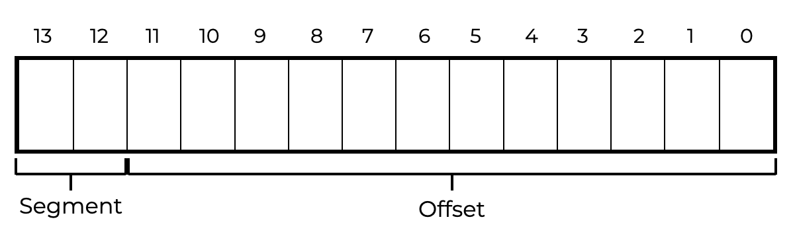
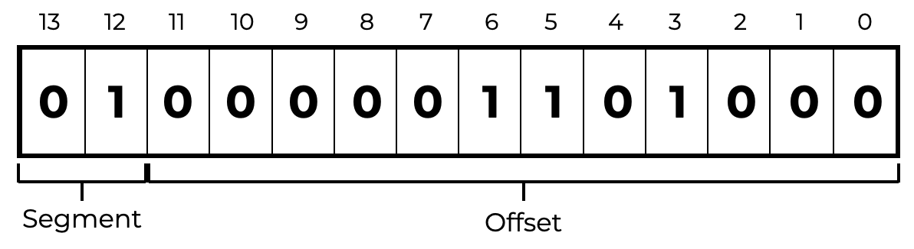
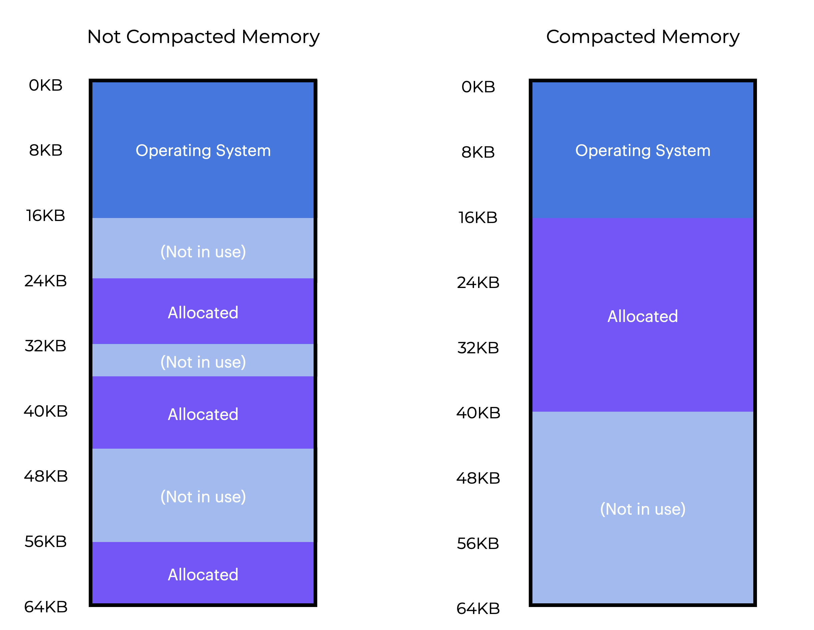

# Overview
# 概览

Let’s explore how to support a larger address space.  
让我们探索如何支持更大的地址空间。

This section should help us answer the following questions:  
本节应该能帮助我们回答以下问题：  

-  **How can we support a large address space that could possibly have a lot of free space between the stack and the heap**  
- **我们如何支持一个大的地址空间，它可能在堆栈和堆之间有很多空闲空间**

# Introduction
# 介绍

**So far, we’ve stored each process’s complete address space in memory.**    
**到目前为止，我们已经将每个进程的完整地址空间存储在内存中。**  
The OS can simply move processes around in physical memory using the **base and bounds registers.**  
操作系统可以使用**基址和界限寄存器**简单地在物理内存中移动进程。  
You may have noticed something unique about our address spaces: a large “free” area between the stack and the heap.    
你可能已经注意到我们的地址空间中有一些独特的东西：堆栈和堆之间有一个大的“空闲”区域。  
In the graphic to the left, even though the space is “free”, it’s still taking up physical memory when we move the whole address space to another spot in physical memory.    
在左边的图形中，即使空间是“空闲的”，但是当我们将整个地址空间移动到物理内存中的另一个位置时，它仍然占用物理内存。  
In this case, using a base and bounds register for memory virtualization is wasteful. This also makes is difficult to run a program when the whole address space doesn’t fit into memory.    
在这种情况下，使用基址和界限寄存器进行内存虚拟化是浪费的。当整个地址空间不适合内存时，这也使得运行程序变得困难。
Let’s further explore how to support a larger address space.  
让我们进一步探索如何支持更大的地址空间。  

# Segmentation: Generalized Base/Bounds

`Segmentation` was created to counteract `internal fragmentation` which occurs when a process gets allocated to a memory block that has more memory than necessary. This result in wasted memory, as seen in a previous example. In segmentation, memory is divide into `varied` segment sizes, A `segment` is an uninterrupted piece of the address space of a particular length. Each of these segments has its own base and bounds pair rather than the entire memory mamagement unit having just one pair.  
`分段`是为了对抗`内部碎片`而创建的，当进程被分配到具有比必要的内存更多内存的内存块时，就会发生这种情况。这导致了浪费的内存，如前面的示例所示。在分段中，内存被分成了`不同`的段大小，一个`段`是一个特定长度的地址空间的不间断的一部分。每个段都有自己的基址和界限对，而不是整个内存管理单元只有一个对。  

There are three different segment types that can occupy the address space:  
有三种不同的段类型可以占用地址空间：  

>  *  `Code` - The code segment contains the instructions that the process will execute.  
>  *  `Code` - 代码段包含进程将执行的指令。  
>  *  `Stack` - The stack segment contains the stack for the process.
>  *  `Stack` - 栈段包含进程的栈。  
>  *  `Heap` - The heap segment contains the heap for the process.
>  *  `Heap` - 堆段包含进程的堆。  

**Segmentation** lets the OS put each one of those segments into different parts of physical memory and avoid filling the physical memory with unused virtual address space.  
**分段**使操作系统可以将这些段中的每一个放入物理内存的不同部分，并避免使用未使用的虚拟地址空间填充物理内存。  

Let's say we want to put the address space from our previous graphics into physical memory. If we have a base and bounds pair for each segment, we can put each one independently into physical memory.  
假设我们想将前面的图形中的地址空间放入物理内存中。如果我们有每个段的基址和界限对，我们可以将每个段分别放入物理内存中。  


In the graphic above, we see a 64KB physical memory with our three segments in it. Huge address spaces with large amounts of **sparse address space** can be accommodated because only used memory is allocated space in physical memory.  
在上面的图形中，我们看到一个64KB的物理内存，其中包含我们的三个段。由于只分配了使用的内存空间，因此可以容纳具有大量**稀疏地址空间**的巨大地址空间。
Our MMU's hardware structure needs a set of three base and bounds register pairs to handle segmentation. The table below shows the registers values for this example. Each bounds register holds the size of a segment.  
我们的MMU的硬件结构需要一组三个基址和界限寄存器对来处理分段。下表显示了此示例的寄存器值。每个界限寄存器都保存了一个段的大小。


| Segment | Base Register | Size Register |
| ------- | ------------- | ------------- |
| Code | 32KB | 2KB |
| Heap | 34KB | 3KB |
| Stack | 28KB | 2KB |

* the `code segment` is placed at physical address 32KB and has a size of 2KB.
* `代码段`放在物理地址32KB处，大小为2KB。
* the `heap segment` is placed at physical address 34KB and has a size of 3KB.
* `堆段`放在物理地址34KB处，大小为3KB。
* the `stack segment` is placed at physical address 28KB and has a size of 2KB.
* `栈段`放在物理地址28KB处，大小为2KB。

The size segment is identical to the bounds register we mentioned previously. It tells the hardware of the number of valid bytes in the segment. This allows the hardware to detect when a software has accessed data outside of these bounds without permission.  
段大小与前面提到的界限寄存器相同。它告诉硬件段中有效字节数的数量。这允许硬件在没有许可的情况下检测软件是否访问了这些边界之外的数据。  

## Questions

In a system using segmentation, programs are represented as a collection of segments stored in a contiguous memory block.  
在使用分段的系统中，程序表示为存储在连续内存块中的一组段。  

# Segmentation Fault

  

Let's translate the address space in the graphics to follow.    
让我们翻译一下图形中的地址空间。  
  

Assume 100 is the virtual address(which is inside the code segment). When the reference happens (like on an instruction fetch), the hardware will add the base value to the offset into this segment(100) to get the desired physical address:  
假设100是虚拟地址（它位于代码段内）。当发生引用（例如在指令获取时），硬件将添加基值到此段（100）的偏移量以获得所需的物理地址：  

```Binary
100 + 32KB = 32,868
```
The hardware will then check if the address is within bounds (is 100 < 2KB), see that it is, and issue the reference to physical memory address 38,868.    
然后硬件将检查地址是否在界限内（100 < 2KB），看到它是，并发出对物理内存地址38,868的引用。  
What about a virtual address of 4200 in the heap? Adding the virtual address 4200 to the heap's base (34KB) gives us a physical address of 39016, which is incorrect.   
那么在堆中的虚拟地址4200呢？将虚拟地址4200添加到堆的基址（34KB）会得到一个物理地址39016，这是不正确的。  
The first step is to get the offset into the heap, which tells us which byte(s) in this segment the address belongs to. Since the heap begins at virtual address 4KB, the 4200 offset is really 4200 - 4KB, or 104. We then add this offset (104) to the physical address of the base register (34KB) to get the desired result: 34920.    
第一步是获取堆中的偏移量，它告诉我们地址属于该段中的哪个字节。由于堆从虚拟地址4KB开始，4200的偏移量实际上是4200 - 4KB，即104。然后，我们将此偏移量（104）添加到基寄存器的物理地址（34KB）中，以获得所需的结果：34920。  
## Questions

What if we tried to refer to an illegal address past the end of the heap?  
如果我们尝试引用堆末尾之后的非法地址怎么办？  
The hardware determines that the address is out of bounds and will likely terminate the process. This results in what is commonly known as a segmentation fault.   
硬件确定地址超出范围，并可能终止进程。这导致了通常称为分段错误的结果。  
# Which Segment Do We Mean?

During translation, the hardware makes use of segment registers. How does it determine the offset into a segment, as well as which segment an address relates to? One common approach, known as an explicit approach, is to divide the address space into segments based on the first few bits of the virtual address.    
在翻译期间，硬件使用段寄存器。硬件如何确定段中的偏移量以及地址与哪个段相关？一种常见的方法，称为显式方法，是根据虚拟地址的前几位将地址空间划分为段。  
In our previous example, we have three segments, so we only need two bits to complete our assignment. If we pick the segment using the first two bits of our 14 -bit virtual address, our virtual address will look like this:  
在我们之前的例子中，我们有三个段，所以我们只需要两位就可以完成我们的分配。如果我们使用14位虚拟地址的前两位来选择段，我们的虚拟地址将如下所示：   


If the top two bits are 00 , the hardware understands the virtual address is in the code segment and uses the code base and bounds pair to relocate it. If the top two bits are 01 , the hardware uses the heap base and bounds.   
如果最高两位是00，硬件就会理解虚拟地址位于代码段中，并使用代码基址和边界对对其进行重定位。如果最高两位是01，硬件将使用堆基址和边界。   
To clarify, let’s translate our previous heap virtual address ( 4200 ). Here is the virtual address 4200 in binary form:  
为了澄清，让我们翻译我们之前的堆虚拟地址（4200）。这是二进制形式的虚拟地址4200：  



So, the first two bits ( 01 ) indicate the hardware which section we’re talking about. The last 12 bits indicate the segment offset: 000001101000 , hex 0x068 , decimal 104 .   
因此，前两位（01）表示硬件我们正在讨论的部分。最后12位表示段偏移量：000001101000，十六进制0x068，十进制104。  
So the hardware uses the first two bits to select the segment register, and the next 12 bits to offset into the segment. The final physical address is obtained by adding the base register to the offset.   
因此，硬件使用前两位来选择段寄存器，下一个12位来偏移段。最终的物理地址是通过将基寄存器添加到偏移量来获得的。  
The offset also simplifies the bounds check. If the offset is not less than the bounds, the address is illegal.   
偏移量还简化了边界检查。如果偏移量不小于边界，则地址是非法的。  

## Questions

The offset is added to a segment’s base register to create the complete physical address.  
偏移量被添加到段的基寄存器中，以创建完整的物理地址。  
# Example

To get the desired physical address, the hardware would do something like the code segment to the blow if the base and bounds were arrays (with one entry per segment).   
要获得所需的物理地址，硬件将像下面的代码段一样做，如果基址和边界是数组（每个段一个条目）。  
``` C
// get top 2 bits of 14-bit VA
Segment = (VirtualAddress & SEG_MASK) >> SEG_SHIFT
// now get offset
Offset = VirtualAddress & OFFSET_MASK
if (Offset >= Bounds[Segment])
	RaiseException(PROTECTION_FAULT)
else
	PhysAddr = Base[Segment] + Offset
	Register = AccessMemory(PhysAddr)
```

  

In our continuous example, we can fill in the values for the constants in the code segment to the left.   
在我们的连续示例中，我们可以在左侧的代码段中填写常量的值。  
- SEG_MASK would be set to 0x300 
- SEG_SHIFT is set to 12 
- OFFSET_MASK is set to 0xFFF 

You may have noticed that when we use the top two bits and there are just three segments (code, heap, and stack), one segment of the address space is left unused. Some systems put code in the same segment as the heap to fully use the virtual address space (and avoid an unused segment) and use only one bit to decide which segment to use.   
您可能已经注意到，当我们使用最高两位时，只有三个段（代码，堆和堆栈），地址空间的一个段被留下来。一些系统将代码放在与堆相同的段中，以完全使用虚拟地址空间（并避免未使用的段），并且只使用一个位来决定使用哪个段。  
You may have noticed that when we use the top two bits and there are just three segments (code, heap, and stack), one segment of the address space is left unused. Some systems put code in the same segment as the heap to fully use the virtual address space (and avoid an unused segment) and use only one bit to decide which segment to use.   
您可能已经注意到，当我们使用最高两位时，只有三个段（代码，堆和堆栈），地址空间的一个段被留下来。一些系统将代码放在与堆相同的段中，以完全使用虚拟地址空间（并避免未使用的段），并且只使用一个位来决定使用哪个段。  
The hardware can also determine the segment an address belongs to. The implicit approach determines the segment by examining the address. If the address came from the program counter (i.e., an instruction fetch), it’s in the code segment. If it came from the stack or base pointer, it’s in the stack segment. All others are in the heap.  
硬件还可以确定地址所属的段。隐式方法通过检查地址来确定段。如果地址来自程序计数器（即，指令获取），则它位于代码段中。如果它来自堆栈或基指针，则它位于堆栈段中。所有其他都在堆中。  
## Questions

> There are three valid segments types: code, stack, and heap.   
> 有三种有效的段类型：代码，堆栈和堆。  
# What About the Stack? 
Next, let’s talk about the stack. If we revisit our previous graphic, the stack has been shifted to physical address 28KB , but with one major difference: it now grows backwards (towards lower addresses). It “starts” at 28KB and expands back to 26KB in physical memory, corresponding to virtual addresses 16KB to 14KB . Translation has to proceed in a different way.  
下一步，让我们谈谈堆栈。如果我们重新访问我们之前的图形，堆栈已经被移动到物理地址28KB，但有一个主要的区别：它现在向后生长（向较低的地址）。它“开始”在28KB，并在物理内存中向后扩展到26KB，对应于虚拟地址16KB到14KB。翻译必须以不同的方式进行。  


The first thing we need is some more hardware support. In addition to the base and boundary numbers, the hardware also has to know which way the segment will grow (a bit, for example, that is set to 1 when the segment grows in the positive direction, and 0 for negative). The table below shows our modified view of the hardware tracks:   
我们需要的第一件事是一些更多的硬件支持。除了基数和边界数字之外，硬件还必须知道段将如何增长（例如，当段以正方向增长时设置为1，而在负方向增长时设置为0）。下表显示了我们修改后的硬件跟踪：  
| Segment | Base | Size(max 4KB) | Growth Direction | 
| :--- | :---: | :---: | ---: | 
| Code | 32K | 2K | 1 | 
| Heap | 34K | 3K | 1 | 
| Stack | 28K | 2K | 0 |

Because the hardware now recognizes that segments can grow in the opposite direction, it has to now translate virtual addresses in a different way. Let’s look at an example stack virtual address and translate it.   
由于硬件现在认识到段可以以相反的方向增长，因此它现在必须以不同的方式翻译虚拟地址。让我们看一个例子堆栈虚拟地址并翻译它。  
Say we want to access virtual address 15KB , which should correspond to physical address 27KB in this example. In binary representation, our virtual address looks like this:   
假设我们想访问虚拟地址15KB，它应该在这个例子中对应于物理地址27KB。在二进制表示中，我们的虚拟地址如下所示：  
```Binary
> 11 1100 0000 0000 (hex 0x3C00)
```
The first two bits ( 11 ) are used by the hardware to designate the segment, but we are left with a 3KB offset. To get the right negative offset, subtract the maximum segment size from 3KB . A segment can be 4KB in this case, so the correct negative offset is:  
硬件用前两位（11）来指定段，但我们剩下的是3KB偏移量。要获得正确的负偏移量，从3KB中减去最大段大小。在这种情况下，一个段可以是4KB，因此正确的负偏移量是：  
```Binary
3KB−4KB=−1KB
```

To get the right physical address, we add the negative offset ( −1KB ) to the base ( 28KB ). The bounds check is done by confirming that the negative offset’s absolute value is less than or equal to the segment’s current size (in this case, 2KB ).  
要获得正确的物理地址，我们将负偏移量（−1KB）加到基数（28KB）。通过确认负偏移量的绝对值小于或等于段的当前大小（在这种情况下为2KB）来完成边界检查。   


## Question

> To get the right physical address, we add the negative offset to the base.  
>  要获得正确的物理地址，我们将负偏移量加到基数。

# OS support

You should now understand the basics of segmentation. As the system operates, pieces of the address space are relocated into physical memory, saving a lot of space compared to using a single base/bounds pair for the whole address space. Specifically, the empty space between the stack and the heap does not need to be allocated in physical memory, allowing us to support larger virtual address spaces per process.   
现在你应该了解了分段的基础知识。随着系统的运行，地址空间的各个部分被重新定位到物理内存中，与为整个地址空间使用单个基数/边界对相比，可以节省大量空间。具体来说，堆栈和堆之间的空间不需要在物理内存中分配，从而允许我们为每个进程支持更大的虚拟地址空间。  
But segmentation presents new challenges for the OS.  
但是分段为操作系统带来了新的挑战。  

*  **What should the OS do on a context switch?** The segment registers must be saved and restored. Each process has its own virtual address space, which the OS must correctly set up before continuing execution.   
**操作系统在上下文切换时应该做什么？** 段寄存器必须保存和恢复。每个进程都有自己的虚拟地址空间，操作系统必须在继续执行之前正确设置它。  

*  **When segments grow, the OS interacts (or perhaps shrink).** To allocate an object, a program can use malloc(). In some cases, the current heap can satisfy the request, and malloc() will find free space for the object and return a pointer to the caller. In others, the heap segment may need to increase.  
当段增长时，操作系统会进行交互（或者可能缩小）。要分配一个对象，程序可以使用malloc()。在某些情况下，当前堆可以满足请求，malloc()将为对象找到空闲空间，并将指针返回给调用者。在其他情况下，堆段可能需要增加。  
	- In this case, the memory-allocation library will use a system call to expand the heap (e.g., sbrk()). As a result, the OS normally provides more space, updating the segment size register to the new (larger) size, and informing the library of success. The OS may deny the request if no more physical memory is available or if the calling process has too much.  
    在这种情况下，内存分配库将使用系统调用来扩展堆（例如，sbrk()）。因此，操作系统通常会提供更多的空间，将段大小寄存器更新为新的（更大）大小，并通知库成功。如果没有更多的物理内存可用或调用进程使用太多，则操作系统可能会拒绝请求。  
* Finally, and maybe most importantly, managing physical memory free space. The OS must be able to find physical memory space for new address spaces. Before, we assumed that each address space had the same size, and physical memory could therefore be described as a series of slots for processes. Now we have multiple segments per process, each with a different size.   
最后，也许最重要的是，管理物理内存空闲空间。操作系统必须能够为新的地址空间找到物理内存空间。在此之前，我们假设每个地址空间的大小相同，因此物理内存可以描述为进程的一系列插槽。现在，每个进程有多个段，每个段的大小都不同。  

The main issue is that physical memory soon fills up with pockets of free space, making it impossible to assign new segments or expand old ones. We call this external fragmentation. We can see an example of this in the figure to the left.  
主要问题是，物理内存很快就会充满空闲空间的口袋，使得无法分配新的段或扩展旧的段。我们称之为外部碎片。我们可以在左边的图中看到这种情况的例子。  

 In this case, a process requests a 20KB section. In this case, there is 24KB free, but not in one piece (rather, in three non-contiguous chunks). So the OS can’t handle the 20KB . If the next so many bytes of physical space are not accessible, the OS must deny the request, even if there are free bytes elsewhere in physical memory.  
在这种情况下，一个进程请求一个20KB的部分。在这种情况下，有24KB的空闲空间，但不是一块（而是三块不连续的块）。因此，操作系统无法处理20KB。如果下一个这么多字节的物理空间不可访问，操作系统必须拒绝请求，即使物理内存中的其他位置有空闲字节。  
Rearranging existing memory parts could help compact physical memory. For example, the OS may stop all current processes, copy their data to one contiguous region of memory, and update their segment register values to point to the new physical addresses. So the OS lets the next allocation request succeed. However, copying segments is memory-intensive and takes up a lot of processor time. Compaction also makes requests to grow current segments difficult to meet.  
重新排列现有的内存部分可以帮助压缩物理内存。例如，操作系统可以停止所有当前进程，将它们的数据复制到内存的一个连续区域，并更新它们的段寄存器值以指向新的物理地址。因此，操作系统允许下一个分配请求成功。但是，复制段是内存密集型的，并且占用大量的处理器时间。压缩还使得对当前段进行扩展的请求难以满足。  

## Question
When physical memory is so full of empty space that assigning new segments or expanding old ones becomes impossible, which of the following happens?  
当物理内存中的空闲空间如此之多，以至于无法分配新的段或扩展旧的段时，会发生以下哪种情况？  

When physical memory fills up with pockets of free space, this makes it impossible to assign new segments or expand old ones. We call this External Fragmentation.   
当物理内存充满了空闲空间的口袋时，这使得无法分配新的段或扩展旧的段。我们称之为外部碎片。  
# Summary

  

Segmentation solves many difficulties and improves memory virtualization.  
分段解决了许多困难并改善了内存虚拟化。  

- It is also fast since the arithmetic segmentation is simple and hardware-friendly. Translation overheads are minor.  
- 它也很快，因为算术分段简单且硬件友好。翻译开销很小。  
- Beyond dynamic relocation, segmentation can help sparse address spaces by reducing the amount of memory wasted across logical address space segments.  
- 除了动态重定位外，分段还可以通过减少逻辑地址空间段之间浪费的内存量来帮助稀疏地址空间。  

- However, as we discovered, allocating variable-sized segments in memory causes certain issues.  
- 然而，正如我们所发现的，将可变大小的段分配到内存中会导致某些问题。  
- The first is external fragmentation. Because segments vary in size, free memory is divided into odd-sized chunks, making memory allocation challenging.  
- 第一个是外部碎片。由于段的大小不同，空闲内存被分成了奇数大小的块，使得内存分配变得具有挑战性。  

The problem is fundamental and hard to avoid using smart algorithms or periodically compact memory.  
这个问题是根本性的，很难使用智能算法或定期压缩内存来避免。  
- Second, and perhaps more importantly, segmentation still isn’t flexible enough to support our fully generalized, sparse address space.  
- 第二，也许更重要的是，分段仍然不够灵活，无法支持我们完全通用的稀疏地址空间。  
- If we have a huge but rarely used heap in one logical segment, we must access the entire heap in memory.  
- 如果我们在一个逻辑段中有一个巨大但很少使用的堆，我们必须访问内存中的整个堆。  

The address space model we use does not exactly match how the underlying segmentation was designed to support it, so we need fresh solutions.  
我们使用的地址空间模型并不完全匹配底层分段如何支持它的方式，因此我们需要新的解决方案。  