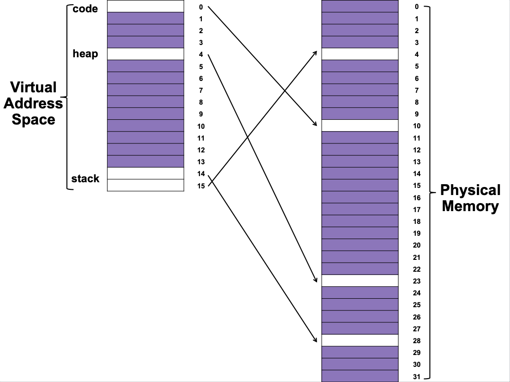
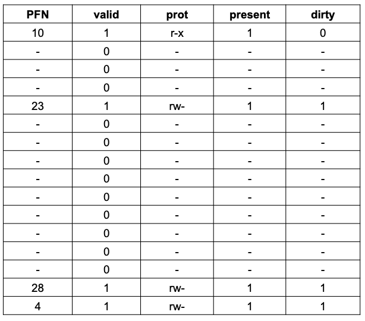
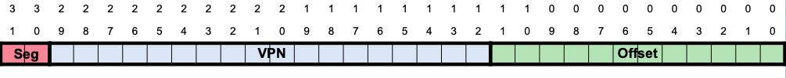
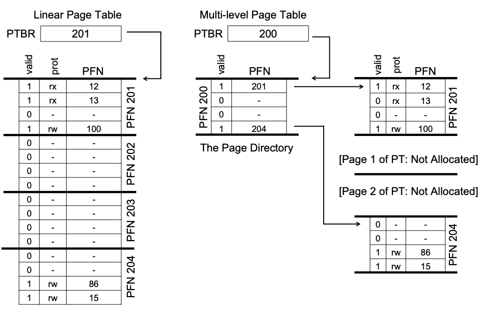
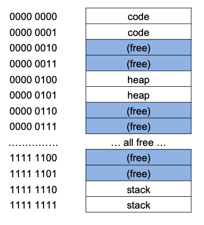
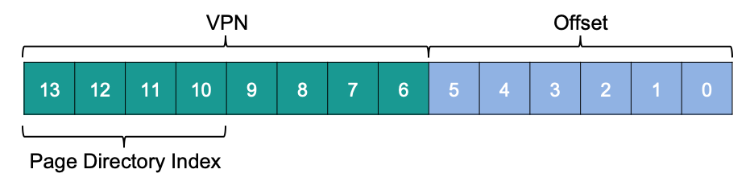
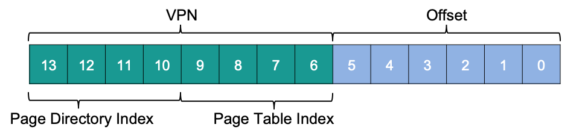
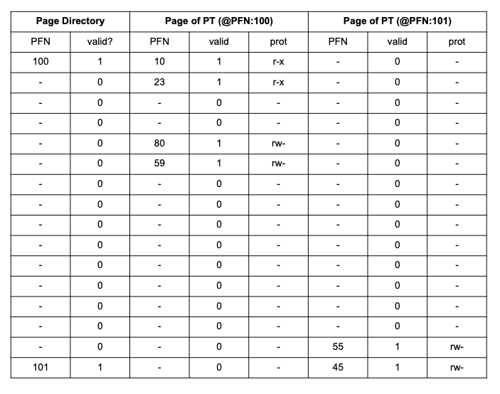
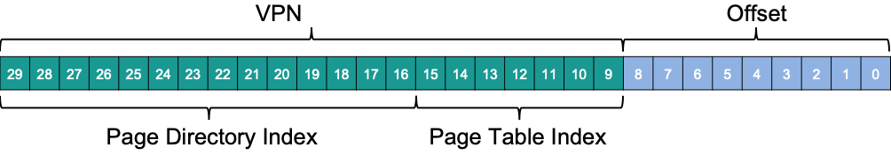
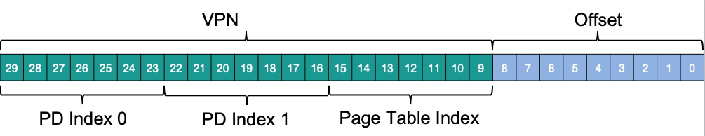

# Overview
Simple array-based page tables (also known as linear page tables) are too big and take up too much memory. For the sake of our OS’s efficiency, let’s explore how to make tables smaller.  
简单的基于数组的页表（也称为线性页表）太大，占用太多内存。为了提高我们的操作系统的效率，让我们探索如何使表更小。  

This section should help us answer the following questions:  
本节应该能帮助我们回答以下问题：
* How can we shrink page tables?  
    我们如何缩小页表？
* What are the central ideas?  
    中心思想是什么？
* What inefficiencies do these new data structures bring with them?  
    这些新的数据结构带来了哪些低效？

# Introduction

Let’s start by imagining we have a **32**-bit address space (**232** bytes) and **4KB** (**212** byte) pages and a **4**-byte page-table entry.  
让我们从想象我们有一个**32**位地址空间（**232**字节）和**4KB**（**212**字节）页和一个**4**字节的页表项开始。  

Considering the size of our page table and the size of our address space, our address space has roughly one million virtual pages (**232÷    212**); multiply by the page-table entry size and we arrive at a **4MB** page table. In addition, each process in the database usually has one page table!  
考虑到页表的大小和地址空间的大小，我们的地址空间大约有一百万个虚拟页（**232÷212**）；乘以页表项的大小，我们得到一个**4MB**的页表。此外，数据库中的每个进程通常都有一个页表！  

If **100** processes are running in parallel (not uncommon on a modern system), we’ll be using hundreds of megabytes of memory for page tables alone! Therefore, we are searching for techniques to reduce this heavy burden.  
如果**100**个进程同时运行（在现代系统上并不罕见），我们将仅使用数百兆字节的内存来存储页表！因此，我们正在寻找减轻这种沉重负担的技术。  

**How can we make these page tables smaller?**  
**我们如何使这些页表更小？**

# Larger Pages
One simple way to reduce the size of the page table is to use larger pages. Consider our 32-bit address space once more, but this time with 16-KB pages. As a result, we would have an 18-bit VPN with a 14-bit offset. Assuming that each PTE is the same size (4 bytes), our linear page table now has 218 entries and a total size of 1MB per page table, a factor of four reduction in the size of the page table (not surprisingly, the reduction exactly mirrors the factor of four increase in page size).  
减小页表的大小的一种简单方法是使用更大的页面。再次考虑我们的32位地址空间，但这次使用16-KB页面。因此，我们将有一个18位VPN和一个14位偏移量。假设每个PTE的大小相同（4字节），我们的线性页表现在有218个条目，每个页表的总大小为1MB，页表的大小减少了四倍（不出所料，减少的大小完全反映了页面大小增加四倍的因素）。  

The major drawback to this strategy is that large pages result in waste within each page, a problem known as internal fragmentation (as the waste is internal to the unit of allocation). As a result, applications allocate pages but only use small portions of each, and memory quickly fills up with these excessively large pages. As a result, in the most common case, most systems use relatively small page sizes: 4KB (as in x86) or 8KB (as in SPARCv9). Unfortunately, our problem will not be solved so easily.  
这种策略的主要缺点是大页面在每个页面中会产生浪费，这是内部碎片化的问题（因为浪费是分配单元内部的）。因此，应用程序分配页面，但只使用每个页面的小部分，内存很快就会充满这些过大的页面。因此，在最常见的情况下，大多数系统使用相对较小的页面大小：4KB（如x86）或8KB（如SPARCv9）。不幸的是，我们的问题不会这么容易解决。  

# Paging and Segments
When you have two legitimate but opposing viewpoints on something, you should always consider combining them to get the best of both worlds. A hybrid is such a mix. For example, why eat simply chocolate or plain peanut butter when you can have a Reese’s Peanut Butter Cup?  
当你对某事有两种合理但相反的观点时，你应该始终考虑将它们结合起来，以两全其美。混合体就是这样的混合体。例如，既然可以喝 Reese’s 花生酱杯，为什么只吃巧克力或纯花生酱呢？

The Multics designers (particularly Jack Dennis) came across such a concept while developing the Multics virtual memory technology. Dennis proposed combining paging and segmentation to reduce page table memory consumption. A closer look at a typical linear page table reveals why this might work. Assume we have a modest heap and stack address space. **Figure 20.1** shows a modest 16KB address space with 1KB pages; **Figure 20.2** shows the page table for this address space.  
Multics设计人员（尤其是Jack Dennis）在开发Multics虚拟内存技术时遇到了这样的概念。 Dennis建议将分页和分段结合起来来减少页表内存消耗。更仔细地看一下典型的线性页表，就会发现这可能会起作用。假设我们有一个适度的堆和堆栈地址空间。**图20.1**显示了一个适度的16KB地址空间，每个1KB页面；**图20.2**显示了这个地址空间的页表。  

Figure 20.1


Figure 20.2


That is, the code page (VPN 0) is mapped to physical page 10, the heap page (VPN 4) to physical page 23, and the two stack pages (VPNs 14 and 15) to physical pages 28 and 4. As you can see, much of the page table is empty or has erroneous entries. Wast! That’s for a 16KB address space. Imagine a 32-bit address space’s page table and all the possible wasted space! Imagine it; it’s far too awful.  
也就是说，代码页面（VPN 0）映射到物理页面10，堆页面（VPN 4）映射到物理页面23，两个堆栈页面（VPNs 14和15）映射到物理页面28和4。正如你所看到的，页表的大部分是空的或有错误的条目。浪费！这是一个16KB地址空间。想象一下32位地址空间的页表和所有可能的浪费空间！想象一下，这太可怕了。  

So, instead of one page table for the process’s whole address space, why not one per logical segment? In this case, we’d have three page tables, one each for the code, heap, and stack.  
因此，为进程的整个地址空间设置一个页表，而不是为每个逻辑段设置一个页表？在这种情况下，我们将有三个页表，分别用于代码，堆和堆栈。

We had a base register that told us where each segment was in physical memory, and a bound or limit register that told us how big it was. In our hybrid, the MMU still has similar structures, but the base now holds the physical address of the segment’s page table. The limits register indicates the page table’s end (i.e., how many valid pages it has).  
我们有一个基寄存器，告诉我们每个段在物理内存中的位置，以及一个边界或限制寄存器，告诉我们它有多大。在我们的混合体中，MMU仍然有类似的结构，但现在基寄存器保存了段的页表的物理地址。限制寄存器指示页表的结束（即它有多少有效页面）。  

Let’s look at a simple example. A 32-bit virtual address space with 4KB pages, divided into 4 pieces. For this example, we’ll use three segments: code, heap, and stack.  
让我们看一个简单的例子。一个32位虚拟地址空间，每个4KB页面，分成4个部分。对于这个例子，我们将使用三个段：代码，堆和堆栈。  

To figure out which segment an address relates to, we examine the top two bits. Assume 00 is unused, 01 is code, 10 is the heap, and 11 is the stack. A virtual address is thus:  
要确定地址与哪个段相关，我们检查最高两位。假设00是未使用的，01是代码，10是堆，11是堆栈。因此，虚拟地址是：  



Assume three base/bounds pairings, one each for code, heap, and stack. When a process runs, the base register for each of these segments includes the physical address of a linear page table for that segment. During a context switch, these registers must be updated to reflect the new process’s page tables.  
假设有三个基/边界配对，每个都是代码，堆和堆栈。当进程运行时，这些段的基寄存器包括该段的线性页表的物理地址。在上下文切换期间，必须更新这些寄存器以反映新进程的页表。

On a TLB miss (assuming a hardware-managed TLB), the hardware utilizes the segment bits (SN) to identify which base and bounds pair to use. The hardware then combines the physical address with the VPN to generate the page table entry (PTE) address:  
在TLB丢失（假设是硬件管理的TLB）时，硬件利用段位（SN）来识别要使用哪个基和边界配对。然后，硬件将物理地址与VPN结合以生成页表条目（PTE）地址：  

```text
SN           = (VirtualAddress & SEG_MASK) >> SN_SHIFT
VPN          = (VirtualAddress & VPN_MASK) >> VPN_SHIFT
AddressOfPTE = Base[SN] + (VPN * sizeof(PTE))
```
This sequence should be familiar from previous work with linear page tables. The only change is that instead of a single page table base register, a three segment base register is used.  
这个序列应该很熟悉，因为之前使用线性页表的工作。唯一的变化是，不是使用单个页表基寄存器，而是使用三个段基寄存器。  

Our hybrid method has a bounds register per segment, which holds the maximum valid page for that segment. Using the first three pages (0, 1, and 2) of the code segment allocates just three entries to the code segment page table, setting the boundaries register to 3. Memory accesses beyond the end of the segment raise an exception, potentially terminating the process. Our hybrid technique saves memory over the linear page table because unallocated pages between the stack and the heap are no longer needed (just to mark them as not valid).  
我们的混合方法每个段都有一个边界寄存器，它保存该段的最大有效页面。使用代码段的前三页（0，1和2）只为代码段页表分配了三个条目，将边界寄存器设置为3。超过段末尾的内存访问会引发异常，可能会终止进程。我们的混合技术节省了线性页表的内存，因为堆栈和堆之间的未分配页面不再需要（只是为了将它们标记为无效）。  

As you can see, this method is not without flaws. First, it still requires segmentation; as previously noted, segmentation is not very flexible, as it assumes a fixed address space utilization pattern; a huge but sparsely used heap, for example, can result in a lot of page table waste. Second, this hybrid triggers external fragmentation. While most memory is maintained in pages, page tables can now be any size (in multiples of PTEs). So finding memory space for them is more difficult. So people kept looking for better ways to create smaller page tables.  
正如您所看到的，这种方法并不完美。首先，它仍然需要分段；如前所述，分段不太灵活，因为它假设了固定的地址空间利用模式；例如，一个巨大但稀疏使用的堆可能会导致大量的页表浪费。其次，这种混合触发了外部碎片。虽然大多数内存都维护在页面中，但现在页表可以是任何大小（以PTE为倍数）。因此，找到它们的内存空间更加困难。所以人们一直在寻找更好的方法来创建更小的页表。  

# Multi-Level Page Tables
A different approach, which does not rely on segmentation, addresses the same issue: how to get rid of all those incorrect sections in the page table rather than retaining them all in memory. This method is known as a multi-level page table because it transforms a linear page table into a tree-like structure. This method is so effective that it is used by many modern systems (e.g., x86). We’ll go through this strategy in more depth now.  
不同的方法，不依赖于分段，解决了同样的问题：如何摆脱页表中所有错误的部分，而不是将它们全部保留在内存中。这种方法被称为多级页表，因为它将线性页表转换为类似树的结构。这种方法非常有效，因为许多现代系统（例如，x86）都在使用它。我们现在将更深入地介绍这种策略。 

A multi-level page table is based on a simple concept. To begin, divide the page table into page-sized units; then, if an entire page of page-table entries (PTEs) is invalid, do not assign that page of the page table at all. Use a new structure called the page directory to track if a page of the page table is valid (and if so, where it resides in memory). As a result, the page directory can either inform you where a page of the page table is located, or that the entire page of the page table includes no valid pages.  
多级页表基于一个简单的概念。首先，将页表分成页面大小的单位；然后，如果整个页面的页表条目（PTE）无效，则不分配该页面的页表。使用一个称为页目录的新结构来跟踪页表的一页是否有效（如果是，它在内存中的位置是什么）。因此，页目录可以告诉您页表的一页的位置，或者整个页表的一页不包含有效页面。

Figure 20.3


An example can be shown in Figure 20.3. The conventional linear page table is shown on the left; even if most of the center regions of the address space are invalid, we still need page-table space for them (i.e., the middle two pages of the page table). A multi-level page table is located on the right. Only the first and end pages of the page table are marked as valid by the page directory, and so only those two pages of the page table are stored in memory. As a result, one way to understand what a multi-level table does is that it simply removes sections of the linear page table (freeing those frames for other purposes) and keeps track of which pages of the page table are allocated using the page directory.  
如图20.3所示，可以显示一个例子。左侧显示了传统的线性页表；即使地址空间的中心区域大多数是无效的，我们仍然需要为它们（即，页表的中间两页）提供页表空间。多级页表位于右侧。页目录仅将页表的第一页和最后一页标记为有效，因此只有这两页页表存储在内存中。因此，理解多级表的一种方法是，它只是删除线性页表的部分（为其他目的释放这些帧），并使用页目录跟踪分配了页表的哪些页。  

In a simple two-level table, the page directory includes one entry per page of the page table. It’s made up of a number of page directory entries (PDE). A PDE, like a PTE, has a valid bit and a page frame number (PFN). However, as previously stated, if the PDE is valid, it signifies that at least one of the pages of the page table that the entry points to (via the PFN) is valid, i.e., the valid bit in at least one PTE on that page linked to by this PDE is set to one. The rest of the PDE isn’t defined if the PDE isn’t valid (i.e., equal to zero).  
在一个简单的两级表中，页目录包含页表每一页的一个条目。它由许多页目录条目（PDE）组成。PDE，如PTE，具有有效位和页帧号（PFN）。然而，如前所述，如果PDE有效，则表示该条目指向的页表的至少一页（通过PFN）是有效的，即，该PDE链接的那一页上至少一个PTE的有效位被设置为1。如果PDE无效（即等于零），则PDE的其余部分未定义。  

Multi-level page tables have a number of clear improvements over previous methods. The multi-level table, for starters, only allocates page-table space in proportion to the amount of address space you’re using; as a result, it’s generally compact and supports sparse address spaces.  
多级页表相比以前的方法有许多明显的改进。首先，多级表仅根据您使用的地址空间的数量分配页表空间；因此，它通常是紧凑的，并支持稀疏的地址空间。  

Second, if appropriately created, each section of the page table fits neatly within a page, making memory management easier; when the OS wants to allocate or grow a page table, it may simply grab the next free page. In contrast, a simple (non-paged) linear page table2, which is simply an array of PTEs indexed by VPN, requires that the full linear page table be kept in physical memory. Finding a significant block of unused contiguous free physical memory for a large page table (say 4MB) can be difficult. We add a level of indirection to a multi-level structure by using the page directory, which points to bits of the page table; this indirection allows us to store page-table pages wherever we want in physical memory.  
其次，如果适当创建，页表的每个部分都可以很好地放在一页中，从而使内存管理更容易；当操作系统想要分配或增长页表时，它可以简单地抓取下一个空闲页。相比之下，简单的（非分页）线性页表2，它只是一个由VPN索引的PTE数组，需要将完整的线性页表保留在物理内存中。为大型页表（例如4MB）找到一块大块的连续空闲物理内存可能很困难。我们通过使用页目录来为多级结构添加间接级别，页目录指向页表的位；这种间接允许我们在物理内存中的任何位置存储页表页。  

On a TLB miss, two loads from memory are necessary to acquire the proper translation information from the page table (one for the page directory, and one for the PTE itself), whereas a linear page table only requires one load. As a result, the multi-level table is a simple illustration of a time-space trade-off. We sought smaller tables (and got them), but not for free; while performance is comparable in the common scenario (TLB hit), a TLB miss has a larger cost with this smaller table.  
在TLB失效时，需要从内存加载两次才能从页表中获取正确的转换信息（一个用于页目录，一个用于PTE本身），而线性页表只需要一次加载。因此，多级表是时间-空间权衡的一个简单说明。我们寻求更小的表（并得到了它们），但不是免费的；虽然在常见情况下性能是可比的（TLB命中），但TLB失效在这个较小的表上的成本更大。  

Another evident disadvantage is the level of intricacy. Whether the page-table lookup (on a TLB miss) is handled by the hardware or the OS, it is clearly more complicated than a basic linear page-table lookup. In the case of a multi-level table, we make page-table lookups more complicated to save important memory.  
另一个明显的缺点是复杂性。无论是在TLB失效时由硬件还是由操作系统处理页表查找，它都明显比基本的线性页表查找更复杂。在多级表的情况下，我们使页表查找更复杂以节省重要的内存。  

# Multi-Level Example
Let’s look at an example of multi-level page tables. Imagine a 16KB address space with 64-byte pages. 8 bits for VPN and 6 bits for offset gives us a 14-bit virtual address space. Even if only a fraction of the address space is used, a linear page table has 28 (256) entries. **Figure 20.4** below is an example.  
让我们看一个多级页表的例子。假设有一个16KB的地址空间，每页64字节。VPN的8位和偏移量的6位给我们一个14位的虚拟地址空间。即使只使用地址空间的一小部分，线性页表也有28（256）个条目。下图是一个例子。  



The code is on virtual pages 0 and 1, the heap is on virtual pages 4 and 5, and the stack is on virtual pages 254 and 255; the rest of the address space is unused.  
代码位于虚拟页0和1上，堆位于虚拟页4和5上，栈位于虚拟页254和255上；地址空间的其余部分未使用。  

Start with our whole linear page table and divide it up into page-sized parts. Assume each PTE is 4 bytes OPERATING SYSTEMS in size. So our page table is 1KB (256 4). With 64-byte pages, the 1KB page table can be partitioned into 16 pages, each holding 16 PTEs.  
从我们的整个线性页表开始，并将其分成页大小的部分。假设每个PTE的大小为4字节。因此，我们的页表是1KB（256 4）。使用64字节的页，1KB的页表可以分成16个页，每个页都包含16个PTE。  

Now we need to learn how to utilize a VPN to index first into the page directory, then into the page table. Each is an array of entries; we only need to figure out how to build the index for each from portions of the VPN.  
现在我们需要学习如何利用VPN来首先索引页目录，然后索引页表。每个都是一个条目数组；我们只需要弄清楚如何从VPN的各个部分构建每个的索引。  

Let’s start with the page directory. In this example, we have 256 entries on 16 pages. The page directory comprises 16 entries, one for each page of the page table. As a result, we need to index four pieces of the VPN into the directory:  
让我们从页目录开始。在这个例子中，我们有16个页面上的256个条目。页目录包括16个条目，每个页表页有一个。因此，我们需要将VPN的四个部分索引到目录中：  



We can utilize the VPN’s page-directory index (PDIndex) to find the PDE’s address by doing the following calculation: (PDIndex * sizeof(PDE)) This creates our page directory, which we now examine to continue our translation.  
我们可以利用VPN的页目录索引（PDIndex）通过以下计算来找到PDE的地址：（PDIndex * sizeof（PDE））这创建了我们的页目录，现在我们检查它以继续我们的翻译。  

If the page-directory entry is invalid, we raise an exception. But if the PDE is valid, we have additional work. We must now retrieve the PTE from the page of the page table referenced to by this page directory entry. To find this PTE, we must index it into the page table using the remaining VPN bits:  
如果页目录条目无效，我们会引发一个异常。但是，如果PDE有效，我们还有额外的工作。我们现在必须从页目录条目引用的页表页中检索PTE。要找到这个PTE，我们必须使用剩余的VPN位将其索引到页表中：  



After that, the PTIndex can be used to index into the page table itself, giving us our PTE’s address:  
之后，PTIndex可以用来索引页表本身，给我们我们的PTE的地址：  

```text
    (PDE.PFN SHIFT) + (PTIndex * sizeof(PTE))
```

Remember to left-shift the PFN from the page directory entry before combining it with the PTE’s page-table index.  
记住在将PFN与PTE的页表索引结合之前，要将其左移。  

To test this, we’ll populate a multi-level page table with real data and translate a single virtual address. Let’s start with the example page directory (left side of **Figure 20.5**).  
要测试这一点，我们将用真实数据填充多级页表，并翻译单个虚拟地址。让我们从示例页目录（**图20.5**的左侧）开始。  

Figure 20.5


As seen in the image, each PDE explains numerous erroneous mappings.
Physical page 100 (the 0th page of the page table) contains the first page of 16 page table entries for the address space’s first 16 VPNs. Figure 20.5 (middle) shows the contents of this page table.  
如图所示，每个PDE都解释了许多错误的映射。物理页100（页表的第0页）包含地址空间的前16个VPN的第一个页面的16个页表条目。图20.5（中间）显示了这个页表的内容。  

In our example, VPNs 0 and 1 (the code section), as well as 4 and 5 (the page table) are legitimate (the heap). That data is in the table. The rest are invalid.  
在我们的例子中，VPN 0和1（代码部分）以及4和5（页表）是合法的（堆）。该数据在表中。其余的都是无效的。  

PFN 101 has the other valid page of the page table. Figure 20.5 (right) shows the mappings for the last 16 VPNs of the address space.  
PFN 101具有页表的另一个有效页。图20.5（右）显示了地址空间的最后16个VPN的映射。  

In this case, VPNs 254 and 255 (the stack) map. This example should show how much space may be saved by using a multi-level indexed structure. Instead of allocating the entire sixteen pages for a linear page table, we merely allot three: one for the page directory and two for the valid mapping chunks. Larger (32-bit or 64-bit) address spaces may save even more.  
在这种情况下，VPN 254和255（堆栈）映射。这个例子应该显示使用多级索引结构可以节省多少空间。与为线性页表分配整个十六页不同，我们只分配三个：一个用于页目录，两个用于有效的映射块。更大的（32位或64位）地址空间可以节省更多。  

Finally, let us translate this data. The 0th byte of VPN 254 is 0x3F80, or 11 1111 1000 0000 in binary.   
最后，让我们翻译这些数据。VPN 254的第0个字节是0x3F80，或二进制中的11 1111 1000 0000。  

In the page directory, we will use the top 4 bits of the VPN. So 1111 picks the last entry (15th if you start at 0) in the page directory above. This points to a legitimate page table at address 101. So we utilize the VPN’s next 4 bits (1110) to index into the page table and find the necessary PTE. 1110 tells us that page 254 of our virtual address space is matched to physical page 55. Our desired physical address is formed by adding PFN=55 (or hex 0x37) to offset=000000 and sending it to the memory system: PTE.PFN + offset = 00 1101 1100 0000 = 0x0DC0  
在页目录中，我们将使用VPN的最高4位。因此，1111选择上面页目录中的最后一个条目（如果从0开始，第15个）。这指向地址101的合法页表。因此，我们使用VPN的下一个4位（1110）来索引页表并找到必要的PTE。1110告诉我们虚拟地址空间的第254页与物理页55相匹配。我们想要的物理地址是通过将PFN = 55（或十六进制0x37）加到偏移量= 000000并将其发送到内存系统来形成的：PTE.PFN + offset = 00 1101 1100 0000 = 0x0DC0  

To build a two-level page table, you need a page directory that points to the page table’s pages. Sadly, our work is not done. As we’ll see, two layers of page table isn’t always enough!  
要构建两级页表，您需要一个指向页表页的页目录。遗憾的是，我们的工作还没有完成。正如我们将看到的，两层页表并不总是足够的！

# More Than Two Levels
So far, we’ve assumed that multi-level page tables have only two levels: a page directory and then individual page table parts. A deeper tree may be achievable in some circumstances (and indeed, needed).  
到目前为止，我们假设多级页表只有两个级别：一个页目录，然后是单独的页表部分。在某些情况下，可能可以实现更深的树（实际上是需要的）。  

Let’s look at a basic example to demonstrate why a deeper multi-level table can be beneficial. Assume we have a 30-bit virtual address space and a tiny (512-byte) page in this example. As a result, our virtual address comprises a virtual page number component of 21 bits and a 9-bit offset component.  
让我们看一个基本的例子来说明为什么更深的多级表可以有益。假设我们有一个30位的虚拟地址空间，在这个例子中有一个小的（512字节）页。因此，我们的虚拟地址由虚拟页号组件21位和9位偏移组件组成。  

Remember our goal while building a multi-level page table: each item of the table should fit on a single page. We’ve only looked at the page table thus far; however, what if the page directory grows too large?  
记住我们在构建多级页表时的目标：表的每一项都应该适合于单个页面。到目前为止，我们只看了页表；但是，如果页目录变得太大怎么办？  

To figure out how many levels are required in a multi-level table such that all components of the page table can fit on a single page, we first figure out how many page-table entries can fit on a single page. Given our 512-byte page size and a PTE size of four bytes, you should be able to fit 128 PTEs on a single page. As a result, we can deduce that we’ll use the VPN’s least significant 7 bits (log2128) as an index when indexing into a page of the page table:  
为了确定多级表中需要多少级，以便页表的所有组件都可以放在单个页面上，我们首先要确定单个页面上可以放置多少个页表条目。给定我们的512字节页面大小和PTE大小为四个字节，您应该能够在单个页面上放置128个PTE。因此，我们可以推断出，当索引页表的页面时，我们将使用VPN的最低有效7位（log2128）作为索引：  



You might also notice how many bits are left in the (big) page directory in the diagram above: 14. Our aim of fitting every item of the multi-level page table into a page vanishes if our page directory has 214 entries and spans 128, rather than one page.  
您也可能注意到上图中（大）页目录中剩余的位数：14。如果我们的页目录有214个条目并跨越128个页面，而不是一个页面，那么我们将多级页表的每一项都放入页面的目标就会消失。  

To fix this, we create a new level of the tree by separating the page directory into many pages and then adding another page directory on top of that to point to the page directory’s pages. As a result, we can divide our virtual address as follows:  
为了解决这个问题，我们通过将页目录分成许多页面来创建树的新级别，然后在其上添加另一个页目录来指向页目录的页面。因此，我们可以将我们的虚拟地址分为以下几部分： 

 

We now utilize the very top bits of the virtual address (PD Index 0 in the diagram) to index the upper-level page directory; this index may be used to get the page-directory entry from the top-level page directory. If the physical frame number from the top-level PDE and the next part of the VPN are valid, the second level of the page directory is checked (PD Index 1). Finally, if the page-table index and the address from the second-level PDE are valid, the PTE address can be constructed. Whew! That’s a significant amount of effort. And it was all for the purpose of looking something up in a multi-level table.  
现在，我们使用虚拟地址的最高位（图中的PD Index 0）来索引上级页目录；该索引可用于从顶级页目录中获取页目录条目。如果顶级PDE的物理帧号和VPN的下一部分有效，则检查页目录的第二级（PD Index 1）。最后，如果页表索引和第二级PDE中的地址有效，则可以构造PTE地址。呼！这是一项重要的工作。而且这一切都是为了在多级表中查找某些内容。  

# Remember the TLB

Figure 20.6
```c
1   VPN = (VirtualAddress & VPN_MASK) >> SHIFT
2   (Success, TlbEntry) = TLB_Lookup(VPN)
3   if (Success == True) // TLB Hit
4     if (CanAccess(TlbEntry.ProtectBits) == True)
5       Offset = VirtualAddress & OFFSET_MASK
6       PhysAddr = (TlbEntry.PFN << SHIFT) | Offset
7       Register = AccessMemory(PhysAddr)
8     else
9       RaiseException(PROTECTION_FAULT)
10  else // TLB Miss
11    // first, get page directory entry
12    PDIndex = (VPN & PD_MASK) >> PD_SHIFT
13    PDEAddr = PDBR + (PDIndex * sizeof(PDE))
14    PDE = AccessMemory(PDEAddr)
15    if (PDE.Valid == False)
16      RaiseException(SEGMENTATION_FAULT)
17    else
18      // PDE is valid: now fetch PTE from page table
19      PTIndex = (VPN & PT_MASK) >> PT_SHIFT
20      PTEAddr = (PDE.PFN << SHIFT) + (PTIndex * sizeof(PTE))
21      PTE = AccessMemory(PTEAddr)
22      if (PTE.Valid == False)
23        RaiseException(SEGMENTATION_FAULT)
24      else if (CanAccess(PTE.ProtectBits) == False)
25        RaiseException(PROTECTION_FAULT)
26      else
27        TLB_Insert(VPN, PTE.PFN, PTE.ProtectBits)
28        RetryInstruction()
```

We present the control flow in algorithmic form once more to summarize the full process of address translation using a two-level page table (Figure 20.6). On every memory reference, the graphic depicts what happens in hardware (assuming a hardware-managed TLB).  
我们再次以算法形式呈现控制流程，以总结使用两级页表进行地址转换的完整过程（图20.6）。在每次内存引用时，图形显示了硬件中发生的情况（假设硬件管理TLB）。  

As shown in the diagram, before any of the sophisticated multi-level page table access takes place, the hardware first examines the TLB; if it finds a match, the physical address is produced directly, without having to consult the page table. The hardware only needs to do the complete multi-level lookup if the TLB misses. The cost of our standard two-level page table is seen on this path: two additional memory requests to look for a valid translation.  
如图所示，在任何复杂的多级页表访问之前，硬件首先检查TLB；如果找到匹配项，则直接产生物理地址，而无需查找页表。如果TLB未命中，硬件只需要执行完整的多级查找。我们标准的两级页表的成本可以在这条路径上看到：查找有效转换需要两个额外的内存请求。  


# Inverted Page Tables
Inverted page tables offer even more severe space reductions in the world of page tables. Rather than having many page tables (one for each system process), we have a single page table with an item for each physical page of the system. This entry indicates which process uses this page and which virtual page of that process corresponds to this physical page.  
倒置页表在页表的世界中提供了更严重的空间减少。我们有一个单独的页表，其中包含系统的每个物理页的条目。此条目指示哪个进程使用此页，以及该进程的哪个虚拟页对应于此物理页。  

It’s now just a matter of looking through this data structure to find the correct entry. Because a linear scan would be costly, a hash table is frequently added on top of the underlying structure to speed up lookups. One example of such an architecture is the PowerPC.  
现在，只需查看此数据结构以找到正确的条目。由于线性扫描会耗费成本，因此通常在底层结构之上添加哈希表来加快查找速度。这种架构的一个例子是PowerPC。  

Inverted page tables, in general, demonstrate what we’ve been saying all along: page tables are essentially data structures. You can make data structures smaller or larger, slower or faster, and do all sorts of weird things with them. Multi-level and inverted page tables are only two of the numerous options available.  
一般来说，倒置页表证明了我们一直在说的：页表本质上是数据结构。您可以使数据结构更小或更大，更慢或更快，并对它们进行各种奇怪的事情。多级和倒置页表只是众多可用选项中的两个。  

# Swapping the Page Tables to Disk
Finally, we talk about how one final assumption can be relaxed. So far, we’ve assumed that page tables are stored in physical memory owned by the kernel. Even with all of our tactics for shrinking page tables, it’s still possible that they’ll be too large to fit into memory all at once. As a result, some systems store page tables in kernel virtual memory, allowing the system to swap portions of these page tables to disk if memory becomes scarce. We’ll go over this in further detail in a later chapter (specifically, the case study on VAX/VMS), once we’ve figured out how to move pages in and out of memory.  
最后，我们讨论如何放松最后一个假设。到目前为止，我们假设页表存储在内核拥有的物理内存中。即使使用了所有我们用于缩小页表的策略，也有可能它们无法一次性全部放入内存中。因此，一些系统将页表存储在内核虚拟内存中，允许系统在内存变得稀缺时将这些页表的部分交换到磁盘。一旦我们弄清楚如何将页面移入和移出内存，我们将在后面的章节中详细介绍这一点(具体来说是VAX/VMS的案例研究)。  

# Summary
We’ve now seen how real page tables are constructed, which isn’t always as simple as linear arrays but can also include more complicated data structures. The time and space trade-offs that such tables present are in time and space — the larger the table, the faster a TLB miss may be serviced, and vice versa — and hence the best structure depends heavily on the constraints of the current environment.  
我们现在已经看到了如何构建真正的页表，这并不总是像线性数组那样简单，而且还可以包括更复杂的数据结构。这些表所呈现的时间和空间权衡是在时间和空间上的——表越大，TLB丢失可能得到更快的服务，反之亦然——因此，最佳结构很大程度上取决于当前环境的约束。  
Small structures make sense in memory-constrained systems (such as many older systems); with a system with enough memory and workloads that actively employ a large number of pages, a larger table that speeds up TLB misses would be the better option. The full space of data structures becomes available to the operating system innovator (hint: that’s you) with software-managed TLBs. What innovative constructions can you devise? What issues are they attempting to address? As you drift off to sleep, consider these questions and imagine the huge fantasies that only operating-system developers can imagine.  
在内存受限的系统(如许多较旧的系统)中，小型结构是有意义的;对于具有足够内存和工作负载的系统，它们会积极使用大量页面，较大的表可以加快TLB丢失，这将是更好的选择。软件管理的TLB使操作系统创新者(提示：这是你)能够使用数据结构的全部空间。您可以设计哪些创新结构？它们试图解决什么问题？当您入睡时，请考虑这些问题，并想象只有操作系统开发人员才能想象的巨大幻想。  

# Lab
1. With a linear page table, you only need one register to find it if the TLB misses. To find a two-level page table, how many registers do you need? What about 3 levels?
2. Using the simulator, translate random seeds 0, 1, and 2, and then check your answers with the -c flag.
    - For each memory lookup, how many references are needed?
3. Considering what you know about cache memory, how do you expect memory references to the page table to operate in the cache?
    - Will they result in a high number of cache hits (and fast accesses)?
    - Or are there a lot of misses (and slow accesses)?  