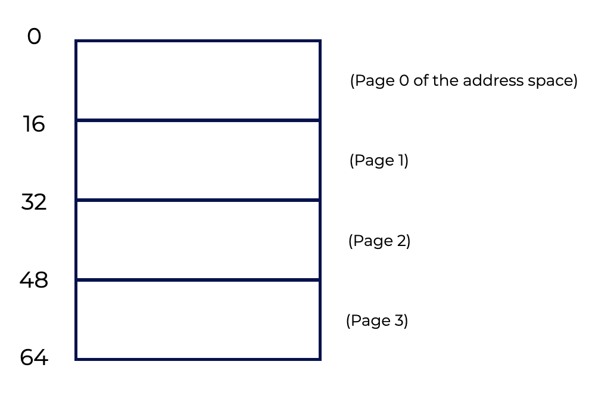
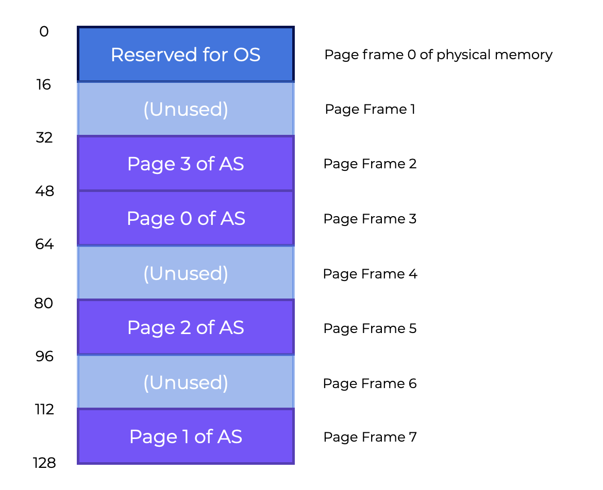
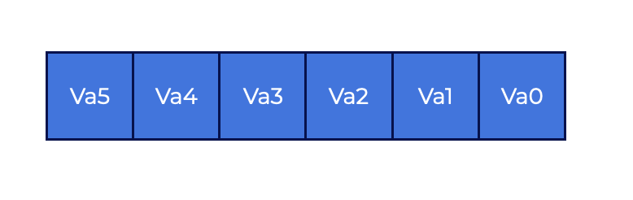
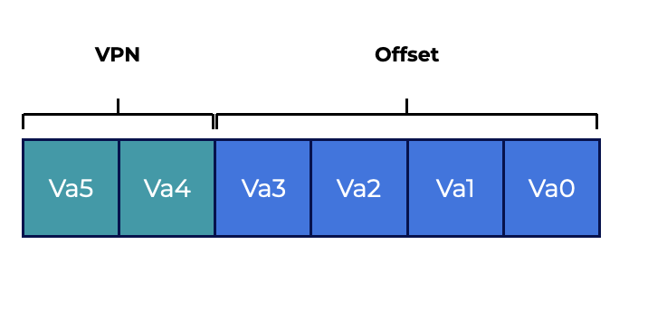
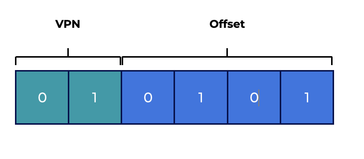
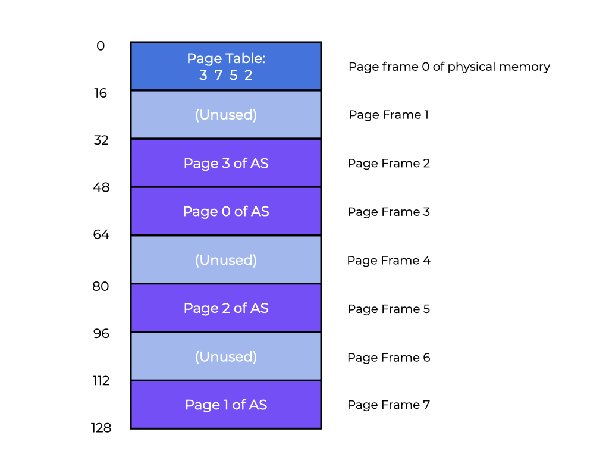

# Overview
Let’s begin by exploring how to virtualize memory with pages.  
让我们开始探索如何使用页面虚拟化内存。  
This section should help us answer the following questions:  
本节应该能帮助我们回答以下问题：  
- How can we virtualize memory with pages without segmentation issues?
    我们如何在没有分段问题的情况下使用页面虚拟化内存？
- What are the basic concepts?
    基本概念是什么？
- How can we make those strategies work well while saving space and time?
    我们如何在节省空间和时间的同时使这些策略运行良好？

# Introduction
When tackling space-management challenges, the operating system usually takes one of two approaches.  
当处理空间管理挑战时，操作系统通常采用两种方法之一。  
- The first approach is to cut up the address space into variable-sized sections. This is called **segmentation** which was covered previously. However, this solution has several challenges. When dividing space into different-sized parts, the area itself might become **fragmented**, which makes memory allocation more difficult over time.  
    第一种方法是将地址空间切分为可变大小的部分。这被称为**分段**，这在之前已经介绍过了。但是，这种解决方案有几个挑战。当将空间划分为不同大小的部分时，区域本身可能会变得**碎片化**，这使得随着时间的推移，内存分配变得更加困难。

- The second approach is **paging** in which the address space is divided into fixed-sized chunks. Instead of dividing a process’s space into variable-sized logical **segments** (e.g., code, heap, stack), it gets divided into fixed-sized units called **pages**. Physical memory is represented as an array of fixed-sized slots called **page frames**, each of which can hold a single virtual-memory page.  
    第二种方法是**分页**，在这种方法中，地址空间被划分为固定大小的块。与将进程空间划分为可变大小的逻辑**段**（例如，代码，堆栈，堆栈）不同，它被划分为称为**页面**的固定大小的单元。物理内存被表示为称为**页面帧**的固定大小的槽的数组，每个槽都可以容纳单个虚拟内存页面。


## Question
Paging involves dividing the address spaces and physical memory of each process into fixed-sized units.  
分页涉及将每个进程的地址空间和物理内存划分为固定大小的单元。  

In the case of paging, we can think of physical memory as being an array of fixed-sized slots called page frames. Each page frame can hold a single virtual memory page.  
在分页的情况下，我们可以将物理内存视为称为页面帧的固定大小的槽的数组。每个页面帧都可以容纳单个虚拟内存页面。  


# A Simple Example And Overview
Let’s use a basic example to better understand this method. The graphic below shows a **64**-byte address space with four **16**-byte pages (virtual pages **0**, **1**, **2**, and **3**).  
让我们使用一个基本的例子来更好地理解这种方法。下图显示了一个**64**字节的地址空间，其中包含四个**16**字节的页面（虚拟页面**0**，**1**，**2**和**3**）。  



Typical address spaces are much larger, however we utilize modest examples to explore these concepts.  
虽然地址空间通常要大得多，但我们使用适度的例子来探索这些概念。  

Physical memory contains a number of fixed-sized slots. In the graphic below, there are eight page frames that give us **128**-bytes of physical memory. The pages of the virtual address space in our graphic have been put at different locations across physical memory. Our graphic also shows that the OS is using some of the physical memory for itself.  
物理内存包含许多固定大小的插槽。在下图中，有八个页面帧，给我们**128**字节的物理内存。我们图形中虚拟地址空间的页面已经被放置在物理内存的不同位置。我们的图形还显示，操作系统正在使用一些物理内存。  



**Paging has significant advantages over our earlier methods.**  
**分页比我们之前的方法具有显着的优势。**  

- Paging is more **flexible** than previous methods.  
    分页比以前的方法更加**灵活**。
    - The system will be able to support the abstraction of an address space effectively, regardless of how a process uses the address space. We won’t make assumptions about the way the heap and stack grow and how they are used.  
        系统将能够有效地支持地址空间的抽象，而不管进程如何使用地址空间。我们不会对堆栈的增长方式和它们的使用方式做出假设。  
- Paging also **simplifies** free-space management.  
    分页还**简化**了空闲空间管理。  
    - For example, to fit our little **64**-byte address space into our eight-page physical memory, the OS simply seeks four **free pages**. Maybe the OS keeps a free list of all free pages and grabs the first four free pages from this list. In our example, the OS puts:  
        例如，为了将我们的小**64**字节的地址空间放入我们的八页物理内存中，操作系统只需寻找四个**空闲页面**。也许操作系统保留了所有空闲页面的空闲列表，并从该列表中获取前四个空闲页面。在我们的例子中，操作系统放置：  
        - Virtual **page 0**  of the address space (AS) in physical **frame 3**
        - **Page 2**  in **frame 5**, and
        - **Page 3**  in **frame 2** 
        - **Page Frames 1, 4**, and **6** are **free**

A **page table** is a per-process data structure that records where each virtual page of the address space is located in physical memory. The page table **stores address translations for each virtual page of the address space, indicating where in physical memory each page is located**. In our example, the **page table** would have four entries:  
**页面表**是每个进程的数据结构，记录地址空间中每个虚拟页面在物理内存中的位置。**页面表为地址空间的每个虚拟页面存储地址转换，指示每个页面在物理内存中的位置**。在我们的例子中，**页面表**将有四个条目：  
- (VP **0** → PF **3**)
- (VP **1** → PF **7**)
- (VP **2** → PF **5**)
- (VP **3** → PF **2**)

This page table is a **per-process** data structure (most page table structures we discuss are per-process structures. The **inverted page table** is an exception). In our example, if another process ran, the OS would have to manage a different page table for it because its virtual pages corresponded to different physical pages (aside from any sharing going on).  
这个页面表是一个**每个进程**的数据结构（我们讨论的大多数页面表结构都是每个进程的结构。**倒置页面表**是一个例外）。在我们的例子中，如果另一个进程运行，操作系统将不得不为它管理一个不同的页面表，因为它的虚拟页面对应于不同的物理页面（除了任何共享）。  

## Question 
Page tables contain translations for each virtual page of the address space, showing where in physical memory each page is located.  
页面表包含地址空间的每个虚拟页面的转换，显示每个页面在物理内存中的位置。  


# Address Translation Example
With this knowledge, we can do an address-translation example.  
有了这些知识，我们可以做一个地址转换的例子。  
**Assume we have a process with a small address space (  64  bytes) that is accessing memory:**  
**假设我们有一个具有小地址空间（64字节）的进程正在访问内存：**  

```assembly
    movl <virtual address>, %eax
```

Notice the explicit load of data from address `<virtual address>` into register `eax`.  
注意从地址`<virtual address>`到寄存器`eax`的显式加载数据。

To **translate** the virtual address the process generates, we have to break the resulting virtual address into two parts:  
要**转换**进程生成的虚拟地址，我们必须将生成的虚拟地址分解为两部分：  
* The **virtual page number (VPN)** and  
* The **offset** within the page.

Because the process’s virtual address space is **64** bytes, we need **6** bits total for our virtual address (**2^6=64**). So, we can think about our virtual address as follows:  
因为进程的虚拟地址空间是**64**字节，我们需要6位总的虚拟地址（**2^6=64**）。所以，我们可以这样想：  



In this diagram, **Va5** is the highest-order bit while **Va0** is the lowest. We can further divide the virtual address as follows, knowing that the page size is **16** bytes:  
在这个图中，**Va5**是最高位，而**Va0**是最低位。我们可以进一步分解虚拟地址，如下所示，知道页面大小是16字节：  



The page size is **16** bytes in a **64**-byte address space, so we need to be able to choose **4** pages, which the top **2** bits do. Now we have a **2**-bit **virtual page number (VPN)**. The rest of the bits tell us which byte of the page we want to look at, in this case **4** bits. This is called the **offset**.  
页面大小是64字节地址空间中的**16**字节，所以我们需要能够选择4个页面，顶部的2位做到这一点。现在我们有一个**2**位的**虚拟页面号（VPN）**。页面的其余部分告诉我们我们想要查看的页面的哪个字节，这种情况下是**4**位。这称为**偏移量**。  

When a process generates a virtual address, the OS and hardware have to work together to translate it into a meaningful physical address. Let’s say the load we issued earlier, `movl <virtual address>, %ea`x, was to virtual address **21**:  
当进程生成虚拟地址时，操作系统和硬件必须一起工作，将其转换为有意义的物理地址。让我们假设之前发出的负载，`movl <virtual address>, %ea`x，是到虚拟地址**21**：  

```assembly
    movl 21, %eax
```

If we convert "**21**" into its binary form, we’ll get "**010101**". With this, we can explore this virtual address and see how it breaks down into a **virtual page number** and **offset**  



So, virtual address “**21**” is on the **5th**("**0101**"th) byte of virtual page “**01**” (or **1**). Using our **virtual page number**, we can now index our **page table** and find out which physical frame virtual page **1** lives in. The **physical frame number (PFN)** is **7** in the page table to the left (binary **111**). So, we can translate this virtual address by replacing the **VPN** with the **PFN**, then issue the load to physical memory, as in our graphic below.  
因此，虚拟地址“**21**”位于虚拟页面“**01**”（或**1**）的第5个（**0101**）字节。使用我们的**虚拟页面号**，我们现在可以索引我们的**页面表**，并找出虚拟页面**1**所在的物理帧号。页面表中的**物理帧号（PFN）**是左边的**7**（二进制**111**）。因此，我们可以通过用**PFN**替换**VPN**，然后发出到物理内存的负载来转换这个虚拟地址，如下图所示。  


Because the offset just tells us the byte inside the page we want, it remains constant (it is not translated). Our final physical address is **1110101**(**117** in decimal), and this is the location from which we want our load to retrieve data.  
因为偏移量只是告诉我们我们想要的页面内的字节，所以它保持不变（它不会被翻译）。我们最终的物理地址是**1110101**（十进制**117**），这是我们想要负载从中检索数据的位置。  
With this basic understanding in mind, we can now ask (and hopefully answer) a few fundamental paging questions.  
考虑到这个基本的认识，我们现在可以提出（并希望回答）一些基本的分页问题。  

- Where, for example, are these page tables stored?
    例如，这些页面表在哪里存储？
- What are the typical page table contents, and how large are the tables?
    页面表的典型内容是什么，表的大小是多少？
- Is paging causing the system to (become) too slow?
    分页是否导致系统（变得）太慢？


# Page Table Storage
**Page tables can grow to be much larger than the segment tables or base/bound pairs we previously discussed**.  
**页面表可以比我们之前讨论的段表或基/边界对更大**。  
Say we have a standard **32**-bit address space with **4KB** pages. This virtual address is composed of:  
假设我们有一个标准的**32**位地址空间，**4KB**页面。这个虚拟地址由以下组成：  

- A **20**-bit VPN, and
    20位VPN，
- A **12**-bit offset
    12位偏移量
    - Recall that **10** bits would be needed for a **1KB** page size, and just add two more to get to **4KB**).  
        回想一下，**10**位是**1KB**页面大小所需的位数，再加两个就可以得到**4KB**）。  

A **20**-bit VPN implies that the OS has to maintain **2^20** translations for each process (about a million). Assuming **4** bytes per **page table entry (PTE)** to carry the physical translation plus any other helpful information, we get an enormous **4MB**of RAM required for each page table!  
20位VPN意味着操作系统必须为每个进程维护2^20个转换（大约一百万）。假设每个**页面表条目（PTE）**需要**4**字节来保存物理转换以及其他有用的信息，我们得到了每个页面表需要的巨大**4MB**的RAM！  

**That’s a lot of space.**   
**这是很多空间。**

Now, think about **100** processes running. The OS would require **400MB** of memory just for address translations! Even though computers have gigabytes of memory, its still pretty wild to consume a huge portion of it just for translations. We won’t even get into how large such a page table would be for a **64**-bit address space. That’s just plain scary!  
现在，想想**100**个进程正在运行。操作系统仅仅为地址转换就需要**400MB**的内存！尽管计算机有数千兆字节的内存，但仅仅为了转换就消耗了大部分内存是非常疯狂的。我们甚至不会讨论在**64**位地址空间中这样一个页面表有多大。这只是非常可怕的！  

We don’t have any specific on-chip hardware in the MMU to hold the page table of the presently-running process because page tables are so large. Instead, **we keep the page table for each process in memory somewhere**.  
我们在MMU中没有任何特定的片上硬件来保存当前运行进程的页面表，因为页面表太大了。相反，**我们将每个进程的页面表保存在内存中的某个地方**。  

For now, we’ll **assume that page tables are stored in physical memory that the OS manages**. Later, we’ll see that much of the OS memory itself can be virtualized, so page tables can be stored in OS virtual memory (and even swapped to disk).  
现在，我们假设页面表存储在操作系统管理的物理内存中。稍后，我们将看到操作系统内存本身的很多部分都可以虚拟化，因此页面表可以存储在OS虚拟内存中（甚至可以交换到磁盘）。  

The graphic to the below shows us a page table in OS memory. See the little set of translations there?  
下面的图表向我们展示了一个OS内存中的页面表。看到那里的一小组转换吗？  



# What's in the Page Table?
**Let’s look at table page organization**.  
**让我们看看页面表的组织**。  
The **page table** is a **data structure** that maps virtual addresses (or virtual page numbers) into physical addresses (physical frame numbers). So, any data structure could work for this.  
页面表是一个数据结构，它将虚拟地址（或虚拟页面号）映射到物理地址（物理帧号）。因此，任何数据结构都可以用于此。  
A **linear page table** is just an array.  
**线性页面表**只是一个数组。  
- A **virtual page number (VPN)** is used to index the array, and  
    一个**虚拟页面号（VPN）**用于索引数组，  
- A **page-table entry (PTE)** determines the **physical frame number (PFN)**.
    一个**页面表条目（PTE）**确定**物理帧号（PFN）**。

We’ll use a linear structure for now. We’ll use more complex data structures in later sections to help ease certain paging challenges.  
我们现在将使用线性结构。我们将在后面的部分中使用更复杂的数据结构来帮助缓解某些分页挑战。  

As for the contents of each PTE, there are several different **bits** to understand.  
至于每个PTE的内容，有几个不同的**位**需要理解。  
- A **valid bit** indicates if a translation is valid.  
    一个**有效位**表示转换是否有效。
    - For example, when a program starts, the code and heap are at one end of the address space and the stack at the other. The unused space in between will be marked **invalid** If the process tries to access this memory, it will trigger an OS trap, which will likely terminate the process.  
        例如，当程序启动时，代码和堆位于地址空间的一端，而堆栈位于另一端。在中间的未使用空间将被标记为**无效**。如果进程尝试访问此内存，则会触发OS陷阱，这可能会终止进程。  
    - By marking all unused pages in the address space illegal, we eliminate the need to allocate actual frames for those pages, saving huge amounts of memory.  
        通过将地址空间中的所有未使用页面标记为非法，我们可以避免为这些页面分配实际帧，从而节省大量内存。

- **Protection bits** may also signal whether a page can be read, written to or executed. Trying to read a page in a way that these bits don’t allow will result in an OS trap.  
    **保护位**也可能表示页面是否可以读取，写入或执行。尝试以这些位不允许的方式读取页面将导致OS陷阱。  
- A **present bit** shows whether a page is in RAM or disk (i.e., it has been swapped out).  
    一个**存在位**显示页面是否在RAM或磁盘中（即它已被交换出去）。  
    - We’ll learn more about this mechanism when we look at how to swap parts of the address space to disk to support address spaces larger than physical memory.  
        当我们查看如何将地址空间的一部分交换到磁盘以支持比物理内存更大的地址空间时，我们将了解更多关于此机制的信息。  
- A **dirty bit** indicates if the page has been modified since it was brought into memory.  
    一个**脏位**表示自从将页面引入内存以来，页面是否已被修改。  
- A **reference bit** (also known as an **accessed bit**) is occasionally used to track whether a page has been accessed, and is so preserved in memory. This information is important during **page replacement**, which we will explore in later sections.  
    一个**参考位**（也称为**访问位**）有时用于跟踪页面是否已被访问，并且在内存中保留。在**页面替换**期间，这些信息非常重要，我们将在后面的部分中探索这一点。


The graphic above shows an x86 architecture page table entry. It contains:  
上图显示了x86架构页面表条目。它包含：  
- A present bit - **P**  
    一个存在位 - **P**
- A read/write bit - **R/W**  
    一个读/写位 - **R/W**
    - This determines if writes are allowed on this page  
        这决定了是否允许在此页面上进行写入  
- A user/ supervisor bit - **U/S**  
    一个用户/超级用户位 - **U/S**  
    - This determines if user-mode processes can access the page  
        这决定了用户模式进程是否可以访问页面  
- **PWT, PCD, PAT**, and **G** determine how hardware caching will work for these pages  
    **PWT，PCD，PAT**和**G**确定硬件缓存如何为这些页面工作  
- An accessed bit (**A**), and  
    一个访问位（**A**），和  
- A dirty bit (**D**)  
    一个脏位（**D**）  
    - This dictates how hardware caching works for these pages.  
        这决定了硬件缓存如何为这些页面工作。  
- And, the **page frame number (PFN)**.  
    还有，**页面帧号（PFN）**。


# Paging is Slow! 🐌

We already know that page tables in memory may be too big. **They can potentially slow things down**.  
我们已经知道内存中的页面表可能太大。**它们可能会减慢速度**。  

Consider this instruction as an example:  
考虑这个指令作为例子：  

```assembly
    movl 21, %eax
```

Let’s look at the explicit reference to address **21** and not so much at the instruction fetch. We’ll assume the hardware does the translation for us. To retrieve the required data, the system has to first translate the virtual address (**21**) into the proper physical address (**117**). As a result, before requesting the data at address **117**, the system has to:  
让我们看看对地址**21**的显式引用，而不是指令提取。我们假设硬件为我们执行翻译。要检索所需的数据，系统首先必须将虚拟地址（**21**）翻译成正确的物理地址（**117**）。因此，在请求地址**117**处的数据之前，系统必须：  
- Get the correct page table entry from the process’s page table  
    从进程的页面表中获取正确的页面表条目  
- Translate it, and  
    翻译它，和  
- Load the data from physical memory  
    从物理内存加载数据  

The hardware has to know the process’s page table location to do this.  
硬件必须知道进程的页面表位置才能执行此操作。  

Let’s say, for now, that a single **page-table base register** has the page table’s physical address. The hardware will conduct the following functions to locate the necessary PTE:  
让我们说，现在，一个单独的**页面表基寄存器**具有页面表的物理地址。硬件将执行以下功能来定位必要的PTE：  

```text
    VPN     = (VirtualAddress & VPN_MASK) >> SHIFT
    PTEAddr = PageTableBaseRegister + (VPN * sizeof(PTE))
```

In our example:

- **VPN_MASK** is set to **0x30** (hex **30**, or binary **110000**), and  
    **VPN_MASK**设置为**0x30**（十六进制**30**，或二进制**110000**），和  
- **SHIFT** is set to **4** (the number of bits in the offset), such that the VPN bits generate the right integer virtual page number.  
    **SHIFT**设置为**4**（偏移量中的位数），以便VPN位生成正确的整数虚拟页号。  
- For example, masking turns virtual address **21(010101)** into **010000**. Shifting puts it into **01**, or virtual page **1**. The page table base register’s index into the array of PTEs.  
    例如，掩码将虚拟地址**21（010101）**变为**010000**。移位将其放入**01**，或虚拟页**1**。页面表基寄存器的索引到PTE数组中。  


In order to get the physical address, the hardware has to:  
为了获得物理地址，硬件必须：  
- Retrieve the PTE from memory,  
    从内存中检索PTE，
- Extract the PFN, and   
    提取PFN，和
- Combine it with the virtual address offset.  
    将其与虚拟地址偏移量结合在一起。

The PFN is left-shifted by **SHIFT**, then bitwise OR’d with the offset to generate the final address:  
PFN被**SHIFT**左移，然后与偏移量按位OR以生成最终地址：  

```text
    offset   = VirtualAddress & OFFSET_MASK
    PhysAddr = (PFN << SHIFT) | offset
```

Finally, the device can read data from memory into register `eax`. The application now has a value loaded from memory!  
最后，设备可以从内存中读取数据到寄存器`eax`。应用程序现在已经从内存中加载了一个值！

In short, we can describe the initial memory reference mechanism. The code example to the left shows us this approach. To use paging, we have to first get the translation from the page table for every memory reference (instruction fetch, explicit load, or store). That takes effort! This will slow down the procedure by a factor of two or more.  
简而言之，我们可以描述初始的内存引用机制。左侧的代码示例向我们展示了这种方法。要使用分页，我们首先必须为每个内存引用（指令提取，显式加载或存储）从页面表中获取翻译。这需要努力！这将使过程减慢两倍或更多。  

Now you can see that we have two serious issues to address. Page tables **slow down the system** and **consume too much memory** if not designed carefully. In order to use this for memory virtualization, we have to first solve these two problems.  
现在你可以看到，我们有两个严重的问题需要解决。如果页面表没有仔细设计，页面表**会减慢系统**并且**消耗太多内存**。为了使用这个内存虚拟化，我们首先必须解决这两个问题。  


```c
// Extract the VPN from the virtual address
VPN = (VirtualAddress & VPN_MASK) >> SHIFT
// Form the address of the page-table entry (PTE)
PTEAddr = PTBR + (VPN * sizeof(PTE))
// Fetch the PTE
PTE = AccessMemory(PTEAddr)
// Check if process can access the page
if (PTE.Valid == False)
    RaiseException(SEGMENTATION_FAULT)
else if (CanAccess(PTE.ProtectBits) == False)
    RaiseException(PROTECTION_FAULT)
else
    // Access is OK: form physical address and fetch it
offset = VirtualAddress & OFFSET_MASK
PhysAddr = (PTE.PFN << PFN_SHIFT) | offset
Register = AccessMemory(PhysAddr)
```


# Summary
We introduced the concept of **paging** to solve the challenges of virtualizing memory. There are many advantages to **paging** over prior methods (like segmentation).  
我们介绍了**分页**的概念来解决虚拟化内存的挑战。与先前的方法（如分段）相比，**分页**有很多优点。  
- The first benefit is that **paging does not cause external fragmentation** since by design, memory is split into fixed-sized segments.  
    第一个好处是**分页不会导致外部碎片**，因为按设计，内存被分成固定大小的段。
- In addition, it is **adaptable**, allowing for minimal use of virtual address spaces.  
    此外，它是**可适应的**，允许最小化使用虚拟地址空间。
- Implementing paging functionality carelessly will result in a **slower computer** (due to the additional memory visits required to reach the page table) and memory waste (with memory filled with page tables instead of useful application data).  
    轻率地实现分页功能将导致**计算机变慢**（由于访问页面表所需的额外内存访问）和内存浪费（内存被页面表填充，而不是有用的应用程序数据）。

