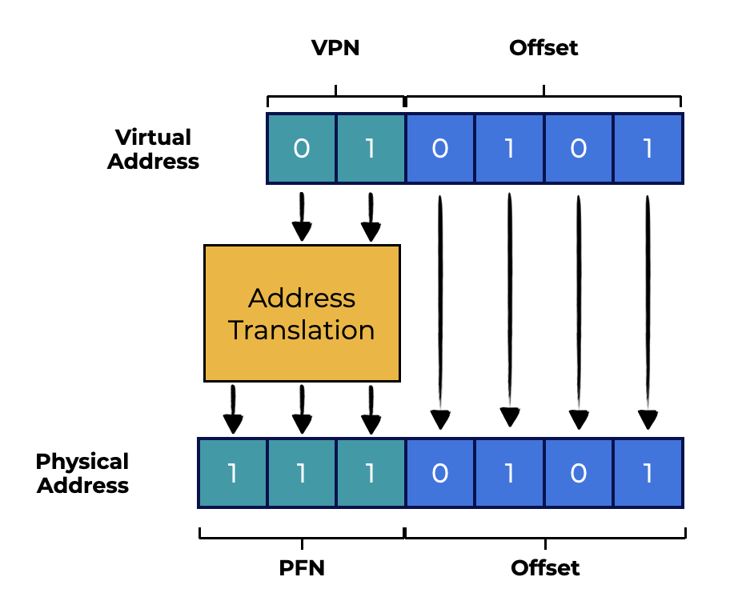
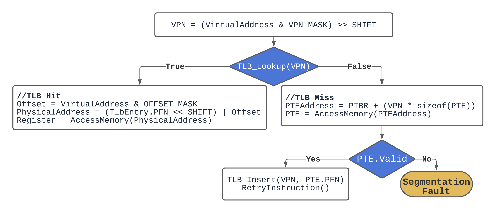
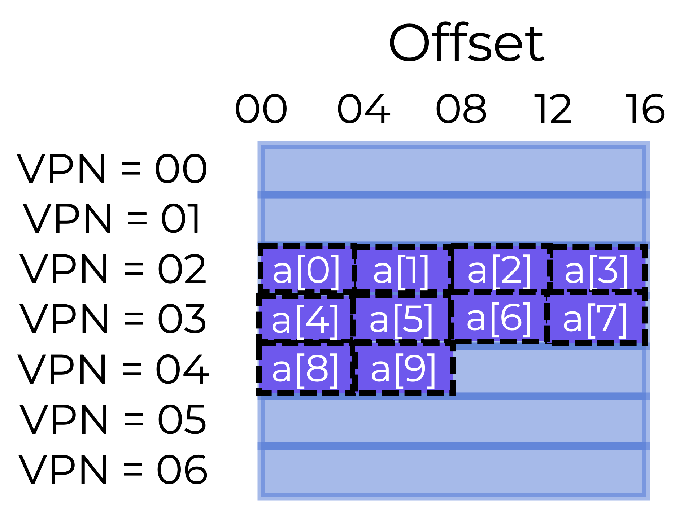
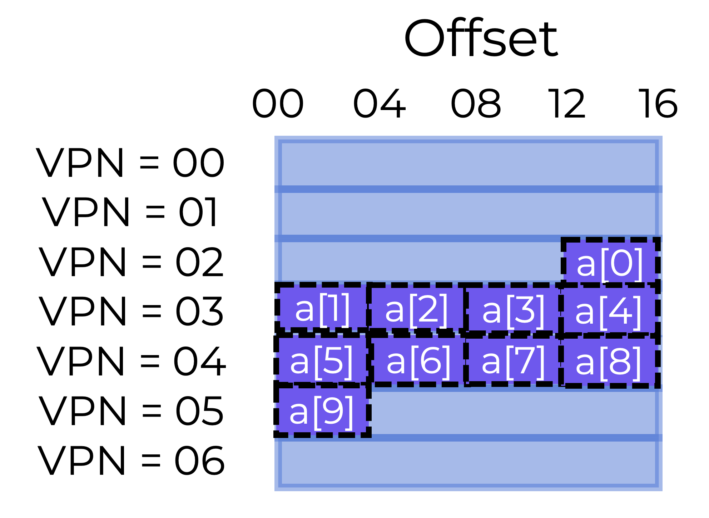

# Overview

This section should help us answer the following questions:  
本节应该能帮助我们回答以下问题：
- How can we speed up address translation and prevent paging’s unnecessary memory reference?  
    我们如何加快地址转换并防止分页的不必要的内存引用？  
- What hardware support is needed?  
    需要什么硬件支持？
- How much OS involvement is required?  
    需要多少OS参与？

When context-switching between processes, the last process’s TLB translations are useless to the next process.  
当在进程之间进行上下文切换时，上一个进程的TLB转换对下一个进程没有用。  
- What should the hardware or OS do to fix this problem?  
    硬件或OS应该做什么来解决这个问题？

# Translation Lookaside Buffers (TLBs)
In practice, paging needs an additional memory lookup in order to translate each virtual address (as illustrated below), but it takes too long to obtain translation information before every instruction fetch, load, or store.  
在实践中，分页需要额外的内存查找才能转换每个虚拟地址（如下所示），但是在每个指令获取，加载或存储之前获取转换信息需要太长时间。  



To speed up address translation, we’ll use a **translation lookaside buffer(TLB)**.  
为了加快地址转换，我们将使用**转换查找缓冲区（TLB）**。  
**Translation Lookaside Buffer or TLB**  
**转换查找缓冲区（TLB）**
A **translation lookaside buffer (TLB)** is a hardware cache of popular virtual-to-physical address translations that is part of the chip’s MMU.  
**转换查找缓冲区（TLB）**是一种硬件缓存，用于缓存常用的虚拟到物理地址转换，它是芯片MMU的一部分。  

If the request translation is stored in the TLB, the hardware does not need to access the page table holding all of the translations.  
如果请求的转换存储在TLB中，则硬件不需要访问存储所有转换的页表。  

Virtual memory would not be possible without the performance improvement afforded by TLBs.  
没有TLB提供的性能改进，虚拟内存将不可能实现。  

## Inside the TLB
TLB entries might look something like this:  
TLB条目可能如下所示：

| Virtual Page Number | Physical Page Number | Valid Bit |
| :---: | :---: | :---: |

Both the VPN and PFN are contained in each entry (in hardware terms, the TLB is known as a fully-associative cache). To see if there is a match, the hardware searches the entries in parallel.  
每个条目都包含VPN和PFN（在硬件术语中，TLB称为完全关联缓存）。为了查看是否有匹配项，硬件并行搜索条目。  
Let’s look at a real TLB. The figure below shows a somewhat simplified TLB entry from a modern system that uses software-managed TLBs.  
让我们看看一个真实的TLB。下图显示了一个使用软件管理的TLBs的现代系统中的一些简化的TLB条目。  


- 20 bits: Virtual Page Number (VPN)
- 6 bits: Process ID (PID); sometimes called Address Space ID or ASID
- 6 bits: unused
- 20 bits: Page Frame Number (PFN)
- N bit: If set, memory access bypasses the cache (this will be discussed in a future section)
- D bit: Dirty bit - If set, memory is writeable (this will be discussed in a future section)
- V bit: Valid bit - indicates whether the entry has a valid translation or not
- G bit: Global bit - If set, TLB does not check PID for translation (see below)

TLBs generally include **32** or **64** of these entries, most of which are used by user processes, but a few are for the OS (using the G bit). The OS can set a wired register to instruct the hardware how many TLB slots to reserve for it. The OS uses these reserved mappings for code and data it needs to access during key moments when a TLB miss would be troublesome (e.g., in the TLB miss handler).  
TLBs通常包含32或64个这样的条目，其中大多数用于用户进程，但有些用于OS（使用G位）。OS可以设置一个固定寄存器来指示硬件保留多少TLB插槽给它。OS使用这些保留的映射来访问它在TLB丢失会引起麻烦的关键时刻需要访问的代码和数据（例如，在TLB丢失处理程序中）。  

When a TLB is software managed, there must be instructions to update it. The system provides four such instructions:  
当TLB由软件管理时，必须有指令来更新它。系统提供了四个这样的指令：  
- `TLBP` probes the TLB for a specific translation  
    `TLBP` 探测 TLB 以进行特定翻译  
- `TLBR` reads the contents of a TLB entry into registers  
    `TLBR` 将 TLB 条目的内容读入寄存器
- `TLBWI` replaces a specific TLB entry, and  
    `TLBWI` 替换特定的 TLB 条目  
- `TLBWR` replaces a random TLB entry  
    `TLBWR` 替换随机的 TLB 条目

## Questions
The operating system gets a virtual page number (VPN) from a process. It then translates it to a page frame number (PFN).  
操作系统从进程中获取虚拟页号（VPN）。然后将其转换为页帧号（PFN）。  

Instead of going to the page table on the disk, the OS can use a Translation Lookaside Buffer on the MMU.  
操作系统可以使用MMU上的转换查找缓冲区（TLB），而不是访问磁盘上的页表。  

There are some helpful bits in the TLB entry that include things like process ID.  
TLB条目中有一些有用的位，包括进程ID等。  

Other helpful bits include whether that memory location is writable, global or valid.  
其他有用的位包括该内存位置是否可写，全局或有效。

# How TLBs Work
The flowchart below sketches out how hardware might handle a virtual address translation.  
下图概述了硬件可能如何处理虚拟地址转换。  



The process involves **2** big switch points:  
该过程涉及**2**个大切换点：  
- After the virtual page number (VPN) is pulled from the virtual address, the system checks whether the TLB has the translation for this VPN  
- 从虚拟地址中提取虚拟页码 (VPN) 后，系统会检查 TLB 是否具有此 VPN 的转换  
    - If it does, we have a TLB hit, which means the translation is stored in the TLB. We can concatenate the page frame number (PFN) from the necessary TLB entry with the offset from the initial virtual address to create the desired physical address (PA), and access memory.  
        如果有，我们就有了一个TLB命中，这意味着转换存储在TLB中。我们可以将必要的TLB条目中的页帧号（PFN）与初始虚拟地址的偏移量连接起来，以创建所需的物理地址（PA），并访问内存。
    - If the CPU does not locate the translation in the TLB (a TLB miss), we have to check the page table to find the translation.  
        如果CPU没有在TLB中找到转换（TLB丢失），我们必须检查页表以找到转换。  
- In the case of a TLB miss, we have to check if the virtual memory reference generated by the process is valid and available  
    在 TLB 未命中的情况下，我们必须检查进程生成的虚拟内存引用是否有效且可用  
    - If so, we update the translation in the TLB, the hardware retries the instruction and (this time) the translation is found in the TLB so the memory reference is quickly processed  
        如果是这样，我们将更新 TLB 中的转换，硬件重试指令，然后（这次）在 TLB 中找到转换，因此内存引用可以快速处理  
    - If not, we have a segmentation fault  
        如果不是，我们就会有一个分段错误  

The TLB, like all caches, anticipates that translations are located in the cache (i.e., are hits). If this is the case, the TLB is located close to the processing core, so any extra overhead is minimal.  
TLB，像所有缓存一样，预测转换位于缓存中（即是命中）。如果是这种情况，TLB位于处理核心附近，因此任何额外的开销都很小。

When there is a miss, the high cost of paging is paid. The page table has to be searched to find the translation, causing an additional memory reference. If this happens a lot, the program will likely run significantly slower. Memory accesses are pretty expensive in comparison to other CPU instructions, and TLB misses lead to more memory accesses.  
当有一个丢失时，就要付出高昂的代价。必须搜索页表以找到转换，从而导致额外的内存引用。如果这种情况经常发生，程序可能会运行得很慢。与其他CPU指令相比，内存访问的成本相当高，TLB丢失会导致更多的内存访问。  

Our goal is to avoid TLB misses as much as possible.  
我们的目标是尽可能避免TLB丢失。 

## Array Access Example
Let’s look at a virtual address trace and see how a TLB can increase its speed. Let’s pretend we have a memory array of **10** **4**-byte integers. Say we have an **8**-bit virtual address space with **16**-byte pages. So, a virtual address is broken down into a **4**-bit VPN and a **4**-bit offset.  
让我们看看虚拟地址跟踪，并了解 TLB 如何提高其速度。让我们假设我们有一个包含**10**个**4**字节整数的内存数组。假设我们有一个**8**位虚拟地址空间，每个**16**字节的页面。因此，虚拟地址被分解为**4**位VPN和**4**位偏移量。



The array’s first entry (a[0]) starts on page VPN= **02** , offset= **00**. The array continues on the next page (VPN= **03** ) with a[4]... a[7] elements. The last two entries (a[8] and a[9]) are on the next page (VPN= **04**).  
数组的第一个条目（a[0]）从页面 VPN= **02** 开始，偏移量= **00**。数组在下一页（VPN= **03**）上继续，其中包含 a[4]... a[7] 元素。最后两个条目（a[8] 和 a[9]）在下一页（VPN= **04**）上。  

Consider a basic loop that doubles each array item, like the following example:  
考虑一个基本循环，它将每个数组项加倍，如下例：  

```c
for (i = 0; i < 10; i++) {
    a[i] *= 2;
}
```

Let’s imagine that the loop’s only memory accesses are to the array (ignoring the variable i, as well as the instructions). As soon as the CPU accesses the first array element (a[0]), it will see a load to virtual address. To check the TLB for a valid translation, the hardware pulls the VPN from here (VPN=02). This turns out to be a TLB miss if this is the first time the program accesses the array.  
让我们想象循环的唯一内存访问是对数组的访问（忽略变量 i，以及指令）。一旦 CPU 访问第一个数组元素（a[0]），它将看到对虚拟地址的加载。要检查 TLB 中是否有有效的转换，硬件从这里提取 VPN（VPN=02）。如果这是程序第一次访问数组，这将导致 TLB 丢失。  

The next access is to a[1], and it’s a TLB **hit**! The translation is already loaded into the TLB because the second element of the array is packed next to the first. This is why we were successful.  
下一个访问是 a[1]，它是 TLB **命中**！转换已经加载到 TLB 中，因为数组的第二个元素紧挨着第一个元素。这就是我们成功的原因。  

Because a[2] and a[3] are on the same page as a[0] and a[1] they are also accessible and therefore a **hit**.  
因为 a[2] 和 a[3] 与 a[0] 和 a[1] 在同一页上，因此它们也是可访问的，因此是**命中**。  

The program hits another TLB miss when it accesses a[4]. However, the following entries (a[5] … a[7]) will still be a TLB **hit**, since they are all stored on the same page.  
程序在访问 a[4] 时遇到另一个 TLB 丢失。但是，以下条目（a[5] ... a[7]）仍然是 TLB **命中**，因为它们都存储在同一页上。

Access to a[8] causes one last TLB **miss**… The hardware searches the page table again to find the virtual page in physical memory and updates the TLB. The final accesses (a[9]) benefits from the TLB update, causing another **hit**.  
对 a[8] 的访问导致最后一个 TLB **丢失** ... 硬件再次搜索页表，以在物理内存中找到虚拟页面，并更新 TLB。最后的访问（a[9]）受益于 TLB 更新，导致另一个**命中**。  

For our **10** array accesses, we had the following TLB activity:  
对于我们的 **10** 数组访问，我们有以下 TLB 活动：
- 1.miss
- 2.hit
- 3.hit
- 4.hit
- 5.miss
- 6.hit
- 7.hit
- 8.hit
- 9.miss
- 10.hit

So our TLB **hit rate** (number of hits divided by total accesses) is   **70** . This is not very high (we want **100** hit rates), but it is not zero. The TLB improves performance even though this is the first time the application accesses the array. Because the array’s elements are closely packed into pages (in space), only the first access to an element on a page causes a TLB miss.  
因此，我们的 TLB **命中率**（命中数除以总访问次数）为 **70**。这不是很高（我们想要 **100** 命中率），但它不为零。即使这是应用程序第一次访问数组，TLB 也会提高性能。由于数组的元素紧密打包到页面（空间中），因此只有对页面上元素的第一次访问才会导致 TLB 丢失。  

This example also shows the importance of page size. The array access would have been better if the page size had been doubled (**32** bytes instead of **16**). Since pages are typically **4KB** in size, dense array-based accesses have excellent TLB performance, with only one miss per page of accesses.  
这个例子还显示了页面大小的重要性。如果页面大小加倍（**32** 字节而不是 **16** 字节），数组访问将更好。由于页面通常为 **4KB** 大小，基于数组的密集访问具有出色的 TLB 性能，每个页面的访问只有一个丢失。  

## **Temporal locality** 
**Temporal locality**, i.e., the rapid re-referencing of memory elements in time, would increase TLB hit rate. TLBs, like any cache, rely on program-specific spatial and temporal proximity. If the program has such locality (and many do), the TLB hit rate will be high.  
**时间局部性**，即在时间内快速重新引用内存元素，将提高 TLB 命中率。TLB，就像任何缓存一样，依赖于程序特定的空间和时间邻近性。如果程序具有这种局部性（并且很多程序都有），则 TLB 命中率将很高。  

The program would likely run better if it accessed the array again soon after the loop ended, provided the TLB was large enough to cache the necessary translations:  
如果 TLB 足够大，以缓存必要的转换，那么在循环结束后很快再次访问数组，程序的运行可能会更好：  

```c
//70% hit rate
for (i = 0; i < 10; i++) {
    a[i] *= 2;
}
//100% hit rate
for (i = 0; i < 10; i++) {
    printf("%d", a[i])
}
```

## Questions
Given the array stored as shown below, what is the TLB hit rate the first time the array is accessed?  
假设数组存储如下所示，第一次访问数组时，TLB 命中率是多少？  




- [ ] 40%
- [ ] 50%
- [ ] 60%
- [ ] 70%

## Answer
The array would have the following access pattern:
1. Miss (VPN 2 stored in TLB)
2. Miss (VPN 3 stored in TLB)
3. Hit (VPN 3)
4. Hit (VPN 3)
5. Hit (VPN 3)
6. Miss (VPN 4 stored in TLB)
7. Hit (VPN 4)
8. Hit (VPN 4)
9. Hit (VPN 4)
10. Miss (VPN 5 stored in TLB)

This totals 4 misses and 6 hits or a 60% hit rate.

# Context Switching
TLBs complicate process switching (and address space switching). Virtual-to-physical translations are only valid for the currently running process. So, when switching processes, the hardware or OS (or both) must make sure that the new process does not reuse past translations.  
TLB 使进程切换（和地址空间切换）变得复杂。虚拟到物理转换仅对当前运行的进程有效。因此，在切换进程时，硬件或操作系统（或两者）必须确保新进程不会重用过去的转换。  

Let’s look at an example. When one process (P1) runs, the TLB is assumed to be caching valid translations from P1's page table. Imagine P1's   10th  virtual page is assigned to frame   100 .  
让我们看一个例子。当一个进程（P1）运行时，假设 TLB 正在缓存来自 P1 的页表的有效转换。想象一下，P1 的第 10 个虚拟页被分配给帧 100。  

Assume another process (P2) exists, and the OS decides to run it via a context switch. Assume P2's   10th  virtual page is assigned to frame   170 . The TLB would contain entries for both processes if they existed:  
假设另一个进程（P2）存在，并且操作系统决定通过上下文切换运行它。假设 P2 的第 10 个虚拟页被分配给帧 170。如果存在，TLB 将包含两个进程的条目：  

| VPN  | PFN   | valid | prot |
| :--- | :---: | :---: | ---: |
| 10   | 100   | 1     | rwx  |
| -    | -     | 0     | -    |
| 10   | 170   | 1     | rwx  |
| -    | -     | 0     | -    |

We have a problem in the TLB: VPN **10** is either PFN **100 (P1)** or PFN **170 (P2)**, but the hardware can’t tell the difference. So the TLB needs more development to appropriately and efficiently enable multi-process virtualization. So, a dilemma:  
我们在 TLB 中遇到了一个问题：VPN **10** 是 PFN **100（P1）**或 **PFN 170（P2）**，但硬件无法区分它们。因此，TLB 需要更多的开发来适当地有效地实现多进程虚拟化。所以，一个困境：  

**How do we manage the contents of the TLB while switching processes?**  
在切换进程时，我们如何管理 TLB 的内容？  

When context-switching between processes, the last process’s TLB translations are useless to the next process. What should the hardware or OS do?  
在进程之间进行上下文切换时，上一个进程的 TLB 转换对下一个进程没有用。硬件或操作系统应该做什么？  

The simplest solution is **flushing**. Flushing the TLB means emptying it before beginning the next process. It can be done using privileged hardware instructions or by modifying the page-table base register in a hardware-managed TLB. **Flushing clears the TLB by setting all valid bits to 0**. Flushing the TLB on each context switch is a viable method, but this causes a lot of TLB misses. Costly process switching may be a problem if it happens too often.  
最简单的解决方案是**刷新**。刷新 TLB 意味着在开始下一个进程之前将其清空。它可以通过使用特权硬件指令或修改硬件管理的 TLB 中的页表基寄存器来完成。**刷新通过将所有有效位设置为 0 来清除 TLB**。在每次上下文切换时刷新 TLB 是一种可行的方法，但这会导致大量的 TLB 未命中。如果过于频繁，进程切换可能会成为一个问题。  

To reduce this overhead, some systems allow hardware TLB sharing across context transitions. Some TLBs include an **address space identifier (ASID)** field. The ASID is a Process ID (PID) with less bits.   
为了减少这种开销，一些系统允许在上下文转换之间共享硬件 TLB。一些 TLB 包括一个**地址空间标识符（ASID）** 字段。ASID 是一个 PID（进程 ID），它的位数较少。  

Adding ASIDs to our previous TLB shows that processes can easily share TLBs: only the ASID field distinguishes otherwise identical translations. Here is an example of a TLB containing an ASID field:  
将 ASID 添加到我们之前的 TLB 中，可以看到进程可以轻松共享 TLB：只有 ASID 字段区分了其他相同的转换。这是一个包含 ASID 字段的 TLB 的示例：  

| VPN  | PFN   | valid | prot | ASID |
| :--- | :---: | :---: | ---: | ---: |
| 10   | 100   | 1     | RWX  | 1    |
| -    | -     | 0     | -    | -    |   
| 10   | 170   | 1     | RWX  | 2    |
| -    | -     | 0     | -    | -    |

With address-space IDs, the TLB can hold several processes’ translations. Since the hardware needs to know which process is executing, the OS has to set a privileged register to the process’s ASID.  
使用地址空间 ID，TLB 可以保存多个进程的转换。由于硬件需要知道哪个进程正在执行，因此操作系统必须将特权寄存器设置为进程的 ASID。  
Perhaps you have also considered the situation where two TLB entries are surprisingly similar. Here, two entries for two processes with two VPNs point to the same physical page:  
也许你还考虑过两个 TLB 条目非常相似的情况。在这里，两个进程的两个 VPN 指向同一个物理页的两个条目：  

| VPN  | PFN   | valid | prot | ASID |
| :--- | :---: | :---: | ---: | ---: |
| 10   | 101   | 1     | r-x  | 1    |
| -    | -     | 0     | -    | -    |
| 50   | 101   | 1     | r-x  | 2    |
| -    | -     | 0     | -    | -    |

When two processes share a page (for example, a code page), this can occur. **Process 1** shares physical page **101** with **Process 2**, but **P1** maps it to the **10th** page of its address space, where **P2** maps it to the **50th** page. Sharing code pages reduces memory overheads by reducing the number of physical pages needed.   
当两个进程共享一个页面（例如，代码页面）时，可能会发生这种情况。**进程 1**与**进程 2**共享物理页**101**，但**P1**将其映射到其地址空间的**第 10 页**，而**P2**将其映射到**第 50 页**。共享代码页面通过减少所需的物理页数来减少内存开销。  

## Question
Which of the following is true about the different approaches to context switching? 
Flushing is the easiest approach to implement (you set all valid bits in the TLB to 0) but it causes a lot of TLB misses which hurt performance.  
刷新是实现最简单的方法（将 TLB 中的所有有效位设置为 0），但它会导致大量的 TLB 未命中，这会影响性能。  

Tracking the process or address space ID is harder to implement (you have to store and check PID or ASID), but it increases TLB hits which helps performance.  
跟踪进程或地址空间 ID 更难实现（你必须存储和检查 PID 或 ASID），但它会增加 TLB 命中，这有助于性能。  

# Other TLB Logistics
There are two pieces of logistics we have not yet addressed:  
我们还没有解决的两个物流问题：
- Who handles a TLB miss?  
    谁处理 TLB 未命中？
- What gets removed from the TLB when it gets full?  
    当 TLB 满时，从 TLB 中删除什么？

## Trap Handlers: Who handles a TLB miss?  
## 陷阱处理程序：谁处理 TLB 未命中？  
There are two options:  
有两个选择：
- The hardware, or
    硬件，或
- Software (OS).
    软件（操作系统）。

In earlier system designs, the hardware would handle the TLB miss completely. To do this, the hardware has to know the exact location of the page tables in memory (through a **page-table base register**), as well as their exact format. If a miss occurs, the hardware walks the page table, finds the correct entry, extracts the translation, updates the TLB, and tries the instruction again.  
在早期的系统设计中，硬件将完全处理 TLB 未命中。为此，硬件必须知道内存中页表的确切位置（通过**页表基寄存器**），以及它们的确切格式。如果发生未命中，硬件将遍历页表，找到正确的条目，提取转换，更新 TLB，然后再次尝试指令。  

In more recent systems, on a TLB miss, the hardware mimics an exception, pausing the current instruction stream, switching to kernel mode, and jumping to a **trap handler**.  
在最近的系统中，在 TLB 未命中时，硬件模拟异常，暂停当前指令流，切换到内核模式，并跳转到**陷阱处理程序**。  

### Trap Handler
A trap handler is code inside the OS intended to handle TLB misses. When run, the trap handler looks for the translation in the page table, uses “privileged” instructions to update the TLB, and exits the trap (resulting in a TLB hit).  
陷阱处理程序是操作系统内部的代码，用于处理 TLB 未命中。运行时，陷阱处理程序会在页表中查找转换，使用“特权”指令更新 TLB，并退出陷阱（导致 TLB 命中）。

### Trap Handler implementation details

- The return-from-trap command has to be different than the one used to service a system call. The return-from-trap should continue running at the instruction following the OS trap, exactly as a return from a procedure call does. Returning from a TLB miss-handling trap causes the hardware to retry the instruction, resulting in a TLB hit. To continue properly, the hardware has to save a separate procedure call when trapping into the OS, depending on how the trap or exception happened.  
    从陷阱返回的命令必须与用于服务系统调用的命令不同。从陷阱返回应该继续在操作系统陷阱后的指令上运行，就像从过程调用返回一样。从 TLB 未命中处理陷阱返回会导致硬件重试指令，从而导致 TLB 命中。为了正确地继续，硬件必须在陷入操作系统时保存一个单独的过程调用，具体取决于陷阱或异常发生的方式。

- Operating systems must avoid creating endless loops of TLB misses by keeping TLB miss handlers in physical memory (unmapped and not subject to address translation) or reserving some TLB entries for always valid translations and using some of those slots for the handler code itself.  
    操作系统必须通过将 TLB 未命中处理程序保留在物理内存中（未映射且不受地址转换的约束）或为始终有效的转换保留一些 TLB 条目并使用其中一些插槽来处理程序代码本身，以避免创建无限循环的 TLB 未命中。  

The main benefit of a software-managed page table is flexibility: the OS can use any data structure it wants to implement the page table. The hardware doesn’t do much on a miss; it only raises an exception and lets the OS TLB miss handler do the rest.  
软件管理的页表的主要好处是灵活性：操作系统可以使用任何数据结构来实现页表。在未命中时，硬件不做太多事情；它只是引发一个异常，并让操作系统的 TLB 未命中处理程序完成其余工作。  

## TLB Replacement Policy: What gets removed from the TLB when it gets full?  
TLB 替换策略：当 TLB 满时，从 TLB 中删除什么？

Cache replacement is a concern with any cache, including the TLB. Specifically, while adding a new entry to the TLB, we must replace an existing one.  
缓存替换是任何缓存（包括 TLB）的一个关注点。具体来说，当我们向 TLB 添加一个新条目时，我们必须替换现有的条目。  

When we add a new TLB entry, which one should be replaced? Of course, the idea is to reduce misses (or increase hits) and therefore improve performance.  
当我们添加一个新的 TLB 条目时，应该替换哪一个？当然，我们的想法是减少未命中（或增加命中），从而提高性能。  

We’ll go over a few common principles when we discuss saving pages to disk. A common technique is to evict the **least-recently-used** entry. In the memory-reference stream, LRU tries to exploit locality, assuming that unused entries are eligible for eviction.  
在讨论将页面保存到磁盘时，我们将回顾一些通用原则。一种常见的技术是驱逐 **最近最少使用** 条目。在内存引用流中，LRU 尝试利用局部性，假设未使用的条目符合驱逐条件。  

Another option is a **random** policy that evicts TLB mappings at random.  
另一个选择是**随机策略**，它随机驱逐 TLB 映射。 

Which policy works best depends a lot on context. For example, when a program cycles through **n+1** pages with a TLB of size **n**, a “reasonable” policy like LRU behaves very irrationally. In this case, LRU misses on every access, where random performs significantly better.   
哪个策略最好取决于很多情况。例如，当程序通过具有大小为 **n** 的 TLB 的 **n+1** 个页面循环时，“合理”的策略（如 LRU）表现得非常不合理。在这种情况下，LRU 在每次访问时都会错过，而随机执行得更好。  

## Questions 
Many systems use a software-driven approach to handling TLB misses called a trap handler, which allows flexibility in TLB implementation.  
许多系统使用一种名为陷阱处理程序的软件驱动方法来处理 TLB 未命中，该方法允许在 TLB 实现中具有灵活性。  
When a miss occurs and a new entry is added to the TLB, an old entry must be replaced. Which entry is determined by the replacement policy.  
当发生未命中并且将新条目添加到 TLB 时，必须替换旧条目。哪个条目由替换策略决定。  
One way to pick is by replacing the least recently used entry, which leverages locality, but there are certain contexts where replacing a random entry performs better.  
选择的一种方法是替换最近最少使用的条目，这利用了局部性，但在某些情况下，替换随机条目会表现得更好。  
While systems aim to minimize TLB misses as much as possible, the OS handles both retrieving and storing addresses in the TLB as well as choosing what in the TLB gets replaced.  
尽管系统旨在尽可能减少 TLB 未命中，但操作系统也处理在 TLB 中检索和存储地址以及选择 TLB 中的替换内容。  

# Summary
In this section, we explored how hardware can help speed up address translation.  
在本节中，我们探讨了硬件如何帮助加速地址转换。  

- By providing an on-chip TLB for address translation, most memory references should be handled without accessing the main memory page table.  
    通过为地址转换提供芯片上的 TLB，大多数内存引用应该不需要访问主存页表。  
- If a program accesses more pages than the TLB can hold in a short period of time, it will cause many TLB misses and so run much slower.
Mark as CompletedBack to dashboard  
    如果程序在短时间内访问的页面数超过了 TLB 可以容纳的页面数，那么它将导致许多 TLB 未命中，因此运行速度会大大降低。  