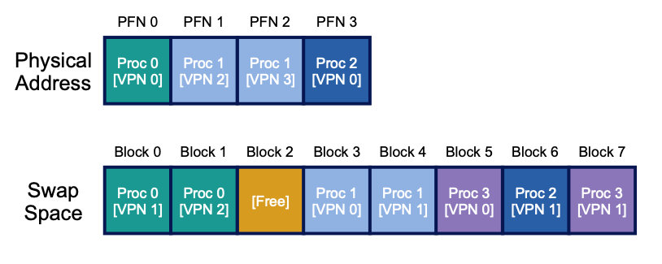
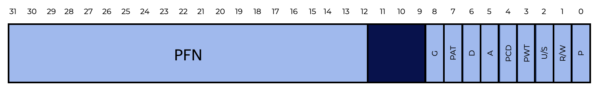
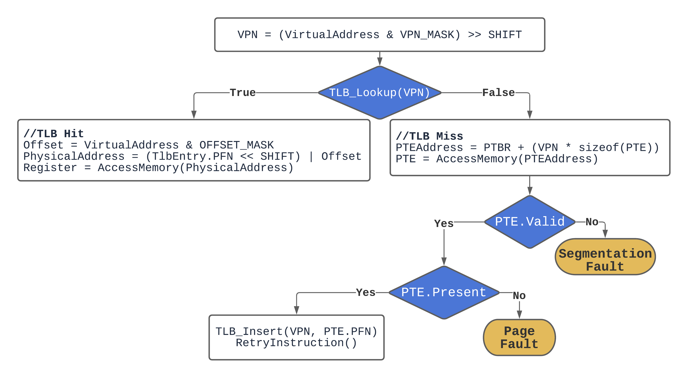

# Adding the Disk
In our previous discussions about Operating Systems, we’ve assumed that:  
在我们之前关于操作系统的讨论中，我们假设：
- The total address space is small and fits in physical memory.  
    总地址空间很小，适合物理内存。
- Every running process’s address space fits in memory.  
    每个运行的进程的地址空间都适合内存。
- We only needed to worry about 1 process’s address space at a time.  
    我们只需要一次关心1个进程的地址空间。 

In reality, we frequently run programs concurrently.  
在现实中，我们经常同时运行程序。  
To support multiple large address spaces running at the same time, we’ll need to add a new level to our memory hierarchy:  
为了支持同时运行多个大的地址空间，我们将需要在我们的内存层次结构中添加一个新的层次：  

|Memory Level   | Description|
|:--------------|:-----------|
|Central Processing Unit (Processor)| Registers and cache in CPU are very fast but very small|
|RAM (Memory)| Fast but limited space|
|**Hard disk drive (Disk)**| **Large but slow, contains file system**|

If the OS can support one large address space for a process, the programmer doesn’t have to worry about whether the program’s data structures will fit in memory and can allocate memory as needed. This means the OS will need to somehow leverage the disk space for when memory gets full.  
如果操作系统可以支持一个进程的大型地址空间，程序员就不必担心程序的数据结构是否适合内存，并且可以根据需要分配内存。这意味着操作系统将需要某种方式利用磁盘空间，以便内存被占满。  

## Swap Space
**Swap space** allows the OS to support several processes running at the same time by allowing running programs to use more RAM than is physically accessible.  
**交换空间**允许操作系统通过允许运行的程序使用比物理可访问的RAM更多的RAM来支持同时运行多个进程。  

**Swap space** is reserved space on the disk for moving pages between memory and the file system.  
**交换空间**是磁盘上保留的空间，用于在内存和文件系统之间移动页面。

Operating systems call this swap space because it is used to swap **pages** out of memory and back in. This assumes the OS can read and write to swap space in page-sized units.  
操作系统将这个交换空间称为交换空间，因为它用于将页面从内存中交换出去并重新交换回来。这假设操作系统可以以页面大小的单位读取和写入交换空间。  

The amount of the swap space the OS reserves defines the maximum number of memory pages that a system can use at any given time. Let us pretend that is pretty massive for now.  
操作系统保留的交换空间的数量定义了系统在任何给定时间内可以使用的内存页面的最大数量。让我们假装这是相当大的。  

Take a look at how 3 processes (Proc 0, 1, and 2) might share the limited memory with the help of the swap space on the disk:  
看看3个进程（Proc 0，1和2）如何在磁盘上的交换空间的帮助下共享有限的内存：  

Note that only a portion of any given process’s valid pages are in memory, with the rest in swap space on disk.  
请注意，任何给定进程的有效页面的只有一部分在内存中，其余部分在磁盘上的交换空间中。  

We can also tell that in the example above, the fourth process (Proc 3) isn’t functioning since none of it is loaded into memory.  
我们还可以看出，在上面的例子中，第四个进程（Proc 3）没有运行，因为它没有加载到内存中。  

Notice:  
- In the “Mem” or memory row, there is more “available” space than “free” - that’s because there are pages the system knows it can get rid of if needed.  
    在“Mem”或内存行中，有更多的“可用”空间而不是“空闲”-这是因为系统知道如果需要的话可以删除页面。  
- There is a second “Swap” row which reports the usage of the swap space as distinct from your memory.  
    还有第二个“Swap”行，它报告了交换空间的使用情况，与您的内存不同。  
- If your memory is relatively empty, your swap space will also be empty since the OS hasn’t needed to move any pages to it yet.  
    如果您的内存相对较空，那么您的交换空间也将为空，因为操作系统尚未需要将任何页面移动到其中。  

## Other data swapping disk spaces
Swap space is not the only place on disk where data is swapped. Assume you are executing a binary program (e.g., ls, or your own compiled main program). This binary’s code pages are stored on disk and loaded into memory when the application runs. If the system has to free up memory for other purposes, it can safely reuse the code pages’ memory space, knowing it can subsequently swap them in from the on-disk binary in the file system.  
交换空间不是磁盘上交换数据的唯一位置。假设您正在执行一个二进制程序（例如，ls或您自己编译的主程序）。当应用程序运行时，这个二进制程序的代码页面存储在磁盘上，并加载到内存中。如果系统必须为其他目的释放内存，它可以安全地重用代码页面的内存空间，知道它可以随后从文件系统中的磁盘二进制文件中交换它们。  

## Questions
Which of the following statements are true about Swap Space? There may be more than one answer.  
下列哪些陈述关于交换空间是正确的？可能有多个答案。  
- Swap space extends the memory available to a process beyond the system RAM.  
    交换空间将进程可用的内存扩展到系统RAM之外。  
- [X] With swap space, a process still needs to worry about data structure size.  
    [X] 有了交换空间，进程仍然需要担心数据结构的大小。  
- A portion of disk space is reserved for swapping pages in and out of memory.  
    一部分磁盘空间用于将页面从内存中换入和换出。  
- Swap space supports multiple processes running at the same time in that they aren’t limited by the available memory.  
    交换空间支持同时运行多个进程，因为它们不受可用内存的限制。  

Swap space extends the memory available to a process by reserving disk space to use for swapping pages out of memory and back in.   
交换空间通过保留磁盘空间来扩展进程可用的内存，以便使用该空间来交换页面从内存中换出和换回。

# Swapping Mechanisms: The Present Bit and Page Faults 
Now that we have disk space, we need to handle the mechanics of page swapping.  
现在我们有了磁盘空间，我们需要处理页面交换的机制。  

**A quick review of how to get a page from memory**  
**从内存中获取页面的快速回顾**
At a high-level, virtual memory references (for fetching instructions or data) are generated by the operating process and are translated into physical addresses by the hardware before fetching data from memory:  
在高层次上，虚拟内存引用（用于获取指令或数据）由操作进程生成，并在从内存中获取数据之前由硬件将其转换为物理地址：  

At a finer-grain, this translation requires:  
在更细的粒度上，这种转换需要： 
- Locating the page table or Translation Lookaside Buffer (TLB)  
    定位页面表或翻译后备缓冲区（TLB）  
- Looking up a page table entry (PTE) using the VPN as an index  
    使用VPN作为索引查找页面表条目（PTE）  

Assume, for simplicity, we have a hardware-managed TLB. If the TLB finds a match for the VPN (a TLB hit), it generates the physical address and gets it from memory.  
假设，为了简单起见，我们有一个硬件管理的TLB。如果TLB为VPN找到匹配项（TLB命中），它将生成物理地址并从内存中获取它。  
However, this step is now complicated by the fact that some of our pages that were in memory are now in the swap space. A page may not exist in physical memory when examined by hardware.  
但是，由于我们的一些页面现在在内存中，而现在在交换空间中，这一步现在被复杂化了。当硬件检查页面时，页面可能不存在于物理内存中。  

# Revisiting: The Present Bit
In a software-managed TLB architecture, the OS determines if a page exists in physical memory using a new piece of information in each page-table entry called the present bit.  
在软件管理的TLB架构中，操作系统使用每个页面表条目中的一个新信息来确定页面是否存在于物理内存中，该信息称为现有位。  

Recall the graphic below which shows an x86 architecture page table entry (and notice that it contains a present bit - P):  
回想一下下面的图表，它显示了x86架构页面表条目（并注意它包含一个现有位-P）：  

 

Assuming the present bit is set to one, the page is in physical memory and everything continues as before.  
假设现有位设置为1，则页面在物理内存中，并且一切都像以前一样继续。  

Alternatively, a **page fault** occurs when a program accesses a page that isn’t in physical memory. (This looks like either a TLB miss or a TLB hit where the present bit is set to zero.)  
另外，当程序访问不在物理内存中的页面时，将发生**页面错误**。（这看起来像是TLB丢失或TLB命中，其中现有位设置为零。）  

The OS is called, triggering a page-fault handler to run, to service the page fault.  
操作系统被调用，触发一个页面错误处理程序运行，以服务页面错误。

# Handling a Page Fault
A page fault will require the OS to swap in a page from disk. (Even with a hardware-managed TLB, the hardware relies on the OS to manage page faults.)  
页面错误将需要操作系统从磁盘中交换页面。（即使有硬件管理的TLB，硬件也依赖操作系统来管理页面错误。）  

- OS locates the required page  
    OS定位所需的页面  
    In many systems, a page’s disk location is stored in the page table. For example, the OS might use the PTE’s data bits, like the page’s PFN, to store a disk address. When the OS receives a page fault, it searches up the address in the PTE and requests the page from disk.  
    在许多系统中，页面的磁盘位置存储在页面表中。例如，操作系统可以使用PTE的数据位，如页面的PFN，来存储磁盘地址。当操作系统收到页面错误时，它会在PTE中搜索地址，并从磁盘请求页面。  
- Disk I/O
    Once the page is located on the disk, it is swapped into memory. The process will be blocked while the I/O is running, so the OS can run other ready processes while the page fault is handled.  
    一旦在磁盘上找到页面，它就会被交换到内存中。在I/O运行时，进程将被阻止，因此操作系统可以在处理页面错误时运行其他就绪进程。  

    Because I/O is expensive, overlapping I/O (page fault) of two processes is another method a multiprogrammed system might use to maximize its hardware.  
    由于I/O开销很大，两个进程的重叠I/O（页面错误）是多道程序系统可能用来最大化其硬件的另一种方法。  
- Update the page table
    After the disk I/O, the OS will update the page table to reflect the new page, update the PFN field of the page-table entry (PTE) to reflect the new page’s address in memory, and retry the instruction.  
    在磁盘I/O之后，操作系统将更新页面表以反映新页面，更新页面表条目（PTE）的PFN字段以反映内存中新页面的地址，并重试指令。  

The process of retrieving memory now looks like:
现在检索内存的过程如下：

Note that on a TLB miss with a valid PTE, the handler performs an I/O request to read the page from swap space with the physical frame in hand. Then, the OS changes the page table (`TLB_Insert`) and retries the instruction after the slow procedure is complete.  
请注意，在具有有效PTE的TLB丢失时，处理程序执行I/O请求，以便在手中使用物理帧从交换空间中读取页面。然后，操作系统更改页面表（`TLB_Insert`），并在完成缓慢过程后重试指令。  

A TLB miss could occur on the first retry if the new page is inserted into the page table but not the TLB. A second retry would then result in a TLB hit.  
如果将新页面插入页面表但不插入TLB，则TLB丢失可能会在第一次重试时发生。然后，第二次重试将导致TLB命中。  

## Question 2
The present bit in the page-table entry informs the operating system that a page exists in physical memory.  
页面表条目中的现有位通知操作系统页面存在于物理内存中。

# What if Memory is full?
In the example described earlier, we assumed there was sufficient free memory to page in a page from swap space. This isn’t always the case; one’s memory may be overburdened (or close to it). As a result, the OS may want to page out one or more pages before bringing in the new page(s).  
在前面描述的示例中，我们假设有足够的空闲内存来将页面从交换空间中调入。这并不总是如此; 一个人的内存可能过载（或接近它）。因此，操作系统可能希望在调入新页面之前将一个或多个页面调出。 

**Page Replacement Policy**
The **page-replacement policy** is the process of deciding which pages should be removed or replaced.  
**页面替换策略**是决定应该删除或替换哪些页面的过程。

A lot of thinking has gone into developing a proper page-replacement policy, because removing the incorrect page can have a significant impact on program performance. Making the wrong decision can cause a program to run at disk-like rates rather than memory-like speeds, which means a program could run 10,000 or 100,000 times slower in today’s technology.  
开发适当的页面替换策略需要花费很多精力，因为删除错误的页面可能会对程序性能产生重大影响。做出错误的决定可能会导致程序以类似磁盘的速度而不是类似内存的速度运行，这意味着在当今的技术中，程序可能会运行10000或100000倍慢。  

The different page replacement policies are described and compared in the next section. For the time being, knowing that such a policy exists, based on the procedures explained here, is sufficient.  
下一节将描述和比较不同的页面替换策略。目前，知道这样的策略存在，基于这里解释的程序，就足够了。  

## When to Swap Out?
The method for replacement we’ve discussed so far assumes that the OS waits until memory is completely full before replacing (evicting) a page to make room for another. As you might expect, this is unrealistic, and there are numerous reasons for the OS to maintain a tiny percentage of memory free more frequently.  
到目前为止，我们讨论的替换方法假设操作系统在内存完全占满之前等待，然后替换（驱逐）页面以腾出空间。你可能会想到，这是不现实的，操作系统维护一小部分内存的原因有很多。  

Most operating systems feature some type of high watermark (HW) and low watermark (LW) to help decide when to start evicting pages from memory to preserve a small amount of memory free:  
大多数操作系统都具有某种类型的高水位（HW）和低水位（LW）来帮助决定何时开始从内存中驱逐页面以保留一小部分内存空闲：  

- When the OS detects that there are more pages in memory than the high watermark (HW), a background process called the swap daemon or page daemon starts to evict pages from memory.  
    当操作系统检测到内存中的页面数超过高水位（HW）时，将启动一个名为交换守护进程或页面守护进程的后台进程，该进程将从内存中驱逐页面。  
- This daemon continues until the number of pages is less than the low watermark (LW). 
    这个守护进程会一直运行，直到页面数少于低水位（LW）。
- The daemon then sleeps until the HW is reached again.  
    然后，守护进程进入睡眠状态，直到再次达到HW。  

In addition to when the high watermark is reached, the swap or page daemon can also be awoken by a process if there are no free pages available; once the daemon has freed up some pages, it will re-awaken the original thread, which will then be able to page in the appropriate page and continue working.  
除了当达到高水位时，交换或页面守护进程还可以由进程唤醒，如果没有可用的空闲页面；一旦守护进程释放了一些页面，它将重新唤醒原始线程，然后原始线程将能够页面中适当的页面并继续工作。 

New performance optimizations can be achieved by doing many replacements at the same time. Many systems, for example, will cluster or group a number of pages and write them out to the swap partition all at once, increasing disk efficiency; as we will see later when we discuss disks in greater detail, such clustering reduces seek and rotational overheads of a disk, resulting in noticeably improved performance.  
通过同时进行许多替换，可以实现新的性能优化。例如，许多系统将聚集或分组许多页面，并一次性将它们写入交换分区，从而提高磁盘效率；当我们稍后更详细地讨论磁盘时，我们将看到，这种聚集减少了磁盘的搜索和旋转开销，从而导致明显的性能改进。  

# Questions
Fill in the blanks to explain how the operating system manages page replacement.  
填写空白，解释操作系统如何管理页面替换。  

A proper page replacement strategy will optimize program performance. Most operating systems will evict pages from memory when there are more than the high watermark. Another way page replacement can be optimized is by writing pages out to disk in a cluster.  
适当的页面替换策略将优化程序性能。当内存中的页面数超过高水位时，大多数操作系统将从内存中驱逐页面。页面替换的另一种优化方式是将页面以群集的形式写入磁盘。

# Lab: Swapping

## Question 1
The program zero used a large amount of memory causing available free space to go down. Pages were swapped in an out to manage this memory usage.  
程序零使用了大量内存，导致可用的空闲空间下降。页面被交换进出以管理这种内存使用情况。  

# Summary
We’ve seen how Operating Systems provide more memory to programs than is physically available in a system.  
我们已经看到了操作系统如何为程序提供比系统中实际可用的内存更多的内存。  
- A present bit (of some kind) indicates whether the page is present in memory or not.  
     一个存在位（某种形式）表示页面是否存在于内存中。  
- If a page is not in memory, the operating system’s page-fault handler kicks in, arranging for the transfer of the required page from disk to memory.  
    如果页面不在内存中，操作系统的页面错误处理程序将启动，安排将所需页面从磁盘传输到内存。  
- Some pages in memory are replaced or removed once the high watermark is reached to preemptively create space for those that will be swapped in soon.  
    一旦达到高水位，内存中的某些页面将被替换或删除，以预先为即将交换的页面创建空间。  

In terms of the process, it’s simply gaining access to its own private, contiguous virtual memory. Pages are stored at arbitrary (non-contiguous) positions in physical memory behind the scenes, and they are sometimes not even present in memory, necessitating a fetch from disk. While we anticipate that memory access is quick in most instances, it may require numerous disk operations in other cases; even something as basic as performing a single instruction can take many milliseconds in the worst scenario.  
从进程的角度来看，它只是获得了对自己私有的连续虚拟内存的访问权限。页面在幕后存储在物理内存中的任意（非连续）位置，并且它们有时甚至不在内存中，需要从磁盘获取。虽然我们预计在大多数情况下内存访问速度很快，但在其他情况下可能需要许多磁盘操作；即使是执行单个指令，在最坏的情况下也可能需要几毫秒。  