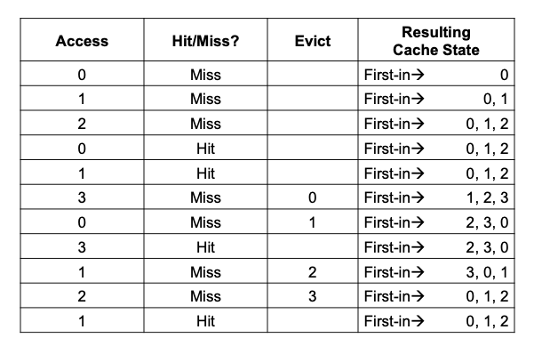
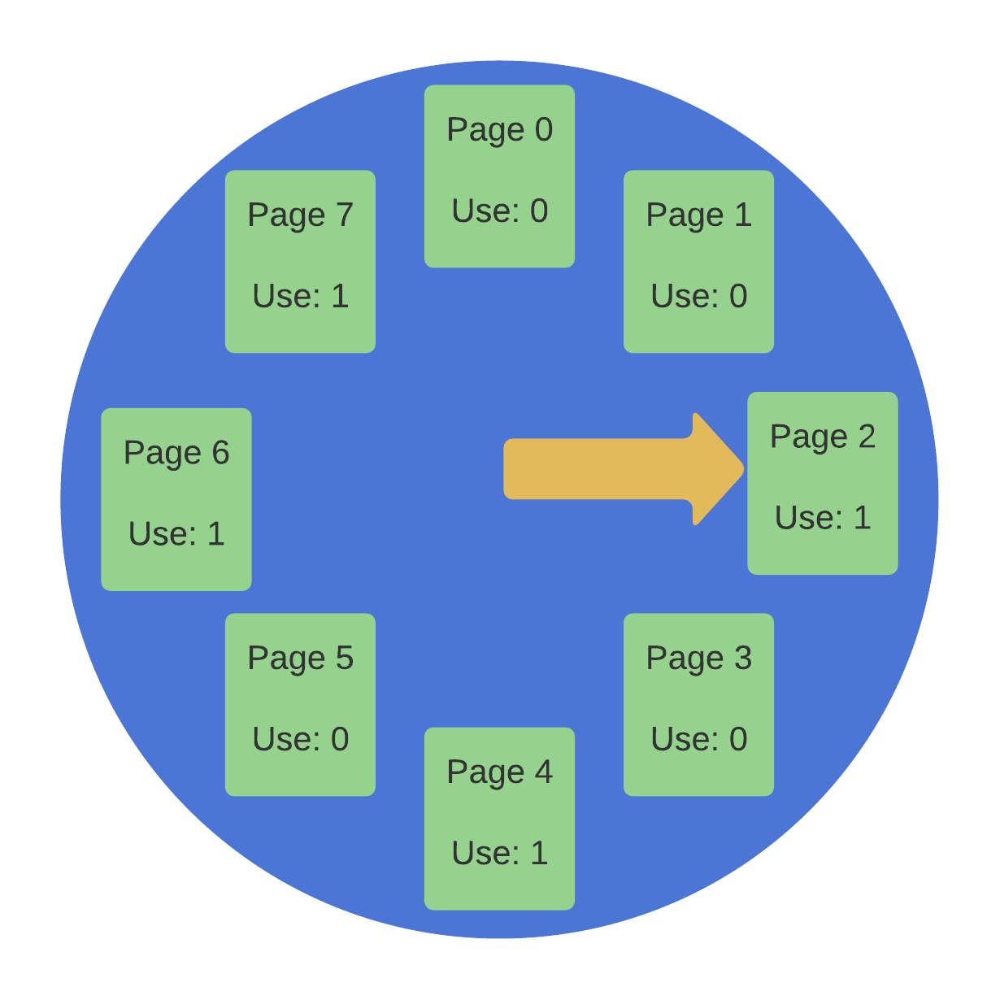

# Introduction
Life is simple when you have a lot of free RAM in a virtual memory management. You scan the free-page list for a free page and assign it to the faulting page when a page fault happens.  
当虚拟内存管理中有大量空闲RAM时，生活就简单了。当发生页错误时，您将扫描空闲页列表以查找空闲页，并将其分配给错误页。  

Things get more exciting when memory is low. In this case, memory pressure triggers the OS to start **paging out** pages to make way for active pages. Because early virtual memory systems had limited physical memory, deciding which page (or pages) to **evict** is a key issue that’s normally handled by the OS’ **replacement policy**.  
当内存很低时，事情就变得更加激动人心了。在这种情况下，内存压力会触发操作系统开始**分页**页面，为活动页面让路。因为早期的虚拟内存系统有限的物理内存，决定要**驱逐**哪个页面（或页面）是一个关键问题，通常由操作系统的**替换策略**处理。  

This section should help us answer the following questions:  
本节应该能帮助我们回答以下问题：
- How does the OS decide which pages to delete from memory?
    操作系统如何决定从内存中删除哪些页面？
- Is it possible to approximate perfect LRU (Least Recently Used) while still producing the desired behavior?  
    是否可以在仍然产生所需行为的同时近似完美的LRU（最近最少使用）？

## Average Memory Access Time

Main memory can be considered as a cache for virtual memory pages in the system because it holds a subset of all the pages in the system.  
主存储器可以被认为是系统中虚拟内存页面的缓存，因为它保存了系统中所有页面的子集。  

**Our goal in selecting a replacement policy for this cache is to reduce the number of cache misses, or the number of times we must request a page from disk.**  
**我们选择替换策略以减少缓存未命中的数量，或者我们必须从磁盘请求页面的次数。**  

The average memory access time (AMAT) for a program can be calculated using the number of cache hits and misses:  
程序的平均内存访问时间（AMAT）可以使用缓存命中和未命中的数量来计算：  


where:
- **T<sub>M</sub>** denotes the cost of accessing memory  
    **T<sub>M</sub>** 表示访问内存的成本
- **T<sub>D</sub>** denotes the cost of accessing disk  
    **T<sub>D</sub>** 表示访问磁盘的成本  
- **P<sub>Miss</sub>** is the likelihood of the data not being found in the cache (a miss)  
    **P<sub>Miss</sub>** 是数据未在缓存中找到的可能性（未命中）  
    - **P<sub>Miss</sub>** = is a number that ranges from 0.0 to 1.0  
        **P<sub>Miss</sub>** 是一个范围从0.0到1.0的数字  
    - We sometimes refer to it as a percent miss rate rather than a probability (e.g., a 10% miss rate equals **P<sub>Miss</sub>** = 0.10).  
        我们有时将其称为百分比未命中率而不是概率（例如，10％的未命中率等于**P<sub>Miss</sub>** = 0.10）。

Note that you must always pay the cost of accessing data in memory; but, if you miss, you must also pay the cost of getting data from disk.  
请注意，您必须始终支付访问内存中数据的成本；但是，如果您未命中，您还必须支付从磁盘获取数据的成本。  

Example Calculation of AMAT  
Assume that all of an address space’s first ten pages, except virtual page 3, are already stored in memory. As a result, our memory references would behave as follows:    
假设地址空间的前十个页面中的所有页面，除了虚拟页面3，都已存储在内存中。因此，我们的内存引用将如下所示：  
1. hit
2. hit
3. miss
4. hit
5. hit
6. hit
7. hit
8. hit
9. hit
10. hit

The hit rate (the percentage of references found in memory) is 90%, because 9 out of 10 references are found in memory. The miss rate is 10% (**P<sub>Miss</sub>**=0.1 ). In general,   **P<sub>Hit</sub>**+**P<sub>Miss</sub>**=1.0.  
命中率（在内存中找到引用的百分比）为90％，因为10个引用中有9个在内存中。未命中率为10％（**P<sub>Miss</sub>**=0.1）。一般来说，**P<sub>Hit</sub>**+**P<sub>Miss</sub>**=1.0。  

If the cost of accessing memory (**T<sub>M</sub>**) is around 100 nanoseconds and the cost of accessing disk (**T<sub>D</sub>**) is around 10 milliseconds then the **AMAT** calculation is:  
如果访问内存（**T<sub>M</sub>**）的成本大约为100纳秒，访问磁盘（**T<sub>D</sub>**）的成本大约为10毫秒，则**AMAT**计算为： 

```text
100ns + 0.1 x 10ms
100ns + 1ms
1.0001ms
```

So AMAT is approximately 1 millisecond. If our hit rate had been 99.9% (**P<sub>Miss</sub>** = 0.001), the outcome would have been substantially different: AMAT is 100 times faster at 10.1 microseconds. AMAT approaches 100 nanoseconds as the hit rate approaches 100%.  
因此，AMAT大约为1毫秒。如果我们的命中率为99.9％（**P<sub>Miss</sub>** = 0.001），结果将会有很大的不同：AMAT的速度是100倍快，为10.1微秒。随着命中率接近100％，AMAT接近100纳秒。  

Unfortunately, as this example shows, the cost of disk access in modern systems is so high that even a small miss rate can quickly overwhelm the overall AMAT of running processes. We must either avoid as many misses as possible or run at the disk’s speed.  
不幸的是，正如本例所示，现代系统中磁盘访问的成本非常高，即使是一个很小的未命中率也可以迅速压倒运行进程的整体AMAT。我们必须尽可能避免更多的未命中，或者以磁盘的速度运行。  

## Question 1
If a policy trace has 15 hits out of 20 accesses, what is the **P<sub>Miss</sub>** value?  
如果策略跟踪在20次访问中有15次命中，那么**P<sub>Miss</sub>**值是多少？  
**P<sub>Hit</sub>** = 15 / 20 = 0.75   
**P<sub>Miss</sub>** = 1 - **P<sub>Hit</sub>** = 1 − 0.75 = 0.25 or 25  

# The Optimal Replacement Policy 

The optimal replacement policy replaces the page that would be accessed the farthest in the future, minimizing cache misses. The rationale is simple: you will refer to other pages before the farthest out.  
最佳替换策略替换将来将被访问最远的页面，从而最小化缓存未命中。根据这个原理很简单：您将在最远之前引用其他页面。  

Let’s look at a basic example to see how optimum policy generates decisions. Suppose a program reads from a stream of virtual pages like this: 0, 1, 2, 0, 1, 3, 0, 3, 1, 2, 1.  
让我们看一个基本的例子，看看最佳策略如何生成决策。假设一个程序从这样的虚拟页面流中读取：0,1,2,0,1,3,0,3,1,2,1。  


- The first three accesses are misses, as the cache starts empty (or compulsory miss).  
    第一次访问是未命中，因为缓存是空的（或强制未命中）。
- Then we refer to pages 0 and 1, both cached.  
    然后我们引用页面0和1，都缓存了。  
- Finally, we reach page 3, but the cache is filled; a replacement is required! So, which page should we replace? Using the optimal strategy, we can observe that 0 gets accessed almost immediately, 1 is accessed after that, and 2 is accessed the furthest in the future so it is evicted from cache.  
    最后，我们到达页面3，但缓存已满；需要替换！那么，我们应该替换哪个页面？使用最佳策略，我们可以观察到0几乎立即被访问，1在此之后被访问，2在未来被访问最远，因此被从缓存中驱逐出去。  
- The next few accesses are in cache since we chose to keep those pages.  
    接下来的几次访问都在缓存中，因为我们选择保留这些页面。  
- When we reach page 2, which we evicted, we get another miss. The best policy considers the future for each cache page (0, 1, and 3), and determines it should not to evict page 1 (which is about to be accessed). Page 3 is evicted in the example, although 0 would also work.  
    当我们到达我们驱逐的页面2时，我们得到另一个未命中。最佳策略考虑了每个缓存页面（0,1和3）的未来，并确定不应该驱逐页面1（即将被访问）。在示例中，页面3被驱逐，尽管0也可以工作。  


Unfortunately, as with scheduling strategies, the future is unknown. So, in building an actual, deployable strategy, we’ll look for alternatives to deciding which pages to evict.  
不幸的是，与调度策略一样，未来是未知的。因此，在构建实际可部署的策略时，我们将寻找决定驱逐哪些页面的替代方案。

# Early Systems 

Many early systems used relatively simple replacement policies to avoid the complication of attempting to approach optimal.  
许多早期系统使用相对简单的替换策略来避免尝试接近最佳的复杂性。  

# FIFO
Some systems, for example, employed FIFO (first-in, first-out) replacement, in which pages were simply placed in a queue when they entered the system; when the queue was re-placed, the page at the tail of the queue (the “first-in” page) was evicted. FIFO has one major advantage: it is very easy to implement.  
一些系统，例如，采用FIFO（先进先出）替换，即当页面进入系统时，它们被简单地放入队列中；当队列被重新放置时，队列尾部的页面（“先进”页面）被驱逐。FIFO有一个主要优点：它非常容易实现。  



- We start our trace with three mandatory misses to pages 0, 1, and 2, before hitting on both 0 and 1.  
    我们从页面0,1和2的三个强制未命中开始，然后在0和1上命中。  
- Next, page 3 is referenced, resulting in a miss; with FIFO, choosing the page that was the “first one” in (the cache state in the figure is preserved in FIFO order, with the first-in page on the left) is simple: choose page 0.  
    接下来，页面3被引用，导致未命中；使用FIFO，选择“第一个”（图中的缓存状态按FIFO顺序保留，第一个页面在左侧）是简单的：选择页面0。  
- Unfortunately, our next access will be to page 0, which will result in another missed opportunity and replacement (of page 1).  
    不幸的是，我们的下一个访问将是页面0，这将导致另一个未命中的机会和替换（页面1）。  
- Then we hit on page 3, but missed on 1 and 2 before eventually hitting on 3.  
    然后我们在页面3上命中，但在最终命中3之前，我们在1和2上未命中。  

When compared to optimal, FIFO performs worse, with a 36.4% hit rate.  
与最佳性能相比，FIFO的命中率为36.4％。

To trace through an example of the FIFO policy at work, click the button below:  
要跟踪FIFO策略的示例，请单击下面的按钮：

```bash
Access:3 MISS FirstIn->      [3]<-Lastin  Evict:- 
Access:3 HIT  FirstIn->      [3]<-Lastin  Evict:- 
Access:1 MISS FirstIn->   [3, 1]<-Lastin  Evict:- 
Access:4 MISS FirstIn->[3, 1, 4]<-Lastin  Evict:- 
Access:1 HIT  FirstIn->[3, 1, 4]<-Lastin  Evict:- 
Access:2 MISS FirstIn->[1, 4, 2]<-Lastin  Evict:3 
Access:0 MISS FirstIn->[4, 2, 0]<-Lastin  Evict:1 
Access:2 HIT  FirstIn->[4, 2, 0]<-Lastin  Evict:- 
Access:0 HIT  FirstIn->[4, 2, 0]<-Lastin  Evict:- 
Access:2 HIT  FirstIn->[4, 2, 0]<-Lastin  Evict:- 
Access:3 MISS FirstIn->[2, 0, 3]<-Lastin  Evict:4 
Access:4 MISS FirstIn->[0, 3, 4]<-Lastin  Evict:2 
Access:2 MISS FirstIn->[3, 4, 2]<-Lastin  Evict:0 
Access:4 HIT  FirstIn->[3, 4, 2]<-Lastin  Evict:- 
Access:0 MISS FirstIn->[4, 2, 0]<-Lastin  Evict:3 
Access:2 HIT  FirstIn->[4, 2, 0]<-Lastin  Evict:- 
Access:1 MISS FirstIn->[2, 0, 1]<-Lastin  Evict:4 
Access:2 HIT  FirstIn->[2, 0, 1]<-Lastin  Evict:- 
Access:2 HIT  FirstIn->[2, 0, 1]<-Lastin  Evict:- 
Access:0 HIT  FirstIn->[2, 0, 1]<-Lastin  Evict:- 

FINALSTATS hits 10   misses 10   hitrate 50.00
```
# Random
Random is a similarly easy to implement policy that simply selects a random page to replace when memory is limited.  
随机是一种类似于随机选择页面以替换内存有限的策略。  

 

Of course, the performance of Random is totally dependent on how lucky (or bad) it is with the choices. Random performs somewhat better than FIFO but slightly worse than optimal in the case above.  
当然，随机的性能完全取决于它的选择有多幸运（或不幸）。在上面的情况下，随机的性能比FIFO稍好，但略低于最佳性能。  

If we repeat the Random experiment a thousand times to see how it performs in general, we see runs ranging from 0 hits to as well as optimal (about 40% of the time).  
如果我们重复随机实验一千次，以查看它在一般情况下的表现，我们会看到从0次命中到最佳性能（大约40％的时间）的运行。  

The performance of a Random policy is determined by the luck of the draw, but on average it performs similarly to FIFO.  
随机策略的性能由抽签的幸运决定，但平均而言，它的性能与FIFO类似。  

```bash
Access:0 MISS Left ->      [0]<-Right Evict:- 
Access:3 MISS Left ->   [0, 3]<-Right Evict:- 
Access:4 MISS Left ->[0, 3, 4]<-Right Evict:- 
Access:4 HIT  Left ->[0, 3, 4]<-Right Evict:- 
Access:1 MISS Left ->[3, 4, 1]<-Right Evict:0 
Access:0 MISS Left ->[3, 4, 0]<-Right Evict:1 
Access:2 MISS Left ->[3, 4, 2]<-Right Evict:0 
Access:3 HIT  Left ->[3, 4, 2]<-Right Evict:- 
Access:3 HIT  Left ->[3, 4, 2]<-Right Evict:- 
Access:3 HIT  Left ->[3, 4, 2]<-Right Evict:- 
Access:0 MISS Left ->[3, 4, 0]<-Right Evict:2 
Access:4 HIT  Left ->[3, 4, 0]<-Right Evict:- 
Access:3 HIT  Left ->[3, 4, 0]<-Right Evict:- 
Access:3 HIT  Left ->[3, 4, 0]<-Right Evict:- 
Access:2 MISS Left ->[4, 0, 2]<-Right Evict:3 
Access:3 MISS Left ->[0, 2, 3]<-Right Evict:4 
Access:0 HIT  Left ->[0, 2, 3]<-Right Evict:- 
Access:2 HIT  Left ->[0, 2, 3]<-Right Evict:- 
Access:3 HIT  Left ->[0, 2, 3]<-Right Evict:- 
Access:4 MISS Left ->[0, 2, 4]<-Right Evict:3 

FINALSTATS hits 10   misses 10   hitrate 50.00
```
# Question
Complete the following paragraph about the above policies applied to 3 different systems.  
完成以下关于上述策略应用于3个不同系统的段落。  

In the first system, random and FIFO perform about the same as there is no characteristic giving one an advantage.  
在第一个系统中，随机和FIFO的表现大致相同，因为没有特征可以使它们获得优势。 

Similarly, in the second system, there is nothing about FIFO to account for the fact that a small subset of pages is accessed frequently.  
同样，在第二个系统中，FIFO没有任何东西可以解释为什么只有少数页面被频繁访问。  

In the looping sequential system, however, FIFO will have a hit rate of 0 since it will always evict the page it is about to access. This makes random the better policy.  
但是，在循环顺序系统中，FIFO的命中率为0，因为它总是会驱逐它即将访问的页面。这使得随机成为更好的策略。

# The Least Recently Used Policy
Basic policies like FIFO or Random are likely to have one flaw: they may delete a critical page that is about to be referenced again.  
像FIFO或随机这样的基本策略可能会有一个缺陷：它们可能会删除一个即将再次引用的关键页面。 

To better predict the future, we draw on the past and use history as our guide, just like we did with scheduling policy. For instance, if a software program has recently viewed a page, it is likely to do so again shortly.  
为了更好地预测未来，我们可以借鉴过去，将历史作为我们的指南，就像我们在调度策略中所做的那样。例如，如果一个软件程序最近查看了一个页面，那么它很可能很快再次这样做。  

Frequency is one type of historical data that a page-replacement policy could employ; if a page has been accessed numerous times, it may not need to be changed because it has some value. The recency of access is a more often utilized feature of a page; the more recently a page has been accessed, the more likely it will be accessed again.  
频率是页面替换策略可以使用的历史数据的一种类型；如果一个页面已经被访问了很多次，那么它可能不需要被更改，因为它有一些价值。访问的最近程度是页面的一个更常用的特征；一个页面被访问的越近，它被再次访问的可能性就越大。  

**Principle of Localization**
An observation that programs often read specific code sequences and data structures (e.g., an array) in a loop.  
程序通常在循环中读取特定的代码序列和数据结构（例如，数组）的观察。  

As a result, a family of straightforward historical-based algorithms emerges. When an eviction is required, the Least-Frequently-Used (LFU) policy replaces the least-frequently-used page. The Least-Recently-Used (LRU) policy, on the other hand, replaces the least-recently-used page.  
因此，一系列简单的基于历史的算法出现了。当需要驱逐时，最不经常使用（LFU）策略替换最不经常使用的页面。另一方面，最近最少使用（LRU）策略替换最近最少使用的页面。  

Here is an example trace using the LRU policy:  
这是一个使用LRU策略的示例跟踪：  


- When LRU first has to replace a page, it evicts page 2 because 0 and 1 have been viewed more recently.  
    当LRU首次需要替换一个页面时，它驱逐页面2，因为0和1已经被更近期地查看过。  
- Because 1 and 3 have been accessed more recently, it replaces page 0.  
    因为1和3已经被更近期地访问过，它替换了页面0。

In both circumstances, LRU’s historical judgement proves to be correct, and the subsequent references are thus hits. As a result, in our scenario, LRU performs as well as it possibly can, meeting ideal performance.  
在这两种情况下，LRU的历史判断被证明是正确的，因此后续引用是命中。因此，在我们的场景中，LRU表现得尽可能好，达到了理想的性能。  

```bash
Access:2 MISS LRU->      [2]<-MRU Evict:- 
Access:2 HIT  LRU->      [2]<-MRU Evict:- 
Access:2 HIT  LRU->      [2]<-MRU Evict:- 
Access:2 HIT  LRU->      [2]<-MRU Evict:- 
Access:3 MISS LRU->   [2, 3]<-MRU Evict:- 
Access:4 MISS LRU->[2, 3, 4]<-MRU Evict:- 
Access:3 HIT  LRU->[2, 4, 3]<-MRU Evict:- 
Access:2 HIT  LRU->[4, 3, 2]<-MRU Evict:- 
Access:2 HIT  LRU->[4, 3, 2]<-MRU Evict:- 
Access:0 MISS LRU->[3, 2, 0]<-MRU Evict:4 
Access:3 HIT  LRU->[2, 0, 3]<-MRU Evict:- 
Access:3 HIT  LRU->[2, 0, 3]<-MRU Evict:- 
Access:0 HIT  LRU->[2, 3, 0]<-MRU Evict:- 
Access:0 HIT  LRU->[2, 3, 0]<-MRU Evict:- 
Access:0 HIT  LRU->[2, 3, 0]<-MRU Evict:- 
Access:3 HIT  LRU->[2, 0, 3]<-MRU Evict:- 
Access:2 HIT  LRU->[0, 3, 2]<-MRU Evict:- 
Access:0 HIT  LRU->[3, 2, 0]<-MRU Evict:- 
Access:1 MISS LRU->[2, 0, 1]<-MRU Evict:3 
Access:1 HIT  LRU->[2, 0, 1]<-MRU Evict:- 

FINALSTATS hits 15   misses 5   hitrate 75.00
```
Complete the following paragraph about the FIFO, random, and LRU policies applied to 3 different systems.  
完成以下关于FIFO，随机和LRU策略应用于3个不同系统的段落。

In a random system, all 3 policies perform similarly.  
在随机系统中，所有3种策略的表现都相似。  
In the second system, LRU takes advantage of the fact a small subset of pages are accessed the most frequently, and outperforms FIFO and random.  
在第二个系统中，LRU利用一小部分页面最常访问的事实，优于FIFO和随机。  
In the looping sequential system, LRU has the same 0% hit rate as FIFO, meaning random performs best.  
在循环顺序系统中，LRU的命中率为0％，与FIFO相同，这意味着随机表现最好。  


# Implementing LRU
As you can see, algorithms like LRU outperform simpler rules like FIFO or Random, which may miss essential pages. These policies provide a fresh problem: how to execute them?  
正如你所看到的，LRU等算法优于FIFO或随机等简单规则，这些规则可能会错过重要的页面。这些策略提供了一个新的问题：如何执行它们？  

To implement LRU, we must update some data structure to advance this page to the front of the list **for each page access** (every time it is accessed in memory). In contrast, FIFO **only accesses the list of pages when a page is evicted** (by removing the first-in page) or added (to the last-in side). This means LRU’s tracking of usage might harm performance if not done properly.  
为了实现LRU，我们必须更新某些数据结构，以便每次访问页面时将该页面提前到列表的前面。相比之下，FIFO**仅在页面被驱逐时访问页面列表**（通过删除最先进入的页面）或添加（到最后一侧）。这意味着如果LRU的使用跟踪没有正确执行，它可能会损害性能。  

Adding some hardware support could help speed things up. A machine might update a **time field** in memory on each page access. The OS can then scan all time fields to find the least-recently-used page and replace it.  
添加一些硬件支持可以加快速度。机器可能会在每次访问页面时更新内存中的**时间字段**。然后，操作系统可以扫描所有时间字段以查找最近最少使用的页面并替换它。  

Unfortunately, as a system’s page count grows, scanning a wide array of times to discover the least-recently-used page becomes prohibitively expensive.  
不幸的是，随着系统页面计数的增长，扫描大量时间以发现最近最少使用的页面变得非常昂贵。  

# The Clock Algorithm
Approximating LRU reduces computing overhead and is used by many modern systems. The first operating system with paging, the Atlas one-level store, used a **use bit** (sometimes called a **reference bit**) to support the idea. Each system page has one usage bit, which is stored in memory. When a page is referenced (read or written), the hardware sets the use bit to 1. The OS is responsible for clearing the bit (setting it to 0).  
近似LRU减少了计算开销，并且被许多现代系统使用。第一个使用分页的操作系统，Atlas一级存储，使用**使用位**（有时称为**引用位**）来支持这个想法。每个系统页面都有一个使用位，它存储在内存中。当页面被引用（读取或写入）时，硬件将使用位设置为1。操作系统负责清除位（将其设置为0）。  

This idea is leveraged by the clock algorithm. Imagine the system’s pages organized in a circle. Initially, a clock hand points to any page:  
这个想法被时钟算法利用。想象一下系统的页面在一个圆圈中组织起来。最初，时钟手指向任何页面：



When replacing a page, the OS checks if the use bit is 1 or 0:  
当替换页面时，操作系统检查使用位是否为1或0：  
- If 1, page P was recently used and so is not a strong replacement choice. The usage bit for P is cleared (set to 0), and the clock hand is advanced one page (P + 1).  
    如果是1，页面P最近被使用，因此不是一个强替换选择。 P的使用位被清除（设置为0），时钟手指向下一页（P + 1）。  
- If the use bit is set to 0, the page hasn’t been used recently (in the worst case, all pages have been recently used and we have now searched through the entire set of pages, clearing all the bits).   
    如果使用位被设置为0，则页面最近没有被使用（在最坏的情况下，所有页面都最近被使用，我们现在已经搜索了整个页面集，清除了所有位）。  

```bash
Access:1 MISS Left ->      [1]<-Right Evict:- 
Access:2 MISS Left ->   [1, 2]<-Right Evict:- 
Access:0 MISS Left ->[1, 2, 0]<-Right Evict:- 
Access:0 HIT  Left ->[1, 2, 0]<-Right Evict:- 
Access:2 HIT  Left ->[1, 2, 0]<-Right Evict:- 
Access:1 HIT  Left ->[1, 2, 0]<-Right Evict:- 
Access:1 HIT  Left ->[1, 2, 0]<-Right Evict:- 
Access:1 HIT  Left ->[1, 2, 0]<-Right Evict:- 
Access:0 HIT  Left ->[1, 2, 0]<-Right Evict:- 
Access:0 HIT  Left ->[1, 2, 0]<-Right Evict:- 
Access:1 HIT  Left ->[1, 2, 0]<-Right Evict:- 
Access:3 MISS Left ->[1, 0, 3]<-Right Evict:2 
Access:4 MISS Left ->[0, 3, 4]<-Right Evict:1 
Access:3 HIT  Left ->[0, 3, 4]<-Right Evict:- 
Access:3 HIT  Left ->[0, 3, 4]<-Right Evict:- 

FINALSTATS hits 10   misses 5   hitrate 66.67
```

## Questions 
Look at the figure below and assume the orange pointer moves in a clockwise manner (such that the page numbers increase)  
看看下面的图表，并假设橙色指针以顺时针方式移动（使页面号增加）  


- Page 6 has a use bit set to 1 – the use bit is cleared and the pointer is advanced to Page 7
- Page 7 has a use bit set to 1 – the use bit is cleared and the pointer is advanced to Page 0
- Page 0 has a use bit set to 0 – Page 0 is evicted

## Dirty Pages
Considering whether a page has been updated or not while in memory is a simple improvement to the clock method that is routinely made. The reason for this is that if a page has been updated and is thus unclean, it must be evicted by writing it back to disk, which is costly. The eviction is free if it has not been updated; the physical frame can simply be reused for other purposes without further I/O. As a result, certain virtual machine systems prefer to evict clean pages over unclean ones.  
考虑在内存中更新页面时是否已更新是对时钟方法的简单改进，这种改进是常规的。这样做的原因是，如果页面已更新且因此不干净，则必须通过将其写回磁盘来驱逐它，这是昂贵的。如果没有更新，则驱逐是免费的; 物理帧可以简单地用于其他目的，而不需要进一步的I / O。因此，某些虚拟机系统更喜欢驱逐干净的页面而不是不干净的页面。 

A modified bit should be included in the hardware to accommodate this behavior (a.k.a. **dirty bit**). Because this bit is set whenever a page is written, it can be used in the page-replacement method. For example, the clock algorithm may be altered to look for pages that are both unused and clean to evict first; if those aren’t found, then look for unused dirty pages, and so on.  
应该在硬件中包含修改位以适应此行为（也称为**脏位**）。因为每当写入页面时，都会设置此位，因此可以在页面替换方法中使用它。例如，时钟算法可以被修改为查找未使用且干净的页面以首先驱逐; 如果找不到这些页面，则查找未使用的脏页面，依此类推。

# Thrashing and Other Policies
## Thrashing
Before we wrap up, we’ll address one last question. What should the OS do when memory is simply overcrowded, and the memory demands of the operating processes simply outnumber the physical memory available? In this situation, the system will be continuously paging, a condition known as **thrashing**.  
在我们结束之前，我们将回答最后一个问题。当内存过度拥挤时，操作系统应该做什么，操作进程的内存需求只是超过了可用的物理内存？在这种情况下，系统将不断分页，这种情况称为**振荡**。 

### **Admission Control**
- An early method to address thrashing that asserts it is sometimes better to accomplish less work properly than to try to complete everything poorly all at once.  
    早期的方法是解决振荡，它断言有时完成工作更好，而不是一次尝试完成所有工作。  
- Specifically, Admission Control means, given a set of processes, a system might opt not to execute a subset of them in the hopes that the pages of the reduced set of processes will fit in memory, allowing progress.  
    具体而言，准入控制意味着，给定一组进程，系统可能会选择不执行它们的子集，希望减少的进程集的页面将适合内存，从而允许进展。  

Some modern systems take a harsher stance against memory saturation. When memory is oversubscribed, some versions of Linux, for example, launch an out-of-memory killer; this daemon selects a memory-intensive process and kills it, decreasing memory in a not-so-subtle manner. While this strategy is effective at decreasing memory strain, it might cause difficulties if it, for example, disables the X server, rendering any apps that require the display inoperable.  
一些现代系统对内存饱和度采取了更严厉的立场。当内存被超额订购时，例如，一些版本的Linux会启动内存不足杀手; 这个守护进程选择一个内存密集型进程并杀死它，以一种不那么微妙的方式减少内存。虽然这种策略有效地减少了内存压力，但如果它导致了一些问题，例如，禁用了X服务器，使任何需要显示的应用程序都无法操作。  

## Other VM Policies
The VM subsystem’s page replacement policy isn’t the only policy it implements. The operating system, for example, must decide when to load a page into memory. This policy, often known as the **page selection policy**, provides the OS with a number of alternatives.  
虚拟内存子系统的页面替换策略不是它实现的唯一策略。例如，操作系统必须决定何时将页面加载到内存中。这种策略通常称为**页面选择策略**，为操作系统提供了多种选择。  

The OS simply employs demand paging for most pages, which means the OS loads the page into memory as needed. Of course, the OS may predict when a page will be used and bring it in ahead of time; this is known as **prefetching**, and it should only be done when there is a good likelihood of success. Some systems, for example, will presume that if code page P is brought into memory, code page P +1 will be accessed shortly and so should be brought into memory as well.  
对于大多数页面，操作系统只是采用按需分页，这意味着操作系统根据需要将页面加载到内存中。当然，操作系统可以预测页面将被使用，并提前将其带入; 这被称为**预取**，只有在成功的可能性很大时才应该这样做。例如，一些系统会假设如果代码页面P被带入内存，代码页面P + 1将很快被访问，因此也应该被带入内存。  

Another policy controls how the operating system writes pages to disk. Of course, they may be written out one at a time; however, many systems instead pool many pending writes in memory and write them to disk in a single (more efficient) write. This is known as **clustering** or simply grouping of writes, and it works because of the nature of disk drives, which can perform a single large write more efficiently than a series of little ones.  
另一个策略控制操作系统如何将页面写入磁盘。当然，它们可以一次写一个; 然而，许多系统会将许多待处理的写入内存中，并将它们一次写入磁盘(更有效)。这被称为**聚类**或简单地写入分组，因为磁盘驱动器的特性，它可以比一系列小的更有效地执行单个大的写入。  

## Questions
As we addressed in the last section, the page daemon is awoken based on specific processes that are out of memory or the system reaching the high watermark – not a policy.  
正如我们在上一节中所讨论的，页面守护进程是根据内存不足的特定进程或系统达到高水位而唤醒的，而不是一个政策。  

# Summary
We’ve seen the introduction of various page-replacement (and other) rules, which are now part of every modern operating system’s VM subsystem. Recent systems make some adjustments to simple LRU approximations like clock; for example, scan resistance is a major feature of many modern algorithms like ARC. Scan-resistant algorithms are typically LRU-like, but they also attempt to avoid the worst-case behavior of LRU, which we observed with the looping-sequential workload. As a result, the advancement of page-replacement algorithms continues.  
我们已经看到了各种页面替换(和其他)规则的介绍，这些规则现在是每个现代操作系统的虚拟内存子系统的一部分。最近的系统对简单的LRU近似值进行了一些调整，例如时钟; 例如，扫描抗性是许多现代算法(如ARC)的主要特征。扫描抗性算法通常是类似于LRU的，但它们还试图避免LRU的最坏情况行为，我们观察到了循环顺序工作负载。因此，页面替换算法的进步继续。  

However, the importance of such techniques has decreased in many circumstances as the difference between memory-access and disk-access durations has increased. Because paging to disk is so expensive, the expense of frequent paging is prohibitive. As a result, the greatest remedy to excessive paging is frequently a simple (albeit intellectually disappointing) one: buy additional memory.  
然而，由于内存访问和磁盘访问持续时间之间的差异增加，这些技术的重要性在许多情况下已经降低。由于分页到磁盘非常昂贵，因此频繁分页的费用是禁止的。因此，过度分页的最佳解决方案通常是简单的(尽管智力令人失望)：购买额外的内存。  