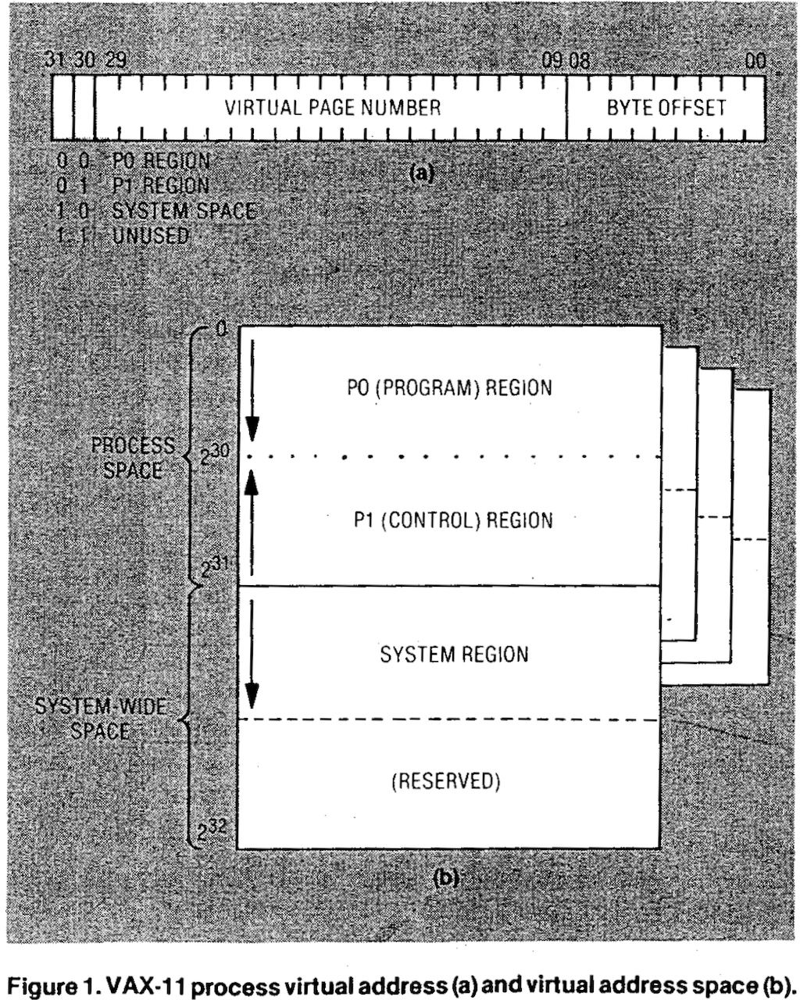
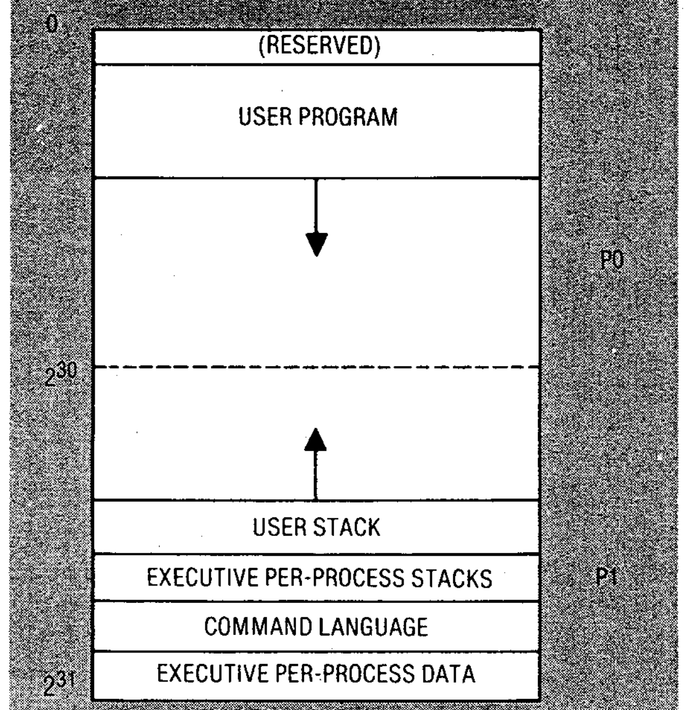
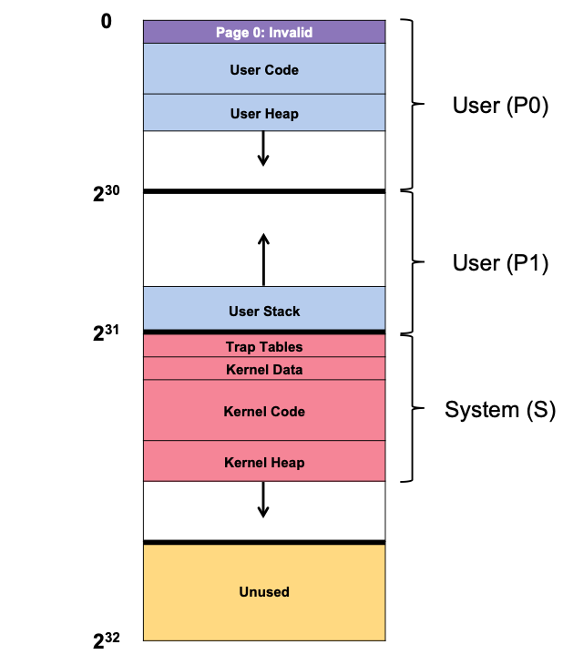

# Introduction
We have discussed multiple individual components of a virtual memory system:  
我们已经讨论了虚拟内存系统的多个单个组件：  
- many page-table designs  
  许多页表设计
- interactions with the TLB  
  与TLB的交互
- policies for determining which pages stay in memory and which are kicked out  
  确定哪些页面保留在内存中，哪些页面被踢出的策略  

A comprehensive virtual memory system has a variety of performance, functionality, and security characteristics. This section will address:  
一个全面的虚拟内存系统具有各种性能，功能和安全特征。本节将讨论：  
- What features are required to create a fully functional virtual memory system?  
  创建一个功能完整的虚拟内存系统需要哪些功能？  
- How do they improve the system’s performance, security, or other aspects?
  它们如何提高系统的性能，安全性或其他方面？    

# VAX/VMS Virtual Memory
This section considers one of the earliest examples of a “modern” virtual memory manager, which can be found in the VAX/VMS operating system. VAX/VMS was developed in the 1970s and a surprising number of techniques and approaches from this system have survived to this day.  
本节考虑了一个最早的“现代”虚拟内存管理器的例子，可以在VAX/VMS操作系统中找到。VAX/VMS是在1970年代开发的，这个系统的许多技术和方法令人惊讶地到今天仍然存在。  

The Digital Equipment Corporation (DEC) released the VAX-11 minicomputer architecture in the late 1970s. VMS could be run on a wide range of machines, from low-cost VAXen (yes, plural) to high-end and powerful computers in the same architecture family. Therefore the OS needed processes and policies that functioned well across a wide range of systems.  
数字设备公司（DEC）在20世纪70年代末发布了VAX-11微型计算机体系结构。VMS可以在各种机器上运行，从低成本的VAX（是的，复数）到同一体系结构家族中的高端和强大的计算机。因此，操作系统需要在各种系统之间都能正常运行的进程和策略。  

## Levy & Lipman
Some of the unique aspects of VAX/VMS OS were reported in 1982 by Levy and Lipman who summarized the contribution as:  
1982年，Levy和Lipman报告了VAX/VMS OS的一些独特方面，他们总结了贡献：  
- Caching pages “reduces the number of disk I/O transactions on pages that have been recently removed from a process’s resident set”  
  缓存页面“减少了最近从进程的常驻集中删除的页面的磁盘I / O事务的数量”  
- Clustering “provides the transfer efficiency of large pages along with the fragmentation characteristics of small pages”  
  聚类“提供了大页面的传输效率以及小页面的碎片特性”  
- Process-local replacement with swapping reduces “the effect of one process’s paging activities on another’s”  
  进程本地替换与交换减少了“一个进程的分页活动对另一个进程的影响”

**Reference**: Levy, H. M., and Lipman, P.H. Virtual memory management in the VAX/VMS operating system. IEEE Computer 15, 3 (Mar. 1982), 35-41.  
**参考文献**：Levy，H.M.和Lipman，P.H。VAX / VMS操作系统中的虚拟内存管理。IEEE计算机15,3（1982年3月），35-41。

VMS is a great example of software advances exploited to cover architectural problems. However, when designing efficient abstractions and illusions, the hardware designers don’t always get it right; we’ll examine a few examples of this in the VAX hardware, and what the VMS operating system does to produce an effective, working system despite the hardware defects.  
VMS是软件进步的一个很好的例子，用来解决体系结构问题。但是，当设计高效的抽象和幻觉时，硬件设计人员并不总是正确的；我们将在VAX硬件中研究这方面的一些例子，以及VMS操作系统如何产生有效的工作系统，尽管硬件缺陷。

# Memory Management Hardware
The VAX-11 provided 512-byte virtual address space per process. So a virtual address was a 23-bit VPN plus a 9-bit offset. The upper two bits of the VPN were also used to differentiate between segments, making the method a combination of paging and segmentation.  
VAX-11为每个进程提供了512字节的虚拟地址空间。因此，虚拟地址是23位VPN加上9位偏移量。VPN的上两位也用于区分段，使该方法成为分页和分段的组合。  

Figure from Levy and Lipman, 1982, p.35  
Process space is the lowest half of the address space. The user program (P0) is situated in the first half of process space (P0). The stack grows upward in the second half of the process space (P1). System space (S) is the upper half of the address space. The OS code and data are protected here, and are shared between processes.  
进程空间是地址空间的最低部分。用户程序（P0）位于进程空间（P0）的第一部分。堆栈在进程空间（P1）的第二部分向上增长。系统空间（S）是地址空间的上半部分。操作系统代码和数据在这里受到保护，并且在进程之间共享。  

Figure from Levy and Lipman, 1982, p.36
The VAX hardware’s limited page size (512 bytes) was a major problem for the VMS designers. This size, chosen for historical reasons, causes overly large linear page tables. The VMS designers wanted to avoid overloading memory with page tables.  
VAX硬件的有限页面大小（512字节）是VMS设计人员的一个主要问题。这个大小是由于历史原因而选择的，导致线性页面表过大。VMS设计人员希望避免用页面表过载内存。  

The system lowered memory stress in two ways:  
系统通过两种方式降低了内存压力：  
- By segmenting the user address space into two areas (P0 and P1) per process, the VAX-11 eliminates the requirement for page table space between the stack and the heap. The base and bounds registers hold the address and size of the segment’s page table, respectively (i.e., number of page-table entries).  
  通过将用户地址空间分成两个区域（P0和P1）每个进程，VAX-11消除了堆栈和堆之间的页面表空间的要求。基址寄存器分别保存段的页面表的地址和大小（即，页面表条目的数量）。  
- The OS decreases memory load by storing user page tables (for P0 and P1) in kernel virtual memory (KVM). While allocating or expanding a page table, the kernel uses virtual memory in segment S. If memory is under extreme stress, the kernel can shift these page tables to disk, freeing up physical memory. Putting page tables in kernel virtual memory, complicates address translation. The hardware must first look for the page-table entry, for that page, in its own page table (the P0 or P1 page table for that process). This may require consulting the system page table (which resides in physical memory). The VAX’s hardware-managed TLBs, which normally (ideally) avoids this arduous lookup, helps make this process speedier.  
  操作系统通过将用户页面表（P0和P1）存储在内核虚拟内存（KVM）中来减少内存负载。在分配或扩展页面表时，内核使用段S中的虚拟内存。如果内存处于极端压力下，内核可以将这些页面表移至磁盘，释放物理内存。将页面表放在内核虚拟内存中，复杂化了地址转换。硬件必须首先查找该页的页面表条目，该页的页面表条目（该进程的P0或P1页面表）。这可能需要查询系统页面表（位于物理内存中）。VAX的硬件管理的TLB通常（理想情况下）避免了这个艰巨的查找，有助于使这个过程更快。  

## Address Space
A real address space is much more sophisticated than a simple user code, data, and heap address space:  
一个真实的地址空间比一个简单的用户代码，数据和堆地址空间要复杂得多：  

Note **Page 0: Invalid** in the figure above. The code segment never starts at page 0; this page is, instead, declared inaccessible to help detect null-pointer accesses.  
注意上图中的**页面0：无效**。代码段从不在页面0开始;相反，这个页面被声明为无法访问，以帮助检测空指针访问。  

The kernel virtual address space (data structures and code) are part of each user address space. The OS alters the P0 and P1 registers to point to the process’s page tables, but not the S base and bound registers, meaning the “same” kernel structures are mapped into each user address space.  
内核虚拟地址空间（数据结构和代码）是每个用户地址空间的一部分。操作系统将P0和P1寄存器指向进程的页面表，但不改变S基址和边界寄存器，这意味着“相同”的内核结构被映射到每个用户地址空间。  

There are a few reasons why the kernel is mapped to each address space:  
有几个原因为什么内核被映射到每个地址空间：  
- The OS can easily copy data from a user program’s pointer (e.g., on a write() system call) to its own structures using this design.  
  操作系统可以使用这种设计轻松地从用户程序的指针（例如，在write（）系统调用）复制数据到它自己的结构。  
- The OS is written and constructed naturally, without regard for the data it accesses.  
  操作系统是自然地编写和构建的，而不考虑它访问的数据。  
- Moving data between user apps and the kernel would be difficult and painful if the kernel were fully in physical memory.  
  如果内核完全在物理内存中，那么在用户应用程序和内核之间移动数据将是困难和痛苦的。  
- With this design, the kernel appears to programs as a protected library.  
  使用这种设计，内核看起来像一个受保护的库。  

Last but not least, this address area is protected. This prevents apps from reading or writing OS data. To enable this, the hardware must support multiple page protection levels. The VAX accomplished it by stating in the page table protection bits what privilege level the CPU must have to access a page. Thus, attempts to access system data and code from user code will result in an OS trap and the termination of the offending process.  
最后但并非最不重要的是，这个地址区域是受保护的。这可以防止应用程序读取或写入操作系统数据。为了实现这一点，硬件必须支持多个页面保护级别。VAX通过在页面表保护位中声明CPU访问页面所需的特权级来实现它。因此，尝试从用户代码访问系统数据和代码将导致操作系统陷阱并终止有问题的进程。  

## Questions
Solutions:
Memory was split into 4 segments: 2 for user programs, 1 for the OS and the rest is unused space.  
内存被分成4个段：2个用于用户程序，1个用于操作系统，其余空间是未使用的空间。  

The virtual address contained 3 pieces of information:  
虚拟地址包含3个信息：  

- The first 2 bits indicated which of these 4 parts of memory  
  前2位指示这4个内存部分中的哪一个  
- The next 21 bits refer to the virtual page number  
  接下来的21位是虚拟页号  
- The last 9 bits refer to the page offset  
  最后9位是页面偏移量   

VMS uses a mix of segmentation and paging.  
VMS使用了分段和分页的混合。

# Page Management
A VMS page table entry contained:  
VMS页面表项包含：
- a valid bit, a protection field (4 bits)  
  有效位，保护字段（4位）  
- a modify (or dirty) bit  
  修改（或脏）位  
- a field reserved for the OS (5 bits)  
  保留给操作系统的字段（5位）  
- a physical frame number (PFN) to store the page’s actual memory address  
  物理帧号（PFN）存储页面的实际内存地址  

You will notice there is no reference bit as the VAX/VMZ can’t use hardware to determine which pages are active.  
你会注意到没有参考位，因为VAX/VMZ不能使用硬件来确定哪些页面是活动的。

## Swapping Policy  
Memory hogs, programs that utilize a lot of memory and slow down other processes, were also a worry. This is true of most of the policies we’ve looked at so far; for example, LRU is a global policy that doesn’t share memory fairly.  
内存猪，使用大量内存并降低其他进程速度的程序，也是一个问题。这对于我们到目前为止看到的大多数策略来说都是真的;例如，LRU是一个全局策略，不公平地共享内存。  

The developers devised the **segmented FIFO replacement policy** to overcome these issues. The concept is simple: each process has a memory limit (known as the resident set size or RSS). The “first-in” page is evicted when a process exceeds its RSS.  
开发人员设计了**分段FIFO替换策略**来克服这些问题。这个概念很简单：每个进程都有一个内存限制（称为常驻集大小或RSS）。当进程超过其RSS时，将驱逐“先进”页面。  

As we saw earlier, pure FIFO is inefficient. To increase FIFO performance, VMS included two second-chance lists: (1) a global clean-page free list and (2) a dirty-page list.  
正如我们前面所看到的，纯FIFO效率低下。为了提高FIFO性能，VMS包括了两个第二次机会列表：（1）全局清洁页面空闲列表和（2）脏页面列表。  

An out-of-order page is removed from the per-process FIFO and placed at the end of either the clean-page list, or the dirty-page list, depending on if it has been updated. If another process wants a page, it removes the first one. The free (or dirty) list is reclaimed from the original process if the original process fails on that page before it is reclaimed.  
从每个进程FIFO中删除顺序错误的页面，并将其放在清洁页面列表或脏页面列表的末尾，具体取决于它是否已更新。如果另一个进程需要一个页面，它将删除第一个页面。如果在回收之前，原始进程在该页面上失败，则从原始进程中回收空闲（或脏）列表。  

The segmented FIFO technique approaches LRU performance as global second-chance lists grow.  
分段FIFO技术接近LRU性能，因为全局第二次机会列表增长。  

## Writing Pages to Disk
VMS used an improvement called **clustering** to overcome the tiny page size (since disk I/O during swapping could be wasteful due to the short page size). Clustering gathers huge batches of pages from the global dirty list and writes them all at once (thus making them clean). The ability to store pages wherever within swap space allows the OS to aggregate pages, execute fewer and larger writes, and therefore increasing performance.  
VMS使用了一种称为**聚类**的改进来克服微小的页面大小（因为由于页面大小太短，交换期间的磁盘I / O可能会浪费）。聚类从全局脏列表中收集大批页面，并一次性写入它们（从而使它们变干净）。存储页面的能力可以在交换空间的任何位置，允许操作系统聚合页面，执行更少和更大的写入，因此提高性能。  

## Questions
A clean list tracks un-modified pages  
A dirty list tracks modified pages  
A modified FIFO policy decides what pages are removed from memory  

Clustering writes batches of dirty pages to the disk, rendering them clean  
聚类将一批脏页面写入磁盘，使它们变干净  

# Other Neat Tricks
VMS also used demand zeroing and copy-on-write, which are lazy optimizations.  
VMS还使用了按需零和写时复制，这些是懒惰的优化。  

## Demand Page Zeroing
VMS (and most current systems) use **demand page zeroing**. Consider adding a page to your address space, say in your heap. In a simple implementation, the OS finds a page in physical memory, zeros it (for security; otherwise, you’d be able to see what was on the page when another process used it! ), and maps it into your address space (i.e., setting up the page table to refer to that physical page as desired). But this naive implementation might be costly, especially if the page is never utilized.  
VMS（和大多数当前系统）使用**按需页面零化**。考虑将页面添加到您的地址空间中，例如在您的堆中。在一个简单的实现中，操作系统在物理内存中找到一个页面，将其清零（出于安全原因；否则，您将能够看到另一个进程使用时页面上的内容！），并将其映射到您的地址空间中（即，设置页面表以按需引用该物理页面）。但是这种天真的实现可能是昂贵的，特别是如果该页面从未被使用过。  

Instead, the OS just adds an entry to the page table marking it unavailable. When the process reads or writes the page, it traps the OS. A demand-zero page is identified by the OS (typically by certain bits designated in the “reserved for OS” portion of the page table entry). The OS then finds a physical page, zeroes it, and maps it into the process’s address space. This task is avoided if the process never accesses the page.  
相反，操作系统只是向页面表添加一个条目，将其标记为不可用。当进程读取或写入页面时，它会陷入操作系统。按需零页面由操作系统（通常由页面表条目中“保留给操作系统”的特定位指定）标识。然后，操作系统找到一个物理页面，将其清零，并将其映射到进程的地址空间中。如果进程从未访问该页面，则可以避免此任务。  

## Copy-on-write
Copy-on-write is when instead of copying a page from one address space to another, the OS can map it into the target address space and declare it read-only in both address spaces. If both address spaces just read the page, no further action is taken by the OS, and hence no data is moved.  
写时复制是指，操作系统可以将页面映射到目标地址空间中，并在两个地址空间中将其声明为只读，而不是将页面从一个地址空间复制到另一个地址空间。如果两个地址空间只读取页面，则操作系统不会采取进一步的操作，因此不会移动数据。  

A page write attempt from one of the address spaces will be logged into the OS. The OS will then (lazily) allocate a new page, fill it with data, and map it into the address space of the faulting process. The procedure repeats, creating a private duplicate of the page.  
来自其中一个地址空间的页面写入尝试将被记录到操作系统中。然后，操作系统将（懒惰地）分配一个新页面，填充数据，并将其映射到故障进程的地址空间中。该过程重复，创建页面的私有副本。  

Copy-on-write (COW) has various uses. Any shared library can be mapped copy-on-write into numerous processes’ address spaces, saving memory. COW is crucial in UNIX systems due to fork() and exec(). Fork(), as you may recall, generates an exact replica of the caller’s address space; this is slow and data-intensive. Worse, a later exec() call overwrites most of the address space, combining the calling process’s and the program’s address spaces. By doing a copy-on-write fork() instead, the OS saves much of the unnecessary copying and improves efficiency.  
写时复制（COW）有各种用途。任何共享库都可以映射为写时复制到许多进程的地址空间中，从而节省内存。由于fork（）和exec（），COW在UNIX系统中至关重要。如您所知，fork（）会生成调用者的地址空间的精确副本；这是缓慢且数据密集的。更糟糕的是，稍后的exec（）调用会覆盖大部分地址空间，将调用进程的地址空间和程序的地址空间结合起来。通过执行写时复制的fork（），操作系统可以节省大量不必要的复制，并提高效率。  

## Questions
Which of the following describes situations where the above optimizations save time?  
下列哪些描述了上述优化可以节省时间的情况？  
Two processes referring to the same page without writing to it  
两个进程引用相同的页面而不写入它  
De-allocating memory that is not re-allocated  
释放未重新分配的内存

Demand page zeroing only saves time if memory is not reallocated, as the memory is zeroed right before allocation.  
如果未重新分配内存，则只有在内存被分配之前才会被清零，这样才能节省时间。  

Copy on write only saves time if no writing occurs.  
如果没有写入，则写时复制可以节省时间。
