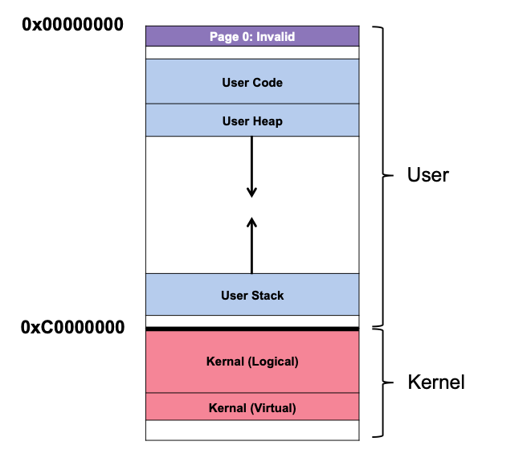
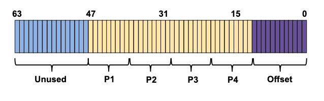

# Virtual Memory for Linux
Linux is a widely used operating system that can run on systems as small and low-powered as phones all the way up to the most scalable multicore processors seen in modern data centers. As a result, its virtualization technology must be adaptable enough to work in all of these scenarios.  
Linux是一种广泛使用的操作系统，可以在手机等小型低功耗系统上运行，也可以在现代数据中心中看到的最大可扩展多核处理器上运行。因此，它的虚拟化技术必须足够灵活，以便在所有这些场景中都能正常工作。  

We’ll now look at some of the more intriguing features of Linux VM. Real engineers solving real problems in production drove Linux development, resulting in a fully functional, feature-rich virtual memory system.  
我们现在将看一些Linux VM的更有趣的特性。实际工程师在生产中解决实际问题推动了Linux的发展，从而产生了一个功能齐全、功能丰富的虚拟内存系统。  

We won’t be able to cover every feature of Linux VM, but we’ll focus on the most significant ones, especially where it goes beyond VAX/VMS, as well as similarities between Linux and earlier systems.  
我们无法涵盖Linux VM的每个特性，但我们将重点介绍最重要的特性，特别是在Linux超越VAX / VMS的地方，以及Linux和早期系统之间的相似之处。  
This section focuses on Linux for Intel x86. While Linux may run on a variety of processor architectures, x86 is the most common and important deployment, and hence our focus.  
本节主要介绍Intel x86的Linux。虽然Linux可以在各种处理器架构上运行，但x86是最常见和最重要的部署，因此我们的重点。  

# The Linux Address Space
A Linux virtual address space is composed of a user portion (containing user program code, stack, heap, and other components) and a kernel portion (where kernel code, stacks, heap, and other parts reside). The user portion of the presently operating address space changes when a context switch occurs, while the kernel portion remains constant. A program in user mode cannot access kernel virtual pages; it must trap into the kernel and switch to privileged mode.  
Linux虚拟地址空间由用户部分（包含用户程序代码、堆栈、堆和其他组件）和内核部分（内核代码、堆栈、堆和其他部分所在位置）组成。当前正在运行的地址空间的用户部分在发生上下文切换时会发生变化，而内核部分保持不变。用户模式下的程序无法访问内核虚拟页面；它必须陷入内核并切换到特权模式。  

In traditional 32-bit Linux (with a 32-bit virtual address space), the user/kernel split occurs at 0xC0000000, or three-quarters of the way across the address space. These are the user virtual addresses, while the kernel virtual addresses (0xC0000000 through 0xFFFFFFFF) are in the user virtual address space. (64-bit Linux also splits, although at various spots.)  
在传统的32位Linux（具有32位虚拟地址空间）中，用户/内核分割发生在0xC0000000处，即地址空间的三分之二处。这些是用户虚拟地址，而内核虚拟地址（0xC0000000至0xFFFFFFFF）位于用户虚拟地址空间中。（64位Linux也会分割，尽管在各个位置。）  



Linux has two types of kernel virtual addresses:  
Linux有两种类型的内核虚拟地址：  

- kernel logical addresses - This is the kernel’s usual virtual address space. To get more of it the kernel code simply calls kmalloc. Page tables, per-process kernel stacks, and other data structures sit here. Kernel logical memory cannot be switched to disk like other system memory.  
  内核逻辑地址 - 这是内核的通常虚拟地址空间。要获得更多的内核代码只需调用kmalloc。页表、每个进程的内核堆栈和其他数据结构就在这里。内核逻辑内存不能像其他系统内存一样切换到磁盘。  
The link between kernel logical addresses and physical memory is fascinating. There is a direct mapping between kernel logical addresses and the first physical memory segment. Thus, 0xC0000000 corresponds to 0x00000000, 0xC0000FFF to 0x00000FFF, and so on. This has two implications. The first is because translating between kernel logical and physical addresses is simple, therefore these addresses are generally considered as physical. Additionally, a chunk of memory that is contiguous in logical address space is contiguous in physical memory. Because the kernel’s address space is contiguous, this memory can be used for activities that require contiguous physical memory, like I/O transfers to and from devices via directory memory access (DMA).  
    内核逻辑地址与物理内存之间的联系非常有趣。内核逻辑地址与第一物理内存段之间存在直接映射。因此，0xC0000000对应于0x00000000，0xC0000FFF对应于0x00000FFF，依此类推。这有两个含义。第一个是因为内核逻辑地址和物理地址之间的转换很简单，因此这些地址通常被认为是物理地址。此外，逻辑地址空间中连续的内存块在物理内存中也是连续的。由于内核的地址空间是连续的，因此可以将此内存用于需要连续物理内存的活动，例如通过目录内存访问（DMA）设备进行I / O传输。  
- kernel virtual addresses - To obtain this memory, the kernel uses vmalloc, which delivers a pointer to a nearly continuous region of the necessary size. Unlike kernel logical memory, kernel virtual memory is frequently not contiguous (and is thus not suitable for DMA). As a result, it is utilized for huge buffers where finding a continuous large portion of physical memory is difficult.  
    内核虚拟地址 - 要获得此内存，内核使用vmalloc，它将指向所需大小的几乎连续区域的指针提供给内核。与内核逻辑内存不同，内核虚拟内存通常不是连续的（因此不适合DMA）。因此，它用于巨大的缓冲区，其中寻找连续的大部分物理内存是困难的。  
In 32-bit Linux, virtual addresses allow the kernel to address memory larger than 1 GB. In the past this was not an issue but as technology advanced, it became necessary to allow the kernel to consume more memory. Kernel virtual addresses and their loose link to physical memory allow this. With 64-bit Linux, the requirement for this is less essential, as the kernel is not limited to the last 1 GB of virtual address space.  
    在32位Linux中，虚拟地址允许内核寻址大于1 GB的内存。过去这并不是问题，但随着技术的发展，需要允许内核消耗更多的内存。内核虚拟地址及其与物理内存的松散联系使这成为可能。在64位Linux中，这个需求不那么重要，因为内核不限于虚拟地址空间的最后1 GB。  

# Question

Use your knowledge of the address space to indicate what portion of the address space each address resides in (assuming 32-bit Linux system).  
使用您对地址空间的了解来指示每个地址所在的地址空间部分（假设32位Linux系统）。  

| Address | Address Space |
| :--- | :--- |
| 0x00000000 | Invalid |
| 0xB0000000 | User Program |
| 0xD0000000 | Kernel |

The first address space (0x00000000) is left empty or invalid. Spaces from there until 0xC0000000 are for programs. Spaces starting at 0xC0000000 and after are reserved for the kernel.  
第一个地址空间（0x00000000）被留空或无效。从那里到0xC0000000的空间用于程序。从0xC0000000开始的空间被内核保留。  

# Page Table Structure
The type of page-table structure given by x86 impacts what Linux can and cannot accomplish. The OS sets up mappings in memory, points to a privileged register at the start of the page directory, and the hardware handles the rest. The OS is engaged in process creation, deletion, and context switching, ensuring that the hardware MMU is using the correct page table for translations.  
x86给出的页面表结构类型决定了Linux可以做什么，不能做什么。操作系统在内存中设置映射，将指向页面目录开始处的特权寄存器，并由硬件处理其余部分。操作系统参与进程创建，删除和上下文切换，确保硬件MMU使用正确的页面表进行转换。  

The major shift in recent years is the switch from 32-bit to 64-bit x86. A 32-bit address space has been present for a long time, and as technology improved, it became a genuine constraint for applications. With current computers containing many GB of memory, 32 bits was no longer adequate to refer to each of them.  
近年来，从32位到64位x86的主要转变。32位地址空间已经存在很长时间，随着技术的改进，它成为应用程序的真正约束。随着当前计算机包含多GB的内存，32位不再足以引用每个内存。  

Moving to a 64-bit address changes the page table structure in x86. The modern 64-bit systems employ a four-level page table since x86 has multiple levels. However, only the bottom 48 bits of the virtual address space are being used.  
转向64位地址会改变x86中的页面表结构。现代64位系统采用四级页面表，因为x86具有多个级别。但是，只有虚拟地址空间的最低48位被使用。  

A virtual address looks like this:


The top 16 bits of a virtual address are unused (and therefore not translated), the bottom 12 bits (because of the 4-KB page size) are utilized as the offset (and thus not translated), leaving the middle 36 bits to be translated. The P1 portion of the address indexes into the topmost page directory, and the translation proceeds one level at a time until P4 indexes the required page table entry.  
虚拟地址的顶部16位未使用（因此不进行翻译），底部12位（因为4-KB页面大小）用作偏移量（因此不进行翻译），留下中间36位进行翻译。地址的P1部分索引到最高级页面目录，并且翻译一次进行一级，直到P4索引所需的页面表条目。  

Enabling more of this vast address space as system memory grows leads to five-level and eventually six-level page-table tree topologies.  
随着系统内存的增长，启用这个广阔地址空间的更多部分会导致五级和最终六级页面表树拓扑结构。  

## Question
Linux uses a multi-level page table.
Linux使用多级页面表。
- [Y] True
- [ ] False
The reason for P1…P4 in the virtual address is that there are 4 levels of the page table, instead of 1 linear table.  
虚拟地址中的P1…P4的原因是页面表有4个级别，而不是1个线性表。

# Page Management
## Large Page Support
Intel x86 supports several page sizes other than the normal 4-KB page. Recent designs support hardware 2-MB and even 1-GB pages. Linux has evolved to allow apps to use these **massive pages** (as they are called in the world of Linux).  
Intel x86支持除了正常的4-KB页面之外的几种页面大小。最近的设计支持硬件2-MB甚至1-GB页面。Linux已经发展到允许应用程序使用这些**巨大页面**（在Linux世界中称为这些页面）。  

Using large pages has many advantages. As observed in VAX/VMS, larger pages require fewer mappings in the page table. Huge pages aren’t caused by fewer page-table entries, but by better TLB behavior and concomitant performance advantages.  
使用大页面有很多优点。正如在VAX / VMS中观察到的那样，较大的页面需要较少的页面表中的映射。巨大的页面不是由于页面表条目较少，而是由于TLB的更好行为和随之而来的性能优势。  

The TLB quickly fills up when a process actively uses a lot of memory. Without causing TLB misses, only a small amount of total memory can be accessed. The result is a considerable performance hit for modern “big memory” workloads running on machines with many GBs of memory.  
当进程积极使用大量内存时，TLB很快就会填满。如果不导致TLB丢失，只能访问很小的总内存量。这导致了在具有多GB内存的机器上运行的现代“大内存”工作负载的显着性能下降。  

**Huge pages allow a process to access enormous amounts of memory while requiring less TLB slots**, which is the main benefit. Huge pages also have a shorter TLB-miss path, meaning that when a TLB miss occurs, it is serviced faster. Allocation can also be quite quick (in some cases), a minor but essential benefit.  
**巨大页面允许进程访问巨大的内存量，同时需要较少的TLB插槽**，这是主要的好处。巨大页面的TLB丢失路径也更短，这意味着当发生TLB丢失时，它会更快地得到服务。分配也可能非常快（在某些情况下），这是一个次要但重要的好处。

The progressive nature of Linux support for big pages is intriguing. They initially thought it was only relevant to a few applications, including huge databases with high performance requirements. So it was decided to let apps directly request big page memory allocations (through `mmap()` or `shmget()`). All but a few mandatory apps would need to be altered, but the discomfort would be worth it for those that require it.  
Linux对大页面的支持是令人兴奋的。他们最初认为它只与少数应用程序相关，包括具有高性能要求的巨大数据库。因此，决定让应用程序直接请求大页面内存分配（通过`mmap()`或`shmget()`）。除了少数强制性应用程序之外，其他应用程序都需要更改，但对于需要它的应用程序来说，不舒服是值得的。  

Recently, as more programs require better TLB behavior, Linux engineers implemented transparent big page support. When enabled, the operating system automatically searches for large page allocations (typically 2 MB, but on some systems 1 GB) without modifying applications.  
最近，随着越来越多的程序需要更好的TLB行为，Linux工程师实现了透明大页面支持。启用后，操作系统会自动搜索大页面分配（通常为2 MB，但在某些系统上为1 GB），而不修改应用程序。  

Huge pages come at a price:  
巨大页面有一个价格：  
- internal fragmentation, i.e. a vast but underused page  
    内部碎片，即巨大但未充分利用的页面  
- huge yet rarely utilized pages can clog up memory  
    巨大但很少使用的页面会阻塞内存  
- increases the amount of I/O a system does during swaps  
    增加系统在交换期间执行的 I/O 量  

## Page Cache
Aggressive caching schemes maintain popular data items in memory to reduce access costs to persistent storage.  
积极的缓存方案将热门数据项保存在内存中，以减少对持久存储的访问成本。  

The Linux page cache keeps pages in memory from three sources:  
Linux页面缓存从三个源保留内存中的页面：  
- memory-mapped files  
    内存映射文件        
- devices’ file contents and metadata (accessible via `read()` and `write()` calls to the file system)  
    设备的文件内容和元数据（通过对文件系统的`read()`和`write()`调用访问）  
- process heap and stack pages (sometimes called anonymous memory, because there is no named file underneath of it, but rather swap space)  
    进程堆和堆栈页面（有时称为匿名内存，因为它下面没有命名文件，而是交换空间）  

These entities are stored in a page cache hash table for rapid access.  
这些实体存储在页面缓存哈希表中，以便快速访问。  

Entries are clean (read but not updated) or dirty (written) (a.k.a., modified). Cleaning is done via background threads (called pdflush) periodically writing dirty data to the backing store (i.e., to a specific file for file data, or to swap space for anonymous areas). This background action occurs after a period of time or if too many pages are unclean (both configurable parameters).  
条目是干净的（读取但未更新）或脏的（写入）（又称为修改）。通过后台线程（称为pdflush）定期将脏数据写入后备存储（即为文件数据写入特定文件，或为匿名区域写入交换空间）。这种后台操作在一段时间后发生，或者如果有太多页面未清理（两个可配置参数）。  

# Page Replacement Policy
When a system runs out of memory, Linux must pick which pages to delete. To accomplish so, Linux uses **a modified form of 2Q replacement**.  
当系统内存不足时，Linux必须选择要删除哪些页面。为此，Linux使用**2Q替换的修改形式**。  

The concept is simple: regular LRU replacement works but is vulnerable to typical access patterns. For example, if a process regularly reads a large file (almost as large as memory), LRU will remove all other files from memory. Worse, chunks of this file are never re-referenced before being deleted from memory.  
这个概念很简单：常规的LRU替换工作，但容易受到典型的访问模式的影响。例如，如果一个进程经常读取一个很大的文件（几乎和内存一样大），LRU将从内存中删除所有其他文件。更糟糕的是，在从内存中删除之前，这个文件的一些块从未被重新引用。  

It works on Linux by keeping two lists and dividing memory between them. An initial access places a page on one queue (the inactive list); further references promote it to the other queue (the active list). When a replacement is needed, the inactive list is used. This keeps the active list to around two-thirds of the entire page cache size.  
它在Linux上工作，通过保持两个列表并在它们之间分配内存。初始访问将页面放在一个队列（非活动列表）上；进一步的引用将其提升到另一个队列（活动列表）。当需要替换时，将使用非活动列表。这使得活动列表大约为整个页面缓存大小的两分之一。  

This 2Q technique is similar to LRU, but it handles cyclic large-file access by restricting the pages of the cyclic access to the inactive list. No additional useful pages in the active list are flushed because these pages are never re-referenced.  
这种2Q技术类似于LRU，但它通过将循环访问的页面限制在非活动列表中来处理循环大文件访问。活动列表中没有其他有用的页面被刷新，因为这些页面从未被重新引用。  

## Questions
Which of the following does Linux page management track?  
Linux页面管理跟踪以下哪些内容？
- If a page is clean or dirty
- If dirty pages need to be cleaned
- The most actively used pages

Linux tracks a page’s cleanliness, similar to VMS, and bulk writes changes using pdflush, when there are too many dirty pages.  
Linux跟踪页面的干净度，类似于VMS，并且使用pdflush在有太多脏页面时批量写入更改。 

Linux’s page replacement policy tracks which pages are used via the active list.  
Linux的页面替换策略通过活动列表跟踪哪些页面被使用。  

# Security And Buffer Overflows
The modern emphasis on security is perhaps the biggest distinction between modern VM systems (Linux, Solaris, or one of the BSD variations) and old (VAX/VMS). In a world where machines are more interconnected than ever, it’s no wonder that developers have developed a number of protective mechanisms to stop those wily hackers from obtaining control of systems and data.  
现代安全性的重点可能是现代VM系统（Linux，Solaris或BSD变体之一）和旧系统（VAX / VMS）之间最大的区别。在一个机器比以往任何时候都更加互联的世界里，开发人员开发了许多保护机制，以防止那些狡猾的黑客获取系统和数据的控制权，这也难怪。  

Buffer overflow attacks can be used against standard user programs and even the kernel. These attacks aim to uncover a flaw in the target system that allows them to inject arbitrary data into its address space. When a developer estimates (erroneously) that an input would not be too long, he copies it into a buffer, which overflows, overwriting the target’s memory. Code as simple as the following can cause issues:  
缓冲区溢出攻击可以针对标准用户程序甚至内核进行攻击。这些攻击旨在发现目标系统中的缺陷，使它们能够将任意数据注入其地址空间。当开发人员（错误地）估计输入不会太长时，他将其复制到缓冲区中，该缓冲区溢出，覆盖目标的内存。如下所示的代码就可以引起问题：  

```c
int some_function(char *input) {
  char dest_buffer[100];
  strcpy(dest_buffer, input); // oops, unbounded copy!
}
```
In many circumstances, an unintentionally faulty input to a user program or even the OS will cause it to crash, but not worse. An attacker can use the input that overflows the buffer to inject their own code into the targeted system, thus taking control and doing their bidding. Assailants can conduct arbitrary computations or even rent out cycles on the compromised system if they successfully assault a network-connected user software (i.e., user code gaining kernel access rights). Obviously, these are all bad things.  
在许多情况下，用户程序甚至操作系统的意外错误输入都会导致它崩溃，但不会更糟。攻击者可以使用溢出缓冲区的输入将自己的代码注入到目标系统中，从而获得控制权并执行他们的命令。攻击者可以进行任意计算，甚至可以在受损系统上租用计算机周期（即用户代码获得内核访问权限）。显然，这些都是坏事。  

The first line of defense against buffer overflow is to deny access to particular regions of address space (e.g., within the stack). In AMD’s x86 (Intel now includes a comparable XD bit), the NX bit inhibits execution of any page that has this bit set in its corresponding page table entry. The solution prevents an attacker from injecting code onto the target’s stack, hence mitigating the problem.  
缓冲区溢出的第一道防线是拒绝对地址空间的特定区域（例如堆栈）的访问。在AMD的x86（Intel现在包含一个类似的XD位），NX位禁止执行任何具有此位设置在其相应的页面表条目中的页面。该解决方案防止攻击者将代码注入到目标的堆栈中，从而缓解了问题。  

However, intelligent attackers are clever, and even when injected code cannot be added intentionally, malicious code can run arbitrary code sequences. It’s called return-oriented programming (ROP) and it’s great. ROP observes that any program’s address space contains many pieces of code (gadgets), especially C programs that link to the large C library. An attacker can modify the stack so that the current function’s return address points to a malicious instruction (or series of instructions), followed by a return instruction. An attacker can execute arbitrary code by stringing together many gadgets (ensuring each return goes to the next gadget). Amazing!  
然而，聪明的攻击者很聪明，即使注入的代码不能被有意添加，恶意代码也可以运行任意代码序列。这被称为面向返回的编程（ROP），它很棒。ROP观察到任何程序的地址空间都包含许多代码片段（小工具），特别是链接到大型C库的C程序。攻击者可以修改堆栈，使当前函数的返回地址指向恶意指令（或一系列指令），后跟返回指令。攻击者可以通过将许多小工具（确保每个返回都转到下一个小工具）连接在一起来执行任意代码。惊人！  

To counter ROP (and its older counterpart, the return-to-libc attack), Linux (and other systems) use address space layout randomization (ASLR). The OS randomly places code, stack, and heap within the virtual address space, making it difficult to create the sophisticated code sequences required to implement this type of attacks. To acquire control of the running application, most attacks against user programs induce crashes.  
为了抵制ROP（和它的旧对手，返回到libc攻击），Linux（和其他系统）使用地址空间布局随机化（ASLR）。操作系统在虚拟地址空间中随机放置代码，堆栈和堆，使得创建实现此类攻击所需的复杂代码序列变得困难。要获得运行应用程序的控制权，大多数攻击用户程序都会导致崩溃。  

In practice, you can see this randomness quite simply. Here’s some code to show it on a current Linux system:  
在实践中，你可以很简单地看到这种随机性。这是一些代码来显示它在当前的Linux系统上：  

```c
int main(int argc, char *argv[]) {
  int stack = 0;
  printf("%p\n", &stack);
  return 0;
}
```

This code just prints the virtual address of a stack variable. Previously, this number was constant in non-ASLR systems. Like the value varies with each run:  
这段代码只是打印堆栈变量的虚拟地址。以前，这个数字在非ASLR系统中是恒定的。像这个值每次运行都会变化：  

```bash
prompt> ./random
0x7ffd3e55d2b4
prompt> ./random
0x7ffe1033b8f4
prompt> ./random
0x7ffe45522e94
```

ASLR is so helpful for user-level programs that it’s been built into the kernel as kernel address space layout randomization (KASLR).  
ASLR对用户级程序非常有帮助，以至于它已经内置到内核中作为内核地址空间布局随机化（KASLR）。  

## Question 

Which of the following ways can you protect your system?  
- Randomize virtual addresses in physical memory
- Deny access to particular regions of address space 

Writing perfect code is not achievable. Instead, we build safe guards into the system such as address space layout randomization and denying access to particular regions of address space  
编写完美的代码是不可实现的。相反，我们将安全保护措施构建到系统中，例如地址空间布局随机化和拒绝访问地址空间的特定区域  

# Summary
In spite of Linux’s vastness and complexity, it inherited many wonderful concepts from the past. By eliminating needless copying, Linux, for example, uses lazy copy-on-write copying of pages when calling `fork()`. This is because Linux uses a background swap daemon (swapd) to swap pages to disk.  
尽管Linux的广阔和复杂，但它继承了许多来自过去的美好概念。例如，通过消除不必要的复制，Linux在调用`fork()`时使用延迟写时复制页面。这是因为Linux使用后台交换守护进程（swapd）将页面交换到磁盘。  