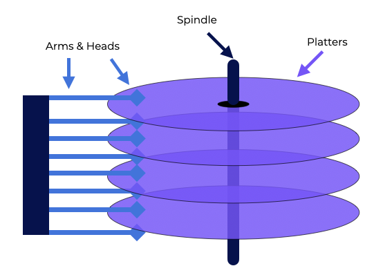
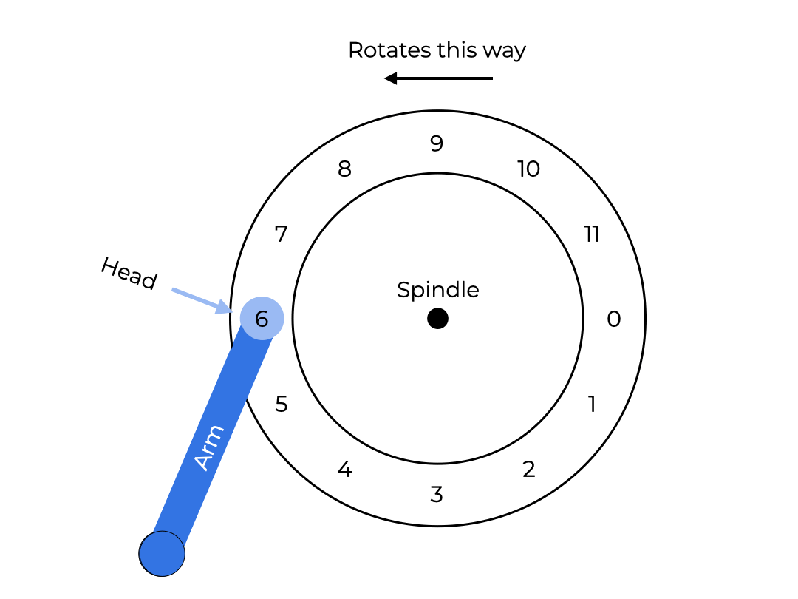
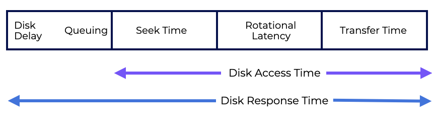

# Overview
We’ve explored what an I/O is and how an OS interacts with it. Now let’s look at the hard disk drive and how to store and access data on one.  
我们已经探索了什么是I/O，以及操作系统如何与它交互。现在让我们看看硬盘驱动器以及如何在其中存储和访问数据。  
This section should help us the following questions:  
本节应该能帮助我们回答以下问题：  
- How do modern hard-disk drives store data?
- 现代硬盘驱动器如何存储数据？
- How is the information organized and accessed?
- 信息如何组织和访问？
- How does disk scheduling improve performance?
- 磁盘调度如何提高性能？

# Introduction
**Hard disk drives** are persistent storage devices for computers. It’s important to understand the inner workings of a disk before creating the file system software that controls it.  
**硬盘驱动器**是计算机的持久存储设备。在创建控制它的文件系统软件之前，了解磁盘的内部工作原理很重要。  
**Interface**  
A hard drive should have the ability to both **read** and **write**.  
硬盘应该具有**读取**和**写入**的能力。
**Internals**
Internally, a hard drive has:
内部，硬盘有：  
- A **controller**
- 一个**控制器**
    - This exports the **interface**
    - 这导出了**接口**
    - It also controls the operation of each request given to the device
    - 它还控制了给设备的每个请求的操作
- **Mechanics**
- **机械**
    - Disk platters
    - 磁盘盘片
    - Arm
    - 磁臂
    - Head, etc.
    - 磁头等。

## Persistent
**Persistent** storage means that when we turn the power to the device off and back on, the data will still be there.  
持久存储意味着当我们将设备的电源关闭并重新打开时，数据仍然存在。

# The Interface
The hard disk **interface** connects the hard disk to the host computer and transfers data between the hard disk cache and the host memory. The quality of the hard disk interface has a direct impact on the program’s speed and system performance.  
硬盘**接口**将硬盘连接到主机计算机，并在硬盘缓存和主机内存之间传输数据。硬盘接口的质量直接影响程序的速度和系统性能。  

A hard disk drive’s interface includes several **sectors (  512**-byte blocks) making up the drive. Each one can be read or written to. It’s like an array of **n** sectors, with an **address space** ranging from **0** to **n−1**.  
硬盘驱动器的接口包括几个**扇区（512字节块）**组成驱动器。每个扇区都可以读取或写入。它就像一个**n**扇区的数组，**地址空间**范围从**0**到**n-1**。  

There are five different types of hard disk interfaces:  
有五种不同类型的硬盘接口：  
- **IDE**
    - Hard drives with an IDE interface are mostly used in consumer electronics and, to a lesser extent, in servers.  
    - IDE接口的硬盘主要用于消费电子产品，而在服务器上的使用程度较低。  
- **SATA**
    - SATA is mostly used in the home market, with SATA, SATA II, and SATA III being the most common.
    - SATA主要用于家庭市场，SATA，SATA II和SATA III是最常见的。
- **SCSI**
    - Servers are the primary users of hard drives using SCSI interfaces. 
    - 服务器是使用SCSI接口的硬盘的主要用户。
- **SAS**
    - Serial Attached SCSI is suitable for servers or workstations that do a lot of processing work. 
    - 串行附加SCSI适用于大量处理工作的服务器或工作站。
- **Fiber Channel**
    - Fiber Channel is only used in sophisticated servers thanks to its high cost. 
    - 光纤通道仅在复杂的服务器中使用，这要归功于其高成本。

A variety of specialized interface types exist under the broad category of **IDE** and **SCSI**. They have varied transmission rates and technical requirements.  
在**IDE**和**SCSI**的广泛类别下存在各种专用接口类型。它们具有各种传输速率和技术要求。

## Questions
The hard disk interface is a device that connects a hard drive to a computer and transports data between the hard disk cache and host memory.  
硬盘接口是一种设备，它将硬盘连接到计算机，并在硬盘缓存和主机内存之间传输数据。  
It consists of multiple 512-byte sectors that make up the drive, having addresses spaces ranging from 0 to n-1.  
它由多个512字节的扇区组成，这些扇区组成驱动器，具有从0到n-1的地址空间。 

# Basic Geometry
Let’s look at what makes up a modern disk drive.  
让我们看看现代磁盘驱动器由什么组成。  
We have a **platter**, a hard circular surface where data is permanently stored by causing magnetic variations. A disk can have one or more platters, each with two sides, called **surfaces**.  
我们有一个**盘片**，一个硬圆面，通过磁变来永久存储数据。磁盘可以有一个或多个盘片，每个盘片都有两个面，称为**表面**。  

These platters are made of a hard material (like aluminum) and covered with a thin magnetic coating that lets the drive store bits even when it is turned off.  
这些盘片是由硬材料（如铝）制成的，并覆盖了一层薄薄的磁性涂层，即使在关闭时也可以存储位。  

The platters are connected around a **spindle** coupled to a motor that spins them at a constant speed measured in **rotations per minute (RPM)**. Normal current values range from **7,200** to **15,000** RPM. Many times, we’ll want to know the time it takes for it to complete a single spin.  
盘片围绕着一个**轴承**连接到一个电机上，该电机以**每分钟旋转（RPM）**的常量速度旋转它们。正常的电流值范围从**7,200**到**15,000**RPM。很多时候，我们想知道它完成一次旋转所需的时间。  

Each surface has data encoded in nested circles called **tracks**. Thousands of tracks are packed together on one surface. **Clusters** are subdivided portions of these tracks. Two or more **sectors** make up a cluster. A cylinder is a vertical collection of one set of tracks stacked on top of each other.  
每个表面都有数据编码在嵌套的圆圈中，称为**轨道**。数千条轨道被打包在一个表面上。**簇**是这些轨道的细分部分。两个或多个**扇区**组成一个簇。一个圆柱体是一组垂直的轨道的集合，它们叠在一起。  

The **disk head**, one per surface of the drive, does the reading and writing by sensing (i.e., read) or creating a change in (i.e., write) the magnetic patterns on the disk. One disk **arm** is attached to the disk head that moves across the surface to put it over the track we want.  
**磁盘头**，每个驱动器的表面各有一个，通过感知（即读取）或创建磁盘上的磁性模式的变化（即写入）来进行读写。一个磁盘**臂**连接到磁盘头，它可以在表面上移动，以将其放在我们想要的轨道上。  

## **Read/Write operations generally have 3 parts**:  
## **读/写操作通常有3个部分**：  
- **Seek** - positioning the read/write head over desired track  
- **寻道** - 将读/写头定位到所需的轨道上
- **Rotation (Rotational Delay)** - Waiting for the target sector to rotate under the head  
- **旋转（旋转延迟）** - 等待目标扇区旋转到头下方
- **Transfer** - performing the read/write  
- **传输** - 执行读/写

A well-designed drive will spend most of its time transferring.  
一个设计良好的驱动器将花费大部分时间进行传输。  

## Questions 
- Sector: A track’s subdivision, usually 512 bytes in size.  
- 扇区：轨道的细分，通常为512字节。
- Track: An area on a disk where data is stored in concentric circles
- 轨道：磁盘上存储数据的区域，数据以同心圆的形式存储
- Cylinder: A collection of tracks stacked vertically
- 圆柱体：垂直堆叠的轨道集合
- Cluster: It is made up of one or more sectors and is the smallest storage unit for a file.
- 簇：由一个或多个扇区组成，是文件的最小存储单元。

# A Simple Disk Drive
Say we have a single-track disk. This track has **12** sectors, each is **512** bytes in size and is addressed by numbers **0** through **11**. The single platter here spins around a spindle driven by a motor.  
假设我们有一个单轨磁盘。这条轨道有**12**个扇区，每个扇区的大小为**512**字节，并且由**0**到**11**的数字来寻址。这里的单个盘片围绕着一个由电机驱动的轴承旋转。  
The disk head is above sector **6** in the graphic, and the surface is spinning counter-clockwise.  
磁盘头位于图中的扇区**6**上方，表面向逆时针旋转。  

## **Single-track Latency: The Rotational Delay**
Imagine we get a request to read block **0** on our one-track disk.  
假设我们收到了一个请求，要读取我们单轨磁盘上的块**0**。

Our disk has to wait for this sector to rotate under the disk head. This wait is called **rotational delay**. This partially depends on how fast the disk platters are spinning.  
我们的磁盘必须等待这个扇区旋转到磁盘头下方。这种等待被称为**旋转延迟**。这部分取决于磁盘盘片的旋转速度。  

If the rotational delay is **R** to spin around the entire disk once, the disk has to wait about **R/2** for **0** to come under the read/write head (if we start at **6**). So, a worst-case request on this single track would be to sector **5**, creating a near-full rotational delay.  
如果旋转延迟为**R**，则磁盘必须等待**R/2**，以便**0**旋转到读/写头下方（如果我们从**6**开始）。因此，这个单轨的最坏情况请求是扇区**5**，这将创建一个近乎完整的旋转延迟。  

## **Various Tracks: Seek Time**
Our disk only has one track, which is unrealistic. Modern disks have millions. Let’s look at a more realistic disk surface with three tracks.  
我们的磁盘只有一条轨道，这是不现实的。现代磁盘有数百万条轨道。让我们看看一个具有三条轨道的更现实的磁盘表面。  
- The head is currently over the innermost track (sectors **24 – 35**).
- 磁头当前位于最内侧的轨道（扇区**24-35**）。
- The next track over has sectors (**12 – 23**), and
- 下一条轨道有扇区（**12-23**），
- The outermost track contains the initial sectors (**0** through **11** ).
- 最外侧的轨道包含初始扇区（**0**到**11**）。

To accesses a particular sector, like sector **11**, the drive has to first **seek** the disk arm to the right track. Along with **rotations**, **seeks** are the most expensive disk operations.  
要访问特定的扇区，比如扇区**11**，驱动器必须首先将磁盘臂**寻道**到正确的轨道。除了**旋转**，**寻道**是最昂贵的磁盘操作。  

The disk arm positioned the head over the correct track after the seek. The arm was moved to the desired track, and the platter was rotated by **3** sectors. Sector **11** is transferred under the disk head with only a little **rotational delay**.  
磁盘臂在寻道后将磁头定位到正确的轨道。臂将移动到所需的轨道，并将盘片旋转**3**个扇区。扇区**11**仅需很少的**旋转延迟**即可传输到磁盘头下方。  

Data is read from or written to the surface when sector **11** passes under the disk head.  
当扇区**11**通过磁盘头时，数据将从表面读取或写入。  

## Questions
- Rotational Delay - The wait for the target sector to rotate under the head
- 旋转延迟 - 等待目标扇区旋转到磁头下方
- Transfer - The performing of the actual read/write operation
- 传输 - 执行实际的读/写操作
- Seek - The drive positions the read/write head over desired track
- 寻道 - 驱动器将读/写头定位到所需的轨道

# Time for I/O: Doing the Math
Now that we have a model of the disk, we can analyze its performance. We can represent **Disk Access Time** as:  
现在我们有了一个磁盘的模型，我们可以分析它的性能。我们可以将**磁盘访问时间**表示为：  
**TI/O** =  **Tseek** + **Trotational delay** + **Ttransfer**

**Disk Response Time** is the average time a request spends waiting for an I/O operation. The average response time is the average response time across all requests.  
**磁盘响应时间**是请求等待I/O操作的平均时间。平均响应时间是所有请求的平均响应时间。

The **rate of I/O (RI/O)**, which is often used to compare drives, is computed from the formula below:  
**I/O速率（RI/O）**，通常用于比较驱动器，是从下面的公式计算出来的：  
**RI/O** = **SizeTransfer** / **TI/O**  
Two markets are important when designing disk drives.  
设计磁盘驱动器时有两个市场很重要。
- A **high performance** drive is designed to spin quickly, have low seek times, and transfer data quickly. 
- 高性能驱动器旨在快速旋转，寻道时间短，传输数据快。
- The **capacity** market is where the cost per byte is important. The drives are slower but pack as many bits as possible into the available space. 
- 容量市场是成本每字节的重要性。驱动器速度较慢，但尽可能多地将比特打包到可用空间中。

Let’s compare the performance of 2 hard drives. Their specifications are listed below.  
让我们比较两个硬盘的性能。他们的规格如下所示。  
|Spec. | Drive A | Drive B |
|:--|:--:|:--|
|Capacity | 1T | 36.7 GB |
|RPM|5400 RPM|7200 RPM|
|Avg. Seek Time| 13 ms| 6.3 ms|
|Max Transfer|140 MB/s| 160 MB/s|
|Platters|1|4|
|Cache|128 MB| 4 MB|
|Connects via|SATA|SCSI|

There are two different types of workloads to consider.  
有两种不同类型的工作负载要考虑。  
- **Random workloads** read small (**4KB**) blocks of data from the disk at **random**. Database management systems, in particular, use random workloads.  
- **随机工作负载**从磁盘中以**随机**的方式读取小的（**4KB**）数据块。特别是数据库管理系统使用随机工作负载。  
- **Sequential workloads** read several sectors from the disk in a linear fashion. Sequential access patterns are pretty common.  
- **顺序工作负载**以线性方式从磁盘中读取几个扇区。顺序访问模式非常常见。  

Using these values, we can estimate how well the drives will perform under our two workloads.  
使用这些值，我们可以估计驱动器在这两种工作负载下的性能如何。

## Random Workload
Say we have a **4KB** read request to a random disk location, if we calculate how long each read would take on each drive, we’d get:  
假设我们有一个**4KB**的随机磁盘位置读取请求，如果我们计算每个驱动器上每个读取操作的持续时间，我们会得到：  
|Measurements | Drive A | Drive B |
|:--|:--:|:--|
|Tseek| 13 ms| 6.3 ms|
|Trotation| 5.5 ms| 4.15 ms|
|Ttransfer| 28.5microsecs| 25microsecs|

So we can calculate TI/O for each drive:  
因此，我们可以计算每个驱动器的TI/O：
- TAI/O = 13 ms + 5.5 ms + 28.5 microsecs $\approx$ 18.5 ms
- TBI/O = 6.3 ms + 4.15 ms + 25 microsecs $\approx$ 10.45 ms

Here, microseconds barely make a difference in our time because they’re so tiny.
Considering our, **4KB** request, calculating   **RI/O**  for each drive would go as follows:  
这里，微秒几乎不会对我们的时间产生影响，因为它们太小了。考虑我们的**4KB**请求，计算每个驱动器的**RI/O**如下所示：  
- RAI/O = 4KB / 18.5 ms = 0.004 MB/18.5 sec $\approx$ 0.22 MB/sec
- RBI/O = 4KB / 10.45 ms = 0.004 MB/10.45 sec $\approx$ 0.38 MB/sec

## Sequential Workload
In this example, we can count on there being one seek and rotation before a long transfer. Let’s say our transfer size for this is **500MB**  
在这个例子中，我们可以计算出在一个长时间的传输之前有一个寻道和旋转。让我们假设这个传输大小是**500MB**  

TI/O for each drive would be: 
每个驱动器的TI/O是：
- TAI/O = 13 ms + 5.5 ms + 500 MB/140 MB/sec $\approx$ 3143.5 ms
- TBI/O = 6.3 ms + 4.15 ms + 500 MB/160 MB/sec $\approx$ 3135.45 ms

And the **RI/O** for each drive would be:  
每个驱动器的**RI/O**是：
- RAI/O = 500 MB / 3143.5 ms = 500 MB/3.1435 sec $\approx$ 159.05 MB/sec
- RBI/O = 500 MB / 3135.45 ms = 500 MB/3.13545 sec $\approx$ 159.46 MB/sec

So our two drives perform as summarized below:  
因此，我们的两个驱动器的性能如下所示：  
|Workload | Drive A | Drive B |
|:--|:--:|:--|
|Random| 0.22 MB/sec| 0.38 MB/sec|
|Sequential| 159.05 MB/sec| 159.46 MB/sec|

We can see a big difference in performance between the two workloads for both drives. Customers are often willing to spend on a high-performance drive while trying to get as much capacity as possible for as little money as possible.  
我们可以看到两个工作负载之间的两个驱动器的性能差异很大。客户通常愿意花费高性能驱动器的成本，同时尽可能地获得尽可能多的容量，花费尽可能少的钱。  

## Questions
Given the following measurements, calculate the RI/O in **MB/sec**  for a **10KB**  request.  
给出以下测量值，计算**10KB**请求的RI/O，单位为**MB/sec**。  
Note: 1 MB = 1000 KB; 1 sec = 1000 ms  
|Measurements | Drive |
|:--|:--:|
|Tseek| 8 ms|
|Trotation| 3 ms|
|Ttransfer| 50 microsecs|

RI/O =   
8ms + 3ms + 50 microsec ≈ 11ms  
10 KB/11 ms = 0.01 MB/0.011 sec = 0.91 MB/sec  

# Summary
We’ve covered the basics of how disks operate.  
我们已经介绍了磁盘操作的基础知识。  
- We’ve covered the basic geometry and anatomy of a hard disk drive. 
- 我们已经介绍了硬盘驱动器的基本几何和解剖结构。
- We also discussed key measurements in determining hard disk drive performance.
- 我们还讨论了确定硬盘驱动器性能的关键测量值。

Using the proper I/O scheduling paradigm is important for maximizing efficiency during various types of I/O requests. We will talk about these next.  
使用适当的I/O调度范例对于在各种类型的I/O请求期间最大化效率非常重要。我们将在下一节讨论这些内容。  
