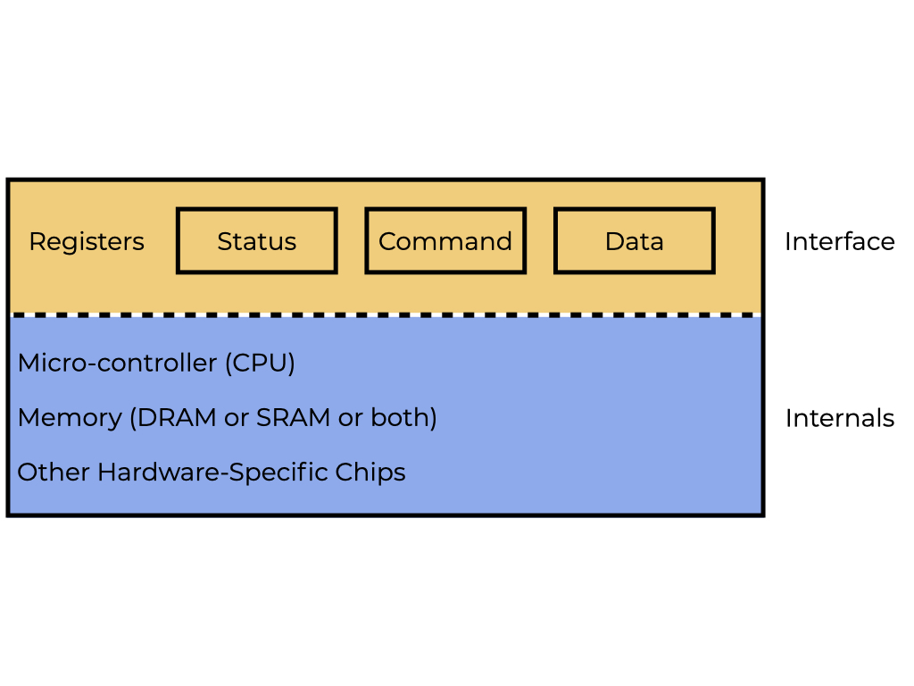
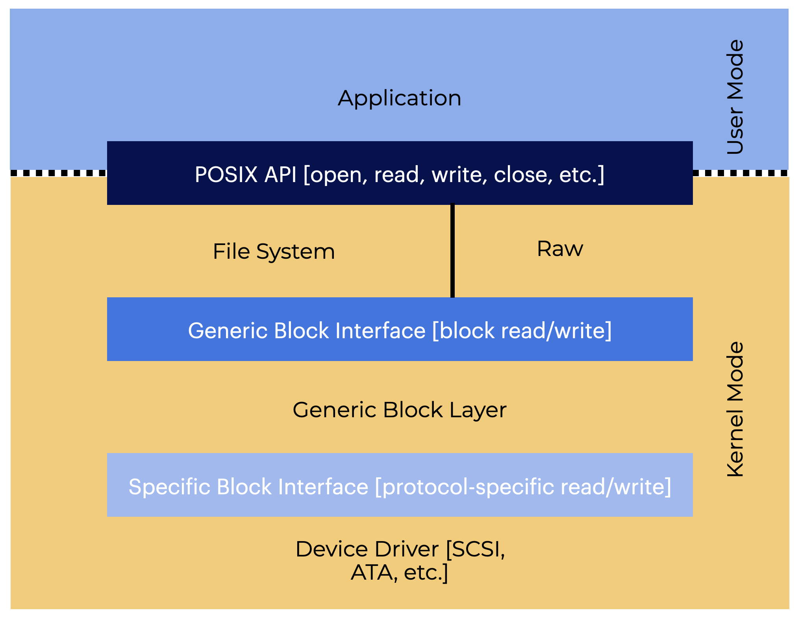

# Overview
Let’s explore how to integrate I/O into a system  
让我们探索如何将I/O集成到系统中
This section should help us answer the following: 
本节应该能帮助我们回答以下问题：
- What is the best way to integrate I/O into a system?
- 如何将I/O集成到系统中？
- What are the basic mechanisms at work?
- 有哪些基本机制在工作？
- What can we do to make them more efficient?
- 我们可以做什么来使它们更有效？

# Introduction
Being able to receive **input** and produce an **output** is an important part of a computer system. **Input/output (I/O)** allows our system to receive information, do something with it, and send us a response in return.   
能够接收**输入**并产生**输出**是计算机系统的重要组成部分。**输入/输出（I / O）**允许我们的系统接收信息，对其进行处理，并返回响应。  

When we say I/O **devices**, we generally mean objects that the CPU handles that are not memory, and are connected to a computer system. There are many types of devices, including but not limited to:  
当我们说I / O **设备**时，我们通常指的是CPU处理的不是内存的对象，并且连接到计算机系统。有很多类型的设备，包括但不限于：  
- SSD
- Hard Drives
- Graphics
- Networking
- Mouse/ Keyboards
- Audio

# System Architecture: The Bus
The CPU is connected to the system’s main memory through a memory bus or connection.  
CPU通过内存总线或连接连接到系统的主内存。  
A **bus** is a system for transferring data between components inside a computer or between computers:  
**总线**是计算机内部组件之间或计算机之间传输数据的系统：  
- Some devices, like graphics and high performance I/O devices are connected to the system using a general I/O bus like a PCI.
- 一些设备，如图形和高性能I/O设备，使用像PCI这样的通用I/O总线连接到系统。
- Peripheral buses like SCSI, SATA, and USB are used to connect slower devices like disks, mice, and keyboards.
- 外围总线，如SCSI，SATA和USB，用于连接像磁盘，鼠标和键盘这样的较慢的设备。


## Why is there a bus hierarchy for I/O?
Because of both **physics** and **cost**. Faster buses have to be shorter, so a high performance memory bus doesn’t have extra space for devices and peripherals.  
由于**物理**和**成本**的原因。更快的总线必须更短，因此高性能内存总线没有设备和外围设备的额外空间。  

Designing multiple high-performance buses are **expensive**, so it’s not something we want to do more of than we have to. Systems designers put high performance parts closer to the CPU and lower performance parts further away. This gives the CPU the ability to accommodate several devices.  
设计多个高性能总线是**昂贵的**，所以我们不希望做的比我们必须做的更多。系统设计人员将高性能部件放在CPU附近，将性能较低的部件放在更远的地方。这使得CPU能够容纳多个设备。  

### What is a peripheral?
A peripheral is an internal or external device that connects directly to a computer or other digital device but doesn't contribute to the computer's primary function. It helps end users access and use the functionalities of a computer.  
外围设备是直接连接到计算机或其他数字设备的内部或外部设备，但不会对计算机的主要功能产生影响。它帮助最终用户访问和使用计算机的功能。  

## Questions
Which of the following is NOT true of I/O bus hierarchy?  
下列哪项关于I / O总线层次结构的说法是错误的？
- Peripheral buses are longer and slower than general I/O busses
- High-performance memory buses have to be shorter.
- Peripheral buses are shorter and located close to the CPU. **False**
- High-performance buses are expensive to design.

“Peripheral buses are shorter and located close to the CPU.”  
“外围总线较短，位于CPU附近。”  
This is not true. Peripheral busses are longer and located farther away from the CPU.  
这是不正确的。外围总线较长，距离CPU较远。


# A Canonical Device
Let’s look at an imaginary **canonical device** to help us understand some of the machinery we need for efficient device interaction.  
让我们看看一个虚构的**标准设备**，以帮助我们理解高效设备交互所需的一些机制。  



## A device includes two essential parts:
- The hardware interface it provides to the rest of the system.  
- 它提供给系统的硬件接口。
    - Hardware, like software, has to use some kind of **interface** that lets the system software control its operation.  
    - 硬件，像软件一样，必须使用某种**接口**，使系统软件控制其操作。
    - All devices have a specific interface and protocol for normal interactions.
    - 所有设备都有用于正常交互的特定接口和协议。
- The **internal structure** of the device.
- 设备的**内部结构**。
    - This element of the device is implementation-specific, and it’s in charge of putting the device’s abstraction to work for the system. Like having a mini-computer dedicated to one task.  
    - 设备的这个元素是特定于实现的，它负责为系统工作。就像有一个专门用于一个任务的迷你计算机。  

The most simple devices depend on one or two hardware chips to do their jobs. More complex devices depend on a CPU, some general-purpose memory, and other various device-specific chips.  
最简单的设备依赖一个或两个硬件芯片来完成它们的工作。更复杂的设备依赖于CPU，一些通用内存和其他各种特定于设备的芯片。  

## Questions
There are two essential parts of a canonical device. Which of the following belong within the interface of the canonical device?  
标准设备有两个基本部分。下列哪些属于标准设备的接口？
Select your response and click the button below to submit.
There may be multiple correct responses!
- [F] Memory
- [T] Status Register
- [T] Command Register
- [F] Hardware-Specific Chips
- [F] Micro-Controller
- [T] Data Register

The interface lets the system software control its operation. The status, command, and data registers belong to a canonical device’s interface.  
接口使系统软件控制其操作。状态，命令和数据寄存器属于标准设备的接口。  

# The Canonical Protocol
This simple interface has three registers:  
这个简单的接口有三个寄存器：  
- **Status Register** - Is read to check the devices current status
- **状态寄存器** - 用于检查设备的当前状态
- **Command Register** - Used to tell the device to do a particular job
- **命令寄存器** - 用于告诉设备执行特定的工作
- **Data Register** - Used to send/receive data to/from the device
- **数据寄存器** - 用于向设备发送/接收数据

The OS can change a devices behavior by reading and writing to these registers. The protocol below shows how the OS and device collaborate to finish a task:  
操作系统可以通过读写这些寄存器来改变设备的行为。下面的协议显示了操作系统和设备如何协作完成任务：  

```c
 While (deviceStatus == busy); // wait until device is free
   // Write some data to DATA register
   // Write some command to COMMAND register
       
       (start device and execute command)
   While (deviceStatus == busy); // wait until device is finished
```

There are 4 parts to how the OS interacts with a device:  
操作系统与设备的交互有4个部分：  
- **Polling** the device to check its status regularly until it is ready for a command.  
- **轮询**设备，定期检查其状态，直到它准备好接受命令。
- **Sending** data to the data register.
- **发送**数据到数据寄存器。
- **Writing a command to the command register** to tell the device that the data and command are there to be processed.
- **将命令写入命令寄存器**，告诉设备数据和命令已经准备好被处理。
- **Polling** the devices repeatedly to see if it’s either finished or encounters an error.
- **轮询**设备，反复查看它是否完成或遇到错误。

This works, but has a big problem…
这是可行的，但有一个大问题……  
**It’s inefficient**. It wastes a lot of CPU time waiting for a device that could be slow to finish it’s job instead of switching to another task.  
**它效率低下**。它浪费了大量的CPU时间等待一个可能很慢的设备来完成它的工作，而不是切换到另一个任务。  
**How can the OS check a device’s status without having to ask it repeatedly, and reduce the time the CPU needs to manage it?**  
操作系统如何在不用反复询问的情况下检查设备的状态，并减少CPU管理它所需的时间？

## Questions
Match the Canonical Device Register with its description.  
将标准设备寄存器与其描述匹配。
- A command register is used to instruct the device to perform a specific action.
- A data register is used to send and receive data.
- A status register - This is read to check the device’s current status.

# 6. Lowering CPU Overhead With Interrupts
Instead of constantly polling the device, the OS can use an **interrupt** to:  
与其不断轮询设备，操作系统可以使用**中断**来：  
- Send a request
- Put the calling process to sleep, and
- Switch the context to another job.

When the I/O request is finished, it sends a **hardware interrupt** and makes the CPU go into the OS to a specific **interrupt handler**. This **handler** is OS code that will complete the request, wake up the process that’s waiting for I/O to finish, and lets it continue about its merry way.  
当I/O请求完成时，它会发送一个**硬件中断**，并使CPU进入OS的一个特定的**中断处理程序**。这个**处理程序**是OS代码，它将完成请求，唤醒等待I/O完成的进程，并让它继续完成它的工作。  

Interrupts let computation and I/O **overlap**, which is **important for an efficient system**.  
中断使计算和I/O**重叠**，这对于高效的系统是**重要的**。  


In the graphic above:  
在上图中：
- An I/O request is sent to disk, causing **Process 1** to be blocked.  
- 一个I/O请求被发送到磁盘，导致进程1被阻塞。  
- Then the system continues without an interrupt, constantly requesting the device’s status until the I/O is finished.
- 然后系统继续没有中断，不断请求设备的状态，直到I/O完成。
- When the disk finishes the request **Process 1** can continue about its merry way.  
- 当磁盘完成请求时，进程1可以继续完成它的工作。

If we use interrupts and allow overlap, the OS can do something else instead of just waiting for the disk.  
如果我们使用中断并允许重叠，操作系统可以做其他事情，而不仅仅是等待磁盘。


- The OS runs **Process 2** on the CPU while the disk is handling **Process 1’s** request.  
- 操作系统在CPU上运行进程2，而磁盘正在处理进程1的请求。
- When the request is finished, an interrupt is issued and the OS wakes up **Process 1** so it can continue.
- 当请求完成时，会发出中断，并唤醒进程1，以便它可以继续。

The disk and CPU are being effectively used the entire time, which is a good thing.  
整个过程中，磁盘和CPU都被有效地使用，这是件好事。  

## Interrupts aren’t always the best choice, though.
If a device is fast to finish, taking the time to switch processes, handle the interrupt, and switch back would slow down the system too much to be worth it.  
虽然中断并不总是最好的选择。如果设备完成得很快，那么花时间切换进程，处理中断并切换回来会使系统速度减慢，这样做没有任何意义。  
- If the device does it’s job fast, **polling** may be the better option.
- 如果设备的工作很快，**轮询**可能是更好的选择。
- If it is slow enough to allow for overlapping, **interrupts** might be your best bet.
- 如果它足够慢以允许重叠，**中断**可能是你最好的选择。  

If the device speed is unknown or unreliable, using a little of both in your approach could give you the best of outcome.  
如果设备速度未知或不可靠，那么在你的方法中使用两者的一点可能会给你最好的结果。  

## Questions
When would it be more efficient to use an interrupt?  
什么时候使用中断会更有效？  
Interrupts might be your best bet if the device is slow enough to allow overlapping.  
如果设备足够慢以允许重叠，中断可能是您最好的选择。  
Polling may be a better option if the device completes its task quickly.  
如果设备快速完成任务，轮询可能是更好的选择  

# Moving Data With DMA
The CPU wastes time manually transporting data between devices using programmed I/O (PIO).  
CPU使用编程I/O（PIO）在设备之间手动传输数据浪费时间。  
** How can we offload this job to make better use of the CPU?**   
**我们如何将这项工作转移出来，以更好地利用CPU？**

 

In the graphic above:
在上图中：
- Process 1 is running and wants to write some data to the disk. It starts the I/O, which has to copy the data from memory to the device, one word at a time.  
- 进程1正在运行，想要将一些数据写入磁盘。它启动I/O，必须将数据从内存复制到设备，一次一个字。  
- When the copy is finished, I/O on the disk begins, allowing the CPU to be used for other things.  
- 复制完成后，磁盘上的I/O开始，允许CPU用于其他事情。

**Direct Memory Access (DMA)** is our answer to this problem. A **DMA engine** is a system component that handles transfers between devices and main memory without relying so much on the CPU.  
**直接内存访问（DMA）**是我们解决这个问题的答案。**DMA引擎**是一个系统组件，它可以在不依赖CPU的情况下处理设备和主存之间的传输。  
- The OS tells the DMA engine where and how much data to copy and what device to send data to.  
- 操作系统告诉DMA引擎要复制的数据的位置和大小以及要发送数据的设备。
- Now, the OS is finished with the transfer and can go on to other tasks.
- 现在，操作系统已经完成了传输，可以继续进行其他任务。
- The DMA engine raises an interrupt when it’s finished, letting the OS know that the transfer is done.
- DMA引擎在完成时引发中断，让操作系统知道传输已完成。

**Now, the DMA engine is in charge of copying data.**  
**现在，DMA引擎负责复制数据。**


Since the CPU is free, the OS can do something else (like run **Process 2**). **Process 2** gets to use some CPU before **Process 1** starts up again.  
由于CPU是空闲的，操作系统可以做其他事情（例如运行**进程2**）。**进程2**在**进程1**再次启动之前可以使用一些CPU。  

## Questions
Which of the following allows the CPU use of a dedicated memory controller?  
下列哪个允许CPU使用专用内存控制器？  
Using Direct Memory Access, the CPU can delegate memory transfer operations to a dedicated controller, freeing it up for other tasks.  
使用直接内存访问，CPU可以将内存传输操作委托给专用控制器，释放它用于其他任务。

# Methods Of Device Interaction
**How should a device’s hardware communicate with the OS?**  
**设备的硬件应该如何与操作系统进行通信？**  

Device communication is generally done in two ways:  
设备通信通常有两种方式：  
- Having **explicit I/O instructions** that define how the OS delivers data to specific device registers.  
- 有**显式I/O指令**，定义了操作系统如何将数据传递给特定的设备寄存器。
    - Normally, these instructions are privileged. Only the OS is allowed to interface directly with devices because it controls them. 
    - 通常，这些指令是特权指令。只有操作系统才允许直接与设备进行接口，因为它控制它们。
- Memory-mapped I/O is the second method of interacting with devices.
- 内存映射I/O是与设备交互的第二种方法。
    - This makes device registers available like they were memory addresses.
    - 这使得设备寄存器像内存地址一样可用。
    - To access a specific register, the OS issues a load (to read) or store (to write) address.
    - 要访问特定的寄存器，操作系统发出加载（读取）或存储（写入）地址。
    - The hardware then delivers the load/store to the device instead of main memory.
    - 硬件然后将加载/存储传递给设备，而不是主存储器。

There isn’t much difference between the two. Both are still in use today, although the memory-mapped approach has the benefit of not needing new instructions.  
两者之间没有太大的区别。尽管内存映射方法不需要新指令，但两者仍然在使用中。

## Questions
Explicit I/O - Contains instructions that describe how the OS delivers data to specific device registers.  
显式I/O - 包含描述操作系统如何将数据传递给特定设备寄存器的指令。  
Memory-mapped I/O - Device registers are accessible in the same way as if they were memory addresses.  
内存映射I/O - 设备寄存器可以像内存地址一样访问。

# The Device Driver
Let’s investigate how to integrate devices with special interfaces into an OS that we want to make as general as possible.  
让我们研究如何将具有特殊接口的设备集成到我们希望尽可能通用的操作系统中。  

**How can we ensure that our operating system is neutral enough for all types of devices while hiding device interactions from key OS subsystems?**  
**我们如何确保我们的操作系统对所有类型的设备都足够中立，同时从关键的操作系统子系统中隐藏设备交互？**  

We can handle this with **abstraction**.  
我们可以通过**抽象**来处理这个问题。 

The OS has to understand how a device works in detail. Device interface functionalities are wrapped within this piece of software called a **device driver**.  
操作系统必须详细了解设备的工作方式。设备接口功能被包装在称为**设备驱动程序**的软件中。  

Let’s explore the Linux file system software stack.  
让我们探索Linux文件系统软件堆栈。  



Here, a file system (or application) doesn’t care about disk class. It just sends read and write requests to the generic block layer, which routes them to the appropriate driver. This shows how operating systems can hide information with abstraction.  
在这里，文件系统（或应用程序）不关心磁盘类。它只是将读取和写入请求发送到通用块层，该层将它们路由到适当的驱动程序。这表明操作系统如何使用抽象来隐藏信息。  

Certain programs can read and write blocks directly without needing the file abstraction. Most systems support low-level storage management applications using this interface.  
某些程序可以直接读写块，而无需文件抽象。大多数系统支持使用此接口的低级存储管理应用程序。  

This encapsulation does have some drawbacks. If a device has a lot of unique features but needs to offer a generic interface to the rest of the kernel, those unique features will be wasted.  
这种封装确实有一些缺点。如果设备具有很多独特的特性，但需要向内核的其余部分提供通用接口，则这些独特的特性将被浪费。  

## Questions
Which of the following is a piece of software that encapsulates the functionalities of a device’s interface?  
下列哪个是封装设备接口功能的软件？  
A device interface’s functionality is contained within the device driver.  
设备接口的功能包含在设备驱动程序中。

# Summary
**You should now have a good idea of how an operating system interacts with a device.**  
**您现在应该对操作系统如何与设备进行交互有一个很好的了解。**

- Several strategies, including interrupts and DMA, have been developed for enhancing device efficiency.
- 已经开发了几种策略，包括中断和 DMA，以提高设备效率。
- Specific I/O instructions and memory-mapped I/O have also been proposed.  
- 还提出了特定的I/O指令和内存映射I/O。  
- Finally, the concept of a device driver has been introduced, showing how the OS can capture low-level features, making it easier to develop the rest of the OS in a device-agnostic manner.  
- 最后，介绍了设备驱动程序的概念，说明了操作系统如何捕获低级特性，使其更容易以与设备无关的方式开发操作系统的其余部分。  