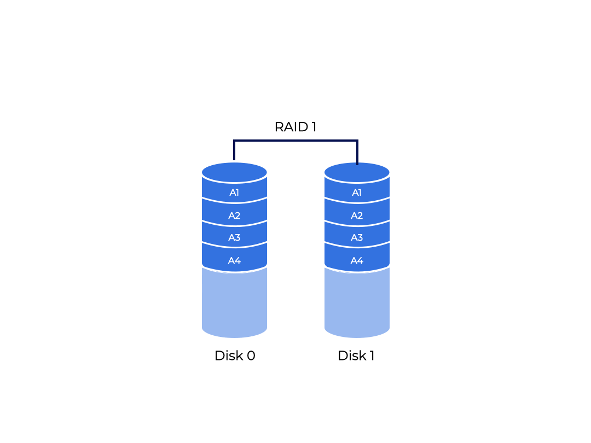
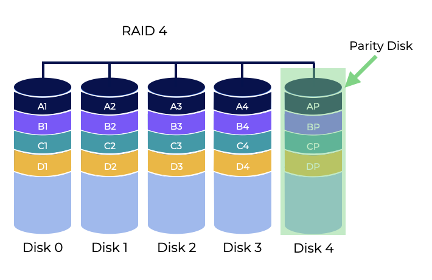
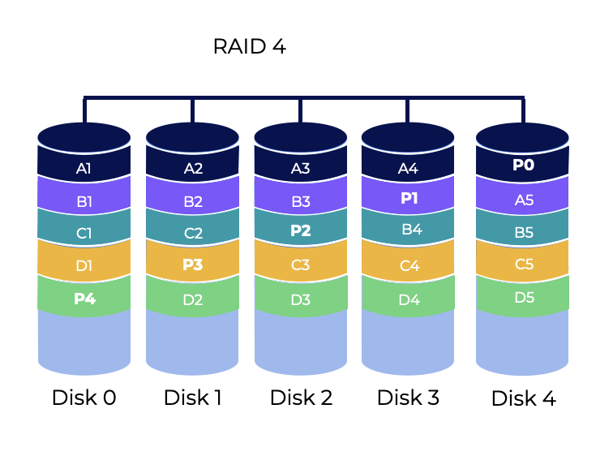

# Overview
Let’s explore **RAID**, a strategy for using several disks together to produce a quicker, bigger, and more dependable disk system.  
让我们探索**RAID**，一种使用多个磁盘一起使用的策略，以产生更快，更大，更可靠的磁盘系统。  
This section should help us answer the following questions:  
本节应该能帮助我们回答以下问题：  
- How can we build a storage system that is fast, large, and dependable?
- 我们如何构建一个快速，大型和可靠的存储系统？
- What are the most important techniques?
- 最重要的技术是什么？
- What are the trade-offs between approaches?
- 方法之间的权衡是什么？

# Introduction
I/O can be slow and bottleneck the system. Sometimes we want it to be bigger to store more data, or more reliable so we can backup our data and keep it secure.  
I/O可能会很慢并成为系统的瓶颈。有时我们希望它更大，以存储更多的数据，或者更可靠，以便我们可以备份我们的数据并保持安全。  
A **Redundant Array of Independent Disks (RAID)** protects against drive failure by storing the same data in different places on multiple hard drives. A group of physical disks can then function as one logical disk on your system.  
**独立磁盘冗余阵列（RAID）**通过在多个硬盘上的不同位置存储相同的数据来防止驱动器故障。然后，一组物理磁盘可以作为系统上的一个逻辑磁盘。  
There are different RAID levels, and not all provide redundancy.  
有不同的RAID级别，不是所有的都提供冗余。  
Inside, a RAID contains:  
内部，RAID包含：  
- Several disks
- 几个磁盘
- Memory (volatile and non-volatile), and
- 内存（易失性和非易失性），
- One or more processors.
- 一个或多个处理器。

**A hardware RAID is a computer system designed to manage a set of disks.**   
**硬件RAID是一种计算机系统，用于管理一组磁盘。**  
RAIDs outperform single disks in many ways, including:  
RAID在许多方面都优于单个磁盘，包括：  
- Performance - Parallelizing disks can drastically reduce I/O times.  
- 性能 - 并行磁盘可以大大减少I/O时间。
- Capacity - Big data requires big disks.
- 容量 - 大数据需要大磁盘。
- **Reliability** - Spreading data across multiple drives without RAID techniques makes data **vulnerable to a single disk failure**. With **redundancy**, RAIDs may survive a disk failure and keep working like nothing happened.  
- 可靠性 - 在没有RAID技术的情况下，将数据分布在多个驱动器上会使数据**易受单个磁盘故障的影响**。通过**冗余**，RAID可能会在磁盘故障后继续工作，就像什么都没有发生一样。  

RAID technology has three basic functions:  
RAID技术有三个基本功能：  
- Block access to data is achieved by **striping the data** on the disk, reducing the mechanical seek time and increasing data access speed.  
- 通过在磁盘上**条带化数据**来实现对数据的块访问，从而减少机械寻道时间并提高数据访问速度。  
- **Reading multiple disks** in an array reduces mechanical seek time and increases data access speed at the same time.  
- 在阵列中**读取多个磁盘**可以同时减少机械寻道时间并提高数据访问速度。
- **Mirroring** and storing **parity** information helps in data protection.
- **镜像**和存储**奇偶校验**信息有助于数据保护。

**RAIDs** do their job **transparent** to the systems they are used on, so it looks like a single big disk representing itself as a linear array of blocks. It can replace a disk without changing a single line of software while the OS and user applications continue to work as before.  
**RAID**对它们所使用的系统**透明**，因此它看起来像一个单独的大磁盘，表示自己是一个线性块数组。它可以替换磁盘而不改变任何一行软件，而操作系统和用户应用程序继续像以前一样工作。  
Transparency increases RAID **deployability** by letting users and administrators use RAID without worrying about software compatibility.  
透明性通过让用户和管理员在不用担心软件兼容性的情况下使用RAID来增加RAID的**可部署性**。  

## Questions
RAIDS outperform single disk storage systems in performance, capacity, and reliability.  
RAID在性能，容量和可靠性方面优于单个磁盘存储系统。  

# Interface and RAID Internals
A file system sees a RAID as a single disk, a linear array of blocks that the file system or client can read or write to.  
文件系统将RAID视为一个单独的磁盘，文件系统或客户端可以读取或写入的线性块数组。  
The RAID will issue one or more physical I/Os once it knows which disk (or disks) to access. The physical I/Os vary depending on the RAID level.  
RAID一旦知道要访问哪个磁盘（或磁盘），就会发出一个或多个物理I/O。物理I/O取决于RAID级别。  
If a RAID stores each block twice (one on each disk), two physical I/Os would be required for each logical I/O.  
如果RAID将每个块存储两次（每个磁盘上一个），则每个逻辑I/O将需要两个物理I/O。  
A RAID system connects to a host using a normal interface (SCSI or SATA).  
RAID系统使用普通接口（SCSI或SATA）连接到主机。  
Inside, RAIDs contain:  
在内部，RAID包含：  
- **Microcontrollers** that run firmware to control the RAID
- 运行固件以控制RAID的**微控制器**
- **Volatile memory (DRAM)** to buffer data blocks being read and written
- **易失性内存（DRAM）**用于缓冲正在读取和写入的数据块
- **Non-volatile memory (NVM)** to buffer writes safely, and
- **非易失性内存（NVM）**用于安全地缓冲写入，以及
- **Parity** calculations might even be done with special logic
- **奇偶校验**计算甚至可以用特殊逻辑来完成

In a sense, a RAID system is a tailored computer system that contains a processor, memory, and disks. Instead of running applications, it runs RAID-specific software.  
从某种意义上说，RAID系统是一种定制的计算机系统，它包含处理器，内存和磁盘。它不是运行应用程序，而是运行RAID特定的软件。  

## Questions
Non-volatile memory (NVM): These are responsible for buffering writes safely.  
非易失性内存（NVM）：这些负责安全地缓冲写入。  
Parity: These include special logic for calculating missing data.  
奇偶校验：这些包括计算缺失数据的特殊逻辑。  
Microcontrollers: These run firmware to control the RAID.  
微控制器：这些运行固件来控制RAID。  
Volatile memory (DRAM): These buffer data blocks that are being read or written.  
易失性内存（DRAM）：这些缓冲正在读取或写入的数据块。

# Fault Model
**RAIDs are designed to sense and recover from certain kinds of disk failures**. For this, it needs to know which faults to expect.  
**RAID被设计为能够感知和从某些类型的磁盘故障中恢复**。为此，它需要知道要期望哪些故障。  
## **Fail-Stop**  
With the **fail-stop** fault model, a disk can be in one of two states.  
在**故障停止**故障模型中，磁盘可以处于两种状态之一。  
- **Working**
    - All blocks can be read or written.
    - 所有块都可以读取或写入。 
- **Failed**
    - When a disk has failed, we assume the data is gone for good.
    - 当磁盘故障时，我们假设数据已永久丢失。

The **fail-stop** model assumes that a failing disk is quickly sensed by fault detection. In a **RAID** array, we would expect the **RAID** controller hardware (or software) to detect a failed disk instantly.  
**故障停止**模型假设故障检测会快速感知故障磁盘。在**RAID**阵列中，我们希望**RAID**控制器硬件（或软件）能够立即检测到故障磁盘。  
For now, we can ignore more complex errors like disk corruption. We also don’t have to worry about a single block on a functional drive becoming inaccessible. We’ll consider more realistic disk faults like these a little later.  
现在，我们可以忽略更复杂的错误，如磁盘损坏。我们也不必担心功能驱动器上的单个块无法访问。我们稍后会考虑更现实的磁盘故障。  

## Questions
A disk can be in one of two states when using the fail-stop failure model.  
在使用故障停止故障模型时，磁盘可以处于两种状态之一。  
- Working, where all blocks can be read or written.
- Failed, where we lose all of the data for good.

# Evaluating A RAID
There are many ways to construct a **RAID**, each with its own goals, advantages, and disadvantages.  
有很多方法可以构建**RAID**，每种方法都有自己的目标，优点和缺点。  
We will evaluate each **RAID** design on three categories.  
我们将在三个类别上评估每种**RAID**设计。  
- **Capacity** - How much usable space is in **N** drives with **B** blocks each available to **RAID** clients?
- **容量** - **N**个驱动器中有多少可用空间，每个驱动器都有**B**个块可供**RAID**客户端使用？
    - **N⋅B** without redundancy. Keeping two copies of each block, or **mirroring** gives us **(N⋅B)/2**.
    - **N⋅B**没有冗余。保留每个块的两个副本，或者**镜像**，我们可以得到**（N⋅B）/ 2**。
- **Reliability** - Tolerance for disk failures for specified design. Our current fault model assumes only a complete disk can fail.
- **可靠性** - 指定设计的磁盘故障容忍度。我们当前的故障模型假设只有完整的磁盘才能失败。
- **Performance** - Performance is difficult to evaluate because it really depends on the workload transmitted to the disk array. Let’s look at some typical workloads before our analysis.
- **性能** - 性能很难评估，因为它真的取决于传输到磁盘阵列的工作负载。在分析之前，让我们先看看一些典型的工作负载。  
- **Availability** - How available is the system for actual use?
- **可用性** - 系统有多可用？

## Questions
Mirroring is a method of copying data, but we don’t use it to evaluate RAID models.  
镜像是复制数据的一种方法，但我们不使用它来评估RAID模型。

# RAID Level 0: Striping
**RAID Level 0** uses block level **striping**, or splitting data up across multiple areas. It chooses reasonable strips on **N** hard disks to make a strip set.  
**RAID Level 0**使用块级**分条**，或者在多个区域中拆分数据。它在**N**个硬盘上选择合理的条带来创建条带集。  
The idea is to split a piece of data into several strips and write it to all of the hard drives at the same time, allowing reading and writing to happen simultaneously. It performs well, but doesn’t protect us against a disk failure.  
这个想法是将一段数据拆分成几条带，并同时将其写入所有硬盘，允许同时进行读取和写入。它表现良好，但不能保护我们免受磁盘故障的影响。  
Say we have **2** physical hard disks of **1TB** each and these disks store our data, **A1−8**.  
假设我们有**2**个**1TB**的物理硬盘，这些硬盘存储我们的数据，**A1-8**。  

In this figure, **A1&A2** create a **stripe**. Instead of only placing one block into a disk at a time, we can deal with two (or more) at a time.  
在这个图中，**A1&A2**创建了一个**条带**。我们不仅可以一次将一个块放入一个磁盘，而且可以同时处理两个（或更多）块。  
We can illustrate the advantage of storing our data like this with an example.  
我们可以用一个例子来说明这种存储数据的优点。  
We could ask a person to write down a dataset of numbers,**1−20**. This should take them a few seconds.  
我们可以让一个人写下一组数字，**1-20**。这应该需要几秒钟。  
We could then ask two people to write down this number set and split the work, with person **1** writing **1−10** and person **2** writing **11−20** . This would take us less time that our single person request.  
然后我们可以让两个人写下这个数字集，并分担工作，人员**1**写**1-10**，人员**2**写**11-20**。这将比我们单个人的请求花费更少的时间。  
Let’s say we then lost one of our data writers responsible for a piece of our data. If we lose them or they fail, we would also lose our dataset.  
假设我们失去了负责我们数据一部分的数据编写者。如果我们失去了他们或他们失败，我们也会丢失我们的数据集。  
This is the same case with RAID Level 0. If we lose one of our disks, we lose all of our data because our drives were operating as one logical drive.  
这与RAID Level 0的情况相同。如果我们丢失了一个磁盘，我们就会丢失所有数据，因为我们的驱动器正在作为一个逻辑驱动器运行。  
## **Evaluation**
- **Reliability** - RAID Level 0 doesn’t stand up against disk failure, so it’s not very reliable. 
- **可靠性** - RAID Level 0无法抵御磁盘故障，因此不是很可靠。
- **Capacity** - Since the whole space is used to store original data (not copies), **N** disks, each with **B** blocks is fully used.
- **容量** - 由于整个空间用于存储原始数据（而不是副本），**N**个磁盘，每个磁盘**B**个块都被完全使用。

# Question
Striping is a method of splitting data across multiple areas.  
分条是将数据分散在多个区域的一种方法。

# Chunk Sizes
The **chunk size** influences array performance. Because the positioning time for the entire request is decided by the maximum of all positioning times across drives, accessing blocks across many disks increases positioning times.  
**块大小**影响阵列性能。因为整个请求的定位时间由驱动器之间的所有定位时间的最大值决定，因此跨多个磁盘访问块会增加定位时间。  

Large **chunk sizes** restrict parallelism within files, requiring several simultaneous searches to get high speeds. However, they also reduce positioning time. When only one file fits on a single disk and it is accessed, the positioning time is only that of a single disk positioning.  
大**块大小**限制了文件内的并行性，需要多个同时搜索才能获得高速。但是，它们也减少了定位时间。当只有一个文件适合单个磁盘并且被访问时，定位时间仅为单个磁盘定位时间。

To find the “best” chunk size, you need to know about how much work the disk system does. For now, we’ll assume the size of one block chunk is **4KB** and stick to a single block.  
要找到“最佳”块大小，您需要了解磁盘系统所做的工作量。现在，我们假设一个块大小为**4KB**，并且只使用一个块。

# Evaluating RAID Performance
Two performance measures can be used to evaluate RAID performance:  
可以使用两种性能指标来评估RAID性能：  
- **Single-request latency** - The time it takes for a single logical I/O request to be addressed by a RAID shows how much parallelism there can be.  
- **单个请求延迟** - 一个RAID对一个逻辑I/O请求的响应时间显示了可以有多少并行性。
- **Steady-state throughput** - The overall bandwidth of multiple queries. Because RAIDs are often used in high-performance situations, we will focus on steady-state bandwidth.
- **稳态吞吐量** - 多个查询的整体带宽。因为RAID通常用于高性能情况，我们将重点关注稳态带宽。

Welcome back our sequential and random style workload examples!  
让我们再次回到顺序和随机样式的工作负载示例！  
- A **sequential request** (sequence of requests) can accesses **1MB** of data, starting at block **x** and finishing at block (**x+1MB**)  
- 一个**顺序请求**（请求序列）可以访问**1MB**的数据，从块**x**开始，到块（**x+1MB**）结束
- For **random workloads** each request is small and to a different random disk location.
- 对于**随机工作负载**，每个请求都很小，并且到达不同的随机磁盘位置。

Sequential and random workloads need different disk performance.  
顺序和随机工作负载需要不同的磁盘性能。  

- **Sequential access** allows a disk to work at its best, spending less time seeking and waiting for rotation and **more time delivering data**.
- **顺序访问**允许磁盘以最佳状态工作，花费更少的时间寻找和等待旋转，**更多的时间传输数据**。
- With **random access**, time is spent seeking and waiting for rotation, not delivering data.
- 对于**随机访问**，花费的时间是寻找和等待旋转，而不是传输数据。

To account for this, we’ll assume a disk can transport data at **S MB/s**  sequentially and **R MB/s** randomly. Generally, **S** is far greater than **R**.  
为了解决这个问题，我们假设磁盘可以顺序传输数据**S MB/s**，随机传输数据**R MB/s**。一般来说，**S**远大于**R**。  

Let’s calculate **S** and **R** with:  
让我们用以下公式计算**S**和**R**：  
- A **10MB** sequential transfer, and
- 一个**10MB**顺序传输，
- A **10KB** random transfer.
- 一个**10KB**随机传输。

Say we have the following disk properties:  
假设我们有以下磁盘属性：  
- Average seek time: **7ms** 
- Average rotational delay: **3ms**
- Transfer rate of disk: **50MB/s**

To calculate **S** we need to:  
要计算**S**，我们需要：  
- Figure out how long a **10MB** transfer takes
- 计算**10MB**传输需要多长时间
- Seek for **7** milliseconds
- 寻找**7**毫秒
- Spin for **3** milliseconds, then
- 旋转**3**毫秒，然后
- The transfer begins
- 传输开始

A transfer of **10MB** at **50MB/s** takes **00 milliseconds**. So, each **10−MB** request takes **210 milliseconds** to complete.  
**10MB**的**50MB/s**传输需要**00毫秒**。因此，每个**10−MB**请求需要**210毫秒**才能完成。  
**S = Dataamount/TimeAccess = 10MB/210ms = 47.62MB/s**  
**S** is very close to the disk’s peak bandwidth because of the time spend transferring data.  
由于传输数据所花费的时间，**S**非常接近磁盘的峰值带宽。  
We can compute **R** similarly:  
我们可以类似地计算**R**：  
**R = Dataamount/TimeAccess = 10KB/10.195ms = 0.981MB/s**

## Question
Sequential Request - Accesses data in a continuous fashion.  
顺序请求 - 连续访问数据。  
Random Workloads - Accesses small requests to different random disk locations  
随机工作负载 - 访问不同随机磁盘位置的小请求  
Steady-State Throughput - The total bandwidth consumed by requests.  
稳态吞吐量 - 请求消耗的总带宽。  
Single-Request Latency - The time it takes a RAID to respond to a single logical I/O request demonstrates how much parallelism is possible.  
单个请求延迟 - RAID响应单个逻辑I/O请求所需的时间，表明可能的并行性。

# RAID-1: Mirroring
RAID level 1 is also known as **mirroring**. This level doesn’t have **striping**. Instead, it uses at least two drives that copy the data storage, so we won’t lose all of our data if one disk fails.  
RAID级别1也称为**镜像**。这个级别没有**条带化**。相反，它使用至少两个驱动器来复制数据存储，因此如果一个磁盘失败，我们不会丢失所有数据。  
Reading from both disks at the same time will improve read performance. Write performance is the same for single disk storage.  
同时从两个磁盘读取将提高读取性能。单个磁盘存储的写入性能相同。  
In a mirrored system, each logical block has two physical copies.  
在镜像系统中，每个逻辑块都有两个物理副本。  

Here, we won’t have as much space as we’d like. Of our **2** total terabytes, only half is usable because we need the other half for the mirrored copy of data.  
在这里，我们没有像我们想要的那样多的空间。在我们的**2**总兆字节中，只有一半是可用的，因为我们需要另一半用于数据的镜像副本。  
This also means that we have **reliability** in that if one disk was to fail, the raid controller can simply move over to the working version. We could then replace the faulty hard drive, and the data would begin to copy again to the new drive.  
这也意味着我们有**可靠性**，因为如果一个磁盘失败，raid控制器可以简单地移动到工作版本。然后我们可以替换故障硬盘，数据将再次复制到新驱动器。  
## **Evaluation**
- **Reliability** - This RAID level can handle at least 1 disk failure because the failed disk would have a copy on another disk. Our reliability would be 1 to N/2 because it can handle **N/2** disk failures.  
**可靠性** - 这个RAID级别可以处理至少1个磁盘故障，因为失败的磁盘将在另一个磁盘上有一个副本。我们的可靠性将是1到N/2，因为它可以处理**N/2**个磁盘故障。
- **Capacity** - Only half of our available space can be used for storage. The other half of our space is used for copies of what we already have, so our capacity would be **N⋅B/2** 
**容量** - 只有一半的可用空间可以用于存储。我们空间的另一半用于我们已经有的副本，因此我们的容量将是**N⋅B/2**

## Question
RAID-1 experiences increased reliability because if one disc fails the raid controller can simply move over to the working disc. It also gives us decreased capacity because half of the space available is always being used to store a copy of the data.  
RAID-1的可靠性增加，因为如果一个磁盘失败，raid控制器可以简单地移动到工作磁盘。它还使我们的容量减少，因为可用空间的一半总是用于存储数据的副本。

# RAID-4: Space Saving With Parity
**RAID Level 4** is striped at the block level and has a dedicated **parity** disk. **Parity** is a way of providing redundancy to a disk array.  
**RAID级别4**在块级别进行条带化，并具有专用的**奇偶校验**磁盘。**奇偶校验**是为磁盘阵列提供冗余的一种方法。  
To avoid the significant space cost, we get with mirrored systems, parity-based techniques aim to use less capacity, by sacrificing performance.  
为了避免镜像系统的显着空间成本，奇偶校验技术旨在使用更少的容量，以牺牲性能为代价。  

With this RAID Level, we have one column solely for parity. This parity is calculated using an **XOR** function. One simple approach is to assign data bits with even numbers of ones to parity **0**, and data bits with odd numbers of ones to parity **1**.  
使用这个RAID级别，我们有一列专门用于奇偶校验。这个奇偶校验是使用**XOR**函数计算的。一种简单的方法是将数据位分配给偶数个奇数的奇偶校验**0**，并将数据位分配给奇数个奇数的奇偶校验**1**。  

If we have data bits 0, 0, 0, 1 the parity bit would be:  
如果我们有数据位0，0，0，1，奇偶校验位将是：  
**XOR(0,0,0,1)=1**  
If we have data bits 0, 0, 1, 1 the parity bit would be:  
如果我们有数据位0，0，1，1，奇偶校验位将是：  
**XOR(0,0,1,1)=0**  

|Disk 0|Disk 1|Disk 2|Disk 3|Disk 4|
|:-|:-|:-|:-|:-|
|0|0|0|1|1|
|0|0|1|1|0|

Above is a table with all of our disks and imaginary data bits. If we lost disk 3 to a disk failure, we can look at the values in the other columns as well as the parity bit and recompute the data bit that was stored in Disk 3. This is how we would recover lost data.  
上面是一个包含所有磁盘和虚拟数据位的表格。如果我们失去了磁盘3，因为磁盘故障，我们可以查看其他列中的值以及奇偶校验位，并重新计算存储在磁盘3中的数据位。这就是我们如何恢复丢失的数据的方法。  

**Evaluation**
- **Reliability** - This RAID level lets us recover 1 disk failure at the most. If we lose more than one disk, we can’t recover the data.  
**可靠性** - 这个RAID级别最多让我们恢复1个磁盘故障。如果我们丢失了超过一个磁盘，我们就无法恢复数据。  
- **Capacity** - One whole disk in this system is reserved to storing the parity information, so **N−1** disks are available for us to store data, with each disk having **B** blocks.
**容量** - 这个系统中的一个整个磁盘被保留用于存储奇偶校验信息，因此**N-1**个磁盘可用于存储数据，每个磁盘有**B**个块。  

## Question
In RAID-4, data is striped at the block level. It uses a parity-based technique to save-space. The parity bits are stored on a single disk.  
在RAID-4中，数据在块级别进行条带化。它使用奇偶校验技术来节省空间。奇偶校验位存储在单个磁盘上。  

# RAID-5: Rotating Parity
**RAID-5** is similar to **RAID-4** except instead of having one dedicated parity drive, the parity is distributed across the drives, increasing space efficiency and improving write performance.  
**RAID-5**与**RAID-4**类似，只是它不是有一个专用的奇偶校验驱动器，而是将奇偶校验分布在驱动器上，从而提高空间效率并提高写入性能。  

Each stripe’s parity block is now distributed across the disks, removing the parity-disk bottleneck.  
每个条带的奇偶校验块现在分布在磁盘上，消除了奇偶校验磁盘瓶颈。  
**RAID-5** analysis is similar to **RAID-4**. Both levels have the same effective capacity and fault tolerance. A single request (read or write) has the same latency as **RAID-4**.  
**RAID-5**分析与**RAID-4**类似。两个级别具有相同的有效容量和容错能力。单个请求（读取或写入）具有与**RAID-4**相同的延迟。  
Random read speed improves because we can use all disks now.  
随机读取速度提高，因为我们现在可以使用所有磁盘。  
## **Evaluation**
- **Reliability** - This RAID level lets us recover 1 disk failure at the most. If we lose more than one disk, we can’t recover the data.
- **可靠性** - 这个RAID级别最多让我们恢复1个磁盘故障。如果我们丢失了超过一个磁盘，我们就无法恢复数据。
- **Capacity** - The space that we use for storing the parity information is equal to one whole disk. **N−1** disks are available for us to store data, with each disk having **B** blocks, or **(N−1)⋅B**  
- **容量** - 用于存储奇偶校验信息的空间等于一个整个磁盘。**N-1**个磁盘可用于存储数据，每个磁盘有**B**个块，或者 **(N-1)⋅B**

## Question
RAID-5 is similar to RAID-4 because it uses a parity-based technique. However, RAID-5 has increased space efficiency and improved write performance because it distributes the parity blocks across all discs.  
RAID-5与RAID-4类似，因为它使用奇偶校验技术。但是，RAID-5具有更高的空间效率和更好的写入性能，因为它将奇偶校验块分布在所有磁盘上。

#  RAID-10: 1+0
**RAID-10** is sometimes referred to as a nested level 1 + 0. We have a level one set up where it’s mirroring data, but it’s then striped across like in a **RAID 0**  
**RAID-10**有时被称为嵌套级别1 + 0。我们有一个级别一的设置，它正在镜像数据，但它被条带化，就像在**RAID 0**中一样。  
If Disk 1 were to fail, the system won’t mess up because we have the backup with disk 0 in **RAID 1**. We also have the level of performance that comes with using a **RAID 0**, but we can only actually use half of the available space.  
如果磁盘1失败，系统不会出错，因为我们在**RAID 1**中有磁盘0的备份。我们还有使用**RAID 0**的性能级别，但我们实际上只能使用一半的可用空间。  
This system is efficient because an entire pair of drives would need to fail for this drive to mess up.  
这个系统效率高，因为整个一对驱动器都需要失败，这个驱动器才会出错。  

## Question
In a RAID-10 system:
- Data is mirrored across at least two disks.
- 数据在至少两个磁盘上镜像。
- It is also striped across at least two disks.
- 它还在至少两个磁盘上条带化。
- A pair of drives must fail to mess up the system.
- 一对驱动器必须失败才能弄乱系统。

# Other RAID Levels
There are several other types of RAID levels that we didn’t cover in detail.  
还有几种其他类型的RAID级别，我们没有详细介绍。  
- **RAID-2** is made up of bit-level striping with a Hamming Code parity.
- **RAID-2**由位级条带化和汉明码奇偶校验组成。
- **RAID-3** is made up of byte-level striping with a dedicated parity.
- **RAID-3**由字节级条带化和专用奇偶校验组成。

These two aren’t used very often.  
这两个不常用。

- **RAID-6** is a newer version that has a distributed double parity. This means that instead of just one parity bit being distributed across all the disks, there are two spread out across each block.
- **RAID-6**是一个较新的版本，具有分布式双重奇偶校验。这意味着，不是将一个奇偶校验位分布在所有磁盘上，而是将两个分布在每个块上。

There are also hybrid RAIDs, which use more than one RAID level nested one after the other to meet certain needs.  
还有混合RAID，它们使用多个RAID级别嵌套在一起以满足特定需求。

# Summary
RAID combines multiple separate disks into a larger, more dependable unit; it does so transparently, so the hardware and software above are unaffected.  
RAID将多个单独的磁盘组合成一个更大，更可靠的单位; 它这样做是透明的，因此上面的硬件和软件不受影响。  

- The exact RAID level you choose depends greatly on what is relevant to the end-user.
- 你选择的RAID级别完全取决于对最终用户有何影响。
- **RAID-1** uses mirroring to create a copy of data. It is simple, stable, and gives decent performance but at a significant cost.
- **RAID-1**使用镜像来创建数据的副本。它很简单，稳定，性能也不错，但成本很高。
- **RAID-5**, on the other hand, is more dependable and has better capacity, although it struggles with tiny writes.
- 另一方面，**RAID-5**更可靠，容量更大，尽管它对小写入有所困难。

Choosing the right RAID and configuring its parameters (chunk size, number of drives, etc.) for a given workload is an art and often difficult.  
为给定的工作负载选择正确的RAID并配置其参数（块大小，驱动器数量等）是一门艺术，而且往往很困难。