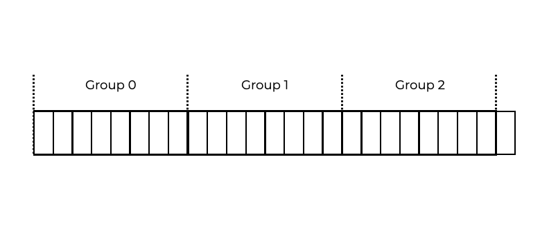

# Introduction
The first UNIX file system, the “old UNIX file system” was basic. On the disk, its data structures looked like the following:   
第一个UNIX文件系统，即“旧UNIX文件系统”是基本的。在磁盘上，它的数据结构看起来像下面这样：  

The super block (**S**) held information about the entire file system, like:  
超级块（**S**）包含有关整个文件系统的信息，如：  
- Volume size
- Inode count
- A link to the free list of blocks.

The inode area of the disk included all file system inodes and data blocks occupied most of the disk.  
磁盘上的inode区域包括所有文件系统inode和数据块，占据了磁盘的大部分空间。 

The previous file system supported basic abstractions of files and directory hierarchies. This was a huge improvement over older record-based storage systems, and the directory hierarchy was an improvement over simple one-level hierarchies.  
上一个文件系统支持文件和目录层次结构的基本抽象。这是与旧的基于记录的存储系统相比的巨大进步，目录层次结构是与简单的一级层次结构相比的改进。  

## Question
The superblock held information about the entire file system.  
超级块包含有关整个文件系统的信息。

# The Poor Performance Problem
The old system’s performance was poor from the start and got worse over time. It would fall to **2%** of total disk bandwidth.  
旧系统的性能一开始就很差，随着时间的推移而变得更糟。它将降至**2%**的总磁盘带宽。  
The first file system treated the disk as RAM. Despite being on a drive, data was scattered. This led to significant placement costs. Reading an inode, then data blocks, requires a costly seek.  
第一个文件系统将磁盘视为RAM。尽管在驱动器上，数据是散乱的。这导致了显着的位置成本。读取inode，然后是数据块，需要昂贵的搜索。  
Inefficient free space management fragments the file system. Moving a logically contiguous file from one side of the disk to the other slows performance.  
低效的空闲空间管理会使文件系统碎片化。将逻辑上连续的文件从磁盘的一侧移动到另一侧会降低性能。  
Consider the following data block region with four files (**Zero, One, Two, and Three**) of size **2** blocks each:  
考虑以下数据块区域，其中包含四个文件（**Zero，One，Two和Three**），每个大小为**2**块： 

Deleting `One` and `Three` would leave the following layout:  
删除`One`和`Three`将产生以下布局：  

The vacant area is split into two two-block sections instead of one big four-block chunk.  
空闲区域被分成两个两块的部分，而不是一个大的四块的块。  
Say we want to allocate a four-block file, `Four`:  
假设我们想分配一个四块的文件，`Four`：

Because `Four` is distributed over the disk, you don’t receive peak (sequential) performance while accessing it. Instead:  
因为`Four`分布在磁盘上，所以在访问它时，你不会获得峰值（顺序）性能。相反：  
- Read `Four1` and `Four2`
- Seek
- Read `Four3` and `Four4`.

Because of this **fragmentation**, the previous UNIX file system was slow. **Defragmentation software** helps to move data around on the disk, making space for contiguous blocks and rewriting inodes to reflect the changes.  
由于这种**碎片化**，上一个UNIX文件系统很慢。**碎片整理软件**有助于在磁盘上移动数据，为连续块提供空间，并重写inode以反映更改。  
The **512**-byte block size was also a performance concern. This made disk data transfer **inefficient**. Smaller blocks reduced internal fragmentation, but were inadequate for data transport because each unit needed to be placed  
**512**字节块大小也是性能问题。这使得磁盘数据传输**低效**。较小的块减少了内部碎片化，但对于数据传输而言不足，因为每个单位都需要放置  

## Question 
FFS: Poor Performance
Block size, random-memory access, and fragmentation were key issues with the “old file system” that caused poor performance.  
块大小，随机内存访问和碎片化是导致“旧文件系统”性能差的关键问题。

# FFS: Disk Awareness
Fast File System (FFS) was the solution to many of the old file system’s problems. The goal was to make the file system structures and allocation policies “disk aware” to boost performance.  
Fast File System（FFS）是解决旧文件系统许多问题的解决方案。目标是使文件系统结构和分配策略“磁盘感知”，以提高性能。  
FFS kept the same file system interface and the same APIs, including:  
FFS保留了相同的文件系统接口和相同的API，包括：  
- `open()`
- `read()`
- `write()`
- `close()`
- Other file system calls while changing the internal implementation.

Modern file systems almost always keep the same interface and program compatibility while upgrading their internals for performance, reliability, or other reasons.  
现代文件系统几乎总是在提高性能，可靠性或其他原因的内部升级时保持相同的接口和程序兼容性。  

## Question
FFS solved many of the old system’s problems by making the structures and allocation policies “disk aware”.  
FFS通过使结构和分配策略“磁盘感知”来解决旧系统的许多问题。  

# Organizing Structure: The Cylinder Group
The FFS splits the disk into **cylinder groups**. A **cylinder** is a collection of tracks on a hard disk that are all the same distance apart. FFS groups **N** consecutive cylinders, so the disk is a cylinder group collection.  
FFS将磁盘分成**圆柱组**。一个**圆柱**是硬盘上所有同一距离的轨道的集合。FFS组**N**个连续的圆柱，因此磁盘是一个圆柱组集合。  

  

Disks export a logical address space of blocks and hide specifics of their geometry from clients. The address space of a disk is divided into **block groups** by current file systems. The image below shows an example of a block group consisting of 8 blocks.  
磁盘导出块的逻辑地址空间，并从客户端隐藏其几何形状的细节。当前文件系统通过将磁盘的地址空间分成**块组**来实现。下图显示了一个由8个块组成的块组的示例。  

**Cylinder** or **block groups** are the core FFS performance mechanisms. By grouping files together, FFS can avoid long disk seeks when accessing them one after the other.  
**圆柱**或**块组**是FFS性能机制的核心。通过将文件分组，FFS可以避免在一个接一个地访问它们时长时间寻找磁盘。  
To use these groups, FFS has to be able to put files and directories into groups and track necessary information about them. Structures in the FFS include:  
要使用这些组，FFS必须能够将文件和目录放入组并跟踪有关它们的必要信息。FFS中的结构包括：  
- Inode space
- inode空间
- Data block space, and
- 数据块空间
- Structures that track whether each of these is allocated or free.  
- 跟踪每个是否分配或空闲的结构。

Within a single cylinder group, FFS keeps:  
在单个圆柱组中，FFS保留： 

For reliability, FFS copies the **super block (S)** in each group. The super block is required to mount the file system. By retaining many copies, you may still mount and access the file system even if one copy is corrupted.  
为了可靠性，FFS在每个组中复制**超级块（S）**。超级块是挂载文件系统所必需的。通过保留许多副本，即使一个副本损坏，您仍然可以挂载和访问文件系统。  

FFS has to track if the group’s inodes and data blocks are allocated. Inodes and data blocks in each group have their own per-group **inode bitmap** and **data bitmap**. This makes it easier to detect big chunks of free space and allocate them to a file using bitmaps. This also eliminates some of the fragmentation issues of the old file system’s free list.  
FFS必须跟踪组的inode和数据块是否分配。每个组中的inode和数据块都有自己的per-group **inode位图**和**数据位图**。这使得检测到大块的空闲空间并使用位图将它们分配给文件变得更加容易。这也消除了旧文件系统空闲列表的一些碎片问题。  

Inode and data block sections are identical to the old very simple file system (**VSFS**). Data blocks still make up most of each cylinder group.  
inode和数据块部分与旧的非常简单的文件系统（**VSFS**）相同。数据块仍然占据了每个圆柱组的大部分。  

# Question 
Using cylinder groups allows the FFS to avoid long disk seeks when accessing them one after the other. Using per-group inode and data bitmaps allows the FFS to solve some of the fragmentation from the previous very simple file system.  
使用圆柱组允许FFS在一个接一个地访问它们时避免长时间的磁盘寻道。使用per-group inode和数据位图允许FFS解决旧的非常简单文件系统中的一些碎片问题。  

# Policies: File and Directory Allocation
The FFS has to choose where to put files, directories, and metadata to improve performance. Its goal is to keep related items together, and unrelated items apart.  
FFS必须选择将文件，目录和元数据放在哪里以提高性能。它的目标是将相关项目放在一起，将不相关的项目分开。  

FFS decides what is **related** and places it in the same block group. **Unrelated** items have to be placed in distinct block groups. It uses a few simple placement algorithms to do this.  
FFS决定什么是**相关的**并将其放在同一个块组中。**不相关的**项目必须放在不同的块组中。它使用一些简单的放置算法来做到这一点。  

## Directory placement
**Directory** placement is an algorithm done by placing the directory data and inode in the cylinder group with the least amount of allocated directories and the most free inodes.  
**目录**放置是通过将目录数据和inode放在分配目录最少和空闲inode最多的圆柱组中来完成的。  
- First, FFS allocates data blocks in the same group as the inode, preventing long seeks between inode and data (like the old file system).  
- 首先，FFS在与inode相同的组中分配数据块，防止inode和数据之间的长寻道（如旧文件系统）。
- Then, it puts all files in the same directory in the same cylinder group.
- 然后，它将所有文件放在同一个圆柱组中。 

If a user creates four files:  
如果用户创建了四个文件：  
- `/a/b`
- `/a/c`
- `/a/d`, and
- `b/f`

FFS will try to position the first three close together within the same group and the fourth one far away in different group.  
FFS将尝试将前三个放在同一组中，并将第四个放在不同的组中。  

The three directories and four files are placed within the groups following FFS rules. Assume that each group has only **10 inodes** and **10 data blocks**. Assume the ordinary files are two blocks apiece, while the directories are one block each. `A` for `/a`, `f` for `/b/f`, and so on are used to represent files and directories in this diagram.  
三个目录和四个文件按FFS规则放置在组中。假设每个组只有**10个inode**和**10个数据块**。假设普通文件每个占两个块，而目录每个占一个块。`A`表示`/a`，`f`表示`/b/f`，依此类推。  

| Group | Inodes | Data Blocks |
| :--- | :---: | ---: |
| 0 | /--------- | /--------- |
| 1 | acde------ | accddee--- |
| 2 | bf-------- | bff------- |
| 3 | /--------- | /--------- |
| 4 | /--------- | /--------- |
| 5 | /--------- | /--------- |
| 6 | /--------- | /--------- |
| 7 | /--------- | /--------- |

This FFS policy places data blocks near their inodes, and files in the same directory are near one other (Group 1, and Group 2, respectively).  
FFS策略将数据块放在它们的inode附近，并且同一目录中的文件彼此接近（分别为组1和组2）。  

## Spreading inodes among groups
Let’s examine a second inode allocation policy that simply spreads inodes among groups, attempting to prevent overflowing inode tables. The final allocation might be as follows:  
让我们检查第二个inode分配策略，它只是在组之间分散inode，尝试防止inode表溢出。最终分配可能如下所示：  

| Group | Inodes | Data Blocks |
| :--- | :---: | ---: |
| 0 | /--------- | /--------- |
| 1 | a--------- | a--------- |
| 2 | b--------- | b--------- |
| 3 | c--------- | cc-------- |
| 4 | d--------- | dd-------- |
| 5 | e--------- | ee-------- |
| 6 | f--------- | ff-------- |
| 7 | ---------- | ---------- |

While the second policy keeps file and directory data near its inode, files within a directory are randomly scattered around the disk, destroying name-based proximity. Files `/a/c, /a/d, and /a/e` now have three groups instead of one.  
虽然第二个策略将文件和目录数据放在其inode附近，但目录中的文件被随机分散在磁盘上，破坏了基于名称的接近性。文件`/a/c`，`/a/d`和`/a/e`现在有三个组而不是一个。  

The FFS policy methods are based on **common sense** rather than comprehensive studies of file-system traffic.  
FFS策略方法基于**常识**而不是对文件系统流量的全面研究。  

Imagine compiling a bunch of files into a single executable. Namespace-based locality allows FFS to improve performance by speeding up searches between related files.  
想象一下将一堆文件编译成一个可执行文件。基于名称空间的局部性允许FFS通过加快相关文件之间的搜索来提高性能。  

# Question 
The FFS uses namespace-based locality and common sense to bundle and link files together for increased performance and reduced search times.  
FFS使用基于名称空间的局部性和常识将文件捆绑在一起，以提高性能并减少搜索时间。  

# Large-File Exception
Large files are an exception to the FFS file placement rules. A large file would generally fill a block group. It prevents subsequent **related** files from being put within it, impacting file-access locality.  
大文件是FFS文件放置规则的例外。大文件通常会填满一个块组。它阻止了后续**相关**文件被放入其中，从而影响文件访问局部性。  

After the large files take a few blocks, FFS allocates the next large chunk of file to a different block group.  
大文件占用几个块后，FFS将下一个大块的文件分配给不同的块组。  

The graphic below illustrates this policy. A huge file would normally arrange all of its blocks in one area of the disk.  
下图说明了这个策略。一个巨大的文件通常会在磁盘的一个区域中安排所有块。  

We study a **30** block file (`/a`) in an FFS with **10** inodes and **40** data blocks per group. Here’s FFS without the large-file exception:  
我们研究了一个**30**块文件（`/a`）在一个FFS中，每组有**10**个inode和**40**个数据块。这是没有大文件例外的FFS：  

| Group | Inodes | Data Blocks |
| :--- | :---: | ---: |
| 0 | /a-------- | /aaaaaaaaa aaaaaaaaaa aaaaaaaaaa a--------- |
| 1 | ---------- | ---------- ---------- ---------- ---------- |
| 2 | ---------- | ---------- ---------- ---------- ---------- |

`/a` fills most of the data blocks in Group 0, but not in other groups. If new files are generated in the root directory (`/`), the group’s data will be squeezed.  
`/a`填充了组0中的大多数数据块，但不是在其他组中。如果在根目录（`/`）中生成新文件，则该组的数据将被压缩。  

Instead of spreading the file among groups, FFS spreads the file between groups, resulting in low utilization within each group:  
FFS不是将文件分散在组中，而是在组之间分散文件，从而导致每个组的利用率低：  

| Group | Inodes | Data Blocks |
| :--- | :---: | ---: |
| 0 | /a-------- | /aaaaa---- ---------- ---------- ---------- |
| 1 | ---------- | aaaaa----- ---------- ---------- ---------- |
| 2 | ---------- | aaaaa----- ---------- ---------- ---------- |
| 3 | ---------- | aaaaa----- ---------- ---------- ---------- |
| 4 | ---------- | aaaaa----- ---------- ---------- ---------- |
| 5 | ---------- | aaaaa----- ---------- ---------- ---------- |
| 6 | ---------- | ---------- ---------- ---------- ---------- |

A user or application may notice that distributing file blocks across the disk reduces performance, but this can be overcome by carefully choosing chunk size.  
用户或应用程序可能会注意到，将文件块分布在磁盘上会降低性能，但可以通过仔细选择块大小来解决这个问题。  
The file system spends most of its time moving data from disk and very little time scanning between blocks. A strategy used in computer systems to reduce overhead by increasing work per overhead paid is **amortization**.  
文件系统花费大部分时间从磁盘移动数据，而很少时间在块之间扫描。一种在计算机系统中用于通过增加每个开销支付的工作来减少开销的策略是**摊销**。  

## Question
The FFS handles large file placement by spreading the file between groups.  
FFS通过在组之间分散文件来处理大文件放置。  

# Calculating Chunk Size
Using our previous example, let’s assume:  
使用我们之前的例子，假设：  
- The average disk positioning time (seek and rotation) is **10ms**.
- 磁盘定位时间（寻道和旋转）的平均值为**10ms**。
- The disk moves data at **75MB/s**.
- 磁盘以**75MB/s**的速度移动数据。

To reach **50%** peak disk performance, we would need to spend **10ms** sending data for every **10ms** seeking between chunks. We can use dimensional analysis to calculate the how big each chunk would have to be.  
为了达到**50%**的峰值磁盘性能，我们需要每**10ms**发送数据花费**10ms**在块之间寻找。我们可以使用维度分析来计算每个块的大小。  

If you transfer data at **75MB/s**, you need to transfer **768KB** every time you view and transfer. As you get closer to peak, the chunks will grow.  
如果您以**75MB/s**的速度传输数据，则每次查看和传输时都需要传输**768KB**。当您接近峰值时，块将增长。  

In our previous example, FFS used a basic inode structure method to distribute large files.  
在我们之前的例子中，FFS使用了一种基本的inode结构方法来分发大文件。  

- The first twelve direct blocks are put together, while following indirect blocks are divided.
- 前12个直接块被放在一起，而后续间接块被分开。
- Except for the first **48KB**, every **1024** blocks of the file **4MB** were divided using this method.
- 除了第一个**48KB**，每个**1024**块的文件**4MB**都使用这种方法分开。  

The **transfer** rate of disk drives is improving rapidly, where **seek mechanical components** (disk arm speed and rotation rate) are improving slowly. So, to amortize increasing mechanical costs, **you have to be able to transfer more data between searches**.  
磁盘驱动器的**传输**速率正在迅速提高，其中**搜索机械组件**（磁盘臂速度和旋转速度）正在缓慢提高。因此，为了摊销增加的机械成本，**您必须能够在搜索之间传输更多的数据**。  

# Summary
The creation of **FFS** was an important moment for file systems.  
**FFS**的创建是文件系统的一个重要时刻。  
- It showed us how important file management is in an operating system and how to deal with the most important piece of hardware, **the hard drive**.
- 它向我们展示了操作系统中文件管理的重要性以及如何处理最重要的硬件**硬盘驱动器**。
- Hundreds of different file systems have emerged. Many still borrow from **FFS**, like Linux ext2 and ext3.
- 出现了数百种不同的文件系统。许多仍然从**FFS**借鉴，如Linux ext2和ext3。
