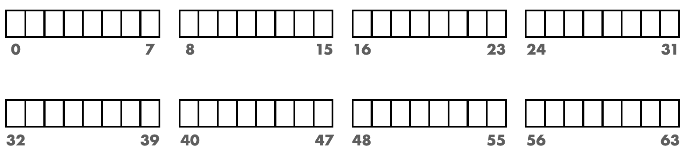
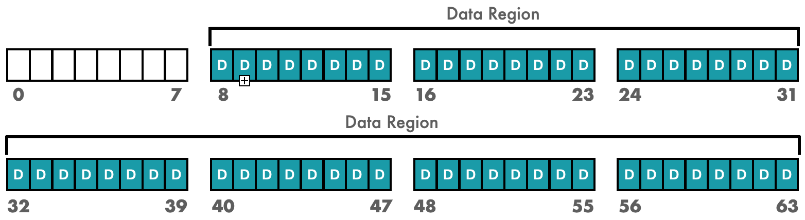
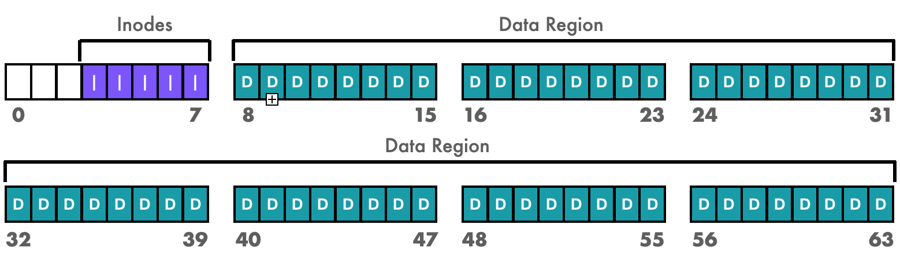
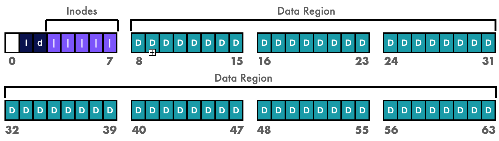
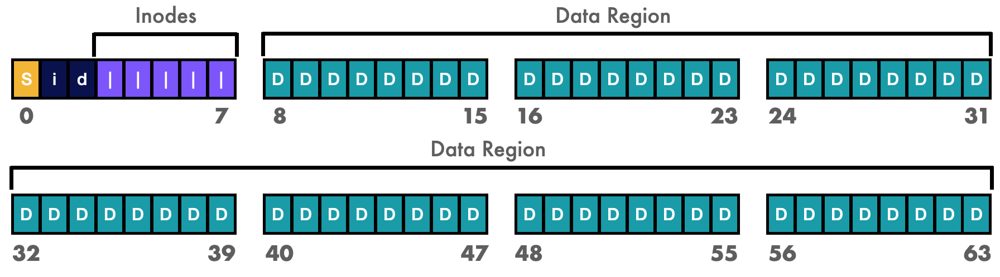
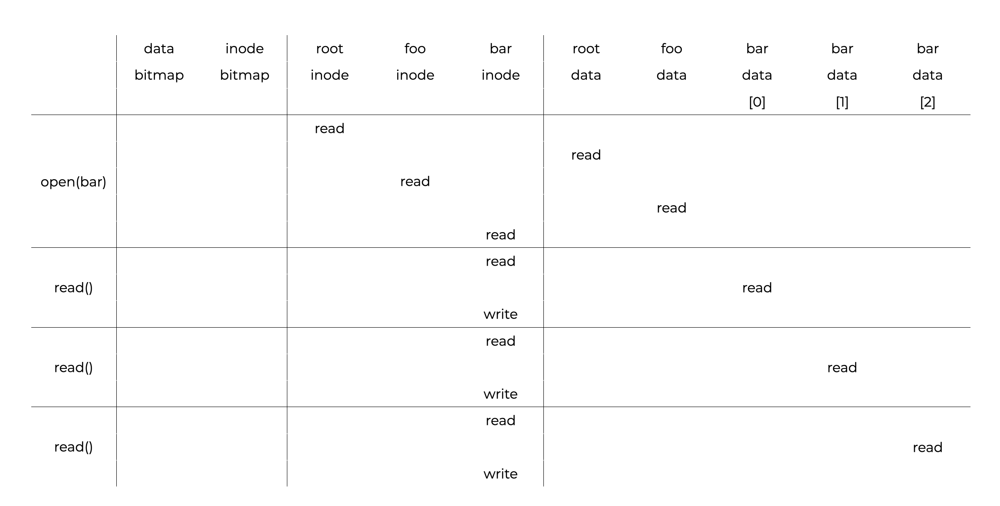
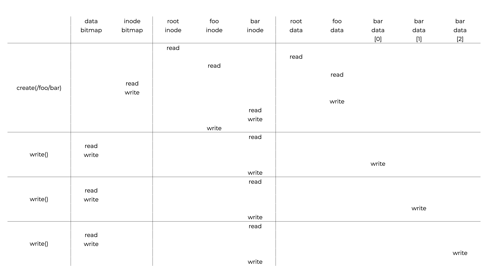

# Introduction
# 介绍
In this section, we’ll explore the ins and outs of a simple version of a UNIX **file system** to introduce important on-disk structures, access methods, and regulations. We’ll also look at some real-world file systems to see how they work in real life.  
在本节中，我们将探索一个简单的UNIX文件系统的内部和外部，以介绍重要的磁盘结构，访问方法和规则。我们还将看一些现实世界的文件系统，看看它们是如何在现实生活中工作的。  

This section should help us answer the following questions:  
本节应该能帮助我们回答以下问题：  
- How do we build a simple file system?
- What structures do we need on the disk?
- What should they track?
- How do we access them?

# Thinking About File Systems
We can look at file systems from two angles.  
我们可以从两个角度来看文件系统。  
- The file system’s **data structures**.  
- 文件系统的数据结构。  
    - These are the on-disk structures the file system uses to organize its data and metadata.  
    - 这些是文件系统用来组织数据和元数据的磁盘结构。  
    - Simple file systems use **arrays of blocks or other objects** for this.
    - 简单的文件系统使用**块或其他对象的数组**来实现这一点。
    - More complex file systems can use tree-based data structures.
    - 更复杂的文件系统可以使用基于树的数据结构。
- The file system’s **access methods**.
- 文件系统的访问方法。
    - This is how the file system maps process calls (like `open(), read(), and write()`) to its structures.  
    - 这是文件系统如何将进程调用（如`open()`，`read()`和`write()`）映射到其结构的。
    - It determines which structures are read during a system call, which ones are written, and how well all of these steps are executed.
    - 它决定在系统调用期间读取哪些结构，写入哪些结构以及这些步骤的执行情况如何。

We can build a strong conceptual framework of how the file system works by understanding its **data structures** and **access methods**.  
我们可以通过了解文件系统的**数据结构**和**访问方法**来构建一个强大的概念框架，以了解文件系统的工作方式。  

## Question 
Data Structures: How the file systems organize their metadata and data on disk  
数据结构：文件系统如何在磁盘上组织其元数据和数据  
Access Methods: How the file system determines which structures are read or written during a system call, and the efficiency of these actions.  
访问方法：文件系统如何确定在系统调用期间读取或写入哪些结构以及这些操作的效率。  

# Organization
In our file system, we organize our data structures on a **disk**. We’ll use a small block size of **4KB** for our example.  
在我们的文件系统中，我们将磁盘上的数据结构组织在一起。我们将使用**4KB**的小块大小作为我们的示例。  
## **Partitions**
A **partition** is a volume containing a file system. Our **partition** for our file system will look like a sequence of **4KB** chunks. Addresses for a **partition** with **N** number of **4KB** blocks start at **0** and go up to **N−1**. A **64**-block disk would look like this:  
分区是包含文件系统的卷。我们的文件系统的分区将看起来像一个**4KB**块的序列。具有**N**个**4KB**块的分区的地址从**0**开始，最高达到**N-1**。一个**64**块的磁盘看起来像这样：  



## **We need to store user data in these blocks.**
This is what most of our file system space should be used for. We’ll use blocks **8** through **65** for this and call it the **data region**.  
我们需要在这些块中存储用户数据。这是我们的文件系统空间的大部分应该用于的地方。我们将使用块**8**到**65**来实现这一点，并将其称为**数据区域**。  



## **Our file system has to keep track of each file**.
This **metadata** tracks a file’s size, owner and access rights, access and modification times, and other similar pieces of data. To hold this data, file systems use an **inode** structure.  
我们的文件系统必须跟踪每个文件。这个**元数据**跟踪文件的大小，所有者和访问权限，访问和修改时间以及其他类似的数据。为了保存这些数据，文件系统使用**inode**结构。  

## **We need to reserve disk space for inodes**.
An array of on-disk inodes is called an **inode table**. Let’s use **5** of our blocks for inodes:  
我们需要为inode保留磁盘空间。磁盘上的inode数组称为**inode表**。让我们使用**5**个块来表示inode：  



Inodes are usually **128** or **256** bytes in size. **16** inodes can fit into a **4**-KB block. Our file system has **80**inodes. This is the maximum number of files that our file system can hold on a **64**-block partition. If the same file system was built on a larger disk, it could allocate a larger inode table and hold more files.  
inode通常是**128**或**256**字节大小。**16**个inode可以放入一个**4**-KB块中。我们的文件系统有**80**个inode。这是我们的文件系统可以在**64**块分区上保存的最大文件数。如果同一个文件系统建立在一个更大的磁盘上，它可以分配一个更大的inode表并保存更多的文件。  

## **We need to check if inodes or data blocks are allocated or free.**  
- We use the **inode bitmap** to do this for both the data region and the inode table.  
- 我们使用**inode位图**来为数据区域和inode表执行此操作。  
- Each bit indicates whether a block is free (**0**) or in use (**1**).
- 每个位表示块是否空闲(**0**)或正在使用(**1**)。

Each bitmap is stored in a   4 -KB block. Our new disk now looks like:
每个位图都存储在一个4-KB块中。我们的新磁盘现在看起来像这样：



## **The empty block that’s left belongs to the superblock, which holds information about the file system like**:  
- How many inodes there are
- 有多少个inode
- The total number of data blocks
- 数据块的总数
- Where the inode table starts
- inode表的起始位置
- A magic number, usually used to identify the file system type.
- 一个魔术数字，通常用于标识文件系统类型。



Before joining the disk to the file-system tree, the OS will read the **superblock** to set up several parameters. This is how the system knows where to look for relevant data on the disk.  
在将磁盘加入到文件系统树之前，操作系统将读取**超级块**来设置几个参数。这就是系统知道在磁盘上查找相关数据的位置的原因。  

## Questions
- The **inode bitmap** tracks whether an inode or data block is allocated or free.  
- **inode位图**跟踪inode或数据块是否分配或空闲。
- The OS will read the **superblock** to set up some parameters before joining the disk to the file system tree.
- 操作系统将在将磁盘加入到文件系统树之前读取**超级块**来设置一些参数。
- The file system uses **metadata** to track specific information about a file. This data is stored in an **inode structure**.
- 文件系统使用**元数据**来跟踪文件的特定信息。这些数据存储在**inode结构**中。
- In our file system’s partition on the disk, the **data region** is where we store user information.
- 在磁盘上的文件系统分区中，**数据区域**是我们存储用户信息的地方。

# File Organization: The Inode
Each file has an **inode** that’s identified by an **i-number** or **inode number** integer. A simple file system should be able to find the appropriate inode location on disk given an **i-number**. Consider an inode table with:  
每个文件都有一个**inode**，它由**i-number**或**inode number**整数标识。一个简单的文件系统应该能够根据**i-number**在磁盘上找到适当的inode位置。考虑一个inode表：  

- **20KB** (five **4KB** blocks)
- **80** inodes (assuming each inode is **256** bytes)
- Inode region starting at **12KB**

This file system partition starts with the following up close layout:  
这个文件系统分区以以下紧密布局开始：  
In order to read inode number **32**, the file system would:  
为了读取inode编号**32**，文件系统将：  
- Compute the inode offset (**32⋅sizeof(inode)** or **8192**)
- Add it to the disk’s inode table’s start address (**12KB**)
- Get the right byte address for the specified inode block: **20KB**

Drives are not byte addressable. Instead, they include several **512**-byte addressable sectors. So, to get the inode block holding inode **32**, the file system would issue a read to sector:  
驱动器不是字节可寻址的。相反，它们包括几个**512**-字节可寻址的扇区。因此，为了获得包含inode **32**的inode块，文件系统将向扇区发出读取：  
- 20*1024/512 = 40

Generally, we can define the sector address by: 
一般来说，我们可以通过以下方式定义扇区地址：  
```c
blk = (inumber * sizeof(inode t)) / blockSize;
sector = ((blk * blockSize) + inodeStartAddr) / sectorSize;
```
Inodes store information like:  
inode存储信息，如：  
- Size of the file
- 文件大小
- The device where the file is stored
- 存储文件的设备
- User and group IDs for the file
- 文件的用户和组ID
- File access permissions
- 文件访问权限
- Number of hard links to the file
- 文件的硬链接数
- Timestamps for creation, read, and write
- 创建、读取和写入的时间戳
- The data’s location (except the filepath, that’s in the directory)
- 数据的位置（除了文件路径，这在目录中）

The placement of data blocks is important in inode design. A file-related inode can contain one or more **direct pointers** or **disk addresses**. You’ll run into trouble if you have a file in the inode larger than:  
inode设计中数据块的位置很重要。与文件相关的inode可以包含一个或多个**直接指针**或**磁盘地址**。如果你有一个比较大的文件，你会遇到麻烦：  
```
    block size × direct references
```
When a file system’s inodes run out, **new files and folders are refused**. Until then, you won’t see much go wrong. Once inodes are fully used, however, you’ll notice:  
当文件系统的inode耗尽时，**新文件和文件夹将被拒绝**。直到那时，你不会看到太多错误。然而，一旦inode被完全使用，你会注意到：  
- Data loss
- 数据丢失
- Crashing applications
- 崩溃的应用程序
- OS restarts
- OS重启
- Processes don’t restart
- 进程不会重启
- Periodic tasks failing to fire
- 周期性任务无法触发

## Question
Inodes store information like:  
inode存储信息，如：
- User and group IDs
- File Access Permissions
- File Sizes

The filepath is stored in the directory. User data is stored in the data region. The superblock holds information on the total number of data blocks.  
文件路径存储在目录中。用户数据存储在数据区域中。超级块保存有关数据块总数的信息。

# The Multi-Level Index
Single index blocks may not be able to hold all of the pointers for very large files. **Multi-Level indexing** holds and supports multiple levels of indices. Using another level of indices may increase our efficiency.  
单个索引块可能无法容纳非常大文件的所有指针。**多级索引**保存并支持多个索引级别。使用另一个索引级别可能会提高我们的效率。  
With multi-level indexing:  
使用多级索引：  
- A first level index block pointing to a second level index block.
- 一个指向第二级索引块的第一级索引块。
- A second level index block pointing to the disk blocks occupied by the file.
- 一个指向文件占用的磁盘块的第二级索引块。 
- One indirect pointer per inode.
- 每个inode一个间接指针。

Depending on the maximum file size, this mechanism can be extended **3+** levels.  
根据最大文件大小，此机制可以扩展**3+**级。
You may be able to support even larger files by adding a **double indirect pointer** to the inode. This address refers to an indirect block with data block references. To exceed **4GB**, a double indirect block allows files to increase by **1024⋅1024**or **1** million , **4KB** blocks.  
通过向inode添加**双间接指针**，您可能能够支持更大的文件。此地址指向具有数据块引用的间接块。要超过**4GB**，双间接块允许文件增加**1024⋅1024**或**1**百万，**4KB**块。  
Say we have:  
- **12** direct pointers, and
- **2** indirect blocks
This structure’s block size is **4KB** with **4**-byte pointers. It can handle files up to **4GB** in size:  
这个结构的块大小是**4KB**，指针是**4**字节。它可以处理**4GB**大小的文件：

```  
**(12+1024+1024^2)⋅ 4KB **  
```

Many modern file systems use a **multi-level index**. We use this type of unbalanced-tree structure because most files are small. If we know this will often be the case, we can optimize for this situation. An inode can directly point to **48KB** of data with **12** direct pointers, but larger files require one (or more) indirect blocks.   
许多现代文件系统使用**多级索引**。我们使用这种不平衡树结构，因为大多数文件都很小。如果我们知道这通常是这种情况，我们可以针对这种情况进行优化。一个inode可以直接指向**48KB**的数据，有**12**个直接指针，但更大的文件需要一个（或多个）间接块。  

The inode is a **data structure**, so any data structure that successfully stores and searches relevant data is suitable. If workloads or technology change, you should be willing to experiment with new techniques.  
inode是一个**数据结构**，所以任何成功存储和搜索相关数据的数据结构都是合适的。如果工作负载或技术发生变化，您应该愿意尝试新的技术。  

## Question
In a multi-level index, the first level index block would point to the disk blocks occupied by a second level index block. The second level then points to the disk blocks occupied by the file.  
在多级索引中，第一级索引块将指向第二级索引块占用的磁盘块。第二级指向文件占用的磁盘块。

# Directory Organization
**Directories** in this file system are **lists of string and number pairs representing the entry name, inode number**. The data block(s) of the directory contain a string and a number for each file or directory.  
本文件系统中的**目录**是**表示条目名称，inode编号的字符串和数字对的列表**。目录的数据块包含每个文件或目录的字符串和数字。  

If we have a directory `dir` with three files:  
如果我们有一个目录`dir`，有三个文件：  
- `naruto`
- `sakura`
- `sasuke`

If these files had inode numbers **12**, **13**, and **24**. On-disk data for dir could look like this:  
如果这些文件的inode编号是**12**，**13**和**24**。磁盘上的dir数据可能如下所示：  

|inum | reclen | strlen |    name|
|:---:|:------:|:------:| ------:|
|5    | 12     | 2      |      . |
|2    | 12     | 3      |     .. |
|12   | 12     | 7      | naruto |
|13   | 12     | 7      | sakura |
|24   | 12     | 7      | sasuke |

Each entry has:  
每个条目都有：  
- **inum** - inode number
- **reclen** - length of this record (number of bytes in the name plus any extra space)
- **strlen** - (name’s actual length)
- **name** - name of entry

The dot `.` directory is the current directory. The **dot-dot** `..` directory is the parent directory.  
`.`目录是当前目录。`..`目录是父目录。  

**Deleting** a file can leave a **gap in the directory**, so it should be marked. You could do this with a **reserved inode number** like zero. A new entry may be able to use an older, bigger entry, making more space.  
**删除**一个文件可以在目录中留下一个间隙，所以它应该被标记。您可以使用一个**保留的inode编号**，如零。新条目可能能够使用较旧的较大条目，从而腾出更多空间。 

**Directories** are frequently treated as a **file type**. A directory has an inode with the type field set to “directory” instead of “regular file”.  
**目录**通常被视为**文件类型**。目录具有一个inode，其类型字段设置为“目录”，而不是“常规文件”。  

Our basic file system’s inode (and possibly indirect blocks) point to data blocks. This means that our disk structure stays the same.  
我们基本文件系统的inode（可能是间接块）指向数据块。这意味着我们的磁盘结构保持不变。  

This is not the only option to store such data. XFS, for example, stores directories as **B-trees**, making file creation faster than systems with simple lists that must be scanned in whole.  
这不是存储此类数据的唯一选择。例如，XFS将目录存储为**B树**，使文件创建速度比必须整个扫描的简单列表的系统更快。

## Question
A directory has a type field that is set to directory.  
目录具有一个类型字段，该字段设置为目录。

# Free Space Management
When a new file or directory is created, the file system must keep track of which inodes and data blocks are free. All file systems have to do this type of **free space management** and this file system uses two **bitmaps** to do so.  
当创建新文件或目录时，文件系统必须跟踪哪些inode和数据块是空闲的。所有文件系统都必须执行此类型的**空闲空间管理**，并且本文件系统使用两个**位图**来执行此操作。  

When creating a file, we have to  
当创建文件时，我们必须  
- Allocate an inode  
- 分配一个inode
- Search the bitmap for a free inode  
- 在位图中搜索空闲的inode
- Allocate it to the file  
- 将其分配给文件
- Mark it as utilized (with a **1**), and  
- 将其标记为已使用（使用**1**），并
- Update the on-disk bitmap with the right information.
- 使用正确的信息更新磁盘上的位图。

We follow similar steps when a data block is created.  
当创建数据块时，我们遵循类似的步骤。  
There are a few other things to consider when allocating data blocks for a new file. When a new file is created, some Linux file systems look for a series of free blocks to allocate to the new file, making sure that a section of the file is **contiguous** on the disk and boosting efficiency.  
当为新文件分配数据块时，还有一些其他事情需要考虑。当创建新文件时，一些Linux文件系统会查找一系列要分配给新文件的空闲块，确保文件的某个部分在磁盘上是**连续的**，并提高效率。  

Pre-allocating space for data blocks is also a fairly common technique.  
预先分配数据块的空间也是一个相当常见的技术。  

## Question
Bitmaps are used to manage what inodes and data blocks are free.  
位图用于管理哪些inode和数据块是空闲的。


# Reading A File From Disk
Assume we want to:  
假设我们想要：  
- open a   12KB  file,
- read it, and
- close it.



To open a file, the file system has to locate the **inode**, which includes key file information. The file system has the pathname and needs to find the inode. To find the desired inode, the file system has to **traverse**, or follow, the pathname.  
要打开文件，文件系统必须找到包含关键文件信息的 **inode**。文件系统有路径名，需要找到索引节点。要找到所需的索引节点，文件系统必须**遍历**，或遵循路径名。  

**Traversals start at the file system’s root directory `/`. The file system will read the root directory’s inode.**  
**遍历从文件系统的根目录`/`开始。文件系统将读取根目录的inode。**  
- The i-number of a file or directory is usually found in its parent directory.  
- 文件或目录的i-number通常在其父目录中找到。
- The root inode number has to be known to the **FS** when mounting the file system. Here, the FS reads in the block containing inode number **2**.
- 安装文件系统时，必须知道**FS**的root inode号。在这里，FS读取包含inode号**2**的块。  

**Once the inode is read, the FS can:**  
**一旦读取了inode，FS就可以：**  
- Check inside it for references to data blocks that have the root directory’s contents.  
- 检查其中对包含根目录内容的数据块的引用。  
- Use these on-disk pointers to search the directory for a foo entry.
- 使用这些磁盘上的指针来搜索目录中的foo条目。
- Find the entry and inode number for foo by reading one or more directory data blocks.
- 通过读取一个或多个目录数据块，找到foo的条目和inode号。
- Iterate over the pathname until the desired inode is found.
- 遍历路径名，直到找到所需的inode。
    - In this case, the FS reads the block containing foo's:
        * inode
        * directory data, and
        * bar’s inode number
- The FS does a final permissions check  
- FS执行最后的权限检查
- Allocates a file descriptor for this process in the per-process open-file table, and
- 在每个进程的打开文件表中为此进程分配一个文件描述符，以及
- Returns it to the user.
- 将其返回给用户。

**It can then use the `read()` system function to read from the file. It will:**  
**然后，它可以使用`read()`系统函数从文件中读取。它将：**  
- Read in the first block of the file
- 读取文件的第一个块  
- Check the inode to locate its location, and
- 检查inode以确定其位置，以及
- Update the inode with a new last-accessed time.
- 使用新的最后访问时间更新inode。
    - The read will update the in-memory open file table for this file descriptor, reading the second file block, etc.
    - 读取将更新此文件描述符的内存中打开的文件表，读取第二个文件块等。
- The file will eventually close.
- 文件最终将关闭。
    - The file descriptor should be deallocated, but for now, that is all the FS needs to do.
    - 应该释放文件描述符，但是现在，FS只需要做这些。

**No disk I/Os occur**.  
**不发生磁盘I/O。**  
The open performs several reads to identify the file’s inode. The file system has to then check the inode, read the block, and update the inode’s last-accessed-time field with a write.  
打开执行几次读取以识别文件的inode。然后，文件系统必须检查inode，读取块，并使用写入更新inode的最后访问时间字段。  
The open creates I/O proportional to the pathname’s length. We have to read the inode and data of each additional directory in the path. We really only need to read one block, but in a huge directory, we may need to read numerous data blocks to find the necessary entry. Writing a file is more difficult than reading one.  
打开创建与路径名长度成比例的I/O。我们必须读取路径中每个附加目录的inode和数据。我们真的只需要读取一个块，但是在一个巨大的目录中，我们可能需要读取大量数据块来找到必要的条目。写入文件比读取文件更困难。  

## Questions
To find a desired inode, the file system has to traverse, or follow, the pathname.  
为了找到所需的inode，文件系统必须遍历或遵循路径名。


# Writing A File To Disk
Writing to a file works similarly:  
写入文件的工作原理类似：  
- The file is opened
- 打开文件
- The application uses `write()` to update the file’s content
- 应用程序使用`write()`来更新文件的内容
- The file is then closed
- 然后关闭文件



It is possible to allocate blocks when writing to a file. Copying a new file requires allocating a block and updating other disk structures (like the data bitmap and inode). To update the data bitmap, you have to:  
在写入文件时可能需要分配块。复制新文件需要分配块并更新其他磁盘结构（如数据位图和inode）。要更新数据位图，您必须：  
- Read the data bitmap
- 读取数据位图
    - This is then updated to mark the newly allocated block as used
    - 然后更新以将新分配的块标记为已使用
- Write the data bitmap.
- 写入数据位图。
    - Here, the inode is updated with the new block’s location
    - 在这里，inode使用新块的位置进行更新
- Write the actual block itself
- 写入实际块本身
    - This is marked as used.
    - 这被标记为已使用。

Creating files generates a lot of write traffic. To create a file, the file system has to:  
创建文件会产生大量的写入流量。要创建文件，文件系统必须：  
- Allocate an inode
- 分配一个inode
- Allocate directory space
- 分配目录空间
- Do one read to find a free inode
- 执行一次读取以查找空闲的inode
- One write to allocate it
- 一次写入以分配它
- One read and write to initialize it to the directory data, linking the high-level name of the file to its inode number.
- 一次读取和写入以将其初始化为目录数据，将文件的高级名称链接到其inode编号。
- A new entry will also need more I/Os if the directory has to expand (data bitmap and new directory block).
- 如果目录必须扩展，则新条目还需要更多的I/O（数据位图和新目录块）。

Just for a single file!  
仅仅是一个文件！  

Consider the file `/foo/bar`, which receives three blocks. This graphic shows the `open()` (file creation) and three **4KB** writes.  
考虑`/foo/bar`文件，它接收三个块。这个图显示了`open()`（文件创建）和三个**4KB**写入。  
This groups reads and writes to the disk by the system call that caused them, and the figure shows them in rough order from top to bottom. Creating the file takes a lot of work: In this scenario, 10 I/Os to walk the pathname and create the file. One pair to read and update the inode, another pair to read and update the data bitmap, and lastly the write of the data itself takes five I/Os. How can a file system do all of this efficiently and lower file system I/O costs?  
这些读取和写入磁盘的系统调用按照它们引起的系统调用进行分组，并且该图从上到下大致显示了它们。创建文件需要很多工作：在这种情况下，10个I/O来遍历路径名并创建文件。一对读取和更新inode，另一对读取和更新数据位图，最后写入数据本身需要五个I/O。文件系统如何有效地执行所有这些操作并降低文件系统I/O成本？  

Simply opening, reading, or writing a file results in a huge number of I/O operations distributed throughout the disk. What can a file system do to reduce I/O costs?  
简单地打开，读取或写入文件会导致大量分布在磁盘上的I/O操作。文件系统可以做什么来降低I/O成本？  

## Question 
Creating files generates a lot of write traffic.  
创建文件会产生大量的写入流量。  


# Caching and Buffering
**Reading and writing files require several I/Os to the disk**. Most file systems use system memory to store important blocks to keep performance high.  
**读取和写入文件需要几个I/O到磁盘**。大多数文件系统使用系统内存来存储重要的块以保持性能高。  
**Consider our previous example.**  
**考虑我们之前的例子。**  
Without caching, each level takes two readings. That’s hundreds of I/Os to open a file!  
如果没有缓存，每个级别需要两次读取。打开一个文件需要数百个I/O！  
The Least Recently Used (LRU) selection policy choose which blocks to cache. A fixed-size cache of about **10** of total RAM is assigned upon boot. The fixed-size technique wastes unused file cache pages if the file system never uses more than **10** of memory.  
最近最少使用（LRU）选择策略选择要缓存的块。在启动时分配了大约**10**的总RAM的固定大小缓存。如果文件系统从未使用超过**10**的内存，则固定大小技术会浪费未使用的文件缓存页面。  
Modern systems use **dynamic partitioning**. A page cache is a collection of virtual memory and file system pages. Virtual memory and file system can share memory depending on who needs it more.  
现代系统使用**动态分区**。页面缓存是虚拟内存和文件系统页面的集合。虚拟内存和文件系统可以根据谁更需要它们来共享内存。  
**Consider the caching file open example.**  
**考虑缓存文件打开示例。**  

The first time you open a file or directory, you may need to read the directory’s inode and data, but future opens will use the cache and require no I/O.  
第一次打开文件或目录时，您可能需要读取目录的inode和数据，但是以后的打开将使用缓存并且不需要I/O。  
Unlike read I/O, write traffic must go to disk to be persistent. However, write buffering (as it’s called) has many performance benefits.  
与读取I/O不同，写入流量必须写入磁盘才能持久。但是，写入缓冲（称为写入缓冲）具有许多性能优势。  
- The file system saves an I/O by waiting for the write after the initial update of an inode bitmap.  
- 文件系统通过等待inode位图的初始更新后的写入来保存一个I/O。
- Buffering writing in memory improves performance by arranging subsequent I/Os.  
- 在内存中缓冲写入可以通过安排后续I/O来提高性能。  
- Delaying some writes completely prevents them, such as creating and deleting files.  
- 延迟一些写入完全可以防止它们，例如创建和删除文件。  

The lack of writing blocks to disk is a good quality here.  
没有将块写入磁盘在这里是一个很好的品质。

Because most modern file systems buffer writes in memory for 5-30 seconds, if the system crashes before the updates are written to disk, the changes are lost.  
因为大多数现代文件系统在内存中缓冲写入 5-30 秒，如果系统在更新写入磁盘之前崩溃，更改就会丢失。

Some applications hate this compromise, so write buffering is avoided using `fsync()`, direct I/O interfaces, or a raw disk interface. While most applications accept the file system’s limitations, there are many options to customize the system.  
一些应用程序讨厌这种妥协，因此使用 fsync()、直接 I/O 接口或原始磁盘接口避免写入缓冲。虽然大多数应用程序都接受文件系统的限制，但仍有许多选项可以自定义系统。


## Questions
Using cache means that after a file is opened the first time, future opens will require the directory’s inode and data I/O from disk every time.  
使用缓存意味着在第一次打开文件之后，以后的打开将每次都需要从磁盘读取目录的inode和数据I/O。

# Summary
We’ve explored the basic tools for creating a file system.  
我们已经探索了创建文件系统的基本工具。  
- Each file requires metadata, which is kept in an inode structure.
- 每个文件都需要元数据，这些元数据保存在inode结构中。
- Directory files store name-inode-number mappings.
- 目录文件存储名称-inode-number映射。
- File systems, for example, utilize a bitmap to track which inodes or data blocks are free or allocated.
- 文件系统，例如，使用位图来跟踪哪些inode或数据块是空闲的或分配的。

These file systems use this freedom to optimize various aspects of their architecture.  
这些文件系统利用这种自由来优化其架构的各个方面。
