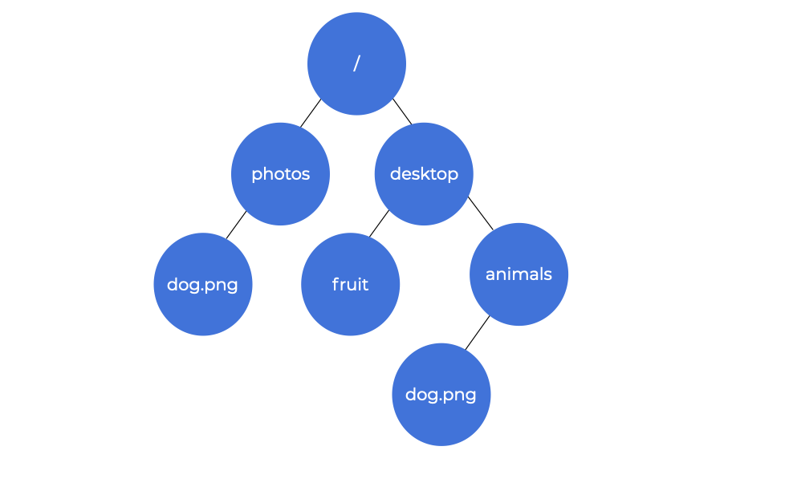
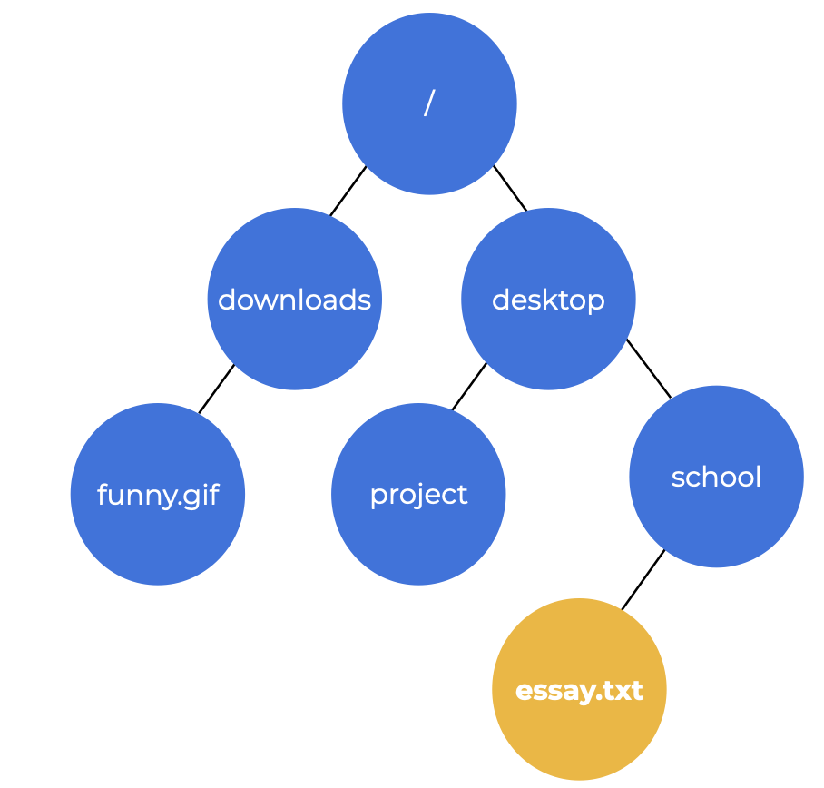
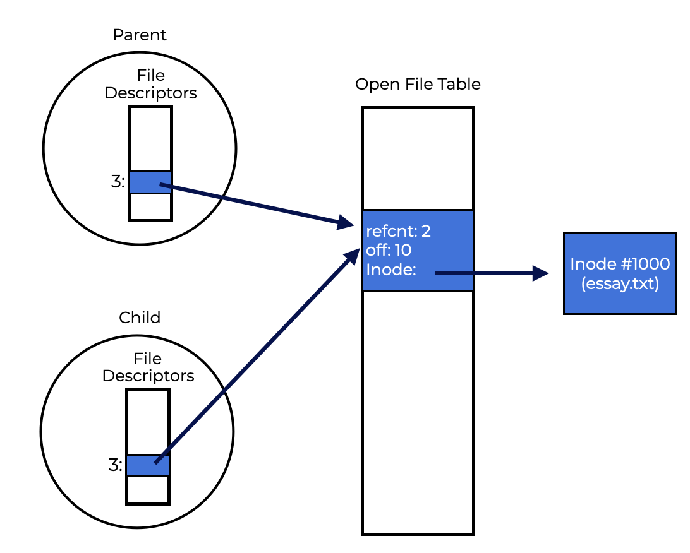

# Introduction
# 介绍
Let’s add **persistent storage** to our collection of virtualizations. Hard disk drives or contemporary solid-state storage devices save data **permanently**, unlike memory, which **loses data when the power goes out**. These devices contain and maintain sensitive data, so the OS has to handle it carefully.  
让我们把**持久化存储**添加到我们的虚拟化集合中。硬盘驱动器或当代固态存储设备永久保存数据，而不像内存一样，当电源断电时会丢失数据。这些设备包含和维护敏感数据，因此操作系统必须小心处理它们。  
We’ll explore how to manage **persistent storage devices** in the OS. This section should help us answer the following questions  
我们将探索如何在操作系统中管理**持久化存储设备**。本节应该能帮助我们回答以下问题
- How should the OS manage a persistent device?
- 操作系统应该如何管理持久化设备？
- What are the important things to remember about this implementation?
- 关于这种实现有什么重要的事情要记住？
- What API are involved in this task?
- 这个任务涉及哪些API？

# Files And Directories
Storage virtualization is based on two main ideas: the **file** and the **directory**.  
存储虚拟化基于两个主要的想法：**文件**和**目录**。  
A **file** is a group of bytes that can be read or written. Each file has a low-level name in the form of an **inode number**, that users don’t see very often. The file system makes sure that the original file data is always kept on the disk.  
**文件**是一组可以读取或写入的字节。每个文件都有一个低级别的名称，形式为**inode编号**，用户很少看到它。文件系统确保始终将原始文件数据保存在磁盘上。  
In a **directory**, the user-readable name and the low-level name are listed in pairs.  
在**目录**中，用户可读的名称和低级别名称以对的形式列出。  
A **file system** consists of groups of **directories** and the **files** and other directories they contain.  
**文件系统**由**目录**组成，以及它们包含的**文件**和其他目录。  
Say a file has:  
假设一个文件有：  
- inode number `12`
- User-readable name `dog`

The directory would hold the item `dog` as the pair (`dog`, 12), mapping the user-readable name to inode number. **Directory entries** refer to files or other directories. Users can create a **directory tree** (directory hierarchy) by nesting directories within other directories.  
目录将保存项目`dog`作为对（`dog`，12），将用户可读的名称映射到inode编号。**目录条目**引用文件或其他目录。用户可以通过在其他目录中嵌套目录来创建**目录树**（目录层次结构）。

The directory hierarchy starts at the **root directory** (`/` in UNIX-based systems) and uses a separator to identify sub-directories until the desired file or directory is specified.  
目录层次结构从**根目录**（基于UNIX的系统中的`/`）开始，并使用分隔符来标识子目录，直到指定所需的文件或目录。  

The file `dog.png` would be referenced by its **absolute pathname**, `/photos/dog.png`, if it were inside the directory photos. The image to the left shows a directory tree with folders and files.  
如果文件`dog.png`位于目录photos中，则通过其**绝对路径名**`/photos/dog.png`进行引用。左侧的图像显示了一个目录树，其中包含文件夹和文件。  

`/photos/dog.png` and `/desktop/animals/dog.png` are both files named `dog.png`.  
`/photos/dog.png`和`/desktop/animals/dog.png`都是名为`dog.png`的文件。 

Here, the file name has two parts: `dog` and `png`, separated by a period (`dog.png`). The first part can be chosen by the coder. The second part indicates the file type ( `.c, .gif, .jpg, .mp3`, etc.).  
在这里，文件名有两个部分：`dog`和`png`，由句点（`dog.png`）分隔。第一部分可以由编码器选择。第二部分表示文件类型（`.c，.gif，.jpg，.mp3`等）。  

The **file system** provides us with a convenient way to **name** all our files. Names let users identify resources. This means that files on storage devices can all be accessed from a single directory tree under UNIX systems.  
**文件系统**为我们提供了一种方便的方法来**命名**所有文件。名称让用户能够识别资源。这意味着UNIX系统下的存储设备上的所有文件都可以从单个目录树访问。  

## Question
Use the image below to select to correct absolute pathname for the highlighted file.  
使用下图选择正确的绝对路径名以高亮显示的文件。  

The absolute path starts at the root directory, /, and uses a separator to identify sub-directories until the desired file or directory is reached. Follow the directory tree to find the highlighted file, essay.txt. It is inside the directory, school, which is inside the desktop directory. Our absolute path is /desktop/school/essay.txt.  
绝对路径从根目录/开始，并使用分隔符来标识子目录，直到达到所需的文件或目录。遵循目录树以找到高亮显示的文件，essay.txt。它位于school目录中，该目录位于desktop目录中。我们的绝对路径是/desktop/school/essay.txt。

# The File System Interface: Creating Files
Let’s explore the file system interface by looking at **creating**, **accessing**, and **deleting** files.  
让我们通过查看**创建**，**访问**和**删除**文件来探索文件系统接口。  
## **Creating Files**
A program can create a new file by using `open()` and passing it the `O_CREAT` flag. The code to the left creates `aFile` in the current working directory.  
程序可以通过使用`open()`并传递`O_CREAT`标志来创建新文件。左侧的代码在当前工作目录中创建`aFile`。  

The `open()` call accepts several flags. here:  
`open()`调用接受几个标志。这里：  
- **O_CREAT** - creates the file
- **O_CREAT** - 创建文件
- **O_WRONLY** - locks it,
- **O_WRONLY** - 锁定它，
- **O_TRUNC** - truncates it to zero bytes, erasing any existing content
- **O_TRUNC** - 将其截断为零字节，擦除任何现有内容
- **S_IRUSR|S_IWUSR** - permissions are set to allow the owner to read and write to the file.
- **S_IRUSR|S_IWUSR** - 权限设置为允许所有者读取和写入文件。

`open()` returns a **file descriptor**, which is useful. If you have permission to read or write to the file, you can use the **file descriptor** to read or write it.  
`open()`返回一个**文件描述符**，这是有用的。如果您有权限读取或写入文件，则可以使用**文件描述符**来读取或写入它。

A file descriptor is like a capability, a handle that grants you specific powers. To access a file, you can use **methods** like `read()` and `write()`, which point to file objects.  
文件描述符就像一个能力，一个授予您特定权限的句柄。要访问文件，您可以使用`read()`和`write()`等**方法**，这些方法指向文件对象。  

The operating system manages file descriptors per process.  
操作系统根据进程管理文件描述符。

# Shared File Table Entries: fork() And dup()
The file descriptor to open file table mapping is often one-to-one. Every time a process opens, reads, and closes a file, it gets its own entry in the open file table.  
打开文件表映射的文件描述符通常是一对一的。每次进程打开，读取和关闭文件时，它都会在打开文件表中获得自己的条目。  
Each file’s logical read or write has its own current offset. There are times, however, where an open file table item may be shared.  
每个文件的逻辑读取或写入都有自己的当前偏移量。然而，有时打开文件表项可能会被共享。  
Let’s look at the example code to the left, fork-seek.c. In this example:  
让我们看看左侧的示例代码fork-seek.c。在这个例子中：  
- The parent process uses fork() to create a child
- 父进程使用fork()创建一个子进程
- Parent waits for it to finish
- 父母等待它完成
- The child calls lseek() to adjust the current offset and exits
- 孩子调用lseek()来调整当前偏移量并退出
- The parent checks the current offset and prints it.
- 父母检查当前偏移量并打印它。
- This causes the parent and child to share the same open file table entry.
- 这导致父母和孩子共享相同的打开文件表项。

The private descriptor array of each process is linked to a shared open file table entry that connects to the underlying file-system inode. The reference count for file table entries shared by two processes increases until both processes exit the file  
每个进程的私有描述符数组与连接到底层文件系统inode的共享打开文件表条目相连。两个进程共享的文件表条目的引用计数会增加，直到两个进程退出文件

# File Information
We expect a file system to keep certain information, called **metadata**, about each file it stores. To see a file’s **metadata**, you can use the `stat()` or `fstat()` system functions.  
我们希望文件系统保留有关它存储的每个文件的某些信息，称为**元数据**。要查看文件的**元数据**，可以使用`stat()`或`fstat()`系统函数。  

A file’s metadata includes information like:  
文件的元数据包括以下信息：  
- The file’s size in bytes,
- 文件的大小（以字节为单位），
- Inode number,
- inode编号，
- Ownership information
- 所有权信息
- When the file was viewed or modified.
- 文件何时被查看或修改。

An inode is a file system structure that stores this type of data. An inode is like a file system’s personal persistent data structure containing the data seen above. All inodes are stored on disk, with a copy in memory to speed up access.  
inode是存储此类数据的文件系统结构。inode就像文件系统的个人持久数据结构，其中包含上述数据。所有inode都存储在磁盘上，内存中有一份副本以加快访问速度。

# Hard Links
Let’s look at a new mechanism for creating an entry in the file system tree. The link()system call accepts two arguments:  
让我们看看在文件系统树中创建条目的新机制。link()系统调用接受两个参数：
- An old pathname
- A new pathname.
By linking the new file name to the old one, you can refer to the same file in another way. We can use the ln command to do this. Repeat this code in the terminal to see for yourself.  
通过将新文件名链接到旧文件名，您可以以另一种方式引用同一个文件。我们可以使用ln命令来做到这一点。在终端中重复此代码，以便自己查看。  

This is where unlink() gets its name. Making a file completes two tasks by  
这就是unlink()得名的地方。通过使文件完成两个任务
- Creating an inode structure that will track the file’s metadata, and  
- 创建一个inode结构，该结构将跟踪文件的元数据，
- Linking that file to a human-readable name to be put in a directory.
- 将该文件链接到一个可读的名称，以便放入一个目录。

The original file name and the new file name are both links to the underlying metadata about the file stored in inode number 7525.  
原始文件名和新文件名都是链接到inode编号7525中存储的有关文件的底层元数据的链接。

# Permission Bits and Access Control Lists
Virtualization gives us two central abstractions: CPU and memory. In reality, the OS uses multiple strategies to safely divide scarce physical resources among competing units. It also gives us a virtual view of a drive, changing it from a collection of raw blocks into more user-friendly files and directories.  
虚拟化为我们提供了两个中心抽象：CPU和内存。实际上，操作系统使用多种策略来安全地在竞争单元之间将稀缺的物理资源分配给它们。它还为我们提供了一个虚拟驱动器的视图，将其从一组原始块更改为更用户友好的文件和目录。  

Unlike the CPU and memory, files are commonly shared across users and processes and are not always private. File systems frequently have a broader set of techniques for varying levels of sharing.  
与CPU和内存不同，文件通常在用户和进程之间共享，并且并不总是私有的。文件系统通常具有更广泛的技术，用于不同级别的共享。

The first type is the UNIX permission bits.   
第一种是UNIX权限位。  
Permissions are divided into three categories:  
权限分为三个类别：
- what the file’s **owner** can do,  
- 文件的所有者可以做什么，
- what a **group** can do, and  
- 一组可以做什么，
- what anyone (known as **other**) can do.  
- 任何人（称为其他）可以做什么。

# Summary
The file system interface in UNIX seems simple, but there is a lot to learn. The best way to understand it deeply is to use it a lot.  
UNIX中的文件系统接口似乎很简单，但有很多东西要学。理解它深入的最好方法是多使用它。  
## **Key Terms**  
- You can create, read, write, and remove **files**.  
- 您可以创建，读取，写入和删除文件。
    - A file has a low-level integer identifier called an **inode number**
    - 文件具有称为inode编号的低级整数标识符
- A **directory** is a set of tuples with a human-readable name and an inode number.
- 目录是一组具有可读名称和inode编号的元组。
    - Each entry links to a different directory or file. Each directory also has an inode-number.
    - 每个条目都链接到不同的目录或文件。每个目录也有一个inode编号。
    - A directory always contains two special entries: the self-referential. and the parent-referential..
    - 目录总是包含两个特殊条目：自我参考和父参考。
- A **directory tree** or **directory hierarchy** arranges all files and directories into a big tree, beginning at the **root /.**
- 目录树或目录层次结构将所有文件和目录排列成一个大树，从根目录/开始。
- A process has to first ask the operating system for permission to access a file. A **file descriptor** is returned if permission is given with the intent to enable read or write access.
- 进程首先必须向操作系统请求访问文件的权限。如果允许访问，则返回文件描述符，以便启用读取或写入访问。
- Each file descriptor relates to an entry in the **open file table**. A file’s **current offset** and other important information are tracked in this entry.
- 每个文件描述符都与打开文件表中的条目相关联。文件的当前偏移量和其他重要信息在此条目中进行跟踪。
- Processes can use `lseek()` to modify the current offset, allowing random access to different regions of the file.
- 进程可以使用lseek（）来修改当前偏移量，从而允许对文件的不同区域进行随机访问。
- A process must use `fsync()` or similar functions to update persistent data. However, doing so correctly while keeping high performance is difficult.
- 进程必须使用fsync（）或类似的函数来更新持久数据。但是，在保持高性能的同时正确执行是困难的。
- You can use **hard links** or **symbolic links** to have several human-readable names point to the same underlying file. Consider their strengths and disadvantages before using them. Remember that removing a file only unlinks it from the directory hierarchy.
- 您可以使用**硬链接**或**符号链接**来让几个可读名称指向同一个底层文件。在使用它们之前，请考虑它们的优点和缺点。请记住，删除文件只会将其从目录层次结构中取消链接。
- Most file systems allow you to turn sharing on and off. **Permissions bits** give a basic method for these controls. **Access control lists** provide more precise control over who can access and change data.
- 大多数文件系统允许您打开和关闭共享。权限位为这些控件提供了基本方法。访问控制列表提供了更精确的控制，以确定谁可以访问和更改数据。