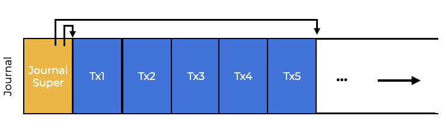

# Introduction
The file system handles a collection of data structures to implement the required abstractions like:  
文件系统处理一组数据结构来实现所需的抽象，如：
- **Files**  
- **Directories**
- All associated **metadata**.

Most data structures (like those in a program’s memory) must **perish**, so file system data structures must **persist** (like hard disks or flash-based SSDs).  
大多数数据结构（如程序内存中的数据结构）必须**消亡**，因此文件系统数据结构必须**持久化**（如硬盘或基于闪存的SSD）。  

A file system must update persistent data structures even if the system fails. Power loss and failures make updating persistent data structures difficult. This causes the issue of **crash-consistency** in file system implementation.  
即使系统失败，文件系统也必须更新持久数据结构。电源损失和故障使更新持久数据结构变得困难。这导致了文件系统实现中的**崩溃一致性**问题。  
Assume you need to update two on-disk structures, `A` and `B`. The disk can only handle one request at a time, so either `A` or `B` will arrive first. It will be inconsistent if the system fails or loses power after only one writing.  
假设您需要更新两个磁盘结构，`A`和`B`。磁盘一次只能处理一个请求，因此`A`或`B`将首先到达。如果只有一个写入后系统失败或丢失电源，则会不一致。  

We need to be able to update the disk despite crashes.  
我们需要能够更新磁盘，尽管会崩溃。  

Because crashes can occur at any time, we must make sure that the file system maintains a reasonable on-disk image.  
因为崩溃可能随时发生，我们必须确保文件系统维护一个合理的磁盘映像。  

In this section, we’ll start by:  
在本节中，我们将首先：  
- looking at the **file system checker (fsck)** used by older file systems.  
- 查看旧文件系统使用的文件系统检查器（fsck）。
- Then we’ll look at **journaling** (also known as **write-ahead logging)**, which adds overhead to each write but recovers faster from crashes or power outages.  
- 然后我们将研究日志记录（也称为预写日志），它为每次写入添加了额外的开销，但从崩溃或断电中恢复得更快。  
- We’ll cover the basics of journaling, as well as some of the more recent journaling file systems.
- 我们将介绍日志记录的基础知识，以及一些最近的日志记录文件系统。

## Questions
Data such as files, directories, and metadata must be stored on media that keep data even when power is lost.  
文件，目录和元数据等数据必须存储在即使断电也能保持数据的介质上。  


# A Detailed Example
To explore journaling, let’s look at a **workload** that modifies on-disk structures. The goal will be to append a single data block to a file.  
为了探索日志记录，让我们看看一个修改磁盘结构的**工作负载**。目标是将单个数据块附加到文件。  
To append a file:  
要附加一个文件：  
- Open it,
- 打开它，
- Use `lseek()` to shift the file offset to the end of the file,
- 使用`lseek()`将文件偏移量移动到文件末尾，
- Issue a single **4KB** write, and
- 发出单个**4KB**写入，
- Close it.  
- 关闭它。  

Assume we are using the simple file system structures on the disk. This example has:  
假设我们正在使用磁盘上的简单文件系统结构。这个例子有：  
- an inode bitmap (**8** bits per inode),
- inode位图（每个inode **8** 位），
- a data bitmap (**8** bits per data block),
- 数据位图（每个数据块 **8** 位），
- **8** inodes (**0** to **7**), and
- **8** inodes（**0** 到 **7**），
- **8** data blocks (**0** to **7**).
- **8** 数据块（**0** 到 **7**）。

This is the file system diagram:  
这是文件系统图：


In the image above, just one inode (inode **2**) is allocated and marked. Data block **4** is allocated and indicated in the data bitmap. This is the first version, labeled I[v1].  
在上面的图像中，只有一个inode（inode **2**）被分配和标记。数据块 **4** 被分配并在数据位图中标记。这是第一个版本，标记为I[v1]。  

When we look inside the inode, I[v1], we see:  
当我们查看inode内部时，I[v1]，我们看到：  
```c
owner       : spider-blast
permissions : read-write
size        : 1
pointer     : 4
pointer     : null
pointer     : null
pointer     : null
```

The file size is **1** because it has one block allocated. The first direct pointer points to the file’s initial data block, Da, in block **4**. The other three direct pointers are set to null because they are not being used.  
文件大小为 **1**，因为它有一个分配的块。第一个直接指针指向块 **4** 中的文件的初始数据块Da。其他三个直接指针设置为null，因为它们没有被使用。  

Real inodes contain many more fields.  
真实的inode包含许多更多的字段。

**When changing the file, there are three on-disk structures that must be updated**:  
**当更改文件时，必须更新三个磁盘结构**：  
- The inode (which must link to the new block and record the new larger size owing to the append)  
- inode（必须链接到新块并记录由于附加而产生的新更大的大小）
- the new data block Db, and  
- 新的数据块Db，
- a new version of the data bitmap.  
- 数据位图的新版本。

Now, we will call it B[v2]) to signal that the new data block has been allocated.  
现在，我们将称之为B[v2]）来表示新数据块已被分配。  

The updates to these three structures also mean that we have three blocks in the system memory that need to write to disk.  
对这三个结构的更新也意味着我们有三个块需要写入磁盘。  
The new inode (I[v2]) looks like this:  
新的inode（I[v2]）如下所示：  

```c
owner       : spider-blast
permissions : read-write
size        : 2
pointer     : 4
pointer     : 5
pointer     : null
pointer     : null
```

The new data bitmap (B[v2]) is `00001100`. The data block (Db) now contains anything its users put into files.  
新的数据位图（B[v2]）是`00001100`。数据块（Db）现在包含任何用户放入文件中的内容。 

The final on-disk image of the file system should look like this:  
文件系统的最终磁盘图像应该如下所示：  


**The file system must make three separate writes to the disk**  
**文件系统必须对磁盘进行三个单独的写入**  
- One for each inode (I[v2])
- 每个inode（I[v2]）
- bitmap (B[v2]), and
- 位图（B[v2]），
- data block (D[v2]) (Db).
- 数据块（D[v2]）（Db）。

The dirty inode, bitmap, and new data will first sit in main memory (in the **page cache** or **buffer cache**) for a while before the file system decides to write them to disk (after **5** or **30** seconds).  
脏的inode，位图和新数据将在文件系统决定将它们写入磁盘之前（**5**或**30**秒）先在主存中（在**页面缓存**或**缓冲区缓存**）一段时间。  

A crash can prevent these upgrades from taking place. If a crash happens after one or two of these writes but not all three, the file system may be left in an odd condition.  
崩溃可能会阻止这些升级。如果崩溃发生在这些写入之后的一个或两个，但不是所有三个，文件系统可能会处于奇怪的状态。


## Questions
3 on-disk updates and writes must be issued to the disk:  
3个磁盘更新和写入必须发出给磁盘：  
- The updated inode
- 更新的inode
- **The new data block, and **
- **新的数据块，**
- The new version of the data bitmap
- 数据位图的新版本

# Crash Scenarios
Looking at various crash scenarios can help us to better understand the issue.  
查看各种崩溃场景可以帮助我们更好地了解这个问题。  
## When only one write succeeds

If only one write succeeds, there are three possible outcomes:  
如果只有一个写入成功，有三种可能的结果：  
- **The disk writes only the data block (Db)**. If this happens, there is no inode pointing to it, and no bitmap saying the block is allocated. It’s like the write never happened. From the perspective of file-system crash consistency, this is okay.
- **磁盘只写入数据块（Db）**。如果发生这种情况，没有指向它的inode，也没有位图说块已分配。这就像写入从未发生过一样。从文件系统崩溃一致性的角度来看，这是可以的。

- **Only the modified inode (I[v2]) is saved**. Here, the inode points to disk address (5), but Db has not yet been written there. With that pointer, we’ll read garbage from the disk (the old contents of disk address 5).  
- **只有修改的inode（I[v2]）被保存**。在这里，inode指向磁盘地址（5），但Db尚未写入那里。有了那个指针，我们将从磁盘读取垃圾（磁盘地址5的旧内容）。
    - We also have a new issue called **file-system inconsistency**. The bitmap on disk says data block 5 hasn’t been allocated, but the inode says it has. To use the file system, we must address the conflict between the bitmap and the inode.  
    - 我们还有一个称为**文件系统不一致性**的新问题。磁盘上的位图表示数据块5尚未分配，但inode表示它已分配。要使用文件系统，我们必须解决位图和inode之间的冲突。
- **Only the updated bitmap (B[v2]) is written**. The bitmap says block 5 is allocated, but no inode points to it. As a result, the file system is inconsistent again, and block 5 will never be used by the file system. This is what we call **space leak**.  
- **只有更新的位图（B[v2]）被写入**。位图说块5已分配，但没有inode指向它。因此，文件系统再次不一致，并且块5将永远不会被文件系统使用。这就是我们所说的**空间泄漏**。

## When two writes succeed and one fails
**When two writes succeed and one fails**:  
**当两个写入成功，一个失败时**：  
- **The bitmap (B[v2]) and the indoe (I[v2]) are written, but not data (Db)**. The inode points to block 5, the bitmap indicates that 5 is in use, and therefore everything seems good from the file system metadata standpoint. But there’s a catch: 5 is full of garbage.  
- **位图（B[v2]）和inode（I[v2]）被写入，但没有数据（Db）**。inode指向块5，位图表明5正在使用，因此从文件系统元数据的角度来看，一切似乎都很好。但是有一个问题：5被垃圾填满了。  
- Only the inode (I[v2]) and data block (Db) are written, and the bitmap (B[v2]) is not. In this scenario, the inode points to the correct data on disk, but there is a discrepancy between the inode and the old bitmap (B1). So, before accessing the file system, we must again solve the issue.
- 只有inode（I[v2]）和数据块（Db）被写入，位图（B[v2]）没有。在这种情况下，inode指向磁盘上的正确数据，但inode与旧位图（B1）之间存在差异。因此，在访问文件系统之前，我们必须再次解决这个问题。  
- Only the bitmap (B[v2]) and data block (Db) are written, and the inode (I[v2]) fails. In this scenario, the inode and the data bitmap are inconsistent. We don’t know which file it belongs to because no inode points to it.  
- 只有位图（B[v2]）和数据块（Db）被写入，inode（I[v2]）失败。在这种情况下，inode和数据位图不一致。我们不知道它属于哪个文件，因为没有inode指向它。  

## Crash Consistency Issues
This should show the multiple issues that crashes can cause our on-disk file system image:  
这应该显示崩溃可能导致我们的磁盘文件系统图像的多个问题：  
- inconsistency in file system data structures,
- 文件系统数据结构的不一致性，
- space leaks,
- 空间泄漏，
- returning garbage data to a user, etc.
- 将垃圾数据返回给用户等。 

We’d like to **atomically** change the file system from its “before the file was appended to” state to another “after the inode, bitmap, and new data block have been written to disk” state. The difficulty lies in the fact that the disk only commits one write at a time, and crashes or power outages may occur between any of them. This is the **crash-consistency problem** or **consistent-update problem**.  
我们希望**原子地**将文件系统从“文件被追加到之前”的状态更改为另一个“inode，位图和新数据块已写入磁盘之后”的状态。困难在于，磁盘一次只提交一个写入，并且可能在任何写入之间发生崩溃或断电。这就是**崩溃一致性问题**或**一致更新问题**。

# Solution #1
Earlier file systems used a basic crash consistency technique that fixed inconsistencies after rebooting.  
早期的文件系统使用了一种基本的崩溃一致性技术，该技术在重新启动后修复不一致性。  

`fsck` is a UNIX tool for finding and resolving these discrepancies. This tool does not work when the file system looks to be consistent but the inode points to junk data. Its real output is merely testing metadata internal correctness.  
`fsck`是一个UNIX工具，用于查找和解决这些不一致性。当文件系统看起来是一致的，但inode指向垃圾数据时，此工具不起作用。它的真实输出仅仅是测试元数据内部正确性。  

`fsck` runs in several phases:  
`fsck`分为几个阶段运行：
- A `fsck` is performed before the file system is mounted and made available to users.  
- 在将文件系统挂载并使其对用户可用之前，将执行`fsck`。
- This makes the on-disk file system consistent and available to users.  
- 这使磁盘文件系统保持一致并对用户可用。  

When running, `fsck` does the following:  
当运行时，`fsck`执行以下操作：  
- **Superblock**: `fsck` checks the superblock by comparing the file system size to the allotted blocks. Finding corrupt superblocks is the goal. In this case, the system (or administrator) can use a backup superblock.  
- **超级块**：`fsck`通过比较文件系统大小与分配的块来检查超级块。查找损坏的超级块是目标。在这种情况下，系统（或管理员）可以使用备份超级块。
- **Free blocks**: Then `fsck` traverses the inodes, indirect blocks, double indirect blocks, etc. to determine the file system’s current block allocation. It relies on inode information to produce correct allocation bitmaps, thus any discrepancy between bitmaps and inodes is addressed. Also, all inodes are checked for use in the inode bitmaps.  
- **Superblock**：`fsck`通过比较文件系统大小与分配的块来检查超级块。寻找损坏的超级块是目标。在这种情况下，系统（或管理员）可以使用备份超级块。  
- **Inode state**: Every inode is checked for damage. For example: `fsck` checks each inode’s type field (e.g., regular file, directory, symbolic link, etc.). Unresolved inode field issues are dealt with by `fsck` and the inode bitmap is refreshed.  
- **Superblock**：`fsck`通过比较文件系统大小与分配的块来检查超级块。寻找损坏的超级块是目标。在这种情况下，系统（或管理员）可以使用备份超级块。  
- **Inode links**: `fsck` counts the links in each inode. A folder reference (or link) counts the number of folders that contain a file reference (or link). Each file and directory in the file system has its own link count, which is validated by `fsck`. It is necessary to fix the inode count if the newly calculated count does not match. An allocated inode is moved to the lost+found directory when it is discovered.  
- **Superblock**：`fsck`通过比较文件系统大小与分配的块来检查超级块。寻找损坏的超级块是目标。在这种情况下，系统（或管理员）可以使用备份超级块。

- **Duplicates**: `fsck` checks for duplicate block references in inodes. Delete an obvious defective inode. Cloning the pointed-to block would provide each inode its own copy.  
- **Superblock**：`fsck`通过比较文件系统大小与分配的块来检查超级块。寻找损坏的超级块是目标。在这种情况下，系统（或管理员）可以使用备份超级块。  
- **Bad blocks**: Faulty block pointers are detected while scanning the pointer list. An address larger than the partition size is considered “bad”. fsck simply removes the pointer from the inode or indirect block.  
- **Superblock**：`fsck`通过比较文件系统大小与分配的块来检查超级块。寻找损坏的超级块是目标。在这种情况下，系统（或管理员）可以使用备份超级块。  

**Directory checks**: `fsck` doesn’t understand user files, but directories contain file system information. For each directory entry, fsck ensures that the inode referenced is allocated, and that no directory is linked to more than once in the hierarchy.  
**目录检查**：`fsck`不理解用户文件，但目录包含文件系统信息。对于每个目录条目，fsck确保引用的inode已分配，并且没有目录链接到层次结构中超过一次。  

Writing a working `fsck` requires substantial file system knowledge, and testing it in all situations is challenging. But fsck (and comparable approaches) have a basic flaw: they are too slow.  
编写一个工作的`fsck`需要大量的文件系统知识，并且在所有情况下测试它都是具有挑战性的。但是fsck（和类似的方法）有一个基本的缺陷：它们太慢了。  

Scanning a huge disk volume to find all allocated blocks and read the directory tree may take minutes or hours. `fsck` performance became prohibitive as disk size and RAID adoption expanded (despite recent enhancements).  
扫描一个巨大的磁盘卷来查找所有分配的块并读取目录树可能需要几分钟或几小时。随着磁盘大小和RAID采用的扩展，`fsck`性能变得禁止（尽管最近有了改进）。  

`Fsck` performance became prohibitive as disk size and RAID adoption expanded.  
随着磁盘大小和RAID采用的扩展，`fsck`性能变得禁止。  

`fsck`'s main premise is illogical. So just three blocks are written to the drive. To fix issues that arose during the update, a full disk scan would be restrictively expensive. It’s like leaving your keys on the bedroom floor and then searching the entire home, starting in the basement and working your way up. The solution is inefficient. As disks (and RAIDs) grew, more solutions were required.  
`fsck`的主要前提是不合理的。所以只有三个块被写入驱动器。为了修复更新期间出现的问题，完整的磁盘扫描将是严重的昂贵的。这就像把钥匙放在卧室地板上，然后在整个家里搜索，从地下室开始，然后向上工作。这个解决方案是低效的。随着磁盘（和RAID）的增长，需要更多的解决方案。

## Question  
Running a tool like fsck is prohibitive because it is very slow and inefficient.  
运行像fsck这样的工具是禁止的，因为它非常慢而且低效。 

# Solution #2
The most prevalent answer to the problem of continuous updates comes from the area of database management systems.  
解决连续更新问题的最普遍的答案来自数据库管理系统的领域。  
**Write-ahead logging**, or **journaling**, was created to handle exactly this type of issue. Many current file systems adopt this principle.  
**预写日志**，或**日志记录**，是为了处理这种类型的问题而创建的。许多当前的文件系统采用这个原则。  
With write-ahead logging, before an update is made on the disk, a note is made somewhere else on the disk stating what is about to happen.  
使用预写日志，在磁盘上进行更新之前，会在磁盘的其他地方记录即将发生的事情。  
If a crash happens during a structure overwrite, instead of scanning the entire disk, you can just refer to the note you wrote and try again. Journaling adds work during updates to reduce recovery effort.  
如果在结构覆盖期间发生崩溃，而不是扫描整个磁盘，您只需参考您写的笔记并重试。日志记录在更新期间增加了工作量以减少恢复工作量。  
With Linux ext3, a well known journaling file system, the disk is separated into block groups, and each block group has an inode bitmap, data bitmap, inodes, and data blocks. The new key structure is the journal, which takes up little space in the partition or elsewhere.  
使用Linux ext3，一个众所周知的日志记录文件系统，磁盘被分成块组，每个块组都有一个inode位图，数据位图，inode和数据块。新的关键结构是日志，它在分区或其他地方占用很少的空间。  

Ext2 file system (without journaling):  
Ext2文件系统（没有日志记录）：


A journaled ext3 file system looks like this:  
日志记录的ext3文件系统如下所示：  


## Question
Write-ahead logging or journaling has a journal that is contained with the block group. It also writes a small note ahead of an action that can be referenced in the case of a crash.  
预写日志或日志记录具有包含块组的日志。它还会在崩溃的情况下引用的操作前写入一个小的笔记。

# Data Journaling
Let’s look at **data journaling**.  
让我们看看**数据日志记录**。  
Let’s say we want to rebuild the inode, bitmap, and data block to disk. We log them before storing them on disk. This will appear in the log:  
假设我们想要将inode，位图和数据块重建到磁盘。我们在将它们存储在磁盘之前将它们记录在日志中。这将出现在日志中：  


Five blocks are used here. `TxB` contains the final addresses of blocks I[v2], B[v2], and Db (the pending file system update) and a **transaction identifier** (`TID`).  
这里使用了五个块。`TxB`包含I[v2]，B[v2]和Db（待处理的文件系统更新）的最终地址和**事务标识符**（`TID`）。  

Then comes **physical logging**, three blocks of the update’s specific physical content. The last block (TxE) carries the transaction ID.  
然后是**物理日志记录**，更新的特定物理内容的三个块。最后一个块（TxE）携带事务ID。  

Once this transaction is safely placed on disk, we **checkpoint** the file system and overwrite the existing structures. To do this, we write I[v2], B[v2], and Db to disk. So our initial operation sequence is:  
一旦这个事务被安全地放置在磁盘上，我们就会**检查点**文件系统并覆盖现有结构。要做到这一点，我们将I[v2]，B[v2]和Db写入磁盘。因此，我们的初始操作序列是：  
- **Journal write**: Write the transaction to the log, including a transaction-begin block, all pending data and metadata modifications, and a transaction-end block.  
- **日志写入**：将事务写入日志，包括事务开始块，所有待处理的数据和元数据修改以及事务结束块。  
- **Checkpoint**: Update the pending information and data in the file system.  
- **检查点**：更新文件系统中的待处理信息和数据。

We start with TxB, I[v2], B[v2], Db, and TxE. After these writes, we checkpoint I[v2], B[v2], and Db to their ultimate destinations on disk.  
我们从TxB，I[v2]，B[v2]，Db和TxE开始。在这些写入之后，我们将I[v2]，B[v2]和Db检查到磁盘上的最终目的地。  
Writing TxB, I[v2], B[v2], Db, TxE to disk can cause issues. One easy but slow technique is to send out one write at a time, waiting for each one to finish. The final goal is to combine all five block writes into a single sequential write. But, the disk may undertake internal scheduling and finish little parts of the main write in any order. So the disk can write TxB, I, B, and TxE first, then Db. What happens if the disk loses power between (1) and (2)?  
将TxB，I[v2]，B[v2]，Db，TxE写入磁盘可能会导致问题。一种简单但缓慢的技术是一次发送一个写入，等待每一个完成。最终目标是将所有五个块写入合并为单个顺序写入。但是，磁盘可能会进行内部调度，并以任何顺序完成主要写入的小部分。因此，磁盘可以首先写入TxB，I，B和TxE，然后是Db。如果磁盘在（1）和（2）之间失去电源会发生什么？  


However, the transaction appears valid. The file system cannot see the fourth block since it is arbitrary user data. Rebooting and running recovery will replicate this transaction and copy ‘??’ where Db should be. Defective or missing superblocks can corrupt or delete user data.  
然而，事务看起来是有效的。由于它是任意用户数据，文件系统无法看到第四块。重新启动并运行恢复将复制此事务并将“??”复制到Db应该在的位置。损坏或丢失的超级块可以损坏或删除用户数据。  

It uses two-step transactional writing to avoid this. It first writes all blocks except TxE to the journal. The diary will then look like this (if we keep appending):  
它使用两步事务写入来避免这种情况。它首先将除TxE之外的所有块写入日志。日记将如下所示（如果我们继续追加）：  


After that, the file system writes the TxE block, leaving the journal in this safe state:  
之后，文件系统写入TxE块，将日志保留在这种安全状态：  


The disk’s atomicity guarantee is a key part of this procedure. The disk ensures that any 512-byte will either be written fully or not.  
磁盘的原子性保证是这个过程的关键部分。磁盘确保任何512字节都将完全写入或不写入。  
Writing TxE should be a single **512**-byte block to ensure atomicity. We now have a three-phase file system updating mechanism:  
写入TxE应该是一个单独的512字节块以确保原子性。我们现在有一个三阶段的文件系统更新机制：  
- **Journal write**: Write the transaction’s contents (TxB, metadata, and data) to the log.  
- **日志写入**：将事务的内容（TxB，元数据和数据）写入日志。
- **Journal commit**: Write the transaction commit block (including TxE) to the log.
- **日志提交**：将事务提交块（包括TxE）写入日志。
- **Checkpoint**: Write the update’s contents (metadata and data) to disk.
- **检查点**：将更新的内容（元数据和数据）写入磁盘。


## Question 
Data journaling is the process of logging the transaction, the dirty data, its metadata, and a transaction end block, then performing a checkpoint where the pending data and metadata is updated to their final physical locations.  True.
数据日志记录是记录事务，脏数据，其元数据和事务结束块的过程，然后执行检查点，其中待处理的数据和元数据更新到其最终的物理位置。   Yes.


# Recovery
A file system can use the journal to recover from a crash.  
文件系统可以使用日志从崩溃中恢复。  
If the crash happens before the transaction is successfully logged, the pending update is skipped.  
如果在成功记录事务之前发生崩溃，则跳过待处理的更新。  
It is possible to recover updates if the file system crashes after the transaction commits but before the checkpoint.  
如果文件系统在事务提交但在检查点之前崩溃，则可以恢复更新。  
The file system then attempts to write the blocks to their final on-disk locations. This is called **redo logging**. The file system then mounts the file system and prepares for future requests.  
然后，文件系统尝试将块写入其最终的磁盘位置。这称为**重做日志**。然后，文件系统将文件系统挂载并准备接受未来的请求。  
It is okay for a crash to occur during checkpointing. If certain updates have already happened, then the remaining updates will be performed during recovery.  
在检查点期间发生崩溃是可以的。如果某些更新已经发生，则在恢复期间将执行剩余的更新。  

## Question
A file system can use journaling to recover after a system crash.  
文件系统可以使用日志在系统崩溃后恢复。

# Batching Log Updates
To avoid unnecessary disk traffic, some file systems, like Linux ext3, do not commit updates one by one to disk, but rather buffer all updates into a global transaction.  
为了避免不必要的磁盘流量，一些文件系统（如Linux ext3）不会将更新逐个提交到磁盘，而是将所有更新缓冲到全局事务中。  
When files are created, the file system labels the in-memory inode bitmap, file inodes, directory data, and directory inode as dirty and adds them to the current transaction’s list of blocks.  
当创建文件时，文件系统将内存中的inode位图，文件inode，目录数据和目录inode标记为脏，并将它们添加到当前事务的块列表中。  
This single global transaction is committed after a 5 second timeout. By buffering updates, a file system can avoid excessive disk write traffic.  
此单个全局事务在5秒超时后提交。通过缓冲更新，文件系统可以避免过多的磁盘写入流量。

## Question
To avoid unnecessary disk traffic, some file systems, like Linux ext3, do not commit updates one by one to disk, but rather buffer all updates into a global transaction.  
为了避免不必要的磁盘流量，一些文件系统（如Linux ext3）不会将更新逐个提交到磁盘，而是将所有更新缓冲到全局事务中。


# The Finite Log

The journal, or write-ahead log has a limit. If we keep adding transactions, it will fill up.  
日志，或预写日志有一个限制。如果我们继续添加事务，它将被填满。  


When the log is filled, two issues arise:  
当日志被填满时，会出现两个问题：  
- recovery takes a longer time because it must replay all transactions within it, and
- 恢复需要更长的时间，因为它必须重放其中的所有事务，以及
- the file system becomes useless since no additional transactions may be committed to disk.  
- 文件系统变得无用，因为无法将其他事务提交到磁盘。

Journaling file systems use a **circular log** to ensure their integrity. An uncheckpointed transaction is stored in a **journal superblock**, and the previously occupied space is released.  
日志文件系统使用**循环日志**来确保其完整性。未检查的事务存储在**日志超级块**中，以前占用的空间被释放。  



The journal superblock stores enough information to identify which transactions have not yet been checkpointed. This allows for faster recovery and cyclic log usage.  
日志超级块存储足够的信息来标识哪些事务尚未被检查。这允许更快的恢复和循环日志使用。  

We’ll add another step to our protocol:  
我们将向我们的协议添加另一个步骤：  
- Journal write: Write the contents of the transaction (TxB and the update) to the log.  
- 日志写入：将事务（TxB和更新）的内容写入日志。  
- Journal commit: Write the transaction commit block (TxE) to the log; wait for it to finish.
- 日志提交：将事务提交块（TxE）写入日志；等待完成。  
- Checkpoint: Update the file system content to their final destinations.
- 检查点：将文件系统内容更新到最终目的地。
- Free: Update the journal superblock to label the transaction free.  
- 释放：更新日志超级块以标记事务空闲。

## Question
Journaling file systems use a circular log to ensure their integrity. An uncheckpointed transaction is stored in a journal superblock, and the previously occupied space is released.  
日志文件系统使用循环日志来确保其完整性。未检查的事务存储在日志超级块中，以前占用的空间被释放。  

Using the journal superblock allows for data journaling file systems to use a circular log to keep the space in the journal free.  
使用日志超级块允许数据日志文件系统使用循环日志来保持日志中的空间空闲。


# Metadata Journaling
File system functioning is still slow. Consecutive journaling doubles write traffic, consuming half the drive’s maximum write capacity. A costly search between journal and main file system writes increases overhead for some workloads.  
文件系统的功能仍然很慢。连续日志记录会将写入流量加倍，消耗一半的驱动器的最大写入容量。在日志和主文件系统写入之间进行昂贵的搜索会增加某些工作负载的开销。  

The cost of writing every data block to disk twice has led to several performance improvements. **Data journaling**, the Linux ext3 journaling mode, captures all user data and metadata. Unlike **metadata journaling, ordered journaling** does not write user data to the notebook. So, after the same update, the journal would show:  
将每个数据块都写入磁盘两次的成本已经导致了几种性能改进。**数据日志记录**，Linux ext3日志记录模式，捕获所有用户数据和元数据。与**元数据日志记录**不同，有序日志记录不会将用户数据写入笔记本。因此，在相同的更新之后，日志将显示：  


Because most disk I/O traffic is data, not writing data twice minimizes the I/O load of journaling.  
由于大多数磁盘I/O流量都是数据，而不是将数据写入两次，可以最小化日志记录的I / O负载。  
Take a look at our file-adding In this update, I[v2], B[v2], and Db. One will be written to the file system twice, while the other two will be logged and checked.  
看看我们的文件添加在这个更新中，I[v2]，B[v2]和Db。一个将被写入两次文件系统，而另外两个将被记录和检查。  

For metadata-only journaling, the data blocks should be written first.  
对于仅元数据日志记录，应该先写入数据块。  

File systems like Linux ext3 write data blocks before metadata. The protocol is as follows:  
像Linux ext3这样的文件系统在元数据之前写入数据块。协议如下：  
- Data write: At final location, write data; wait for completion (waiting is optional; details below).  
- 数据写入：在最终位置，写入数据；等待完成（等待是可选的；详见下文）。
- Journal metadata write: Write the begin block and metadata to the log; wait for writes to complete.  
- 日志元数据写入：将开始块和元数据写入日志；等待写入完成。
- Journal commit: Write the transaction commit block (including TxE) to the log; wait for the write to finish.  
- 日志提交：将事务提交块（包括TxE）写入日志；等待写入完成。  
- Checkpoint metadata: Write the metadata update to its final file system location.  
- 检查点元数据：将元数据更新写入其最终的文件系统位置。  
- Free: Later, mark the transaction free in journal superblock.  
- 释放：稍后，在日志超级块中标记事务为空闲。  
  
This protocol allows a file system to prevent garbage pointers by requiring data write first.  
该协议允许文件系统通过先写入数据来防止垃圾指针。  

Crash consistency relies on the rule of “write the pointed-to object before the object that points to it”.  
崩溃一致性依赖于“在指向它的对象之前写入指向的对象”的规则。  

Metadata journaling outnumbers data journaling. NTFS and SGI’s XFS both journal metadata. Unordered and ordered ext3 are supported. While these methods share common metadata, their data semantics vary.  
元数据日志记录超过了数据日志记录。NTFS和SGI的XFS都记录元数据。支持无序和有序的ext3。虽然这些方法共享通用元数据，但它们的数据语义有所不同。  

Forcing data entry before journal entry is not necessary for accuracy. Writing to data, the transaction-begin block, and journaled metadata can all be done concurrently as long as Steps 1 and 2 are done before Step 3.  
强制在日志条目之前输入数据条目不是必需的。只要在第3步之前完成第1步和第2步，就可以并发地写入数据，事务开始块和日志记录的元数据。  

## Question 
Metadata journaling has become popular because it allows for faster file system operation. It also decreases the I/O write traffic significantly.  
元数据日志记录已经流行起来，因为它允许更快的文件系统操作。它还大大减少了I/O写入流量。  

# Solution #3
**Soft Updates** are another way to maintain metadata consistency. For example, it writes a pointed-to data block to disk before the inode that points to it, so the inode never points to garbage.  
**软更新**是另一种维护元数据一致性的方法。例如，它在指向数据块的inode之前将数据块写入磁盘，因此inode永远不会指向垃圾。  

**Copy-on-write (COW)** is also utilized in several file systems, notably Sun’s ZFS. Not overwriting existing files or directories, but simply updating unused storage space. The COW file system updates the root structure with fresh structure references.  
**写时复制（COW）**也在几个文件系统中使用，尤其是Sun的ZFS。不覆盖现有文件或目录，而是简单地更新未使用的存储空间。COW文件系统使用新的结构引用更新根结构。  

**Backpointer-based consistency (BBC)** is another method. Writing is not ordered. Every block in the system gets a back pointer. The file system can tell if a file is consistent by looking at the forward pointer, or address in the inode or direct block. If so, everything has reached disk safely, and the file is consistent; if not, an error is returned.  
**基于后向指针的一致性（BBC）**是另一种方法。写入不是有序的。系统中的每个块都有一个后向指针。文件系统可以通过查看前向指针（或inode或直接块中的地址）来判断文件是否一致。如果是这样，那么所有内容都已安全到达磁盘，并且文件是一致的；如果不是，将返回错误。  
With an extended form of the **transaction checksum** and a few other techniques, the **optimistic crash consistency** strategy issues as many writes to disk as possible while detecting discrepancies.  
通过**事务校验和**的扩展形式和其他几种技术，**乐观崩溃一致性**策略在检测不一致性时尽可能多地将写入磁盘。  

## Question
Copy-on-write, backpointer-based consistency, optimistic crash consistency, and soft updates are all additional methods that are used to improve metadata consistency in file systems.  
写时复制，基于后向指针的一致性，乐观崩溃一致性和软更新都是用于提高文件系统中元数据一致性的其他方法。

# Summary
We introduced the issue of crash consistency and a few of its possible solutions.  
我们介绍了崩溃一致性问题及其可能的解决方案。  
- On newer computers, the earlier way of generating a file system checker may be too slow. So journaling is now widely used.  
- 在较新的计算机上，早期的文件系统检查器可能太慢。因此，日志记录现在被广泛使用。  
- In short, journaling reduces recovery time from O(disk volume size) to O(log volume size), greatly speeding up post-crash recovery.  
- 简而言之，日志记录将恢复时间从O（磁盘卷大小）减少到O（log卷大小），大大加快了崩溃后的恢复。  
- Journaling can take several forms; the most common is ordered metadata journaling, which minimizes traffic to the journal while maintaining sufficient consistency guarantees for both file system information and user data.  
- 日志记录可以采用几种形式;最常见的是有序元数据日志记录，它可以最小化日志的流量，同时为文件系统信息和用户数据提供足够的一致性保证。  
- Solid user data guarantees are undoubtedly one of the most critical things to provide; however, recent research shows that this field is still evolving.  
- 坚实的用户数据保证无疑是提供的最重要的事情之一;然而，最近的研究表明，这个领域仍在发展。  