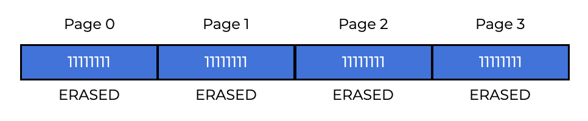
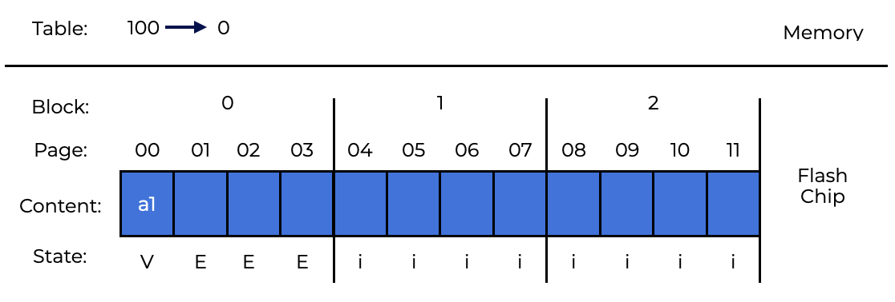

# Introduction
# 介绍
Solid-state storage systems are made entirely of transistors, just like memory and processors.  
固态存储系统完全由晶体管组成，就像内存和处理器一样。  
Unlike conventional random-access memory (RAM), a **solid-state storage device (SSD)** preserves data even when power is lost.  
与传统的随机存取存储器（RAM）不同，**固态存储设备（SSD）**在断电时仍然保留数据。  
**Flash**, which we will explore here, has certain unique properties:  
我们将在这里探索**闪存**，它具有某些独特的特性：  
- to write to a **flash page**, you must first erase a larger piece called a **flash block**, which might be costly and  
- 要写入 **flash 页面**，您必须先擦除一个较大的块，称为 **flash 块**，这可能成本高且
- writing on a page too often will wear it out.
- 写入页面太频繁会使其磨损。

These two features make building a flash-based SSD a unique challenge.  
这两个特性使得构建基于闪存的SSD具有独特的挑战。

## Question
Solid-state drives are made entirely of transistors. This allows them to preserve data even when power is lost.  
固态驱动器完全由晶体管组成。这使得即使在断电时也能保留数据。  

# Storage: From Bits to Banks/Planes
Each transistor in a flash chip stores one or more binary values mapped to the level of charge trapped therein. There are different types of cells:  
闪存芯片中的每个晶体管都存储一个或多个二进制值，这些值映射到其中陷入的电荷水平。有不同类型的单元：  
- **single-level cells (SLC)**: storing only a single bit (i.e., 1 or 0). These chips are faster and more expensive. 
- **单级单元（SLC）**：只存储一个比特（即1或0）。这些芯片速度更快，价格更高。  
- **multi-level cells(MLC)**: storing two bits having differing levels of charge (e.g., 00, 01, 10, and 11 are representing low, somewhat low, somewhat high, and high levels respectively), and  
- **多级单元（MLC）**：存储具有不同电荷水平的两个比特（例如，00，01，10和11分别表示低，有点低，有点高和高水平），并且  
- **triple-level cells (TLC)**: storing 3 bits per cell.  
- **三级单元（TLC）**：每个单元存储3个比特。  

Flash chips are grouped into large **banks** or **planes** of cells.  
闪存芯片被分组到大的**银行**或**平面**的单元中。 

In a bank, data is accessed in two sizes: **blocks** (sometimes called **erase blocks**) of 128 KB or more, and pages of a few KB (e.g., 4KB).  
在一个银行，数据以两种大小访问：128 KB或更多的**块**（有时称为**擦除块**），以及几 KB（例如，4 KB）的页面。

Each bank has several blocks, and each block has many pages. With flash, blocks and pages are distinct from disk blocks, RAID blocks, and virtual memory pages.  
每个银行有几个块，每个块有许多页面。使用闪存，块和页面与磁盘块，RAID块和虚拟内存页面是不同的。  

The image above depicts a flash plane with blocks and pages. There are three blocks, each with four pages.  
上图显示了一个具有块和页面的闪存平面。有三个块，每个块有四个页面。  

To write to a page within a block, you must first erase the entire block. This makes developing a flash-based SSD relatively tough.  
要在块内写入页面，您必须先擦除整个块。这使得开发基于闪存的SSD相对困难。  

## Question
Flash chips cells are grouped into large banks or planes.  
闪存芯片单元被分组到大的银行或平面中。  

# Basic Flash Operations
With this flash arrangement, a flash chip can handle three low-level processes:  
使用这种闪存布局，闪存芯片可以处理三个低级别的过程：  
- **Read a page**: A flash chip client can read any page by sending the read instruction and the appropriate page number.
- **读取页面**：闪存芯片客户端可以通过发送读取指令和适当的页面编号来读取任何页面。
    - This action is often very quick, tens of microseconds or less, regardless of device location or previous request location. This being a **random access** device it can swiftly access any place.
    - 无论设备位置或以前的请求位置如何，此操作通常非常快，十几微秒或更少。这是一个**随机访问**设备，它可以迅速访问任何地方。
- **Erase a block**: Before writing to a page in a flash, you must first erase the block it is contained in.
- **擦除块**：在闪存中写入页面之前，您必须先擦除其中包含的块。
    - To avoid losing data, you must ensure that it has been moved to another location before issuing the erase command. The wipe instruction takes a few milliseconds to complete. The block is then reset and each page is ready to program.
    - 为了避免丢失数据，您必须确保在发出擦除命令之前将其移动到另一个位置。擦除指令需要几毫秒才能完成。然后重置块，每个页面都准备好编程。
- **Program a page**: After erasing a block, the program command can be used to convert some 1s to 0s and write the desired page contents to the flash.
- **编程页面**：在擦除块之后，可以使用编程命令将一些1转换为0，并将所需的页面内容写入闪存。
    - Programming a page is faster than deleting a block, but slower than reading a page on current flash devices.
    - 编程页面比删除块快，但比当前闪存设备上读取页面慢。

Each page in the flash chips has an associated state. Pages begin as `INVALID`.  
闪存芯片中的每个页面都有一个关联的状态。页面开始为`INVALID`。  

All pages within a block are set to `ERASED` when its block is erased. This resets their content and makes them programmable.
当擦除块时，块内的所有页面都将设置为`ERASED`。这会重置它们的内容并使它们可编程。  

A page’s status turns to `VALID` once it is programmed. Programmed means that a page’s contents are set and may be read. Reads are not affected by these states.  
一旦编程，页面的状态就会变为`VALID`。编程意味着页面的内容已设置并且可以读取。读取不受这些状态的影响。

Once a page is programmed, the only way to modify its content is to remove the entire block.  
一旦页面被编程，修改其内容的唯一方法是删除整个块。

In a **4**-page block, the following states change after various erase and program operations:  
在**4**页块中，执行各种擦除和编程操作后，以下状态将发生变化：

## Question
In order to alter the contents programmed to a page, you must delete the entire block the page is within.  
为了更改编程到页面的内容，您必须删除页面所在的整个块。  

# Example
Let’s walk through an example of writing. The following four **8**-bit pages are `VALID` since they have been previously programmed.  
让我们通过一个写入的例子来了解。以下四个**8**位页面是`VALID`，因为它们以前已经被编程过了。  

Let’s write to page **0** to add fresh content. To start writing, we must first erase the block; leaving the block as follows:  
让我们写入页面**0**以添加新内容。要开始写入，我们必须首先擦除块;将块保留为以下内容：  

Now we can program page **0** with contents `00000011`. This overwrites the original page **0** contents (`00011000`). Our block now looks like this:  
现在我们可以用内容`00000011`编程页面**0**。这会覆盖原始页面**0**内容（`00011000`）。我们的块现在看起来像这样：  

After erasing and programing page **0**, all previous contents of pages   **1 , 2, and 3** are gone. Before overwriting any page within a block, we must relocate any important data elsewhere, like in memory or on the flash.  
在擦除和编程页面**0**之后，页面**1，2和3**的所有以前的内容都消失了。在块内覆盖任何页面之前，我们必须将任何重要数据重新定位到其他地方，例如内存或闪存中。  

## Summary
Flash chips read p ages very well and quickly, but when writing a page the entire block must be erased and the chosen page programmed. This can cause flash chips to **wear out**.  
闪存芯片非常好地和快速地读取页面，但是在写入页面时，必须擦除整个块并编程所选的页面。这可能导致闪存芯片**磨损**。  

## Question
Flash chips read pages very well and quickly, but when writing a page the entire block must be erased and the chosen page programmed. This can cause flash chips to **wear out**.  
闪存芯片非常好地和快速地读取页面，但是在写入页面时，必须擦除整个块并编程所选的页面。这可能导致闪存芯片**磨损**。

When using flash chips, reading to pages is fairly straightforward. On the other hand, writing is more complex because entire blocks must be erased before a single page can be programmed.  
在使用闪存芯片时，读取页面相当简单。另一方面，写入更复杂，因为在编程单个页面之前，必须擦除整个块。

# Flash Performance And Reliability
Below is a chart detailing the basic performance characteristics of raw flash chips across the SLC, MLC, and TLC flash.  
下面是一张图表，详细说明了SLC，MLC和TLC闪存芯片的原始闪存芯片的基本性能特性。  

Read latencies take only **10** microseconds.  
读取延迟仅需**10**微秒。  

Program latency increases with bit density, from **200** microseconds for SLC to **900** microseconds for TLC.  
编程延迟随位密度而增加，从SLC的**200**微秒到TLC的**900**微秒。  

In order to get decent write performance, we need to employ multiple flash chips in parallel.  
为了获得不错的写入性能，我们需要并行使用多个闪存芯片。  

Modern flash storage architecture deals with the expensive cost of erasing taking a few milliseconds.  
现代闪存存储体系结构处理擦除费用昂贵的几毫秒。  

Flash chips have are pure silicon and have less reliability difficulties than mechanical disks, which can fail for a multitude of reasons (including the head crash).  
闪存芯片是纯硅，比机械硬盘具有更少的可靠性难题，机械硬盘可能会因多种原因（包括头碰撞）而失败。  

The main worry is **wear out**. Each time a flash block is wiped and programmed, it adds a little charge. Over time, it becomes impossible to distinguish between a **0** and a **1** rendering the block useless.  
主要的担忧是**磨损**。每次擦除和编程闪存块时，它都会增加一点电荷。随着时间的推移，无法区分**0**和**1**，使块变得无用。  

A **10,000** Program/Erase (P/E) cycle lifetime is given to MLC-based blocks by manufacturers. SLC-based devices have a longer lifetime, usually **100,000** P/E cycles, because they only store one bit per transistor. Recent research suggests that SLC lifetimes are longer than expected.  
制造商给出了基于MLC的块的**10,000**编程/擦除（P / E）周期寿命。基于SLC的设备寿命更长，通常为**100,000** P / E周期，因为它们每个晶体管只存储一个比特。最近的研究表明，SLC的寿命比预期的要长。  

**Disturbance** is another flash chip reliability issue. When reading or programming a page in a flash, sometimes bits in surrounding pages become flipped. These bit flips are known as **read disturbs** or **program disturbs** depending on when they occur.  
**干扰**是另一个闪存芯片可靠性问题。当在闪存中读取或编程页面时，有时周围页面中的位会翻转。这些位翻转称为**读取干扰**或**编程干扰**，具体取决于它们发生的时间。  

## Question
The most expensive cost for raw flash chips comes from erasing.  
原始闪存芯片的最昂贵的成本来自于擦除。  

# From Raw Flash to Flash-Based SSD
The standard storage interface reads and writes **512**-byte blocks (or larger). Over the raw flash chips, the flash-based SSD provides a conventional block interface.  
标准存储接口读取和写入**512**字节块（或更大）。在原始闪存芯片上，基于闪存的SSD提供了传统的块接口。  
**SRAM** (static random access memory) is used for data caching, buffering, and mapping tables. It also has device control logic.  
**SRAM**（静态随机存取存储器）用于数据缓存，缓冲和映射表。它还具有设备控制逻辑。  

.guides/img/raw1
The **Flash Translation Layer (FTL)** functions to convert client reads and writes into internal flash operations as needed.  
**闪存翻译层（FTL）**负责将客户端读取和写入转换为内部闪存操作。  

The FTL converts logical block read and write requests into low-level read, erase, and program commands on underlying physical blocks and pages.  
FTL将逻辑块读取和写入请求转换为底层物理块和页面上的低级读取，擦除和编程命令。  

Using multiple flash chips in **parallel** and **write-amplification** (FTL’s total write traffic divided by the client’s total write traffic) both increase performance.  
使用**并行**和**写放大**（FTL的总写入流量除以客户的总写入流量）都可以提高性能。  

To improve reliability, the FTL tries to evenly distribute writes across the flash blocks. As a result, all blocks will **wear out** at the same time. This is called **wear leveling** and is standard in current FTL.   
为了提高可靠性，FTL尝试在闪存块上均匀分布写入。因此，所有块都会在同一时间**磨损**。这称为**磨损平衡**，是当前FTL的标准。   

Program disruption is an additional issue. To avoid disruption, FTLs generally program pages within an erased block in ascending sequence.  
编程干扰是另一个问题。为了避免干扰，FTL通常按升序顺序在擦除的块中编程页面。  

## Question 
Flash Translation Layer functions to convert client reads and writes into the internal flash operations read, erase, and program.  
闪存翻译层负责将客户端读取和写入转换为内部闪存操作读取，擦除和编程。  

# FTL Organization
A **direct mapping** FTL A logical page **N** read corresponds to a physical page **N** read. It must first read the entire block containing page **N**, then erase it, and then program the old and new pages.  
**直接映射**FTL逻辑页面**N**读取对应于物理页面**N**读取。它必须首先读取包含页面**N**的整个块，然后擦除它，然后编程旧页面和新页面。  

Direct-mapped FTL suffers from performance and reliability difficulties. Performance concerns arise from having to read in, erase, and program the entire block for each write. There is a lot of write amplification (proportional to the block size) and poor write performance.  
直接映射的FTL遭受性能和可靠性方面的困难。性能问题来自于每次写入都必须读取，擦除和编程整个块。有很多写放大（与块大小成比例）和写入性能差。  

Also untrustworthy. Reprogramming the same block quickly wears it out and loses data. Insufficient write load distribution among logical blocks leads to premature wear out of the underlying physical blocks containing popular data. It is inconsistent and slow.  
也不可靠。快速重编程同一块会使其磨损并丢失数据。逻辑块之间的写入负载分布不足会导致包含热门数据的底层物理块过早磨损。它是不一致的和缓慢的。  

## Question 
A direct-mapped FTL suffers from performance and reliability difficulties.  
直接映射的FTL遭受性能和可靠性方面的困难。  

A direct mapped FTL, is unreliable and slow due to having to read, erase, and program for every logical write.  
由于每次逻辑写入都必须读取，擦除和编程，直接映射的FTL是不可靠和缓慢的。

# Log-Structured FTL
Most FTLs use logs. A write to logical block **N** adds **N** to the current block’s free space. This is called **logging**. The device maintains a **mapping table** including the physical addresses of all logical blocks.  
大多数FTL使用日志。对逻辑块**N**的写入会将**N**添加到当前块的空闲空间。这称为**日志记录**。该设备维护一个**映射表**，其中包含所有逻辑块的物理地址。  

Clients see it as a conventional disk with **512**-byte sectors (or groups of sectors). Take a look at the **4**-KB pieces. For our purposes, assume the SSD has a huge number of **16**-KB blocks, each partitioned into four **4**-KB pages.  
客户端将其视为具有**512**字节扇区（或扇区组）的传统磁盘。看看**4**KB的部分。为了我们的目的，假设SSD具有大量的**16**KB块，每个块都被分成四个**4**KB页面。  

This example demonstrates the log-based strategy. The client thinks it’s a normal disk because it can read and write **512** sectors (or groups of sectors). For example, the client reads or writes **4**-KB chunks, while the SSD has several **16**-KB blocks, each partitioned into four **4**-KB pages.  
这个例子演示了基于日志的策略。客户端认为它是一个正常的磁盘，因为它可以读取和写入**512**扇区（或扇区组）。例如，客户端读取或写入**4**KB的块，而SSD具有几个**16**KB的块，每个块都被分成四个**4**KB的页面。  

Here is the sequence of operations issued by the client:  
这是客户端发出的操作序列：  

- `Write(100)`  with contents `a1`
- `Write(101)`  with contents `a2`
- `Write(2000)` with contents `b1`
- `Write(2001)` with contents `b2`

The SSD client uses these logical block addresses to store location information.  
SSD客户端使用这些逻辑块地址来存储位置信息。  

The device must record which **physical page** of the SSD each logical block address belongs to. For incorrect blocks, delete them before programming. This is its initial state, with all pages marked `INVALID`.  
设备必须记录每个逻辑块地址属于SSD的哪个**物理页面**。对于错误的块，在编程之前删除它们。这是它的初始状态，所有页面都标记为`INVALID`。  

The FTL decides to write the first write to logical block **100** and physical block **0**, which comprises four physical pages: **0, 1, 2, and 3**. Be fore we can write, the block must be erased, leaving:  
FTL决定将第一个写入逻辑块**100**和物理块**0**，它包括四个物理页面：**0, 1, 2, and 3**。在我们写入之前，块必须被擦除，留下：  

  

Block **0** can now be programmed. Most SSDs write pages in ascending order to reduce program disruption difficulties. The SSD writes logical block   100  to physical page **0**:

Let’s say the client wants to read **100**. A logical block **100** read must be converted to a physical page **0** read. FTL writes logical block **100** to physical page **0** and stores information in an **in-memory mapping table**. The mapping table is shown below:  
假设客户端想读取**100**。逻辑块**100**的读取必须转换为物理页面**0**的读取。FTL将逻辑块**100**写入物理页面**0**并将信息存储在**内存映射表**中。下面是映射表：  

When writing to the SSD, the client normally takes the next free page. The block’s contents are then loaded onto that page, and the logical-to-physical mapping is saved in the SSD’s mapping table. The table will then be used to **translate** the logical block address to the physical page number.  
当写入SSD时，客户端通常会使用下一个空闲页面。块的内容随后将被加载到该页面上，并且逻辑到物理的映射将保存在SSD的映射表中。然后将使用该表来**翻译**逻辑块地址到物理页面号。  

The diagram below shows what the device would state after writes **101**,**2000**, and **2001** in our example write stream are executed.    
下图显示了在我们的示例写入流中执行写入**101**，**2000**和**2001**之后设备的状态。  

  

The log-based approach improves performance and dependability. Writing now spans all pages, extending device life and decreasing wear.  
基于日志的方法提高了性能和可靠性。现在的写入涵盖了所有页面，延长了设备的寿命并减少了磨损。  

This basic log structuring method has several flaws. The first is that overwriting logical blocks generates garbage, which requires frequent collection. Second, in-memory mapping tables are expensive. Larger devices require more memory.  
这种基本的日志结构方法有几个缺点。第一个是覆盖逻辑块会产生垃圾，需要经常收集。其次，内存映射表是昂贵的。较大的设备需要更多的内存。  

## Question
FTL uses an in-memory mapping table to store the logical to physical location pair.  
FTL使用内存映射表来存储逻辑到物理位置对。

# Garbage Collection
Using a log-structured method like this makes a lot of garbage, which means that dead-block reclamation is needed. Let’s think about our last one. Remember that there are logical blocks **100**, **101**, **2000**, and **2001** written.  
使用像这样的日志结构方法会产生大量的垃圾，这意味着需要死亡块回收。让我们想想我们最后一个。记住，有逻辑块**100**，**101**，**2000**和**2001**写入。  

Let’s say that blocks **100** and **101** have been changed so that they now use `c1` and `c2`. A new mapping table is made when you write on free pages.  
假设块**100**和**101**已经被更改，以便它们现在使用`c1`和`c2`。当您在空闲页面上写入时，将创建一个新的映射表。  

Despite being shown as `VALID` in the diagram, actual pages **0** and **1** are garbage. They still have blocks **100** and **101**. Using a log-structure implies overwrites leave behind garbage blocks that must be reclaimed.  
尽管在图中显示为`VALID`，实际页面**0**和**1**仍然是垃圾。它们仍然有块**100**和**101**。使用日志结构意味着覆盖会留下必须回收的垃圾块。  

Garbage collection is the process of discovering and reclaiming **dead blocks**. When a block of garbage pages is detected, the live pages are read in, recorded, and then released for writing.  
垃圾回收是发现和回收**死亡块**的过程。当检测到垃圾页面块时，将读取存活页面，记录并释放以供写入。  

We’ll do what we did before. Some pages in block **0** don’t operate. Take them back: It makes the choice. Pages **0** and **1** are blank. They’re now in block **0**. (Blocks **2000** and **2001** on pages **2** and **3**). It’ll:  
我们将做我们以前做的事情。块**0**中的一些页面不起作用。把它们带回来：它做出选择。页面**0**和**1**是空白的。它们现在在块**0**中。（页面**2**和**3**上的块**2000**和**2001**）。它将：  

In the example, the device performs its garbage collection by  
在示例中，设备通过执行垃圾回收来执行垃圾回收  
- reading the live data on pages 2 and 3,  
- 读取页面2和3上的活动数据，
- writing the live data to the end of the log, and
- 将活动数据写入日志的末尾，
- erasing block 0.
- 擦除块0。

Each block must have enough information to determine a page’s status. This can be done by storing information about which logical blocks are in each page. From there, the device can determine if each page has live data.  
每个块必须有足够的信息来确定页面的状态。这可以通过存储有关每个页面中哪些逻辑块的信息来完成。从那里，设备可以确定每个页面是否具有活动数据。  

Block **0** in our example had logical blocks **100**, **101**, **2000**, and **2001** in it. The mapping table (`100->4, 101->5, 2000->2, 2001->3`) helps the device quickly figure out if each page in the SSD block has live data. For example, the map shows **2000** and **2001**, but not **100** and **101**, which could be used to pick up trash.  
我们示例中的块**0**中包含逻辑块**100**，**101**，**2000**和**2001**。映射表（`100->4, 101->5, 2000->2, 2001->3`）有助于设备快速确定SSD块中的每个页面是否具有活动数据。例如，映射表显示**2000**和**2001**，但不显示**100**和**101**，这可以用来收集垃圾。  

When the garbage collection is complete, the device is in the following state:  
当垃圾回收完成后，设备处于以下状态： 

Garbage collection is costly. Only blocks containing only dead pages can be eliminated without data transfer.  
垃圾回收是昂贵的。只有包含死亡页面的块才能在不进行数据传输的情况下消除。  

Some SSDs feature extra capacity that allows for **over provision**, so cleaning can be delayed until the device is less active. So the client’s bandwidth is not harmed.  
一些SSD具有额外的容量，可以进行**超额提供**，因此清理可以延迟到设备不活跃为止。所以客户的带宽不受到伤害。  

# Block-Based Mapping
The second cost of log-structure is one item every **4**-KB device page. A single **4**-byte item on a **4**-KB page takes up **1** GB of memory on a **1**-TB SSD. Page-level FTL is unusable.  
日志结构的第二个成本是每个**4**-KB设备页面的一个项目。**4**-KB页面上的**4**-字节项目在**1**-TB SSD上占用**1** GB的内存。页面级FTL是不可用的。  

This reduces mapping costs by **`Sizeblock`** divided by **`Sizepage`**. **block-level** Greater virtual memory page sizes require less VPN bits and a wider offset in each virtual address.  
这将映射成本减少了**`Sizeblock`**除以**`Sizepage`**。**块级**更大的虚拟内存页面大小需要更少的VPN位，并且每个虚拟地址中的偏移量更宽。  

A log-based FTL with block-based mapping is sluggish. The fundamental issue is when a “small write” is smaller than a physical block. In this situation, the FTL must read and duplicate the old block’s live data (along with the data from the small write).  
具有块级映射的基于日志的FTL是迟钝的。根本问题是当“小写入”小于物理块时。在这种情况下，FTL必须读取并复制旧块的活动数据（以及来自小写入的数据）。  

Take logical blocks **2000**, **2001**, **2002**, and **2003** (with their contents a,b,c,d) and put them in physical block **1** on physical pages **4**, **5**, **6**, and **7** of physical block **1**. If you used per-page mappings, the table would have to record four mappings for these logical blocks: `2000->4, 2001->5, 2002->6, and 2003->7`.  
将逻辑块**2000**，**2001**，**2002**和**2003**（其内容为a，b，c，d）放在物理块**1**的物理页面**4**，**5**，**6**和**7**上。如果使用每页映射，则该表必须记录这些逻辑块的四个映射：`2000->4, 2001->5, 2002->6, and 2003->7`。  

Using block-level mapping cuts down on the number of address translations that the FTL has to do.  
使用块级映射可以减少FTL必须执行的地址转换的数量。  

Consider the device’s logical address space as being partitioned into blocks the size of flash memory. Two parts: chunk number, offset. In logical addresses, the offset component needs two bits since each physical block contains four logical blocks.  
考虑将设备的逻辑地址空间分成与闪存内存大小相同的块。两部分：块号，偏移量。在逻辑地址中，偏移量组件需要两个比特，因为每个物理块包含四个逻辑块。  

In this example, each of these logical blocks all have the same chunk number (**500**) and different offsets (**0**, **1**, **2**, and **3**, respectively). As shown in the image below, chunk **500** goes to Block **1**, beginning at physical page **4**.  
在这个例子中，这些逻辑块中的每一个都具有相同的块号（**500**）和不同的偏移量（分别为**0**，**1**，**2**和**3**）。如下图所示，块**500**转到块**1**，从物理页面**4**开始。  

FTL simplifies reading. A client’s logical block address is used to get the FTL’s chunk number. The FTL then searches the table for the chunk-to-page mapping. Finally, the FTL calculates the flash page address by adding the logical address offset to the block physical address.  
FTL简化了读取。客户端的逻辑块地址用于获取FTL的块号。然后，FTL搜索表以获取块到页面映射。最后，FTL通过将逻辑地址偏移量添加到块物理地址来计算闪存页面地址。  

The device first looks up the translation in the mapping table to find **4**. Then, it adds the offset from the client’s physical address (**2**). The result is the physical-page address (**6**), which the FTL can read to get the data it needs.  
设备首先在映射表中查找翻译以找到**4**。然后，它添加来自客户端的物理地址（**2**）的偏移量。结果是物理页面地址（**6**），FTL可以读取以获取所需的数据。  

If the client writes contents c to logical block **2002**. FTL must read in **2000**, **2001** and **2003** and write them all to a new location and making changes to the mapping table. Block **1** can then be wiped and reused.  
如果客户端将内容c写入逻辑块**2002**。FTL必须读取**2000**，**2001**和**2003**并将它们全部写入新位置，并对映射表进行更改。块**1**可以被擦除并重用。  

While block level mappings can reduce translation memory requirements, they can negatively effect performance when writes are smaller than the device’s physical block size.  
虽然块级映射可以减少翻译内存需求，但是当写入小于设备的物理块大小时，它们可能会对性能产生负面影响。  

## Question
Block-level mapping cuts down the amount of **address translations**.  
块级映射可以减少**地址转换**的数量。

# Hybrid Mapping
To write differently while saving money, modern FTLs use **hybrid mapping**. In hybrid mapping, the FTL keeps a few erased blocks and directs all writes to them. The FTL does not wish to copy these log blocks, thus it saves per-page mappings for these **log blocks**.  
为了在写入时节省成本，现代FTL使用**混合映射**。在混合映射中，FTL保留了几个擦除的块，并将所有写入指向它们。FTL不希望复制这些日志块，因此它为这些**日志块**保存了每页映射。  

FTL keeps two types of tables:  
FTL保留两种类型的表：  
- the log-table which stores a small set of per-page mappings
- 日志表，用于存储一组较小的每页映射
- the data table which stores the per-block mappings.
- 数据表，用于存储每块映射。

If the FTL can’t find a logical block in the log-table, it looks in the data table to find it.  
如果FTL无法在日志表中找到逻辑块，则在数据表中查找它。  

Hybrid mapping should reduce log block count. The FTL must look at log blocks (one per page) and convert them into blocks with only one pointer. Depending on the block, there are three ways to make this swap.  
混合映射应该减少日志块计数。FTL必须查看日志块（每页一个）并将它们转换为只有一个指针的块。根据块的不同，有三种方法进行此交换。  

If the FTL had written **1000**, **1001**, **1002**, and **1003** to physical block **2** (made up of physical pages **8**, **9**, **10**, **11**), and their contents are a, b, c and d.  
如果FTL将**1000**，**1001**，**1002**和**1003**写入物理块**2**（由物理页**8**，**9**，**10**，**11**组成），并且它们的内容是a，b，c和d。   

Let’s say the client overwrites each of these blocks (in the exact same order) in one of the available log blocks, say physical block **0** (physical pages **0**, **1**, **2**, and **3**). That means that the FTL will be:  
假设客户端在可用的日志块中覆盖了这些块中的每一个（以相同的顺序），例如物理块**0**（物理页**0**，**1**，**2**和**3**）。这意味着FTL将是：  

Because these blocks are identical, the FTL can do a **switch merge**. The old log block (block **2**) has been erased and is now used as a log block. In this case, a single block pointer takes the place of all per-page pointers.  
因为这些块是相同的，FTL可以执行**切换合并**。旧的日志块（块**2**）已被擦除，并现在用作日志块。在这种情况下，单个块指针取代了所有每页指针。  

This switch mode is the best for a hybrid FTL. The FTL isn’t always so lucky. Let’s say that we start with the same thing (logical blocks **1000−1003** in physical block **2**, but the client changes **1000** and **1001**).  
这种切换模式是混合FTL的最佳选择。FTL并不总是如此幸运。假设我们从相同的事情开始（物理块**2**中的逻辑块**1000-1003**，但客户端更改了**1000**和**1001**）。  

As a result of this, only one block pointer can reference the remaining pages of this physical block. Appending logical blocks **1002** and **1003** to the log from physical block **2**. However, the FTL needs to execute more I/O to achieve its goals, increasing write amplification.  
由于这个原因，只有一个块指针可以引用这个物理块的剩余页。将逻辑块**1002**和**1003**附加到物理块**2**的日志中。但是，FTL需要执行更多的I/O来实现其目标，从而增加了写放大。  

A **full merge** is the FTL’s last case, and it takes a lot of work. In this case, the FTL must clean pages from many blocks at once. Imagine writing logical blocks **0**, **4**, **8**, and **12** to log block **A**.  
**完全合并**是FTL的最后一种情况，它需要很多工作。在这种情况下，FTL必须同时清理许多块的页面。想象一下将逻辑块**0**，**4**，**8**和**12**写入日志块**A**。 
- Building a data block with logic blocks **0**, **1**, **2**, and **3** first.  
- 构建一个数据块，其中包含逻辑块**0**，**1**，**2**和**3**。
- Then, the FTL must read logic blocks **1** and **2** somewhere else and write them together in the block.  
- 然后，FTL必须在其他地方读取逻辑块**1**和**2**，并将它们一起写入块中。  
- The merging must then find logical blocks **5**, **6**, and **7** and reassemble them into a single physical block.  
- 然后，合并必须找到逻辑块**5**，**6**和**7**并将它们重新组合成一个物理块。  
- Then, log block A can be freed. Frequent full merges can substantially impair performance and should be avoided whenever possible.  
- 然后，日志块A可以被释放。频繁的完全合并可能会大大降低性能，并且应该尽可能避免。  

## Question
Hybrid mapping presents two mapping tables:
a log-table, and
a data table

# Page Mapping with Caching
Others have come up with more simple ways to cut down on the memory use of page-mapped FTLs. The easiest way is to store only the FTL’s active bits in memory.  
其他人已经想出了更简单的方法来减少页面映射FTL的内存使用。最简单的方法是只在内存中存储FTL的活动位。  

This plan may work. If a process just needs to glance at a few pages, in-memory FTL will save time and space. It may fail. So, if memory doesn’t have a **working set** of translations, you’ll have to read from flash to retrieve the translations.  
这个计划可能会起作用。如果一个进程只需要看一下几页，内存中的FTL将节省时间和空间。它可能会失败。因此，如果内存没有翻译的**工作集**，则必须从闪存中读取以检索翻译。  

The FTL may also have to **evict** a dirty mapping, causing another write. Because the task is often done in the same place, caching saves memory while maintaining performance.  
FTL还可能必须驱逐一个脏映射，导致另一个写入。因为这个任务通常在同一个地方完成，所以缓存可以节省内存同时保持性能。  

## Question
The FTL can cut costs by holding a working set of translations in-memory.  
FTL可以通过在内存中保存翻译的工作集来减少成本。

# Wear Leveling
Modern FTLs incorporate **wear leveling**. The FTL should try to spread the work out evenly because multiple erase and programs cycles will wear down a flash block. Instead of a few “hot” blocks quickly becoming worthless, all blocks will wear out at about the same time.  
现代的FTL包含了**磨损均衡**。FTL应该尝试将工作均匀分布，因为多次擦除和程序周期将磨损闪存块。而不是几个“热”块很快就变得毫无价值，所有块都将在大约相同的时间磨损。  

When you start with a basic log-structuring strategy, it spreads out the writing load. Garbage collection also helps. If a block has long-term data that isn’t changed, garbage collection won’t get rid of it, and it won’t get its fair share of write load.  
当你开始使用基本的日志结构策略时，它会分散写入负载。垃圾收集也有帮助。如果一个块有长期数据，而且不会改变，垃圾收集不会把它去掉，它也不会得到它的公平份额的写入负载。  

In order for the FTL to write again, it needs to read all the live data out of these blocks and write it somewhere else. Performance is slowed down because more I/O is needed to make sure that all blocks wear at about the same rate.  
为了让FTL再次写入，它需要从这些块中读取所有活动数据，并将其写入其他地方。由于需要更多的I / O来确保所有块的磨损率大致相同，因此性能会降低。  

## Question
Wear leveling is a technique that spreads out the writing load.  
磨损均衡是一种技术，它将写入负载分散开来。

Wear leveling is the act of spreading erase/program cycles across all flash blocks.  
磨损均衡是将擦除/程序周期分布在所有闪存块上的行为。

# SSD Performance
Now let’s look at how current SSDs function and how much they cost in terms of long-term storage. We’ll compare modern hard drives to old-fashioned hard drives (HDDs).  
现在让我们看看当前SSD的功能以及它们在长期存储方面的成本。我们将比较现代硬盘驱动器与老式硬盘驱动器（HDD）。  

Like DRAM, flash-based SSDs are “random access” technologies. It can only do a few hundred random I/Os per second. SSDs are much superior. Using data from modern SSDs, we can see how well FTLs disguise raw chip performance concerns.  
像DRAM一样，基于闪存的SSD是“随机访问”技术。它每秒只能做几百个随机I/O。SSD要好得多。使用现代SSD的数据，我们可以看到FTL如何掩盖原始芯片性能问题。  

Here, we look at data from some of the most recent SSDs to see how well FTLs hide the performance issues of the raw chips.  
这里，我们从最近的一些SSD中查看数据，以了解FTL如何隐藏原始芯片的性能问题。  

The table displays In the last row is a Seagate high-end drive. The first three rows present data for three SSD kinds (Samsung, Intel, and Seagate). Lastly, a Seagate hard drive.  
表格显示在最后一行是一个Seagate高端驱动器。前三行显示三种SSD的数据（三星，英特尔和Seagate）。最后是一个Seagate硬盘驱动器。  

The main differences between SSDs and the single hard drive is:  
SSD与单个硬盘驱动器之间的主要区别是：  
- How quickly they can do random I/O. With an SSD hundreds MB/s can be processed, but this “high performance” hard drive can only reach speeds of just a few megabytes per second,  
- 它们如何进行随机I/O。使用SSD可以处理数百MB / s，但这个“高性能”硬盘驱动器只能达到每秒几兆字节的速度，  
- Even though SSDs are better, a hard drive is still a good choice if you only need sequential performance, and  
- 即使SSD比较好，如果你只需要顺序性能，硬盘驱动器仍然是一个不错的选择，  
- SSD random read performance is not as good as random write performance. Many SSDs have a log-structured design that turns random writes into sequential ones, which makes them faster.  
- SSD随机读取性能不如随机写入性能。许多SSD具有结构化日志设计，将随机写入转换为顺序写入，这使它们更快。  

The performance difference between sequential and random I/Os is minor, yet reducing random I/Os is crucial when designing file systems.  
顺序和随机I/O之间的性能差异很小，但是在设计文件系统时减少随机I/O至关重要。  

## Question
SSDs outperform HDDs.  
SSD优于HDD。

# SSD Cost
SSDs outperform current hard drives even while conducting sequential I/0, but SSDs haven’t completely replaced hard drives because of the cost per unit of capability.  
SSD在进行顺序I / O时优于当前的硬盘驱动器，但是由于单位能力的成本，SSD尚未完全取代硬盘驱动器。  

Currently, a 250GB SSD costs around $150.00, or 60 cents per GB.  
目前，250GB SSD的成本约为150美元，即每GB 60美分。  

A typical **1**-TB hard disk costs around $ **50** , or **5** cents per **GB**. The cost gap between these two storage medium is still more than **10×**.  
一般的1-TB硬盘成本约为50美元，即每GB 5美分。这两种存储介质之间的成本差距仍然超过10倍。  

Large-scale storage systems are created based on performance and cost disparities.  
大型存储系统是基于性能和成本差异而创建的。  

SSDs are a great choice for performance, especially for random reads. If you’re building a big data center and need to store a lot of data, the pricing differential pushes many toward hard drives.  
SSD是性能方面的一个很好的选择，尤其是随机读取。如果你正在建立一个大型数据中心并需要存储大量数据，价格差异会推动许多人选择硬盘驱动器。  

## Question 
HDDs are currently more prevalent than SSDs because of cost.        
HDD目前比SSD更普遍，因为成本。

# Summary
Flash-based SSDs are becoming prevalent in laptops, desktops, and servers in the world’s data centers.  
基于闪存的SSD正在笔记本电脑，台式机和服务器中普及。  
- A **flash chip** has multiple banks, each structured into **erase blocks** (sometimes just called **blocks**). Each block is broken into **pages**.   
- 闪存芯片有多个银行，每个都结构化为擦除块（有时称为块）。每个块被分成页面。  

- Blocks are large (**128KB –2MB**) and contain several smaller pages (**1KB – 8KB**).
- 块很大（128KB-2MB），包含几个较小的页面（1KB-8KB）。 

- To read from flash, send a read command with an address and length.
- 要从闪存中读取，请发送一个读取命令，带有地址和长度。 

- Flash is more difficult. Initially, the client must **erase** the entire block (which deletes all information within it). Once **programmed**, the client can complete the write. 
- 闪存更难。最初，客户端必须擦除整个块（删除其中的所有信息）。一旦编程，客户端就可以完成写入。

- A new **trim** operation is important for informing the device that a certain block (or set of blocks) is no longer required. 
- 新的trim操作对于通知设备某个块（或一组块）不再需要非常重要。

- Reliability of flash is largely controlled by **wear out**; too much erasing and programming destroys flash. 
- 闪存的可靠性主要由磨损控制; 太多的擦除和编程会破坏闪存。

- A flash-based **solid-state** data works like a regular block-based read/write disk, by using a **flash translation layer**, it transforms client reads and writes into reads, erases, and programs to underlying flash chips. 
- 基于闪存的固态数据类似于常规的基于块的读/写磁盘，通过使用闪存转换层，它将客户端读取和写入转换为读取，擦除和编程到底层闪存芯片。 

- Most FTLs are **log-structured**, reducing writing costs by reducing erase/program cycles. An in-memory translation layer tracks physical writes. 
- 大多数FTL都是结构化的日志，通过减少擦除/编程周期来减少写入成本。内存中的转换层跟踪物理写入。 

- The cost of **garbage collection** leads to **write amplification** in log-structured FTLs. 
- 垃圾收集的成本导致了结构化日志FTL中的写放大。 

- Another issue is the mapping table’s size, which can be rather extensive. Remedies include **hybrid mapping** or only **caching** hot FTL parts. 
- 另一个问题是映射表的大小，这可能相当广泛。解决方法包括混合映射或仅缓存热FTL部分。 

- Last but not least, **wear leveling** requires the FTL to migrate data from blocks that are mostly read to guarantee they get their fair portion of erase/program load.  
- 最后但并非最不重要的是，磨损平衡要求FTL将数据从大多数读取的块中迁移，以保证它们获得擦除/编程负载的公平部分。  

