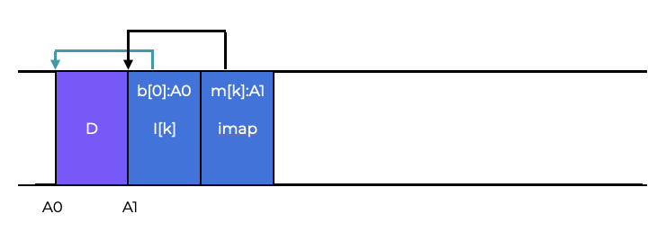

# Introduction
# 介绍
The log-structured file system was created due to the following observations:  
日志结构文件系统是由以下观察结果创建的： 
- System memory expansion  
- 系统内存扩展
- The performance gap between random and sequential I/O is large
- 随机和顺序I/O之间的性能差距很大
- File systems perform badly on several typical tasks
- 文件系统在几个典型任务上表现不佳
- File systems are not aware of RAIDs
- 文件系统不知道RAID

A file system should focus on writing while maximizing sequential bandwidth. It should also perform well on common workloads that often alter on-disk metadata structures and work on RAIDs and single disks.  
文件系统应该专注于写入，同时最大化顺序带宽。 它还应该在常见工作负载上表现良好，这些工作负载经常更改磁盘上的元数据结构，并在RAID和单个磁盘上工作。  

**LFS**, or **Log-structured File System**, buffers and writes all changes (including metadata) into an in-memory **segment**. This segment is written to disk in one continuous sequential transfer to an unused section of the disk.  
**LFS**或**日志结构文件系统**将所有更改（包括元数据）缓存在内存中的**段**中。 这个段被写入磁盘，以一个连续的顺序传输写入磁盘的未使用部分。  

**LFS** never overwrites existing data because it writes the large segments to free areas. File system performance increases because the RAID is being used much more efficiently.  
**LFS**从不覆盖现有数据，因为它将大段写入空闲区域。 文件系统性能提高，因为RAID被更有效地使用。  

## Question 
The log-structured file system increases system performance because:  
日志结构文件系统提高了系统性能，因为：  
- all changes are buffered and written in a single continuous sequential transfer
- 所有更改都被缓冲并以单个连续的顺序传输写入
- the RAID is being used efficiently, and
- RAID被有效地使用，以及
- it buffers all changes into an in-memory segment
- 它将所有更改缓存在内存段中

# Writing to Disk Sequentially
LFS’s core concept is to write all updates (data blocks, inodes, etc.) to the disk sequentially.  
LFS的核心概念是将所有更新（数据块，inode等）顺序写入磁盘。  

Below is an example of what writing data block **D** at disk address **A0** could look like.  
下面是写入磁盘地址**A0**的数据块**D**的示例。  


This is immediately followed by the metadata associated with the data block.  
这立即被与数据块相关的元数据所取代。  


## Question

A log-structured file systems core idea is to write all updates to disk sequentially.  
日志结构文件系统的核心思想是将所有更新顺序写入磁盘。


# Writing Sequentially and Effectively
Sequential writing to disk does not ensure efficient writes. To obtain good write performance, you must issue a large number of contiguous writes to the drive.  
顺序写入磁盘并不能确保写入效率。 要获得良好的写入性能，您必须向驱动器发出大量连续的写入。  

LFS uses a technique called **write buffering** to keep track of updates in memory before writing them to disk. This guarantees efficient disk usage.  
LFS使用一种称为**写缓冲**的技术来跟踪内存中的更新，然后将它们写入磁盘。 这保证了高效的磁盘使用。  

The huge batch of changes is called a **segment**. A segment, here, is a relatively large chunk utilized by LFS to aggregate writes.  
这些巨大的更改被称为**段**。 段是LFS用于聚合写入的相对较大的块。  

When writing to disk, LFS buffers the updates in memory and writes the segment all at once.  
当写入磁盘时，LFS将更新缓存在内存中，并一次写入段。  

Here’s an example of LFS buffering two sets of updates into a short chunk (a few MB). The first update writes four blocks to file **J**, and the second adds one to file **K**.  
这是LFS将两组更新缓冲到一个短块（几MB）的示例。 第一个更新将四个块写入文件**J**，第二个更新将一个块添加到文件**K**。  

LFS then commits the full seven-block segment to disk at one time. This results in the following on-disk layout:  
然后，LFS将整个七块段一次提交到磁盘。 这导致了以下磁盘布局：  


## Question
Write buffering and segmenting are how a log-structured file system are able to use disk space efficiently and increase performance.  
写缓冲和分段是日志结构文件系统能够有效利用磁盘空间并提高性能的方式。

# How Much To Buffer?
How many updates LFS should buffer before writing to disk depends on the disk and how high the positioning overhead is in comparison to the transfer rate.  
LFS应该在写入磁盘之前缓冲多少更新取决于磁盘以及与传输速率相比定位开销有多高。

If before each write, positioning takes **T<sub>position</sub>** seconds and the disk transfer rate is  **R<sub>peak</sub> MB/s** , we can figure out how much should LFS buffer before writing.  
如果在每次写入之前，定位需要**T<sub>position</sub>**秒，并且磁盘传输速率为**R<sub>peak</sub> MB/s**，我们可以计算出LFS在写入之前应该缓冲多少。

You can think of it like paying a fixed overhead of the positioning cost every time you write. The more you write, the closer you get to peak bandwidth.  
您可以将其视为每次写入时都要支付定位成本的固定开销。 写的越多，您就越接近峰值带宽。  

Assume we are programming D MB to get a tangible answer.  
假设我们正在编写D MB以获得一个具体的答案。

The time to write out this piece of data is:  
写出这一部分数据的时间是：  

**T<sub>write</sub> = T<sub>position</sub> + D / R<sub>peak</sub>**  

So the effective rate of writing, which is the amount of data written divided by the total time to write it, is:  
因此，写入的有效率是写入的数据量除以写入的总时间：  

**R<sub>effective</sub> = D/T<sub>write</sub> = D / (T<sub>position</sub> + D / R<sub>peak</sub>)**

We want the effective rate (R<sub>effective</sub>) close to the peak rate. We want the effective rate to be a fraction (**F**) of the peak rate, Where: **F** is between 0 and 1.  
我们希望有效率（R<sub>effective</sub>）接近峰值率。 我们希望有效率是峰值率的一个分数（**F**），其中：**F**在0和1之间。  

A typical **F** might be **0.9**, or **90%**, of the peak rate.  
典型的**F**可能是峰值率的**0.9**，或**90%**。  

If we solve for **D**, we get:  
如果我们解决**D**，我们得到：  
**R<sub>effective</sub> = D / (T<sub>position</sub> + D / R<sub>peak</sub>) = F * R<sub>peak</sub>**  
**D = F * R<sub>peak</sub> * (T<sub>position</sub> + D / R<sub>peak</sub>)**  
**D = F * R<sub>peak</sub> * T<sub>position</sub> + F * R<sub>peak</sub> * D / R<sub>peak</sub>**  
**D = F / (1 - F) * R<sub>peak</sub> * T<sub>position</sub>**  

For example, if a disk has:  
例如，如果磁盘有：  
- Positioning Time = 10 milliseconds
- 定位时间=10毫秒
- Peak Rate = 100 MB/s
- 峰值率=100 MB/s

and we want and effective bandwith of 90%:  
并且我们想要90%的有效带宽：  
- effective bandwidth = 90% = 0.9

Then: 

**D = 0.9 / (1 - 0.9) * 100 MB/s * 0.01 s = 9 MB**

# Finding Inodes
To find an inode in a normal UNIX file system or a system like FFS, inodes are structured in an array and placed in defined positions on disk.  
要在普通UNIX文件系统或类似FFS的系统中找到inode，inode被结构化为数组，并放置在磁盘上的定义位置。  
This is more difficult in LFS because we’ve spread the inodes around the disk, and we never overwrite in place, so the desired inode keeps shifting.  
这在LFS中更加困难，因为我们已经在磁盘上分散了inode，并且我们从不覆盖原处，因此所需的inode一直在移动。  

# The Inode Map
LFS designers created a. **level of indirection** and a data structure called an **inode map (imap)**. This structure takes an inode number as input and returns the most recent version’s disk address. It’s commonly implemented as a 4-byte array (a disk pointer). When an inode is written to disk, the imap is updated.  
LFS设计人员创建了一个**间接级别**和一个称为**inode map（imap）**的数据结构。 此结构将inode编号作为输入，并返回最近版本的磁盘地址。 它通常被实现为4字节数组（磁盘指针）。 当将inode写入磁盘时，imap将被更新。  
Since, the imap must be persistent in order for LFS to retain track of inode positions across crashes, LFS writes the new data block together with its inode and a section of it’s imap to the disk as follows:  
由于，imap必须是持久的，以便LFS在崩溃时跟踪inode位置，LFS将新数据块与其inode和imap的一部分一起写入磁盘，如下所示：  



The imap array stored in the imap block notifies LFS that the inode **k** is at disk address **A1** and that its data block **D** is at address **A0**.  
存储在imap块中的imap数组通知LFS inode **k**位于磁盘地址**A1**，其数据块**D**位于地址**A0**。  

## Questions
LFS’ solution to finding inodes is to persistently store new data together with its inode and a section of its imap.  
LFS找到inode的解决方案是将新数据与其inode和imap的一部分一起持久存储。  

# The Checkpoint Region
Due to the inode map being fragmented over the disk, a file lookup requires a fixed and known location on disk.  
由于inode map分散在磁盘上，因此文件查找需要磁盘上的固定和已知位置。  
This fixed location is known as the **checkpoint region (CR)** in LFS. The latest inode map parts are found by first reading the **CR**. The checkpoint region is only updated every **30** seconds or so. A checkpoint region points to the newest portions of the imap. The imap contains addresses of inodes, which lead to files (and directories) like ordinary UNIX file systems.  
这个固定位置在LFS中称为**checkpoint region（CR）**。 通过首先读取**CR**来找到最新的imap部分。 checkpoint区域每隔**30**秒左右更新一次。 checkpoint区域指向imap的最新部分。 imap包含inode的地址，这些地址指向文件（和目录），就像普通的UNIX文件系统一样。  
Here’s an example of a checkpoint area (at address **0**), an imap chunk, inode, and data block.  
这是一个checkpoint区域（在地址**0**）的示例，imap块，inode和数据块。  


## Questions 
A checkpoint region is a fixed and known location with the addresses to the last known chunks of the imap.  
checkpoint区域是一个固定的已知位置，其中包含imap最后已知块的地址。

# Review: Reading a File From Disk
Let’s walk through reading a file from disk starting with no memory.  
让我们从没有内存开始从磁盘读取文件。  
- The checkpoint region is the first on-disk data structure is read first. It contains pointers to the entire inode map, so the LFS reads the entire imap and caches it in memory.  
- The checkpoint region是第一个磁盘数据结构，首先读取。 它包含指向整个inode map的指针，因此LFS读取整个imap并将其缓存在内存中。  
- The inode number of a file is read in by the LFS, which looks up the inode number to disk address mapping in the imap, and reads the most recent version.  
- LFS读取文件的inode编号，它在imap中查找inode编号到磁盘地址的映射，并读取最新版本。  
- To read a block from the file, LFS uses direct, indirect, or doubly-indirect pointers, as needed.  
- 要从文件中读取块，LFS根据需要使用直接，间接或双重间接指针。  

Typically, LFS should perform the same amount of I/O as a typical file system. The entire imap is cached, so the extra work LFS does during a read is to search for the inode’s address in the imap.  
通常，LFS应该执行与典型文件系统相同数量的I/O。 整个imap被缓存，因此LFS在读取期间执行的额外工作是在imap中搜索inode的地址。  

## Questions
The checkpoint region must be read first. Next, LFS can use the inode number to look up the disk address stored in the imap. Finally, a block can be read from the file using different types of pointers, as needed.  
必须首先读取checkpoint区域。 接下来，LFS可以使用inode编号查找存储在imap中的磁盘地址。 最后，可以根据需要使用不同类型的指针从文件中读取块。  

# Directory Access
When accessing a file, some directories must be opened as well.  
访问文件时，还必须打开一些目录。  
Directory structure is very much the same as in ancient UNIX file systems, with name and inode number mappings.  
目录结构与古老的UNIX文件系统中的目录结构非常相似，具有名称和inode编号映射。  
LFS must, for example, write a new inode, some data, as well as the file’s directory data and inode when creating a file. LFS does so sequentially after buffering the updates for some time. This would result in the following new structures on disk:  
例如，当创建文件时，LFS必须写入新的inode，一些数据以及文件的目录数据和inode。 LFS在缓冲更新一段时间后顺序执行此操作。 这将导致磁盘上出现以下新结构：  


The inode map provides information about the directory file `dir` and the newly generated file `f`. In this example, you would first search in the inode map (typically cached in RAM) for the directory inode `A3`, then read the directory inode to discover the directory data (`A2`), and read this data block to get the name-to-inode-number mapping of file `test (test, k)`. Then you look up inode `k (A1)` on the inode map, and finally read the desired data block at address `A0`.  
inode map提供有关目录文件`dir`和新生成的文件`f`的信息。 在这个例子中，你首先要在inode map（通常缓存在RAM中）中搜索目录inode `A3`，然后读取目录inode以发现目录数据（`A2`），并读取此数据块以获取文件`test（test，k）`的名称到inode编号的映射。 然后，你在inode map上查找inode `k（A1）`，最后在地址`A0`处读取所需的数据块。  

The inode map also overcomes another important LFS issue of the **recursive update**. The issue exists in any file system that transfers updates to new locations on the disk (like LFS).  
inode map还克服了另一个重要的LFS问题**递归更新**。 该问题存在于将更新传输到磁盘上新位置的任何文件系统中（如LFS）。  

LFS avoids updating the directory that corresponds to the file by using an inode map. Even if an inode’s location changes, the directory’s imap structure remains unchanged. LFS avoids the recursive update problem through indirection.  
LFS通过使用inode map避免更新与文件对应的目录。 即使inode的位置发生更改，目录的imap结构也不会更改。 LFS通过间接避免了递归更新问题。  

## Questions 
LFS avoids recursive updating by using the inode map.  
LFS通过使用inode map避免了递归更新。


# Garbage Collection
An issue that arises with LFS is that it scatters old file structure versions throughout the disk.  
LFS出现的一个问题是它将旧文件结构版本散布在磁盘上。  
Consider a file referred to by inode number **k**, which links to a single data block **D0**. With each new inode and data block, we update the previous block. (Note: For simplicity, we omit the imap and other structures; a new chunk of imap must be written to disk to refer to the new inode.):  
考虑一个由inode编号**k**引用的文件，该文件链接到单个数据块**D0**。 每次更新新的inode和数据块时，我们都会更新先前的块。（注意：为简单起见，我们省略了imap和其他结构; 必须将新的imap块写入磁盘以引用新的inode。）  


As seen in the diagram, the inode and data block have two versions on disk, an old one (left) and one current and **live** (right). By logically changing a data block, LFS must persist new structures and leave the old versions on the disk.  
如图所示，inode和数据块在磁盘上有两个版本，一个旧的（左）和一个当前的和**live**（右）。 通过逻辑地更改数据块，LFS必须保留新结构并将旧版本留在磁盘上。  

Assume we instead append a block to the original file **k**. The inode is generated again, but it still points to the original data block. So it’s still there, and part of the current file system:  
假设我们改为将块附加到原始文件**k**。 inode再次生成，但它仍然指向原始数据块。 所以它仍然在那里，是当前文件系统的一部分：  


LFS periodically searches for and cleans old dead versions of file data, inodes, and other structures to free up disk blocks for later writes. Cleaning is a type of **garbage collection**, which is used in computer languages to automatically free up memory.  
LFS定期搜索并清理文件数据，inode和其他结构的旧死版本，以释放磁盘块以供以后写入。 清理是一种**垃圾收集**，它用于计算机语言，用于自动释放内存。  

Segments as the mechanism that allows big writes to disk in LFS are essential to successful cleaning.  
LFS中允许大写入磁盘的段作为允许大写入磁盘的机制对于成功的清理至关重要。  

Using segments for cleaning allows the system to avoid free **holes** mixed in with assigned space.  
使用段进行清理允许系统避免在分配的空间中混合使用空闲**holes**。  
The LFS cleaner frees up significant amounts of space for future writing.  
LFS清理程序为将来的写入释放了大量空间。  

The LFS basic cleaning  
LFS基本清理  
- frees up space for writing by periodically reading in old (partially-used) segments,
- 通过定期读取旧（部分使用）段来释放空间以供写入，
- deciding which blocks are live inside them, and
- 决定哪些块在其中是活的，
- writing out a fresh set of segments with just the live blocks within them.
- 只写出其中只有活动块的新段集。

It should read **M** existing segments, compress their content into **N** new segments (where **N<M**), and write the N segments to disk in new places. The file system can then use the previous **M** segments for further writes.  
它应该读取**M**个现有段，将其内容压缩到**N**个新段（其中**N<M**），并将N段写入新位置的磁盘。 然后文件系统可以使用先前的**M**段进行进一步的写入。  

## Question
Cleaning, a type of garbage collection, is used to automatically free up memory in LFS.  
清理是LFS中一种垃圾收集，用于自动释放内存。  

# Block Liveness
To determine a blocks liveness, LFS adds a little more information to each block segment. It includes the inode number and offset for each data block. This data is stored in the **segment summary block** at the segment’s head.  
为了确定块的活性，LFS在每个块段中添加了一些额外的信息。 它包括每个数据块的inode编号和偏移量。 此数据存储在段头处的**段摘要块**中。  
Determining a block’s status is done by finding the inode number (N) and offset (T) of block D at address A. Next, locate N in imap and read it from disk or memory. Finally, use the offset T to find the file’s Tth block on disk. LFS can determine if block D is alive if it links to disk address A. If it points elsewhere, LFS knows that D is no longer needed and that this version is dead. The following is a pseudocode summary:  
确定块的状态是通过在地址A处找到块D的inode编号（N）和偏移量（T）来完成的。 接下来，在imap中定位N并从磁盘或内存中读取它。 最后，使用偏移T在磁盘上找到文件的Tth块。 如果块D链接到磁盘地址A，则LFS可以确定块D是活的。 如果它指向其他位置，则LFS知道D不再需要，该版本已死亡。 以下是伪代码摘要：

```c
(N, T) = SegmentSummary[A];
inode = Read(imap[N]);
if (inode[T] == A)
  // block D is alive
else
  // block D is garbage
```

The segment summary block (SS) records that the data block at address A0 is actually a portion of file k at offset 0. You may find the inode by checking the imap for k.  
段摘要块（SS）记录地址A0处的数据块实际上是文件k的偏移量0处的一部分。 您可以通过检查imap来查找inode。  


LFS uses various shortcuts to speed up the liveness determination procedure. When a file is destroyed, LFS increments its version number and updates the imap. By comparing the on-disk version number to an imap version number, LFS can prevent unnecessary reads and bypass the lengthy check outlined above.  
LFS使用各种快捷方式来加快活性确定过程。 当文件被销毁时，LFS会增加其版本号并更新imap。 通过将磁盘版本号与imap版本号进行比较，LFS可以防止不必要的读取并绕过上述详细的检查。  

## Question
LFS uses the segment summary block to determine the liveness of a block.   
LFS使用段摘要块来确定块的活性。  
LFS uses a segment summary block to store extra information needed to determine whether a segment is alive or dead.  
LFS使用段摘要块来存储确定段是否活着或死亡所需的额外信息。

# Crash Recovery and The Log
**LFS** buffers writes in a segment and then writes the segment to disk when the segment is full or a time period has passed.  
**LFS**在段中缓冲写入，然后在段填满或经过一段时间后将段写入磁盘。  

**LFS** organizes these writes in a **log**, pointing to a head and tail segment and where each segment points to the next segment to be written.  
**LFS**将这些写入组织在**日志**中，指向头段和尾段，每个段指向要写入的下一个段。  

Crashes might occur while **LFS** is writing to a segment or to the CR.  
当**LFS**正在写入段或CR时，可能会发生崩溃。  

To minimize data loss if the crash occurs while writing to segment, **LFS** maintains two CRs, one at each end of the disk, and writes to them alternately to assure atomic CR updates.  
如果在写入段时发生崩溃，则为了最小化数据丢失，**LFS**维护两个CR，一个位于磁盘的每一端，并交替写入它们以确保原子CR更新。  

**LFS** also uses a rigorous protocol for updating the CR with new inode map pointers and other data; it puts out a header (with timestamp), then the body, and finally one last block (also with a timestamp).  
**LFS**还使用严格的协议来更新CR中的新inode映射指针和其他数据; 它输出一个标题（带有时间戳），然后是正文，最后是最后一个块（也带有时间戳）。  

**LFS** can identify a system crash during a CR update by noticing an inconsistent pair of timestamps. **LFS** will always use the most current CR with consistent timestamps.  
**LFS**可以通过注意到不一致的时间戳对来识别CR更新期间的系统崩溃。 **LFS**将始终使用具有一致时间戳的最新CR。  

If there is a crash while **LFS** is writing to the CR, when **LFS** is restarted, it will read the checkpoint region, the imap pieces it points to, and any files or directories it hasn’t already read.  
如果在**LFS**写入CR时发生崩溃，当**LFS**重新启动时，它将读取检查点区域，它指向的imap片段以及它尚未读取的任何文件或目录。  

**LFS** attempts to reconstruct many of those segments using a database approach called **roll forward**.  
**LFS**尝试使用称为**roll forward**的数据库方法来重建这些段的许多部分。

This approach uses the last checkpoint region to determine the end of the log, and use that to go through the next segments, looking for valid updates. **LFS** is able to recover much of the data and metadata written since the last checkpoint.  
这种方法使用最后一个检查点区域来确定日志的结尾，并使用它来遍历下一个段，寻找有效的更新。 **LFS**能够恢复自上次检查点以来写入的大部分数据和元数据。  

## Question
LFS uses a rigorous protocol for updating the CR with new inode map pointers and other data; it puts out a header (with timestamp), then the body, and finally one last block (also with a timestamp).  
LFS使用严格的协议来更新CR中的新inode映射指针和其他数据; 它输出一个标题（带有时间戳），然后是正文，最后是最后一个块（也带有时间戳）。  

To minimize data loss if a crash occurs while LFS is writing to segment, LFS maintains two checkpoint regions.  
如果在LFS写入段时发生崩溃，则为了最小化数据丢失，LFS维护两个检查点区域。  

# Summary
LFS modifies disk updates. LFS always writes to an unused part of the disk and cleans it later. LFS can write efficiently by grouping all updates into an in-memory segment and writing them sequentially.  
LFS修改了磁盘更新。 LFS始终写入磁盘的未使用部分，并稍后清理它。 LFS可以通过将所有更新分组到内存段并顺序写入来高效地写入。  

LFS’s huge writes are fast on many devices. With parity-based RAIDs like RAID-4 and RAID-5, large writes eliminate the small-write problem. Large I/Os are necessary for high performance on Flash-based SSDs, so LFS-style file systems may be suitable.  
LFS的大写入在许多设备上都很快。 基于奇偶校验的RAID，如RAID-4和RAID-5，大写入消除了小写入问题。 大I/O对于基于闪存的SSD上的高性能是必要的，因此LFS风格的文件系统可能是合适的。  

This procedure produces waste (i.e., old copies of data are spread around the disk, and to reclaim such space for future use, one must periodically clean old segments). Concerns about cleaning costs may have limited LFS’ initial impact.  
这种程序产生了浪费（即旧数据的副本散布在磁盘上，要为将来使用回收这样的空间，必须定期清理旧段）。 清理成本的问题可能会限制LFS的初始影响。  

Recent commercial file systems such as NetApp’s WAFL, Sun’s ZFS, Linux btrfs, and even newer **flash-based SSDs** carry the LFS conceptual legacy. By providing **snapshots** of the file system, users can access older files if they accidentally delete newer ones.  
最近的商业文件系统，如NetApp的WAFL，Sun的ZFS，Linux btrfs，甚至更新的**基于闪存的SSD**都带有LFS的概念遗产。 通过提供文件系统的**快照**，用户可以访问旧文件，如果他们意外删除了新文件。  

## Question 

LFS is a great file-system for performance in many devices. One of its major drawbacks is garbage production.       
LFS是许多设备中性能的伟大文件系统。 它的一个主要缺点是垃圾产生。 