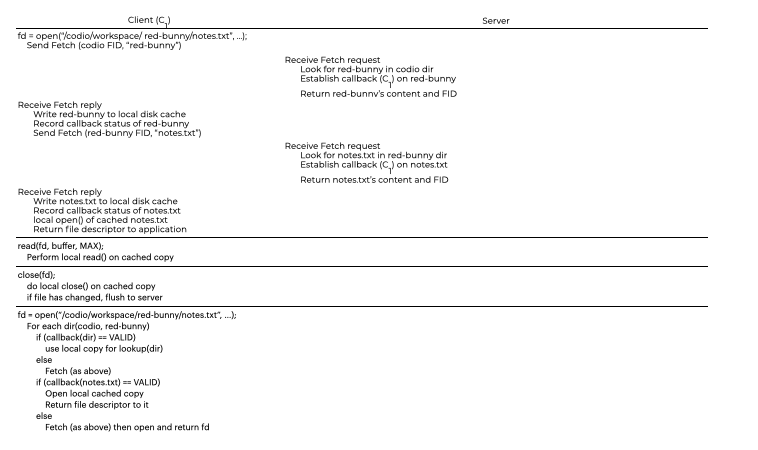
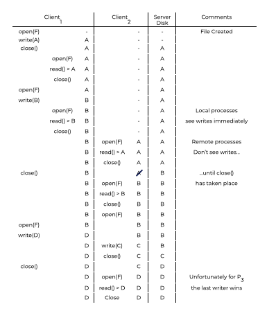

# Introduction
# 介绍
The Andrew File System was developed with the simple goal of scaling.  
Andrew 文件系统的开发目标是简单的扩展。  
**How can a distributed file system be designed to support as many clients as possible?**  
**如何设计一个分布式文件系统以支持尽可能多的客户端？**  

Many design and implementation aspects affect scalability. Client-server protocol is vital. Because each check uses server resources (CPU and network bandwidth), this limits the number of consumers a server can serve.  
许多设计和实现方面都影响可扩展性。客户端-服务器协议至关重要。因为每个检查都使用服务器资源（CPU和网络带宽），这限制了服务器可以服务的消费者数量。  

Instead of hiding the underlying data, AFS prioritizes transparency. Client-side cache timeout intervals, for example, are difficult to define in NFS. When a file is opened, the client receives the server’s most current consistent copy.  
与其隐藏底层数据，不如优先考虑透明性。例如，客户端缓存超时间隔在NFS中很难定义。当打开文件时，客户端将接收服务器的最新一致副本。  

## Question
The Andrew File System has always prioritized scalability and sensible user-visible behavior.  
Andrew 文件系统一直都优先考虑可扩展性和合理的用户可见行为。  

# AFS Version 1
The first system was dubbed the ITC distributed file system, which led to a redesign and the final protocol, (called AFSv2, or just AFS). The highlights of this protocol can be seen to the left.  
第一个系统被称为ITC分布式文件系统，这导致了重新设计和最终的协议（称为AFSv2或AFS）。可以在左侧看到此协议的亮点。  

All **AFS** versions support **whole-file caching** on the client’s local disk. In order to `open()` a file, the server must first obtain it from the server’s storage. Read and write operations are redirected to the local file system, avoiding network communication. `close()` returns the modified file to the server.  
所有**AFS**版本都支持客户端本地磁盘上的**整个文件缓存**。为了`open()`一个文件，服务器必须首先从服务器的存储中获取它。读取和写入操作被重定向到本地文件系统，避免了网络通信。`close()`将修改的文件返回给服务器。  

This is in stark contrast to NFS, which caches blocks (not files, though it may do so).  
这与NFS相比，NFS缓存块（不是文件，尽管它可能这样做）。  

To start, the AFS client-side code (dubbed Venus by the AFS creators) sends a Fetch protocol message to the server.  
首先，AFS客户端代码（由AFS创建者称为Venus）向服务器发送Fetch协议消息。  

These system calls are fully local (no server contact) and point to the local copy of the file. Due to the local nature of `read()` and `write()`, a block may be cached in client memory. So AFS uses client RAM to cache disk blocks. AFS client checks if the file has been updated (opened for writing) and communicates it to the server via a Store protocol message if so.  
这些系统调用完全是本地的（没有服务器联系），并指向文件的本地副本。由于`read()`和`write()`的本地性质，块可能被缓存在客户端内存中。因此，AFS使用客户端RAM来缓存磁盘块。如果AFS客户端检查到文件已更新（打开写入），则通过Store协议消息将其通知服务器。  

When the file is accessed again, AFSv1 is much faster. If the file has changed, this code checks with the server (using the TestAuth protocol). It uses a locally cached copy to prevent a network transmission. Above is a graphic of AFSv1 protocol messages. It used to caching file contents, leaving directories on the server.  
当再次访问文件时，AFSv1的速度要快得多。如果文件已更改，此代码将与服务器（使用TestAuth协议）进行检查。它使用本地缓存的副本来防止网络传输。上面是AFSv1协议消息的图形。它曾经缓存文件内容，将目录留在服务器上。  

## Question
AFS uses whole-file caching to reduce network communication and increase performance.  
AFS使用整个文件缓存来减少网络通信并提高性能。  

# Problems with Version 1
Lesser known AFS issues prompted the designers to revise their file system. The AFS designers spent a lot of time measuring their existing prototype to find out what was incorrect. **Measurement** is essential to understanding how systems work and how to improve them.  
AFS的较少已知问题促使设计人员对其文件系统进行修订。AFS设计人员花了很多时间测量他们的现有原型，以了解有什么不正确之处。**测量**是了解系统如何工作以及如何改进它们的基础。  

The authors observed two major issues with AFSv1:  
作者观察到AFSv1存在两个主要问题：  

- **The costs of path-traversal were too high**:  
- **路径遍历的成本太高**：  
    - When using the Fetch or Store protocol, the client sends the whole pathname (e.g., `/codio/ workspace/notes.txt`) to the server.  
    - 当使用Fetch或Store协议时，客户端将整个路径名（例如`/codio/ workspace/notes.txt`）发送到服务器。
    - To access the file, the server must first seek in the root directory for `codio`, then in home for `workspace`, and so on until the file is found.
    - 要访问文件，服务器必须首先在根目录中寻找`codio`，然后在home中寻找`workspace`，依此类推，直到找到文件为止。
    - Many clients visiting the server at once meant the server was spending a lot of time simply walking directory paths.
    - 许多客户同时访问服务器意味着服务器花费了大量时间只是在目录路径中行走。

- **Too many TestAuth protocol messages were being issued by the client**:  
- **客户端发出的TestAuth协议消息太多**：  
    - AFSv1 generated a lot of traffic to check if a local file (or its stats) was valid with the TestAuth protocol message. Servers spent a lot of time telling clients whether they may use cached copies of files. Most of the time, the file had not changed.  
    - AFSv1生成了大量流量来检查本地文件（或其状态）是否有效，使用TestAuth协议消息。服务器花费了大量时间告诉客户端他们是否可以使用文件的缓存副本。大多数情况下，文件都没有改变。

They also found smaller issues.  
他们还发现了一些小问题。

- AFSv1 didn’t balance load across servers:
- AFSv1没有在服务器之间平衡负载：
    - This issue was corrected by introducing volumes.
    - 通过引入卷来解决此问题。
    - Volumes meant that an administrator could move across servers to balance the load.
    - 卷意味着管理员可以在服务器之间移动以平衡负载。
- It used a single process per client:
- 它每个客户端使用一个进程：
    - This caused context switching and other overheads.
    - 这导致了上下文切换和其他开销。
    - The issue was solved by building the server with threads instead of processes in AFSv2.
    - 该问题通过在AFSv2中使用线程而不是进程构建服务器来解决。

We will focus only on the two major problems.  
我们将只关注两个主要问题。  

## Making Changes  
The two major problems above severely limited scalability.  
上述两个主要问题严重限制了可伸缩性。  

The server CPU bottlenecked the system, and each server could only serve  **20** clients without being overloaded.  
服务器CPU瓶颈了系统，每个服务器只能服务**20**个客户端而不会过载。  

Servers were receiving too many TestAuth messages and spent too much time traversing the directory structure. So the AFS designers had to solve the problem of redesigning the protocol to limit the number of server interactions and to make server interactions more efficient.  
服务器收到了太多的TestAuth消息，并花费了太多的时间遍历目录结构。因此，AFS设计人员必须解决重新设计协议以限制服务器交互的数量并使服务器交互更有效的问题。  

A new protocol addressing these difficulties would result in a far more scalable: AFSv2.  
解决这些困难的新协议将导致一个更具可伸缩性的AFSv2。  

## Question
Clients sending too many TestAuth protocol messages generate a lot of traffic.  
客户端发送太多的TestAuth协议消息会产生大量流量。

# AFS Version 2
Client/server interactions were reduced with AFSv2. With a callback, the server assures that a cached file will be updated. An invalid cached file no longer requires contacting the server. Until the server says otherwise, it assumes the file is valid.  
AFSv2减少了客户端/服务器交互。通过回调，服务器确保缓存的文件将被更新。无效的缓存文件不再需要联系服务器。除非服务器另有说明，否则它假定文件是有效的。  

AFSv2 uses a file identifier (FID) instead of pathnames, like NFS. Volum, file, and “uniquifier” are all AFS FIDs (to enable reuse of the volume and file IDs when a file is deleted). It would save the server time by walking pathnames one by one instead of transmitting whole pathnames.  
AFSv2使用文件标识符（FID）而不是像NFS一样的路径名。卷，文件和“唯一标识符”都是AFS FID（以便在删除文件时重用卷和文件ID）。它将通过逐个遍历路径名而不是传输整个路径名来节省服务器时间。  

Here the client would first fetch `codio`, cache it locally, and then set up a home callback. Next, the client would fetch `workspace`, save it locally, and call it. The caller application gets this file descriptor, as summarized in the figure to the left.  
这里，客户端首先获取`codio`，将其缓存在本地，然后设置主回调。接下来，客户端将获取`workspace`，将其保存在本地，并调用它。调用程序应用程序获取此文件描述符，如左图所示。  

Unlike NFS, the AFS client would establish a callback with the server with each directory or file fetch.  
与NFS不同，AFS客户端将在每次获取目录或文件时与服务器建立回调。  

In case the server’s cached state changed, the client would be notified The first access to the file creates several client-server messages, as well as callbacks for all folders and files. Because AFS caches files locally, it behaves like a disk-based file system. A second access to a file should be as fast as accessing it locally.       
如果服务器的缓存状态发生了变化，客户端将被通知。对文件的第一次访问将创建几个客户端-服务器消息，以及所有文件夹和文件的回调。由于AFS在本地缓存文件，因此它的行为类似于基于磁盘的文件系统。对文件的第二次访问应该与本地访问它一样快。  

## Question
AFS uses callbacks to reduce the number of client/server interactions.  
AFS使用回调来减少客户端/服务器交互的数量。

# Cache Consistency
Callbacks and whole-file caching make **AFS** cache consistency simple to establish. Consistency between processes on different machines and inside the same machine is critical.  
回调和整个文件缓存使**AFS**缓存一致性很容易建立。不同机器上进程之间以及同一机器内部的一致性至关重要。  

When an updated file closes, **AFS** makes the update accessible on the server and invalidates cached copies. A client writes to a file (perhaps repeatedly). The server then flushes the new file. If any clients have cached copies, the server contacts each client and informs them that their callback is no longer valid. In order to read older versions of the file, clients must re-download them from the server (and will also serve to reestablish a callback on the new version of the file).  
当更新的文件关闭时，**AFS**使更新在服务器上可用并使缓存的副本无效。客户端将文件写入（可能重复多次）。然后服务器刷新新文件。如果任何客户端都有缓存的副本，服务器将联系每个客户端并通知他们他们的回调不再有效。为了读取旧版本的文件，客户端必须从服务器重新下载它们（并且还将用于重新建立对文件的新版本的回调）。  

**AFS** departs from this basic principle within a single procedure. The file write events are visible to other local processes. Simple UNIX rules dictate that only one machine be used. Only switching machines would reveal the **AFS** consistency mechanism.
Further discussion is warranted on one machine. Because **AFS** uses the Last Writer Wins approach when many processes on separate machines modify a file simultaneously. It’s worth noting that the “winning” file is the one that closes last. As a result, just one client created the file. Unlike **NFS**, where individual block updates are flushed to the server, the final file on the server may contain updates from both clients. An example of this is when two clients write to a JPEG image in different places.
An event timeline is shown on the left. They show two processes on **Client1 (P1**  and **P2**), one on **Client2 (P3)**, and the server (**Server**) all working on a single file (**F**). The figure for the server only shows the file contents after the left operation. Read it and try to understand the effects of each read. You can use the right commentary field to get help.  
**AFS**在单个过程中偏离了这个基本原则。文件写入事件对其他本地进程可见。简单的UNIX规则规定只能使用一个机器。只有切换机器才会显示**AFS**一致性机制。  

## Question
When working on different machines, if Client 1 modifies a file that is cached on Client 2, the server will “break” the callback and require a re-fetch by Client 2 to receive the latest version of the file.  
当在不同的机器上工作时，如果客户端1修改了客户端2上缓存的文件，服务器将“破坏”回调并要求客户端2重新获取以接收文件的最新版本。  

# Crash Recovery
AFS crash recovery is a bit more involved than with NFS.  
AFS崩溃恢复比NFS要复杂一些。  

Consider a situation where a server (**S1**) cannot reach a client (**C1**) while the client is rebooting. Let’s say **C1**had file **F** cached on its local drive, and then **C2** (another client) changed it. This would cause the server to notify all clients cached the file to delete it.  
考虑在客户端重新启动时服务器 (**S1**) 无法连接到客户端 (**C1**) 的情况。假设 **C1** 的本地驱动器上缓存了文件 **F**，然后 **C2**（另一个客户端）更改了它。这将导致服务器通知所有缓存该文件的客户端将其删除。  

Because **C1** may miss vital communications after rebooting, **C1** should treat all cache contents as suspect when rejoining the system, and send a TestAuth message to verify.  
因为**C1**在重新启动后可能会错过重要的通信，所以**C1**应该将所有缓存内容视为可疑的，并发送TestAuth消息以进行验证。

If the **C1**'s cached copy of file **F** is still valid, **C1** can use it; if not, **C1** should fetch the latest version from the server.  
如果**C1**的文件**F**的缓存副本仍然有效，**C1**可以使用它;如果没有，**C1**应该从服务器获取最新版本。  

Server recovery is also more difficult.  
服务器恢复也更困难。

Because callbacks are retained in memory, a server cannot tell which client machine has what files when it restarts.  
因为回调在内存中保留，所以服务器在重新启动时无法确定哪个客户机具有哪些文件。  

Thus, upon server restart, each client must recognize that the server has crashed, suspect all cache contents, and verify the legitimacy of files before utilizing them.  
因此，在服务器重新启动时，每个客户端必须识别服务器已崩溃，怀疑所有缓存内容，并在使用它们之前验证文件的合法性。  

The importance of notifying clients of server failures is underscored by the risk of stale files being accessed.  
服务器故障通知客户端的重要性在于访问过时文件的风险。  

There are numerous ways to implement such recovery:  
有许多方法可以实现这种恢复：  
- having the server send a message to each client that indicates that cached contents should not be trusted, or  
- 服务器向每个客户端发送一条消息，指示不应信任缓存内容，或
- having clients periodically check that the server is still alive with a **heartbeat message**.
- 让客户端定期检查服务器是否仍然存活，使用**心跳消息**。

Building a scalable and appropriate caching architecture is not free. It comes at a cost; with NFS, clients barely noticed a server crash.  
构建可扩展且适当的缓存架构并非免费。它是有代价的;使用NFS，客户端几乎没有注意到服务器崩溃。

## Question
In the AFS protocol, if a client has crashed, upon rebooting, it should send a TestAuth message to the server to verify whether its contents are up-to-date or not.  
在AFS协议中，如果客户端已崩溃，在重新启动时，它应该向服务器发送TestAuth消息以验证其内容是否是最新的。

# Other Improvements
Like Berkeley FFS, AFS designers added features to make the system easier to use and administer:  
像Berkeley FFS一样，AFS设计人员添加了一些功能，使系统更易于使用和管理：  
- By providing a genuine global namespace to clients, AFS ensures that all files are named the same way.
- 通过向客户端提供真正的全局命名空间，AFS确保所有文件都以相同的方式命名。
- AFS takes security seriously, incorporating means to authenticate users and keep files private if requested.
- AFS认真对待安全问题，包括验证用户和保护文件的机制。
- AFS allows for user-controlled access. Using AFS, a user may regulate who can access which files.
- AFS允许用户控制访问。使用AFS，用户可以控制谁可以访问哪些文件。
- AFS introduces tools to make server management easier for system administrators. AFS was much ahead of the curve in terms of system administration.
- AFS引入了一些工具，使系统管理员更容易管理服务器。在系统管理方面，AFS远远领先于其他系统。

## Question
Features like user authentication and true global namespace were added to AFSv2 in order to make the system easier to use and manage.  
像用户身份验证和真正的全局命名空间这样的功能被添加到AFSv2中，是为了使系统更易于使用和管理。

# Summary
AFS shows us how to build distributed file systems in a different way than NFS. By decreasing server contacts (via whole-file caching and callbacks), each server may accommodate multiple clients, reducing the number of servers required to manage a site. AFS’s single namespace, security, and access-control lists make it easy to use. The AFS consistency paradigm is easy to understand and reason about, and does not lead to the odd behavior seen in NFS.  
AFS向我们展示了如何以与NFS不同的方式构建分布式文件系统。通过减少服务器联系（通过整个文件缓存和回调），每个服务器都可以容纳多个客户端，从而减少了管理站点所需的服务器数量。 AFS的单一命名空间，安全性和访问控制列表使其易于使用。 AFS一致性范例易于理解和推理，并且不会导致NFS中出现的奇怪行为。  

Regrettably, AFS is expected to decline. Because NFS is an open standard, many companies support it, and it dominates the market together with CIFS (the Windows-based distributed file system protocol). While AFS installations are still seen from time to time (such as at Wisconsin educational institutions), the system’s concepts are likely to be the only lasting influence. NFSv4 now includes server state (e.g., a “open” protocol message) and so resembles the fundamental AFS protocol.  
遗憾的是，AFS预计将会衰落。由于NFS是一个开放的标准，许多公司支持它，并且它与CIFS（基于Windows的分布式文件系统协议）一起占据市场主导地位。虽然AFS安装仍然会不时出现（例如在威斯康星教育机构），但系统的概念可能只是持久影响。NFSv4现在包括服务器状态（例如，“打开”协议消息），因此类似于基本的AFS协议。  

