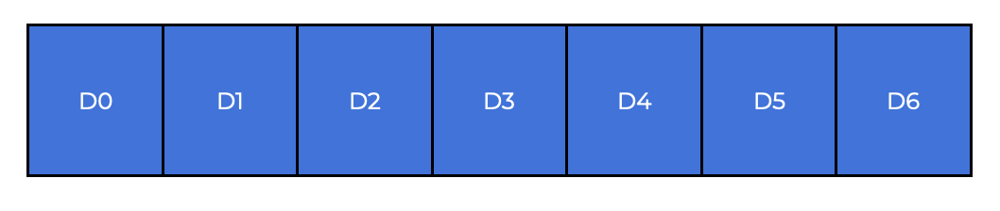
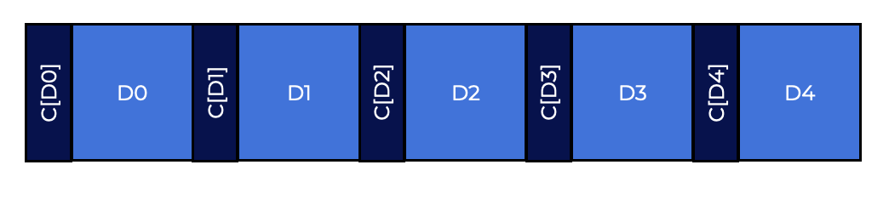
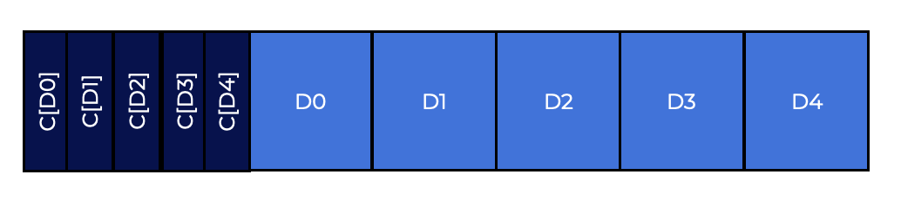
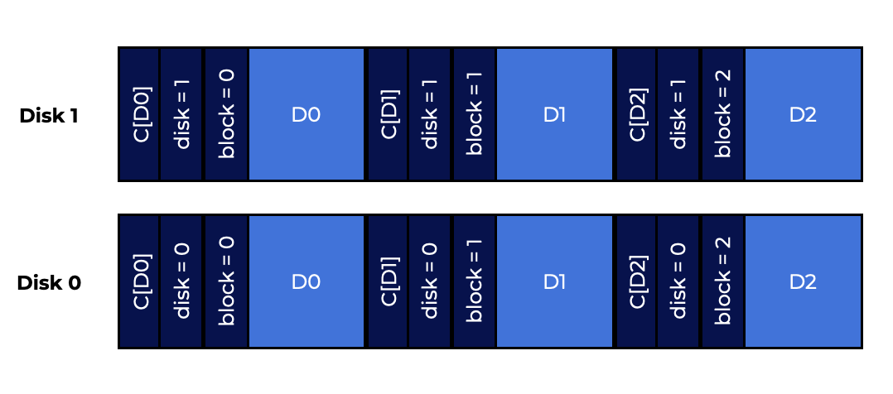

# Introduction
In this section, we will cover **Data integrity** or **data protection**. We will look into the different techniques used by file and storage systems to provide data security even when modern storage technologies are unreliable.  
在本节中，我们将介绍**数据完整性**或**数据保护**。我们将研究文件和存储系统使用的不同技术，即使现代存储技术不可靠，也可以提供数据安全性。  

# Disk Failure Modes
Early RAID systems made it easy to access failure:  
早期的RAID系统使故障访问变得容易：  
- if all disks are working, then the RAID is functional;
- 如果所有磁盘都工作，则RAID是功能性的;
- else, stop the entire system.
- 否则，停止整个系统。

This **fail-stop** model was simple. Now, there are other types of disk failure to consider.  
这种**fail-stop**模型很简单。现在，还有其他类型的磁盘故障要考虑。  

**Latent-sector errors (LSEs)** and **block corruption** are two of the most common single-block problems.  
**潜在扇区错误（LSEs）**和**块损坏**是最常见的单块问题。  

| -  | Cheap | Costly|
|:---------------   |:-----:| -----:|
|**LSEs**           | 9.4%  | 1.4%  |
|**Corruption**     | 0.6%  | 0.05% |

Latent-sector errors (LSE) occur when a head crash destroys a disk sector or set of sectors, or when cosmic rays flip some of the bits. These codes check if the bits are usable and fix them if necessary. If the drive doesn’t have enough information to repair the damage, it will fail.  
当磁头碰撞破坏磁盘扇区或一组扇区时，或者当宇宙射线翻转一些位时，会发生潜在扇区错误（LSE）。这些代码检查位是否可用，并在必要时修复它们。如果驱动器没有足够的信息来修复损坏，它将失败。  

Block corruption can happen several ways:  
块损坏可以有几种方式：  
- When a disk block gets damaged beyond the disk’s detection. When the firmware writes a block to the wrong location, the disk ECC claims the block is good, but the client receives the wrong block.
- 当磁盘块受到磁盘检测以外的损坏。当固件将块写入错误的位置时，磁盘ECC声称块是好的，但客户端接收到错误的块。  
- Is if it gets transferred through a faulty bus. The disk stores the corrupted data, but this is not what the client requested.
- 如果通过故障总线传输。磁盘存储损坏的数据，但这不是客户端请求的内容。

These types of defects are called **silent faults** because they don’t give any error indications.  
这些缺陷称为**静默故障**，因为它们不会给出任何错误指示。  

A **fail-partial** concept allows disks to fail in parts. This can happen when reading or writing a block (a non-silent partial fault) or when accessing a seemingly-working hard drive (a silent partial fault).  
**fail-partial**概念允许磁盘以部分失败。当读取或写入块时（非静默部分故障），或者访问似乎工作的硬盘时（静默部分故障），这可能会发生。  

Other results about the LSEs are as follows:  
关于LSE的其他结果如下：  

- Costly drives with at least **1** LSE are just as likely to have additional errors as cheaper drives
- 价格昂贵的驱动器至少有**1**个LSE，就像便宜的驱动器一样可能有其他错误
- The number of LSEs grows with the size of the disk.
- LSE的数量随磁盘的大小而增长。
- Disk scrubbing helps identify more LSEs
- 磁盘擦除有助于识别更多的LSE
- Spatial and temporal locality play a big part in finding LSEs
- 空间和时间局部性在发现LSE方面起着重要作用

Some findings about how people are able to do bad things:  
关于人们如何做坏事的一些发现：

- There is a lot of variation in the chances of corruption between different drive models in the same drive class
- 不同的驱动器型号之间的损坏机会存在很大差异
- Age effects drives differently across different models
- 年龄影响不同型号的驱动器
- Most corrupted disks only have a few corruption
- 大多数损坏的磁盘只有少数损坏
- Corruption is not independent within a disk or across disks in a RAID
- 损坏不是磁盘内部或RAID中磁盘之间的独立事件
- There is a weak correlation with LSEs.
- 与LSEs存在弱相关性。

For a reliable storage system, it must have tools to find and recover from LSEs and block corruption.  
对于可靠的存储系统，它必须具有查找和从LSE和块损坏中恢复的工具。

## Question 
Latent-sector errors and block corruption are two of the most common single-block problems.  
潜在扇区错误和块损坏是两个最常见的单块问题。  


#  Handling Latent Sector Errors
LSEs can be more easily addressed using common redundancy methods to fix problems.  
LSEs可以更容易地使用常见的冗余方法来解决问题。  

Because the error is detected, the correct data can be easily returned using the alternate copy in a mirrored RAID or using the parity group to rebuild in a RAID-4 or RAID-5.  
因为检测到错误，可以使用镜像RAID中的备用副本或使用奇偶校验组在RAID-4或RAID-5中重建来轻松返回正确的数据。  

RAID designs have been inspired by the growing number of LSEs over the past few years.  
RAID设计受到过去几年LSE数量的增长的启发。  

When both full-disk faults and LSEs happen in RAID-4/5 systems, there is a very interesting problem.  
当RAID-4/5系统中发生全磁盘故障和LSE时，会出现一个非常有趣的问题。  
- When one of the disks in a RAID group fails, the RAID tries to **reconstruct** it by reading the other disks in the group and recalculating the missing values. If an LSE is found along the way the reconstruction will not complete correctly.  
- 当RAID组中的一个磁盘故障时，RAID尝试通过读取组中的其他磁盘并重新计算缺失的值来**重建**它。如果在此过程中发现LSE，则重建将无法正确完成。

To deal with this, some systems add more redundancy. If an LSE is found during reconstruction, the second parity disk helps to fill in missing blocks.  
为了解决这个问题，一些系统增加了更多的冗余。如果在重建过程中发现LSE，则第二个奇偶校验磁盘有助于填充缺失的块。  
Keeping two parity blocks per stripe costs more, but the log-structured design of the NetApp **WAFL** file system helps in many cases.  
每条带两个奇偶校验块的成本更高，但NetApp **WAFL**文件系统的结构化日志设计在许多情况下有所帮助。  

## Question
LSEs are easier to address because their errors are detected.  
LSEs更容易解决，因为它们的错误已被检测到。  

# Detecting Corruption
The recovery process for a broken block is the same.  
破坏的块的恢复过程是相同的。  

Detecting silent failures is the major issue.  
检测静默故障是主要问题。  
Modern storage systems use **checksums** to maintain data integrity.  
现代存储系统使用**校验和**来维护数据完整性。  

A checksum is the result of a function that takes a chunk of data, passes it through a function, and produces a brief summary of the data (say **4** or **8** bytes). The summary is called the **checksum**.  
校验和是一个函数的结果，该函数接受一块数据，将其通过函数传递，并生成数据的简要摘要（例如**4**或**8**字节）。该摘要称为**校验和**。  

To determine if data has been changed or corrupted, the a checksum (stored with the data) is compared to the original storage value. If they are the same, the data should be good.  
要确定数据是否已更改或损坏，将校验和（与数据一起存储）与原始存储值进行比较。如果它们相同，则数据应该是好的。  

## Question
The checksum allows systems to pass a chunk of data into a function and produce a small summary to be matched with the original storage value.  
校验和允许系统将数据块传递到函数中，并生成一个小的摘要与原始存储值匹配。  


# Common Checksum Function
Checksums are generated using a variety of functions that vary in strength (data integrity protection) and speed (how quickly they can be computed).  
校验和是使用各种功能生成的，这些功能在强度（数据完整性保护）和速度（计算速度）方面有所不同。  
A common system trade-off occurs: the more protection you get, the more it costs.  
常见的系统折衷方案是：你得到的保护越多，它就越贵。  

Some utilize a simple checksum technique based on exclusive or **XOR**.  
一些利用基于排他或**XOR**的简单校验和技术。  

When using **XOR**-based checksums, each chunk of the data block being checked is XORed together to get one value that reflects the complete block.  
使用**XOR**-based校验和时，将要检查的数据块的每个块与其他块进行XOR，以获得反映整个块的一个值。  

Imagine computing a **4**-byte check-sum over a **16**-byte block.  
想象一下在一个**16**字节的块上计算一个**4**字节的校验和。

The **16** data bytes in hexadecimal:
十六进制的**16**数据字节：  

`365e c4cd ba14 8a92 ecef 2c3a 40be f666`

If we look at them in binary, we get:  
如果我们以二进制形式查看它们，我们得到：  

```bash
0011 0110 0101 1110
1011 1010 0001 0100
1110 1100 1110 1111
0100 0000 1011 1110
1100 0100 1100 1101

1000 1010 1001 0010

0010 1100 0011 1010

1111 0110 0110 0110
```

The data is arranged in **4** byte rows. XOR each column to get the final checksum:  
数据按**4**字节排列。XOR每列以获得最终校验和：  

```bash
0010 0000 0001 1011    1001 0100 0000 0011
```

The result, in hex, is `0x201b9403`.
结果，以十六进制表示为`0x201b9403`。  

XOR is a reasonable but limited checksum. The checksum will not detect a corruption if two bits in the same position change within the checksummed unit. So people looked for various checksum functions.  
XOR是一个合理但有限的校验和。如果校验单元中的两个位在同一位置发生变化，则校验和不会检测到损坏。所以人们寻找各种校验和函数。  

## Checksum Functions
- **Addition** is a fundamental checksum function. This method is fast since it only requires 2’s complement addition over each block of data, ignoring overflow. It can identify many changes in data, but not shifted data.
- **Addition**是一个基本的校验和函数。这种方法很快，因为它只需要对每个数据块进行2的补码加法，忽略溢出。它可以识别数据中的许多更改，但不能识别移位数据。  

- The **Fletcher checksum** is computed by computing two check bytes, **s1** and **s2**. Assume a block **D** contains bytes **`d1...dn; s1=(s1+di) mod 255`**  (computed across all **di**).  
- **Fletcher校验和**是通过计算两个校验字节**s1**和**s2**来计算的。假设块**D**包含字节**`d1...dn; s1=(s1+di) mod 255`**（在所有**di**之间计算）。

`s2=(s2+s1) mod 255  (again over all di).`

All single-bit, double-bit, and multiple burst mistakes are detected by the Fletcher checksum.  
Fletcher校验和检测所有单比特，双比特和多个突发错误。  

- A **cyclic redundancy** check is another typical checksum (**CRC**). Assume you want to checksum a data block **D**. You just divide **D** by an agreed-upon value as though it were a huge binary number (**k**).
- **循环冗余**检查是另一种典型的校验和（**CRC**）。假设你想要校验数据块**D**。你只需将**D**除以一个约定的值，就像它是一个巨大的二进制数（**k**）一样。  

The CRC value is the remainder of this division. This binary modulo operation can be implemented efficiently, making it useful in networking.  
CRC值是这个除法的余数。这个二进制模操作可以有效地实现，使其在网络中有用。  

Whatever method you use, there is no perfect checksum: two data blocks with different contents can have the same checksum, a situation known as a **collision**.  
无论你使用什么方法，都没有完美的校验和：具有不同内容的两个数据块可能具有相同的校验和，这种情况称为**碰撞**。  

After all, computing a checksum reduces a huge (**4KB**) file to a considerably smaller one (**4** or **8** bytes).  
毕竟，计算校验和将一个巨大的（**4KB**）文件减少到一个相当小的文件（**4**或**8**字节）。  
Choosing a suitable checksum function reduces the probability of collisions while being simple to compute.  
选择合适的校验和函数可以降低碰撞的概率，同时计算起来很简单。  

## Question
Cyclic Redundancy Check: the remainder of division by a large binary number.
循环冗余检查：除以一个大的二进制数的余数。  

Fletcher Checksum: is computed by computing two check bytes.  
Fletcher校验和：是通过计算两个校验字节来计算的。  

XOR: a reasonable but limited checksum that will not detect a corruption if two bits in the same position change within the checksummed unit.  
XOR：一个合理但有限的校验和，如果校验单元中的两个位在同一位置发生变化，则校验和不会检测到损坏。

Addition: a fast method that can identify many changes in data, but not shifted data.  
加法：一种快速的方法，可以识别数据中的许多更改，但不能识别移位数据。  

# Checksum Layout
A checksum is stored with each disk sector (or block). Let us name the checksum over a data block **D**. Without checksums, the disk configuration is as follows:  
校验和与每个磁盘扇区（或块）一起存储。让我们命名数据块**D**的校验和。没有校验和，磁盘配置如下：  



The layout adds one checksum per block with checksums:  
布局在每个块中添加一个校验和：  



Because checksums are often short (**8** bytes) and drives can only write in sectors (**512** bytes) or multiples of **512** bytes, achieving this layout can be difficult. Manufacturers format drives with **520**-byte sectors, with an extra **8** bytes each sector for the checksum.  
因为校验和通常很短（**8**字节），而驱动器只能以扇区（**512**字节）或**512**字节的倍数写入，因此实现此布局可能很困难。制造商使用**520**字节的扇区格式化驱动器，每个扇区额外有**8**字节用于校验和。  

On disks without this feature, the file system must store the checksums in **512**-byte blocks. One option is as follows:  
在没有此功能的磁盘上，文件系统必须将校验和存储在**512**字节的块中。一种选择是：  



Then come n data blocks, followed by another checksum sector for the next **n** blocks, and so on. If the file system intends to overwrite block **D1** , it must first read in the checksum sector containing **C(D1)**, update **C(D1)**, and then write out the checksum sector and new data block **D1**. Using one checksum per sector requires only one write.  
然后是n个数据块，然后是另一个校验和扇区，用于下一个**n**块，依此类推。如果文件系统打算覆盖块**D1**，则必须首先读取包含**C(D1)**的校验和扇区，更新**C(D1)**，然后写出校验和扇区和新的数据块**D1**。每个扇区使用一个校验和只需要一次写入。  

## Question
A checksum is stored with each disk sector.  
校验和与每个磁盘扇区一起存储。  


# Using Checksums
The client (file system or storage controller) receives the stored checksum from disk **Cs(D)** while reading a block **D**. The client then computes the checksum over the obtained block.  
客户端（文件系统或存储控制器）在读取块**D**时从磁盘**Cs(D)**接收存储的校验和。然后，客户端计算获得块的校验和。  

At this point, the client compares the stored and computed checksums.  
此时，客户端比较存储的和计算的校验和。  

- If they are equal (**Cs(D)==Cc(D)**), the data has likely not been corrupted, and can be safely returned to the user.  
- 如果它们相等（**Cs(D)==Cc(D)**），则数据可能没有被损坏，并且可以安全地返回给用户。  
- If they do not match (**Cs(D)!=Cc(D)**), the data has changed since the time it was stored (since the stored checksum reflects the value of the data at that time).  
- 如果它们不匹配（**Cs(D)!=Cc(D)**），则数据自存储以来已更改（因为存储的校验和反映了该时刻数据的值）。  

In this example, the checksum helped us detect a corruption.  
在这个例子中，校验和帮助我们检测到了一个损坏。  

In the case of corruption, if the storage system contains a redundant copy, use it instead. If the storage system does not have such a copy, an error is likely. If you can’t acquire the non-corrupted data, you’re out of luck.  
在损坏的情况下，如果存储系统包含冗余副本，请改用它。如果存储系统没有这样的副本，很可能会出错。如果您无法获得未损坏的数据，那么您就没有运气了。  

## Question
If the computed checksum is equal to the stored checksum, the data is assumed to be safe.  
如果计算的校验和等于存储的校验和，则假定数据是安全的。  

If the computed checksum is not equal to the stored checksum, the data is assumed to be corrupted.  
如果计算的校验和不等于存储的校验和，则假定数据已损坏。  


# Misdirected Writes
The aforementioned basic method works effectively for corrupted blocks. The failure modes of newer disks necessitate alternative solutions.  
上述基本方法有效地解决了损坏的块。新型磁盘的故障模式需要替代解决方案。  

A misdirected write is the initial interest failure mode. Disk and RAID controllers write data to disk successfully, but in the wrong place. In a single-disk system, this means the disk wrote block **Dx** to address **y** instead of **x** (“corrupting” **Dy**).  
误导写入是最初的兴趣故障模式。磁盘和RAID控制器成功地将数据写入磁盘，但是写入了错误的位置。在单磁盘系统中，这意味着磁盘将块**Dx**写入地址**y**而不是**x**（“损坏”**Dy**）。  

## **What features does the checksum need to have?**  
## **校验和需要什么特性？**  
The answer is to give each checksum a little more information. In this instance, a physical identifier (**ID**) is useful.  
答案是给每个校验和一些更多的信息。在这种情况下，物理标识符（**ID**）是有用的。  

If a locale contains the checksum **C(D)** and both the disk and sector numbers, a client can quickly determine if the right information is saved. As seen below, the client’s disk number and sector offset should be stored. If the data does not match, a corrupted write occurred. This extra data appears on a two-disk system. The checksums are **8** bytes and the blocks are **4** KB or more:  
如果一个区域包含校验和**C(D)**和磁盘和扇区号，客户端可以快速确定是否保存了正确的信息。如下所示，客户端的磁盘号和扇区偏移量应该被存储。如果数据不匹配，则发生了损坏的写入。这些额外的数据出现在两个磁盘系统中。校验和是**8**字节，块是**4**KB或更多：  

  

Each block’s disk number is kept, as is the block’s offset. This is where redundancy comes in. While not required for clean disks, more data can help identify possible concerns.  
每个块的磁盘号都被保留，块的偏移量也是如此。这就是冗余的地方。虽然对于干净的磁盘不是必需的，但更多的数据可以帮助识别可能的问题。  

## Question 
Misdirected writes occur when data is written to the wrong location.  
当数据写入错误的位置时，会发生误导写入。  

# Lost Writes
A **lost write** occurs when the **device alerts the upper layer that a write has completed but it is never persisted**, resulting in the old contents of the block being retained rather than the new ones.  
**丢失写入**发生在**设备通知上层写入已完成，但永远不会持久化**的情况下，导致块的旧内容保留而不是新内容。  

A matching checksum and physical ID are needed to help detect lost writes.  
需要匹配的校验和和物理ID来帮助检测丢失的写入。  

Performing a **write verify** or **read-after-write** ensures that data has reached the disk surface. This method, however, doubles the amount of I/Os required to accomplish a write.  
执行**写入验证**或**写入后读取**可确保数据已到达磁盘表面。然而，这种方法会将写入所需的I/O数量加倍。  

Some systems add a checksum to detect lost writes. Sun’s **Zettabyte File System (ZFS)** includes a checksum in every inode and indirect block. Even if a write to a data block is lost, the inode’s checksum will not match the old data. This approach will only fail if both the inode and data writes are lost simultaneously, which is unlikely.  
一些系统添加校验和来检测丢失的写入。Sun的**Zettabyte文件系统（ZFS）**在每个inode和间接块中包含一个校验和。即使数据块的写入丢失，inode的校验和也不会与旧数据匹配。这种方法只有在inode和数据写入同时丢失的情况下才会失败，这不太可能。  


## Question
Lost writes occur when the upper layer reports that a write has completed but it is not persisted, retaining the old contents of a block  
当上层报告写入已完成但未持久化时，会发生丢失写入，保留块的旧内容  


# Scrubbing
After all of this, you may question when these checksums are truly tested. Of course, apps check data when they access it, but most data is rarely accessed and so inspected. The problem with unchecked data is that bit rot can eventually infect all copies of a data set.  
在所有这些之后，您可能会质疑何时真正测试这些校验和。当然，应用程序在访问数据时会检查数据，但大多数数据很少被访问和检查。未检查数据的问题是，比特腐烂最终会感染数据集的所有副本。  

Many systems use various sorts of disk scrubbing to solve this issue. The disk system can lessen the probability of all copies of a data item being corrupted by periodically reading over every block and checking checksums. Most systems run scans every night or week.  
许多系统使用各种类型的磁盘擦拭来解决这个问题。磁盘系统可以通过定期读取每个块并检查校验和来减少数据项的所有副本被损坏的可能性。大多数系统每晚或每周运行扫描。  

## Question
The disk system can lessen the probability of all copies of a data item being corrupted by periodically reading over every block and checking checksums.  
磁盘系统可以通过定期读取每个块并检查校验和来减少数据项的所有副本被损坏的可能性。  


# Overheads of Checksumming
In computer systems, overheads are divided into two categories: **space** and **time**.  
在计算机系统中，开销分为两类：**空间**和**时间**。  

A space overhead can be either. A stored checksum takes up space on the disk, which can no longer be used for user data. An **8**-byte checksum per **4** KB data block typically consumes **0.19%** of disk capacity.  
空间开销可以是。存储的校验和占用磁盘上的空间，不能再用于用户数据。每4 KB数据块的8字节校验和通常消耗0.19％的磁盘容量。  

Both checksums and data must be saved in memory to access data. The overhead is negligible if the system only checks the checksum. To protect against memory corruption, checksums must be stored in memory.  
校验和和数据都必须保存在内存中才能访问数据。如果系统只检查校验和，则开销可以忽略不计。为了防止内存损坏，校验和必须存储在内存中。  

The time overheads from check-summing can be significant. When saving and retrieving data, the CPU must checksum each block (to compute the checksum again and compare it against the stored checksum). Because data copying is required anyhow, many systems that use checksums combine the two processes.  
校验和的时间开销可能很大。保存和检索数据时，CPU必须校验每个块（重新计算校验和并将其与存储的校验和进行比较）。由于无论如何都需要数据复制，因此许多使用校验和的系统将这两个过程结合在一起。  

Background scrubbing and various checksumming methods may generate considerable CPU and I/O overheads. In both circumstances, controlling the cleaning time reduces the impact. Late at night, when most (but not all!) industrious workers have retired, may be the greatest time to soak up scrubbing activity and build the storage system  
背景擦拭和各种校验和方法可能会产生大量的CPU和I/O开销。在这两种情况下，控制清洁时间可以减少影响。深夜，大多数（但不是全部！）勤劳的工人已经退休，可能是吸收擦拭活动和建立存储系统的最佳时间  

## Question
While space overheads are minor, time overheads from check-summing can be significant.  
虽然空间开销很小，但校验和的时间开销可能很大。  

# Summary
We have examined checksum implementation and usage in current storage systems.  
我们已经检查了当前存储系统中的校验和实现和使用。  

As storage devices evolve, new failure modes will inevitably emerge. Maybe the research community and industry will have to rethink some of these core approaches, or devise new ones.  
随着存储设备的发展，新的故障模式将不可避免地出现。也许研究界和工业界将不得不重新思考这些核心方法，或者设计新的方法。  