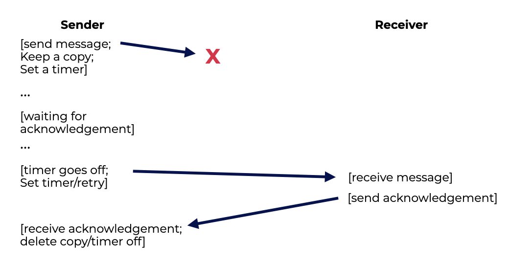
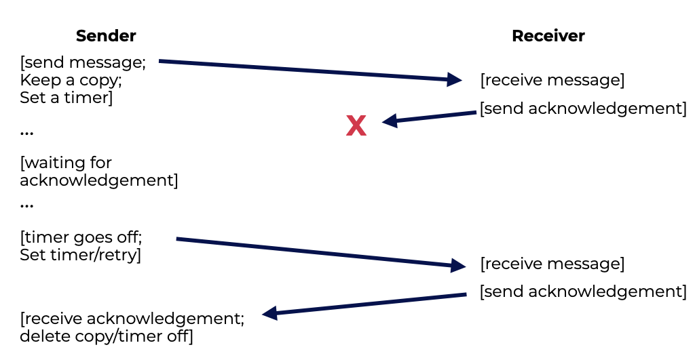

# Introduction
# 介绍
Connecting to a web server anywhere in the globe seems straightforward, but it isn’t. These complex services are made up of many machines that work together to make the site work.  
在全球任何地方连接到Web服务器似乎很简单，但事实并非如此。这些复杂的服务由许多机器组成，这些机器一起工作以使网站正常工作。  

We don’t know how to develop “perfect” parts or systems, so we focus on how to make a modern online service seem like it never fails to its users.  
我们不知道如何开发“完美”的部件或系统，因此我们专注于如何使现代在线服务看起来永远不会失败。  

The goal is to build systems that work even when parts of them don’t.  
目标是构建即使部分系统也能正常工作的系统。  

- **Failure** is a big problem when it comes to building distributed systems.  
- **故障**是构建分布式系统时的一个大问题。
    - Even if one machine fails, that doesn’t mean the entire system must fail. This is one of the great things about distributed systems, and it’s why Google, Facebook, and other web services use them now.  
    即使一台机器失败，这并不意味着整个系统必须失败。这是分布式系统的一个伟大之处，这也是Google，Facebook和其他网络服务现在使用它们的原因。  
- Another problem is **performance**.
- 另一个问题是**性能**。
    - Because our distributed system is connected by a network, system designers have to think about ways to keep the number of messages sent down and make communication as efficient as possible.  
    由于我们的分布式系统是通过网络连接的，因此系统设计人员必须考虑减少发送的消息数量并使通信尽可能高效的方法。  
- A final concern is **security**.
    - A connection to a remote site must have some trust that the person on the other side is who they say they are and trust that third party cannot monitor or change an ongoing communication between two others.  
    连接到远程站点必须有一些信任，即对方说的是谁，第三方不能监视或更改两者之间的正在进行的通信。  
- **Communication** is new in distributed systems. Specifically, how machines in a distributed system talk to each other.  
- **通信**是分布式系统中的新内容。具体来说，分布式系统中的机器如何彼此交谈。

In this section, we’ll start with the simplest things first, like messages, and work our way up from there.  
在本节中，我们将首先从最简单的事情开始，如消息，然后再从那里开始。  

## Question
A fundamental issue when working with a distributed system is a matter of managing **failure** in different parts of the system. **Security** is another major concern of distributed systems.  
在使用分布式系统时的一个基本问题是管理系统中不同部分的**故障**。**安全性**是分布式系统的另一个主要问题。  


# Communication Basics
It appears that communication is always going to be unreliable with modern networking. Packets are frequently lost, corrupted, or otherwise not delivered over the Internet or through high-speed local networks.  
看起来，现代网络通信总是不可靠的。数据包经常丢失，损坏或以其他方式未能通过互联网或高速本地网络传递。  
Packets can be lost or corrupted for a number of reasons:  
数据包可能因以下原因丢失或损坏：  
- Some bits become inverted during transmission because of electrical or other issues,
- 由于电气或其他问题，在传输过程中某些位被反转，

- A network link, packet router, or even the remote host can be damaged, or
- 网络链接，数据包路由器甚至远程主机都可能受损, 或者
- Network cables can be cut by accident.
- 网络电缆可能会意外被切断。

Packets can also be **dropped** if multiple packets come in at the same time and there isn’t enough buffering in a network switch or router.  
如果多个数据包同时到达并且网络交换机或路由器中没有足够的缓冲区，则数据包也可能被**丢弃**。  

## Question
Communication in modern networking is viewed as unreliable because even if all links, routers, and cables are functioning correctly, a packet can still be **dropped** due to insufficient buffer space.  
现代网络通信被视为不可靠的，因为即使所有链接，路由器和电缆都正常运行，由于缓冲区空间不足，数据包仍可能被**丢弃**。  


# Unreliable Communication Layers
A simple yet effective way of dealing with unreliable communication is to simply not deal with it at all.  
处理不可靠通信的一种简单而有效的方法是根本不处理它。  

Because some programs can deal with lost packets, it’s sometimes good to let them connect to a simple unreliable messaging layer.  
因为一些程序可以处理丢失的数据包，所以有时最好让它们连接到一个简单的不可靠的消息层。  

An example of this is the unreliable layer found in the **UDP/IP** networking stack. This can be found on almost all modern computers.  
这种情况的一个例子是**UDP/IP**网络堆栈中的不可靠层。这可以在几乎所有现代计算机上找到。

To communicate with UDP, a process uses the **sockets** API to build a **communication endpoint**. Processes on the same or a different machine send UDP datagrams which are a fixed-sized message up to some max size.  
要与UDP通信，进程使用**套接字**API来构建**通信端点**。同一台或不同台计算机上的进程发送UDP数据报，这些数据报是固定大小的消息，最大为某个最大值。

Our examples to the left show a simple **client** and **server** being built upon UDP/IP. The client sends a message to the server, which then responds back to the sender.  
我们左边的示例显示了一个简单的**客户端**和**服务器**建立在UDP/IP之上。客户端向服务器发送消息，然后服务器向发送者回复。  

Unreliable communication layers include UDP. When using it, you will run into circumstances when packets are dropped or lost and never reach their destination.  
不可靠的通信层包括UDP。使用它时，您将遇到数据包被丢弃或丢失而永远无法到达目的地的情况。  

UDP does provide some safeguard against failure because it will include a checksum to detect some forms of packet corruption.  
UDP确实提供了一些防止失败的保障，因为它将包含校验和来检测某些形式的数据包损坏。 

```c UDP client
// client code
int main(int argc, char *argv[]) {
  int sd = UDP_Open(20000);
  struct sockaddr_in addrSnd, addrRcv;
  int rc = UDP_FillSockAddr(&addrSnd, "coconut-insect.codio.io", 10000);
  char message[BUFFER_SIZE];
  sprintf(message, "hello world");
  rc = UDP_Write(sd, &addrSnd, message, BUFFER_SIZE);
  if (rc > 0)
    int rc = UDP_Read(sd, &addrRcv, message, BUFFER_SIZE);
  return 0;
 }
```

```c UDP server
// server code
int main(int argc, char *argv[]) {
    int sd = UDP_Open(10000);
    assert(sd > -1);
    while (1) 
    {
        struct sockaddr_in addr;
        char message[BUFFER_SIZE];
        int rc = UDP_Read(sd, &addr, message, BUFFER_SIZE);
        if (rc > 0) {
        char reply[BUFFER_SIZE];
        sprintf(reply, "goodbye world");
        rc = UDP_Write(sd, &addr, reply, BUFFER_SIZE);
        } 
    }
    return 0; 
}
```

## Question
UDP/IP networking stack has an unreliable layer that can be found on almost all modern computers.  
UDP/IP网络堆栈具有一个不可靠的层，几乎可以在所有现代计算机上找到。


# Reliable Communication Layers
There are new ways and mechanisms that need to be used to deal with packet loss.  
需要使用新的方法和机制来处理数据包丢失。  

When a client sends a message to a server over an unreliable link, there are protocols in place for the receiver to verify they have received the message.  
当客户端通过不可靠的链接向服务器发送消息时，接收器有协议来验证它们是否已接收到消息。  


An acknowledgment, or ack, and short message the receiver sends in return acknowledging receipt. When a message is sent, the sender uses a **timeout** and waits a specified amount of time to receive the ack.  
确认或ack是接收器返回的确认收到的简短消息。当发送消息时，发送者使用**超时**并等待指定的时间来接收ack。  



If the sender does not receive the ack within the time frame it performs a **retry** of the message. This means that the sender must keep a copy of the message in case they need it for a retry.  
如果发送者在时间范围内没有收到ack，则它将执行消息的**重试**。这意味着发送者必须保留消息的副本，以防它们需要它进行重试。  

Some people call the method **timeout/retry** because it has a timeout and then tries again. Timeout/retry isn’t enough on its own.  
有些人称该方法为**超时/重试**，因为它具有超时，然后再试一次。超时/重试本身是不够的。  

The figure below shows that if the acknowledgement is lost, the sender would issue a retry which, without a **sequence counter**, would have multiple copies of the same message.  
下图显示，如果确认丢失，发送者将发出重试，而没有**序列计数器**，则将具有相同消息的多个副本。  



This may be OK in some situations, but when we’re looking for a reliable message layer, we usually want to make sure that each message is seen **exactly once**.  
在某些情况下，这可能是可以的，但是当我们寻找可靠的消息层时，我们通常希望确保每个消息都**只看到一次**。  

To do this, the sender marks each message with a unique ID. The recipient then keeps track of whether or not it has already seen each message by using a **sequence counter**.  
为此，发送者使用唯一的ID标记每个消息。然后，接收者通过使用**序列计数器**来跟踪它是否已经看到了每个消息。  

With a sequence counter, both sides agree on a start value for a counter. When you send a message, the current value of the counter (**N**) is sent with it as an ID. Immediately after the message is sent, its value goes up (**N + 1**).  
使用序列计数器，双方都同意计数器的起始值。当您发送消息时，计数器的当前值(**N**)将作为ID一起发送。消息发送后，它的值立即上升(**N + 1**)。  

The sender’s ID is used as the receiver’s “counter.” If the message’s ID is the same as the receiver’s counter, it accepts the message and sends it to the application. As soon as they get a new message, they add one to their counter (**N + 1**).  
发送者的ID用作接收者的“计数器”。如果消息的ID与接收者的计数器相同，则接收器接受该消息并将其发送到应用程序。一旦他们收到新消息，他们就会将计数器加一(**N + 1**)。  

When encountering the data for a second time, the receiver sends the ack which ends the cycle reties, but it doesn’t pass the packet on to the application.  
当第二次遇到数据时，接收器发送ack，结束循环重试，但它不会将数据包传递给应用程序。  
**TCP/IP**, or **TCP** for short, is the most reliable way to communicate.  
**TCP/IP**，或者简称**TCP**，是沟通最可靠的方式。  

## Question
A reliable communication system might have a receiver use a sequence counter to verify whether or not they need to pass information to the application.  
可靠的通信系统可能会使用序列计数器来验证接收器是否需要将信息传递给应用程序。

# Communication Abstractions
The systems community came up with many approaches to communication abstraction.  
系统社区提出了许多关于通信抽象的方法。  

One approach, **distributed shared memory (DSM)systems**, made it possible for processes on different computers to share a huge virtual address space. This allowed distributed computation to run multiple threads on different machines instead of on different processors on the same machine.  
一种方法是**分布式共享内存(DSM)系统**，它使不同计算机上的进程可以共享一个巨大的虚拟地址空间。这允许分布式计算在不同的机器上运行多个线程，而不是在同一台机器上的不同处理器上运行。  

Almost all of the DSM systems work with the OS’s “virtual memory” in one of two ways:  
几乎所有的DSM系统都以两种方式之一与OS的“虚拟内存”一起工作：  

- The page is already local on the machine (best case) because the data can be quickly retrieved, or
- 该页面已经在机器本地（最好的情况），因为可以快速检索数据，或者

- The page must be retrieved from another machine to move on. In this case, the page fault handler contacts the other system to get the page and put it in the process’s page table.
- 必须从另一台机器上检索页面才能继续。在这种情况下，页面错误处理程序会联系另一个系统来获取页面并将其放入进程的页面表中。

DSM’s biggest flaws are:  
DSM的最大缺点是：  
- How it deals with failure -
- 它如何处理失败-
    - If one machine fails, then parts of the data structure or computations become instantly unavailable.
    - 如果一台机器失败，那么数据结构的一部分或计算将立即变得不可用。
- Its performance -
- 它的性能-
    - Some DSM accesses are cheap, but others are very expensive.
    - 一些DSM访问是廉价的，但其他的非常昂贵。
    - DSM programmers had to be very careful about how computations were done so that very little communication took place, which was against the point of the approach.
    - DSM程序员必须非常小心地处理计算，以便尽可能少地进行通信，这与该方法的目的相违背。

Despite a lot of research, DSM is no longer used to make sure that distributed systems are safe.  
尽管有很多研究，但DSM不再用于确保分布式系统是安全的。

## Question
Distributed shared memory is no longer used today because its greatest flaws were how is dealt with failure and its performance.  
今天不再使用分布式共享内存，因为它最大的缺点是如何处理失败和它的性能。 

# Remote Procedure Call (RPC)
Programming language abstractions make far more sense than OS abstractions for constructing distributed systems. The most common abstraction is a **remote procedure call**, or **RPC**.  
编程语言抽象比OS抽象更有意义，用于构建分布式系统。最常见的抽象是**远程过程调用**，或者**RPC**。  

The purpose of all remote procedure call packages is to make executing code on a distant machine as straightforward as calling a local function.  
所有远程过程调用包的目的是使在远程机器上执行代码与调用本地函数一样简单。  

A procedure call is made to a client, and the results are returned after some time. The server merely specifies which routines to export.  
调用一个客户端的过程，一段时间后返回结果。服务器只需指定要导出哪些例程。  

The RPC system handles the rest with a **stub generator** (sometimes called a **protocol compiler**) and a **run-time library**.  
RPC系统使用**存根生成器**(有时称为**协议编译器**)和**运行时库**处理其余部分。  

## Question
The remote procedure call is a programming language abstraction.  
远程过程调用是一种编程语言抽象。


# Stub Generator
Code is also generated for the server:  
服务器也生成代码：  
- **Unpack the message**.
- **解包消息**。
    - Unmarshaling or deserialization removes the information from the incoming message.
    - 解包或反序列化从传入的消息中删除信息。
    - Arguments and function identifiers are extracted from the message.
    - 参数和函数标识符从消息中提取。
- **Call into the function**.
- **调用函数**。
    - We have reached the point where the remote function is executed. Runtime RPC calls the function specified by the ID and passes the arguments.
    - 我们已经到了远程函数执行的地方。运行时RPC调用由ID指定的函数并传递参数。
- **Package the results**.
- **打包结果**。
    - The return argument(s) are marshaled back into a single reply buffer.
    - 返回参数被打包回单个回复缓冲区。
- **Send the reply to the caller**.
- **将回复发送给调用者**。

A stub compiler must also consider a few more factors. To begin, how does one package and convey a complex data structure?  
存根编译器还必须考虑几个因素。首先，如何打包和传递复杂的数据结构？  

Say, an integer file descriptor, a buffer pointer, and a size argument are passed to the write() system call.  
假设，一个整数文件描述符，一个缓冲区指针和一个大小参数被传递给write()系统调用。  

If an RPC package receives a pointer, it must interpret it and take the appropriate action.  
如果RPC包接收到一个指针，它必须解释它并采取适当的操作。  

Usually, this is done by annotating the data structures with more information, allowing the compiler to know which bytes need to be serialized.  
通常，这是通过使用更多的信息注释数据结构来完成的，允许编译器知道哪些字节需要序列化。  

Another important thing to think about is how the server handles concurrent tasks.  
另一个需要考虑的重要事情是服务器如何处理并发任务。  

One by one, requests come into a simple server and it waits for them in a loop.  
一个接一个的请求进入一个简单的服务器，它在循环中等待它们。  

Because if one RPC call takes too long, this can get wildly inefficient.  
因为如果一个RPC调用花费太长时间，这可能会变得非常低效。  

Most servers are often built concurrently using **thread pools**.  
大多数服务器通常使用**线程池**并发构建。  
- When the server starts, a limited number of worker threads are created.
- 服务器启动时，将创建有限数量的工作线程。

- When a message comes in, it is sent to one of these worker threads, which then performs the RPC call and sends back the answer.
- 当消息到达时，它将发送到这些工作线程之一，然后执行RPC调用并发送回答。

- While this is going on, the main thread is still receiving messages and may send them to other workers.
- 在这个过程中，主线程仍然在接收消息，并且可能将它们发送给其他工作人员。

- The standard costs also come up, but they mostly come in the form of more complicated programming. The RPC calls may now need locks and other synchronization tools to make sure they work properly.  
- 标准成本也出现了，但它们大多以更复杂的编程形式出现。RPC调用现在可能需要锁和其他同步工具，以确保它们正常工作。  


## Question
A stub generator is an interface that makes it easy to generate new pieces of code, automates message packaging, and includes all information needed to run correctly.  
存根生成器是一个接口，它可以轻松地生成新的代码片段，自动打包消息，并包含运行正确所需的所有信息。  


# Run-Time Library
The **run-time library** handles the bulk of the work and solves most performance and reliability issues in an **RPC** system.  
运行时库处理大部分工作，并解决**RPC**系统中的大多数性能和可靠性问题。  

One issue we do see frequently in distributed systems is **naming**.  
我们经常在分布式系统中看到的一个问题是**命名**。  
- The simplest approaches rely on existing naming systems, such as hostnames and port numbers (a way of identifying a particular communication activity taking place on a machine).
- 最简单的方法依赖于现有的命名系统，例如主机名和端口号（一种用于标识机器上正在进行的特定通信活动的方法）。
    - This way, once the client knows the RPC server’s **hostname** or **IP address** and the **port number** it uses, the internet protocols then allow any machine in the system to send packets to a certain address.  
    - 这样一来，一旦客户端知道RPC服务器的**主机名**或**IP地址**以及它使用的**端口号**，则互联网协议允许系统中的任何机器向特定地址发送数据包。  

Once a client knows which server to contact for a certain service, the question becomes which transport-level protocol to use.  
一旦客户端知道要联系哪个服务器以提供某种服务，问题就变成了使用哪种传输级协议。  

Putting **RPC** on top of a reliable communication layer could lead to **performance issues**.  
将**RPC**放在可靠的通信层上可能会导致**性能问题**。  

Remember how reliable communication layers work: acknowledgments plus timeout/retry.  
记住可靠的通信层如何工作：确认加上超时/重试。  

When a client delivers an **RPC** request to a server, the server acknowledges the request to let the caller know it was received.  
当客户端将**RPC**请求交付给服务器时，服务器会确认请求，以让调用者知道它已收到。 

Similarly, when the server replies to the client, the client acknowledges receipt. Building an RPC protocol on top of a reliable communication layer would send two “extra” messages.  
同样，当服务器回复客户端时，客户端会确认收到。在可靠的通信层之上构建RPC协议将发送两个“额外”的消息。  

As a result, many **RPC** packages rely on unreliable communication protocols like UDP. This allows for a more efficient RPC layer, but also adds the duty of providing reliability.  
因此，许多**RPC**软件包依赖于不可靠的通信协议，如UDP。这允许更有效的RPC层，但也增加了提供可靠性的责任。  

Using **timeout/retry** and **acknowledgments**, the RPC layer achieves the necessary amount of responsibility.  
使用**超时/重试**和**确认**，RPC层实现了必要的责任。  

The communication layer can ensure that each RPC occurs exactly once or, at most, once by employing sequence numbering.  
通信层可以通过使用序列编号来确保每个RPC最多只发生一次。  

## Question
A frequent issue with the runtime library is naming.  
运行时库的一个常见问题是命名。

# Summary
We have seen the introduction of **distributed systems** and its fundamental issue: handling failure. **Failure** is unusual on a desktop machine, but common in a data center with thousands of machines. Managing failure is critical in distributed systems.  
我们已经看到了**分布式系统**的介绍及其基本问题：处理故障。**故障**在台式机上是不寻常的，但在拥有数千台机器的数据中心中很常见。在分布式系统中管理故障至关重要。  

A distributed system’s heart is **communication**. The **RPC** package handles all the details, including **timeout/retry** and acknowledgment, to produce a service that closely resembles a local procedure call.  
分布式系统的核心是**通信**。**RPC**软件包处理所有细节，包括**超时/重试**和确认，以产生一个与本地过程调用非常相似的服务。  
The best approach to learn an **RPC** package is to use it.  
学习**RPC**软件包的最佳方法是使用它。  

