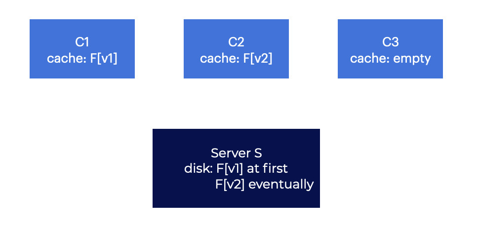

# Introduction
# 介绍
Distributed file systems were one of the first uses of distributed client/server computing.  
分布式文件系统是分布式客户端/服务器计算的第一个用途之一。  

The server stores data on its disks, while clients request data via well-formed protocol messages.  
服务器将数据存储在其磁盘上，而客户端通过格式良好的协议消息请求数据。  


This setup allows for client-to-client data transfer, or **sharing**. Clients send messages to the server to access their directories and files. Due to automatic data transfer. We can browse the file system on two different PCs in the same way.  
这种设置允许客户端之间的数据传输，或**共享**。 客户端向服务器发送消息以访问其目录和文件。 由于自动数据传输。 我们可以以相同的方式浏览两台不同PC上的文件系统。  

Other benefits include **centralized administration**, where files can be backed up from a few server machines rather than several different clients.  
其他好处包括**集中式管理**，其中文件可以从几台服务器机器而不是几台不同的客户端备份。

Another benefit is **security**. Using this type of system provides the ability to keep all servers in a locked machine room which prevents certain issues.  
另一个好处是**安全性**。 使用这种类型系统可以保持所有服务器位于锁定的机器房中，从而防止某些问题。  

## Question
A few benefits of a client/server system are data sharing, centralized administration, and security.  
客户端/服务器系统的一些好处是数据共享，集中式管理和安全性。  

# Basic Distributed File System
A basic distributed file system contains more components than the other file systems we’ve explored.  
基本的分布式文件系统包含比我们探索的其他文件系统更多的组件。  

Client applications use the **client-side file system** to access files and directories. To access files stored on the server, a client program uses the client-side file system to make **system calls** (`open(), read(), write(), close(), mkdir()`, etc.). This makes the file system appear the same as the client’s local (disk-based) file system.  
客户端应用程序使用**客户端文件系统**来访问文件和目录。 要访问存储在服务器上的文件，客户端程序使用客户端文件系统进行**系统调用**（`open（），read（），write（），close（），mkdir（）`等）。 这使得文件系统看起来与客户端的本地（基于磁盘的）文件系统相同。  

In this approach, distributed file systems enable **transparent** access to files.  
在这种方法中，分布式文件系统使得对文件的**透明**访问成为可能。 

The client-side file system handles system calls. Examples include when a client calls `read()`. The client-side file system instructs the **server-side file system** to read from a specific disk block (or its own in-memory cache).  
客户端文件系统处理系统调用。 例如，当客户端调用`read（）`时。 客户端文件系统指示**服务器端文件系统**从特定磁盘块（或其自己的内存缓存）读取。  

It will then copy data into the user buffer supplied to read(), finishing your query. In this case, the block may be **cached** in memory or disk. No network traffic is generated.  
然后，它将数据复制到提供给read（）的用户缓冲区中，完成您的查询。 在这种情况下，块可能在内存或磁盘中**缓存**。 不会产生网络流量。


These are the two key components to a client/server distributed file system:  
这是客户端/服务器分布式文件系统的两个关键组件：  
- the client-side file system, and
- 客户端文件系统，和
- the file server.
- 文件服务器。

Their behavior together determines how the distributed file system functions.  
它们的行为共同决定了分布式文件系统的功能。  

## Question
The two key components of a distributed file system are the client-side file system and the file server.  
分布式文件系统的两个关键组件是客户端文件系统和文件服务器。  

# On To NFS
Sun Microsystems created the **Sun Network File System (or NFS)**.  
Sun Microsystems创建了**Sun Network File System（或NFS）**。  
Instead of creating a proprietary and closed system, Sun created an **open protocol** that merely defined the message formats that clients and servers would use to interact.  
Sun没有创建专有和封闭的系统，而是创建了一个**开放的协议**，它仅定义了客户端和服务器将用于交互的消息格式。  

Different parties could design their own NFS servers and compete as long as they preserve interoperability.  
只要保留互操作性，不同的方面就可以设计自己的NFS服务器并竞争。  

Today numerous companies sell NFS servers:  
今天，许多公司销售NFS服务器：  
- Oracle/Sun,
- NetApp,
- EMC,
- IBM, and
- others.

This widespread success is likely a testament to NFS’s open-market approach.  
这种广泛的成功可能是NFS开放市场方法的证明。  

## Question
The Sun Network File System was created with a(n) open protocol. This led to many other groups developing their own NFS server.  
Sun Network File System是用开放协议创建的。 这导致许多其他组织开发自己的NFS服务器。  

# Focus: Simple and Fast Server Crash Recovery
The classic NFS protocol (sometimes known as **NFSv2**) was the standard for many years.  
经典的NFS协议（有时称为**NFSv2**）多年来一直是标准。  

The protocol design goal for **NFSv2** was simple with rapid server recovery.  
**NFSv2**的协议设计目标是简单的，具有快速的服务器恢复。  

This approach makes a lot of sense if you are dealing with a multiple-client, single-server environment. If the server fails, the entire system fails.  
如果您正在处理多客户端，单服务器环境，则这种方法是有意义的。 如果服务器失败，整个系统就会失败。  

## Question
In a multi-client, single-server environment, if the server fails the entire system fails.  
在多客户端，单服务器环境中，如果服务器失败，整个系统就会失败。 


# Statelessness
NFSv2 achieved the goal of fast crash recovery by designing a **stateless** protocol.  
NFSv2通过设计**无状态**协议来实现快速崩溃恢复的目标。  
To begin, the server does not track client activity; rather, the protocol is designed to send all relevant information in each protocol request.  
首先，服务器不跟踪客户端活动; 相反，协议被设计为在每个协议请求中发送所有相关信息。  

Lets examine a **stateful** protocol. Consider the `open()` system call. If you give it a pathname, `open()` returns an integer file descriptor. In the code to the left, the descriptor is used to `read()` or `write()` to different parts of a file.  
让我们来看一个**有状态**协议。 考虑`open()`系统调用。 如果您给出路径名，`open()`将返回一个整数文件描述符。 在左侧的代码中，描述符用于`read()`或`write()`到文件的不同部分。  

Think about how a file system on the client-side file system opens the file.  
想想客户端文件系统上的文件系统如何打开文件。  

- The client sends the server a protocol message that says, “Open the file notes and return a descriptor.”  
- 客户端向服务器发送协议消息，该消息说：“打开文件notes并返回描述符。”
- The file server opens the file and sends its descriptor to the client.
- 文件服务器打开文件并将其描述符发送给客户端。
- It then calls read() with the descriptor, and the client-side file system sends the descriptor along with the request for a file.
- 然后使用描述符调用read()，并且客户端文件系统将描述符与文件请求一起发送。


Here, the file descriptor is a **shared state** (or **distributed state**) between the client and server.  
在这里，文件描述符是客户端和服务器之间的**共享状态**（或**分布式状态**）。  

Shared state, as stated above, impedes recovery. Assume the server crashes after the first read but before the client sends the second.  
如上所述，共享状态会妨碍恢复。 假设服务器在第一次读取之后，客户端发送第二次之前崩溃。  

After the server restarts, the client issues the second read, but the information was lost in the crash.  
服务器重新启动后，客户端发出第二次读取，但在崩溃中丢失了信息。  

To address this, the client and server would need to have a **recovery protocol**, where the client would keep enough information in its memory to inform the server of the situation (the file descriptor `fd` refers to file `notes`).  
为了解决这个问题，客户端和服务器需要有一个**恢复协议**，其中客户端将足够的信息保存在其内存中，以通知服务器情况（文件描述符`fd`指的是文件`notes`）。  

A stateful server must also handle client crashes. Assume a user opens a file and crashes. `open()` uses a file descriptor, so the server doesn’t know when to close it. Normally, a client would call `close()` to close a file. When a client dies, the server never gets a `close()`.  
有状态服务器还必须处理客户端崩溃。 假设用户打开一个文件并崩溃。 `open()`使用文件描述符，因此服务器不知道何时关闭它。 通常，客户端将调用`close()`来关闭文件。 当客户端死亡时，服务器永远不会得到`close()`。  

In order to address these issues, NFS designers chose a stateless approach:  
为了解决这些问题，NFS设计人员选择了无状态的方法：  
- Each client operation contains all information needed to complete the request.  
- 每个客户端操作都包含完成请求所需的所有信息。  

## Question
The stateless server will include all necessary information for a client operation.  
无状态服务器将包含客户端操作所需的所有必要信息。  


# The NFSv2 Protocol
The **file handle** is important in understanding the NFS protocol design.  
文件句柄在理解NFS协议设计时很重要。  

Many protocol requests include a file handle to uniquely identify the file or directory being operated on.  
许多协议请求包含文件句柄，以唯一地标识正在操作的文件或目录。  

A file handle has three key components:  
文件句柄有三个关键组件：  
- Volume identification
- 卷标识
    - tells the server which file system the request is for. An NFS server can export more than one file at a time, so this is important.
    - 告诉服务器请求的是哪个文件系统。 NFS服务器可以同时导出多个文件，因此这很重要。
- Inode number
- inode编号
    - tells the server which file in that partition the request is going to.
    - 告诉服务器请求的是该分区中的哪个文件。
- The client’s generation number
- 客户端的生成号
    - when reusing an inode number If an old file handle is used, the generation number is incremented, preventing inadvertent access to the freshly allocated file.
    - 重新使用inode编号时。 如果使用旧的文件句柄，则增加生成号，以防止无意中访问新分配的文件。

The file to the left holds a summary of the major pieces of the protocol.  
左边的文件包含协议的主要部分摘要。  

To access files, the `LOOKUP` protocol message first obtains a file handle.  
要访问文件，`LOOKUP`协议消息首先获取文件句柄。  

The client sends the server a directory file handle and a file name to lookup, and the server returns the handle and related attributes, such as the file’s creation and modification dates, size, ownership and permissions. Similar to what you’d get from a file’s `stat()` call.  
客户端向服务器发送目录文件句柄和要查找的文件名，服务器返回句柄和相关属性，例如文件的创建日期和修改日期，大小，所有权和权限。 类似于您从文件的`stat()`调用中获得的内容。  

Imagine the client already has a handle to the file system’s root directory (`/`) which it would have obtained through the NFS **mount protocol**.  
想象一下，客户端已经有一个文件系统根目录的句柄（`/`），它将通过NFS **mount protocol**获得。  

If a client-side program opens the file `/essay.txt`, it would send a lookup request for the file handle (and attributes) for the file `essay.txt`.  
如果客户端程序打开文件`/essay.txt`，它将发送一个查找请求，以获取文件`essay.txt`的文件句柄（和属性）。  

Now, the client can use the **READ** and **WRITE** protocol messages to read and write files.  
现在，客户端可以使用**READ**和**WRITE**协议消息来读取和写入文件。  

The **READ** protocol message requires the protocol to send:  
**READ**协议消息要求协议发送：  

- the file handle,
- 文件句柄，
- offset within the file,
- 文件中的偏移量，
- the quantity of bytes to read, and
- 要读取的字节数，
- the file name.
- 文件名。

The server can then read the data from the file (since the handle tells it which volume and inode to read from) and provide it to the client (or an error if there was a failure).  
然后，服务器可以从文件中读取数据（因为句柄告诉它从哪个卷和inode读取数据），并将其提供给客户端（如果失败，则提供错误）。  

Writing data to the server is done similarly, except that no data is sent back.  
将数据写入服务器的方式类似，只是没有数据被发送回来。  

One additional protocol to mention is the **GETATTR** request. The **GETATTR** will collect the file’s attributes like the file’s last update time, given only the file handle.  
还有一个要提到的协议是**GETATTR**请求。 **GETATTR**将收集文件的属性，例如文件的最后更新时间，只需给出文件句柄。  

```c 
NFSPROC GETATTR file handle
returns: attributes

NFSPROC SETATTR file handle, attributes
returns: –

NFSPROC LOOKUP directory file handle, name of file/dir to look up
returns: file handle

NFSPROC READ file handle, offset, count
data, attributes

NFSPROC WRITE file handle, offset, count, data
attributes

NFSPROC CREATE directory file handle, name of file, attributes
–

NFSPROC REMOVE directory file handle, name of file to be removed
–

NFSPROC MKDIR directory file handle, name of directory, attributes
file handle

NFSPROC RMDIR directory file handle, name of directory to be removed
–

NFSPROC READDIR directory handle, count of bytes to read, cookie
returns: directory entries, cookie (to get more entries)
```

## Question
A file handle has three key components: volume identification tells the server which file system the request is for, the inode number, which tells the server which file in that partition the request is going to, and the generation number, used when reusing inode numbers.  
文件句柄有三个关键部分：卷标识告诉服务器请求的是哪个文件系统，inode编号告诉服务器请求的是该分区中的哪个文件，以及生成号，用于重新使用inode编号时。  

# From Protocol To Distributed File System
The protocol used between the client and a file servers should be getting a little clearer. The client-side file system keeps track of open files and turns application requests into relevant protocol messages. The server will then respond to protocol messages, which will have all the information needed.  
客户端和文件服务器之间使用的协议应该越来越清晰。 客户端文件系统跟踪打开的文件，并将应用程序请求转换为相关的协议消息。 然后，服务器将响应协议消息，其中包含所有所需的信息。  

Let’s say we have a small application that reads a file.  
让我们假设我们有一个小应用程序，它读取一个文件。  

First, note how the client keeps track of the relevant **state** including the file descriptor’s NFS file handle mapping as well as the current file pointer. This allows the client to convert each read request into a properly designed read protocol message telling the server exactly which bytes from the file to read. Following a successful read, the same file handle is used, but the offset is different for each one.  
首先，注意客户端如何跟踪相关的**状态**，包括NFS文件句柄映射以及当前文件指针的文件描述符。 这允许客户端将每个读取请求转换为适当设计的读取协议消息，告诉服务器准确地从文件中读取哪些字节。 在成功读取后，使用相同的文件句柄，但每个偏移量都不同。  

Second, we note where the interactions with the server take place. If the pathname is long (like, `/home/codio/workspace/essay.txt`), the client would require four lookups:  
其次，我们注意与服务器交互的位置。 如果路径名很长（例如，`/home/codio/workspace/essay.txt`），则客户端需要四个查找：  

  1. `/home`
  2. `/home/codio`
  3. `/home/codio/workspace`
  4. `/home/codio/workspace/essay.txt`

Third, notice how each server request has all that it needs to complete the request.  
第三，注意每个服务器请求都有完成请求所需的所有内容。  


## Question
The client-side file system keeps track of open files and turns application requests into relevant protocol messages. The server will then respond to protocol messages, which will have all the information needed.  
客户端文件系统跟踪打开的文件，并将应用程序请求转换为相关的协议消息。 然后，服务器将响应协议消息，其中包含所有所需的信息。  


# Handling Server Failure With Idempotent Operations
In some cases, clients’ requests are ignored. This **lack of responsiveness** has many causes. In some cases, the network may lose communication, leaving the client without a response.  
在某些情况下，客户端的请求被忽略。 这种**无响应**有许多原因。 在某些情况下，网络可能会丢失通信，使客户端无法得到响应。  

It’s also possible that the server is **offline** and not responding. A later reset will restore all requests. When the server doesn’t answer quickly, clients are left wondering what to do.  
服务器也可能**离线**并且无法响应。 以后的重置将恢复所有请求。 当服务器没有快速回答时，客户端会想知道该怎么办。  

If any of these fail, **NFSv2** clients **retry**. The client then sets a **timer** to expire. The timer is canceled if you react before the countdown. If the timer expires without a response, the client resends the request. If the server responds, the client succeeded.  
如果任何一项失败，**NFSv2**客户端**重试**。 然后，客户端设置一个**计时器**到期。 如果在倒计时之前反应，计时器将被取消。 如果在没有响应的情况下计时器到期，客户端将重新发送请求。 如果服务器响应，客户端成功。  

Because most **NFS** queries are **idempotent**, the client can simply retry. An operation is idempotent if the result of repeating it is the same. Idempotent actions include, for example, storing a value three times in memory. Notably, incrementing a counter three times yields a different outcome than incrementing it once. A read-only operation is usually idempotent, but an update operation must be carefully analyzed.  
因为大多数**NFS**查询都是**幂等**的，因此客户端可以简单地重试。 如果重复操作的结果相同，则该操作是幂等的。 例如，将值存储三次在内存中是幂等的。 值得注意的是，将计数器增加三次产生的结果与将其增加一次的结果不同。 只读操作通常是幂等的，但更新操作必须仔细分析。  

The **idempotency** of most common operations lies at the basis of **NFS** crash recovery. In the absence of an update, `LOOKUP` and `READ` queries are trivially idempotent. `WRITE` requests are also idempotent. If a `WRITE` fails, the client can simply try again. Data, count, and (most critically) offset are all contained in the `WRITE` message. It can be repeated knowing that the consequence of several writes is the same as a single write.  
大多数常见操作的**幂等性**在**NFS**崩溃恢复的基础上。 在没有更新的情况下，`LOOKUP`和`READ`查询是微不足道的幂等的。 `WRITE`请求也是幂等的。 如果`WRITE`失败，客户端可以简单地再试一次。 数据，计数和（最关键的）偏移量都包含在`WRITE`消息中。 它可以重复，因为多次写入的结果与单次写入的结果相同。  

So the client can handle all timeouts uniformly.  
因此，客户端可以统一处理所有超时。  

- Case 1: A `WRITE` request is simply lost, but the client retries it, and the server writes it.  
- 情况1：`WRITE`请求被简单地丢失，但客户端重试它，并且服务器写入它。  
- Case 2: Similarly, if the server is down when the first request is submitted, but up and running when the second request is sent, everything functions as expected. The server may receive a `WRITE` request, write to its disk, and respond.  
- 情况2：类似地，如果服务器在提交第一个请求时关闭，但在发送第二个请求时启动并运行，一切都按预期运行。 服务器可能会收到`WRITE`请求，写入其磁盘并响应。  
- Case 3: The client must resend the request if the reply is lost. On re-request, the server simply writes the data to disk and replies that it has done so. Succeeding clients have handled both message loss and server failure uniformly.  
- 情况3：如果丢失回复，则客户端必须重新发送请求。 在重新请求时，服务器只需将数据写入磁盘并回复已完成。 后续客户端已统一处理消息丢失和服务器故障。  

Aside: some operations are difficult to idempotent. For example, when trying to create a directory that already exists, the `mkdir` request fails. The file server receives an `MKDIR` protocol message and executes it properly, but the reply is lost. The client may repeat the action and face that failure.  
除此之外：一些操作很难是幂等的。 例如，当尝试创建已存在的目录时，`mkdir`请求失败。 文件服务器收到`MKDIR`协议消息并正确执行它，但丢失了回复。 客户端可能会重复该操作并面对失败。  


## Question
Idempotency is the idea that some operations can be repeated with no consequences to the outcome.  
幂等性是一些操作可以重复执行，而不会对结果产生影响的想法。  


# Client-side Caching
Sending all read and write requests over the network poses a huge performance issue: the network is slower than local memory or disk.  
通过网络发送所有读取和写入请求会带来巨大的性能问题：网络比本地内存或磁盘慢。  

**How can we measure a distributed file system’s performance?**  
**我们如何衡量分布式文件系统的性能？**  

**Client-side caching**, as the huge bold words in the sub-heading above suggest. **NFS** caches file data (and metadata) read from the server in client memory. While the first access is costly and requires network connectivity, subsequent accesses served from client memory are inexpensive.  
**客户端缓存**，正如上面子标题中的巨大粗体字所示。 **NFS**将从服务器读取的文件数据（和元数据）缓存在客户端内存中。 虽然第一次访问成本高昂并且需要网络连接，但从客户端内存中提供的后续访问是廉价的。  

The cache also acts as a **write buffer**. Before writing to a file, a client application buffers the data in client memory. The application’s `write()` function succeeds instantly and only puts the data in the client-side file system’s cache. The data is only written to the file server afterwards.  
缓存还充当**写入缓冲区**。 在写入文件之前，客户端应用程序将数据缓存在客户端内存中。 应用程序的`write()`函数立即成功，并且只将数据放入客户端文件系统的缓存中。 数据只在之后写入文件服务器。  

**NFS** clients cache data and perform well, right? Well, no. A system with many client caches creates a huge and interesting challenge we’ll call the cache consistency problem.  
**NFS**客户端缓存数据并表现良好，对吗？ 好吧，不是。 具有许多客户端缓存的系统会创建一个巨大而有趣的挑战，我们将其称为缓存一致性问题。  

## Question
First accessing data from the server is client-side caching’s most expensive operation.  
首先从服务器访问数据是客户端缓存的最昂贵的操作。  


# The Cache Consistency Problem
Consider the case of two clients and one server. Cached file **F** is read by client **C1**. Let’s call the new one version 2 (**F[v2]**) and the old one version 1 **F[v1]**) . The file has the same name, just different contents). **C3** hasn’t accessed file **F**  
考虑两个客户端和一个服务器的情况。 缓存文件**F**被客户端**C1**读取。 让我们称新的版本为2（**F[v2]**)，旧的版本为1（**F[v1]**)。 文件具有相同的名称，只是不同的内容）。 **C3**尚未访问文件**F**  

Two concerns arise. While **F[v2]** is in **C2**'s memory, any other client (say **C3**) will get the old version of the file **F[v1]**). Imagine updating **F** on **C2** then trying to read the file on **C3** and getting the old copy!  
出现了两个问题。 当**F[v2]**在**C2**的内存中时，任何其他客户端（例如**C3**）都会得到文件**F[v1]**的旧版本。 想象一下在**C2**上更新**F**，然后尝试在**C3**上读取文件并获得旧副本！  

**When do modifications from one client become available to other clients?**  
**当一个客户端的修改对其他客户端可用时？**  

 

So the file server has the newest version because **C2** flushed its writes to it **F[v2]**). Due to the fact that **C1** still has **F[v1]** in its cache, a program executing on **C1** will get the older version (**F[v1]**).  
因此，文件服务器具有最新版本，因为**C2**将其写入刷新到**F[v2]**)。 由于**C1**仍然在其缓存中具有**F[v1]**，因此在**C1**上执行的程序将获得较旧的版本（**F[v1]**）。  

**NFSv2** addresses cache consistency in two ways. By writing to and closing a file, a client software flushes all updates (dirty cache pages) to the server. With flush-on-close, another node will see the latest file version.  
**NFSv2**通过两种方式解决缓存一致性问题。 通过写入和关闭文件，客户端软件将所有更新（脏缓存页面）刷新到服务器。 通过关闭刷新，另一个节点将看到最新的文件版本。  

**NFSv2** clients also check for changes in a file before accessing its cached data. Each cached block generates a `GETATTR` request to the server. The client invalidates the file if the server time-of-modification is more recent than the client cache time-of-modification. This clears the client cache and guarantees that subsequent reads get the latest version. The client will use the cached data if it has the latest version of the file.  
**NFSv2**客户端还会在访问其缓存数据之前检查文件中的更改。 每个缓存块都会向服务器生成一个`GETATTR`请求。 如果服务器的修改时间比客户端缓存的修改时间更晚，则客户端将使文件无效。 这将清除客户端缓存并保证后续读取获得最新版本。 如果客户端具有文件的最新版本，则客户端将使用缓存数据。  

The stale cache method resulted in an overflow of `GETATTR` requests on the **NFS** server. Even if only one client accessed a file (perhaps frequently), the client had to make `GETATTR` queries to the server to ensure no one else had changed it. That’s why a client keeps asking the server “has anyone edited this file?”  
陈旧的缓存方法导致**NFS**服务器上的`GETATTR`请求溢出。 即使只有一个客户端访问文件（可能经常），客户端也必须向服务器发出`GETATTR`查询，以确保没有人更改了它。 这就是为什么客户端一直在问服务器“有人编辑过这个文件吗？”  

Now every client has an attribute cache. In the attribute cache, clients still examine files before accessing them. A file’s attributes were cached and timed out when accessed (say **3** seconds). If the cached file was safe to use, all file accesses would proceed without contacting the server.  
现在每个客户端都有一个属性缓存。 在属性缓存中，客户端仍然在访问文件之前检查文件。 访问文件时（例如**3**秒），文件的属性将被缓存并超时。 如果缓存的文件可以安全使用，则所有文件访问都将继续进行，而无需联系服务器。  


## Question 
The issue that arises when multiple clients are storing different versions of a file is known as update visibility. The issue of clients using out-dated versions of a file that has been recently updated on the server is known as stale cache.  
当多个客户端存储不同版本的文件时，出现的问题称为更新可见性。 客户端使用服务器上最近更新的过时版本的问题称为陈旧的缓存。  


# Assessing NFS Cache Consistency
Final thoughts on NFS **cache consistency**. While the flush-on-close behavior made sense, it caused a performance issue.  
关于NFS**缓存一致性**的最后想法。 虽然关闭刷新行为是有意义的，但它导致了性能问题。  

The server would still be required to accept a temporary or short-lived file created on a client and subsequently erased. A better method would hold such temporary files in memory until they are erased, reducing server contact and possibly improving performance.  
服务器仍然需要接受在客户端上创建的临时或短暂文件，并随后擦除。 更好的方法是将这些临时文件保存在内存中，直到它们被擦除为止，从而减少服务器联系并可能提高性能。  

Adding an attribute cache to **NFS** made it difficult to determine what version of a file one was getting. Because your attribute cache had not yet timed out, the client was delighted to offer you whatever was in client memory. This was great most of the time, but occasionally led to weird behavior.  
将属性缓存添加到**NFS**使得很难确定正在获取文件的版本。 因为您的属性缓存尚未超时，客户端很高兴向您提供客户端内存中的任何内容。 这大多数时候都很好，但偶尔会导致奇怪的行为。  


## Question 
With cache consistency, sometimes an old version of a file could be accessed simply because the attribute cache hasn’t timed out yet.  
在缓存一致性方面，有时可能会访问文件的旧版本，只是因为属性缓存尚未超时。  

# Implications On Server-Side Write Buffering
**NFS** servers are often powerful machines with lots of memory, so caching issues also arise here.  
**NFS**服务器通常是功能强大的机器，具有大量内存，因此这里也会出现缓存问题。  
When data (or metadata) is read from disk, NFS servers **hold it in memory**, so subsequent reads don’t go to disk, potentially improving performance.  
当从磁盘读取数据（或元数据）时，NFS服务器**将其保存在内存中**，因此后续读取不会访问磁盘，可能会提高性能。  

Write buffering is more of a challenge.  
写缓冲区更具挑战性。  
Consider a client’s write sequence:  
考虑客户端的写入序列：  

```c
write(fd, a_buffer, size); // fill 1st block with a’s 
write(fd, b_buffer, size); // fill 2nd block with b’s
write(fd, c_buffer, size); // fill 3rd block with c’s
```

These writes **overwrite** a file’s three blocks with a block of `a, b`, and `c`. So, assuming the file started out like this:  
这些写入将文件的三个块**覆盖**为`a, b`和`c`的块。 因此，假设文件最初是这样的：  

```bash
xxxxxxxxxxxxxxxxxxxxxxxxxxxxxxxxxxxxxxxxxxxx
yyyyyyyyyyyyyyyyyyyyyyyyyyyyyyyyyyyyyyyyyyyy
zzzzzzzzzzzzzzzzzzzzzzzzzzzzzzzzzzzzzzzzzzzz
```

The **x**'s, **y**'s, and **z**'s would be **overwritten** with **a**'s, **b**'s, and **c**'s, accordingly.  
相应地，**x**，**y**和**z**将被**a**，**b**和**c**覆盖。  

```bash
aaaaaaaaaaaaaaaaaaaaaaaaaaaaaaaaaaaaaaaaaaaa
bbbbbbbbbbbbbbbbbbbbbbbbbbbbbbbbbbbbbbbbbbbb
cccccccccccccccccccccccccccccccccccccccccccc
```

Say these three client writes were sent to the server as three separate `WRITE` protocol messages.  
假设这三个客户端写入作为三个单独的`WRITE`协议消息发送到服务器。  

- Assume the server receives the first `WRITE` message, writes it to the disk, and informs the client.
- 假设服务器收到第一个`WRITE`消息，将其写入磁盘并通知客户端。
- Assume the second write is only buffered in memory, and the server communicates success to the client before forcing it to disk.
- 假设第二个写入仅在内存中缓冲，并且在将其强制写入磁盘之前，服务器将成功通知客户端。

- The server restarts promptly and receives a third successful write request.
- 服务器立即重新启动并接收第三个成功的写入请求。  

The client’s requests were successful, but the file contents are incorrect:  
客户端的请求是成功的，但文件内容是不正确的：  

```bash
aaaaaaaaaaaaaaaaaaaaaaaaaaaaaaaaaaaaaaaaaaaa
yyyyyyyyyyyyyyyyyyyyyyyyyyyyyyyyyyyyyyyyyyyy <--- oops
cccccccccccccccccccccccccccccccccccccccccccc
```

Because the server informed the client that the second write was successful before committing it to disk, an old chunk remains in the file, potentially causing problems.  
由于服务器在将其提交到磁盘之前通知客户端第二个写入是成功的，因此文件中仍然存在旧块，可能会导致问题。  

To avoid this issue, NFS servers **must** commit each write to persistent storage before telling the client of success.  
为了避免这个问题，NFS服务器**必须**在告知客户端成功之前将每个写入提交到持久存储。  
The issue with this requirement in NFS server implementation is that write performance might be a substantial bottleneck.  
NFS服务器实现中的这个要求的问题是，写入性能可能是一个重要的瓶颈。  

Companies like Network Appliance were created with the goal of building an NFS server that performs writes quickly. They do this using a few work-arounds:  
像Network Appliance这样的公司是为了构建一个快速写入的NFS服务器而创建的。 他们使用一些变通方法来做到这一点：  

For example, they put writes in a battery-backed memory, allowing rapid answers to `WRITE` requests without danger of losing data or incurring the cost of writing to disk immediately.  
例如，他们将写入放在电池支持的内存中，允许快速回答`WRITE`请求，而不会丢失数据或立即写入磁盘的成本。  

## Question 
In order to avoid intermingled file contents, NFS servers must commit each write to persistent storage before telling the client of success.  
为了避免混合文件内容，NFS服务器必须在告知客户端成功之前将每个写入提交到持久存储。  


# Summary
Initiation of **NFS** (Network File System NFS is meant to allow simple and rapid server recovery. Because a client can safely replay a failed action, it doesn’t matter if the server did it.  
**NFS**（网络文件系统NFS旨在允许简单和迅速的服务器恢复。 因为客户端可以安全地重放失败的操作，所以服务器是否执行它并不重要。  
Caching can potentially complicate a multi-client, single-server system. It’s reasonable to address **cache consistency**, which NFS does carelessly, resulting in weird behavior. To sum up, **forcing writes** to stable storage before returning success (otherwise data can be lost).  
缓存可能会使多客户端单服务器系统变得复杂。 解决**缓存一致性**是合理的，NFS不小心导致了奇怪的行为。 总而言之，**强制写入**稳定存储器之前返回成功（否则数据可能会丢失）。  

We haven’t discussed other aspects, most notably **security**. Early NFS security was inadequate; any user on a client could easily masquerade as another user and so access nearly any file.  
我们还没有讨论其他方面，最值得注意的是**安全性**。 早期的NFS安全性不足; 客户端上的任何用户都可以轻松地伪装成另一个用户，从而访问几乎任何文件。  
- An NFS **stateless** protocol is the key to achieving the core goal of rapid and simple crash recovery. After a server crash, clients just retry requests until they succeed.  
- NFS**无状态**协议是实现快速和简单崩溃恢复的核心目标的关键。 服务器崩溃后，客户端只需重试请求，直到成功为止。
- Making requests idempotent is a central aspect of the NFS protocol. An operation is idempotent if repeating it has the same result as doing it once. In NFS, **idempotency** unifies client lost-message retransmission and client-server crash handling.
- NFS**幂等**是NFS协议的一个核心方面。 如果重复操作的结果与一次操作的结果相同，则该操作是幂等的。 在NFS中，**幂等性**统一了客户端丢失消息重传和客户端服务器崩溃处理。
- Client-side caching and write buffering are required for performance, but pose a **cache consistency** issue.
- 客户端缓存和写入缓冲区对于性能是必需的，但会导致**缓存一致性**问题。
- NFS implementations engineer cache integrity in different ways: When a file is closed, its contents are forced to the server, allowing other clients to see the updates. An attribute cache decreases the frequency of file change checks with the server (via `GETATTR` requests).
- NFS实现以不同的方式工程化缓存完整性：当文件关闭时，其内容将强制发送到服务器，允许其他客户端查看更新。 属性缓存减少了与服务器（通过`GETATTR`请求）检查文件更改的频率。
- Failure to commit writes to persistent media might result in data loss.
- 未将写入提交到持久介质可能会导致数据丢失。

